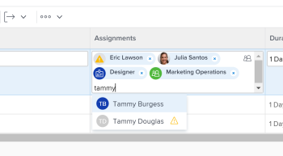

# 21.4 Verbeterde rapportage

Op deze pagina worden alle verbeteringen beschreven die zijn aangebracht in de release 21.4 voor Voorvertoning. Deze verbeteringen zullen beschikbaar worden gesteld in de productieomgeving in de week van 4 oktober 2021.

Voor een lijst van alle veranderingen beschikbaar met de versie 21.4, zie [&#x200B; overzicht van de Versie 21.4 &#x200B;](../../../product-announcements/product-releases/21.4-release-activity/21-4-release-overview.md).

## Nieuwe look en feel voor het veld Toewijzingen in bijgewerkte lijsten en rapporten

>[!NOTE]
>
>Voorheen beschikbaar in de productieomgeving met de release van 21.2 en vervolgens tijdelijk verwijderd uit de productieomgeving op 20 mei 2021.

>[!NOTE]
>
>Deze functie is alleen beschikbaar in de nieuwe Adobe Workfront-ervaring.

Om de moderne blik van andere gebieden in de nieuwe ervaring van Workfront aan te passen, is het stileren voor het gebied van Taken in bijgewerkte lijsten en rapporten veranderd. Dit nieuwe ontwerp omvat:

* Een afgeronde avatar voor de beelden van het gebruikersprofiel, baanrollen, en teams
* Weergave initialen voor gebruikers zonder profielafbeeldingen
* Een nieuw taakrolpictogram
* Een nieuw pictogram Personen voor geavanceerde toewijzingen
* Een nieuw pictogram voor beperkte toegang
* Andere kleine ontwerpwijzigingen

Voor meer informatie over taken in lijsten, zie [&#x200B; taken toewijzen &#x200B;](../../../manage-work/tasks/assign-tasks/assign-tasks.md) of [&#x200B; kwesties toewijzen &#x200B;](../../../manage-work/issues/manage-issues/assign-issues.md).

## Nieuwe vormgeving voor typekop-kopvelden in bijgewerkte lijsten en rapporten

>[!NOTE]
>
>Voorheen beschikbaar in de productieomgeving met de release van 21.2 en vervolgens tijdelijk verwijderd uit de productieomgeving op 20 mei 2021.

>[!NOTE]
>
>Deze functie is alleen beschikbaar in de nieuwe Adobe Workfront-ervaring.

Om de moderne blik van andere gebieden in de nieuwe ervaring van Workfront aan te passen, is het formatteren voor typeahead gebieden in bijgewerkte lijsten en rapporten veranderd. Deze wijzigingen zijn onder meer:

* Het Typeahead-pictogram is uit het veld verwijderd.
* Wanneer u op een veld van de typekop klikt, wordt het menu met suggesties weergegeven voordat u tekst invoert.
* Het menu met suggesties reageert beter op de lengte van waarden en deze waarden worden nu afgekapt aan het einde wanneer aan de tekenlimiet wordt voldaan in plaats van in het midden van de waarde.

Voor informatie over bijgewerkte lijsten, zie het [&#x200B; verschil tussen de bijgewerkte en erfenislijsten &#x200B;](../../../workfront-basics/navigate-workfront/use-lists/view-items-in-a-list.md#updated) sectie in het artikel [&#x200B; begonnen worden met lijsten in Adobe Workfront &#x200B;](../../../workfront-basics/navigate-workfront/use-lists/view-items-in-a-list.md).

