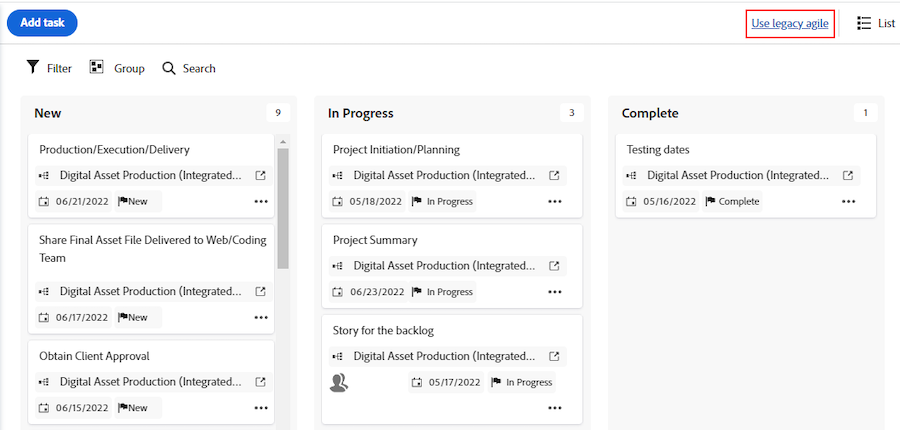

# Overzicht tweede release 2025, tweede kwartaal

Deze pagina bevat informatie over de functionaliteit die is opgenomen in de release van het tweede kwartaal van 2025. Deze verbeteringen zullen naar verwachting in het hele kwartaal beschikbaar komen in de productieomgeving.

 off-cycle eigenschappen (die die aan Productie voorafgaand aan het Tweede Kwartaal 2025 versiedatum vrijgeven) worden benadrukt in geel.

## Releaseplanning

Workfront-releases worden genummerd voor zowel maandelijkse als driemaandelijkse releasetracks. Het eerste getal geeft het jaar aan en het tweede getal geeft de maand van de release aan. Voorbeeld: de release voor april 2025 krijgt het nummer 25.4.

Voorzien wordt dat maandelijkse en driemaandelijkse versies beschikbaar zullen zijn op donderdag van de tweede volledige week van de maand, tenzij anders vermeld.

| Maandelijkse release | Driemaandelijkse release |
| ----------------- | ----------------- |
| <ul><li>25.2 (13 februari 2025)</li><li>25.3 (13 maart 2025)</li><li>25.4 (10 april 2025)</li></ul> | <ul><li>25.4 (10 april 2025)</li></ul> |

>[!NOTE]
>
>Voor de definitieve versie van elk kwartaal (25.4 dit kwartaal), zullen de gebruikers op het snelle versieschema één dag vroeg de versie ontvangen.
>
>Voor meer informatie over het snelle versieproces, zie [&#x200B; toelaten of onbruikbaar maken het snelle versieproces &#x200B;](/help/quicksilver/administration-and-setup/set-up-workfront/configure-system-defaults/enable-fast-release-process.md).

## Verbeteringen voor Adobe Workfront

* [Beheerdersverbeteringen](#administrator-enhancements)
* [Verbeteringen voor documentbeheer](#document-management-enhancements)
* [Verbeteringen voor mobiele apparaten](#mobile-enhancements)
* [Projectverbeteringen](#project-enhancements)
* [Verbeteringen rapporteren](#reporting-enhacements)
* [Andere verbeteringen](#other-enhancements)

### Beheerdersverbeteringen

<table>
<col style="width: 50%;" />
<col style="width: 50%;" />
<tbody>
<tbody>
    <tr>
        <td>
            
<a href="/help/quicksilver/product-announcements/product-releases/25-q2-release-activity/25-q2-administrator-enhancements.md" class="MCXref xref" xrefformat="{para}">
            Verbeteringen voor logica voor aangepaste formulieren</a>

[!BADGE in productie &#x200B;]{type=Informative}

            
De builder van de logica voor aangepaste formulieren heeft een bijgewerkte interface waarmee u meer ruimte hebt voor het maken van logische regels. Dit nieuwe ontwerp kan gemakkelijker extra logische types aanpassen die in de toekomst kunnen worden toegevoegd.

Naast de huidige opties voor weergave en het overslaan van logica, is ook validatielogica beschikbaar.

        </td>
        <td>
            
<b>Beschikbaar op deze data:</b>

            <ul>
                <li>Voorvertoningsrelease: 13 maart 2025</li>
                <li>Productieversie voor alle klanten: met de release van 25.4 (april 2025)</li>
            </ul>
        </td>
    </tr>                          
    <tr>
        <td>
            
<a href="/help/quicksilver/product-announcements/product-releases/25-q2-release-activity/25-q2-administrator-enhancements.md" class="MCXref xref" xrefformat="{para}">
            Expressies die worden toegevoegd aan berekende aangepaste velden</a>

            [!BADGE in productie &#x200B;]{type=Informative}
            
De volgende expressies zijn nu beschikbaar in door Workfront berekende aangepaste velden: ARRAY, FORMAT, SWITCH, SORTASCARRAY, SORTDESCARRAY, ARRAYLENGTH, ARRAYELEMENT en ADDHOUR. Definities en voorbeelden van elke expressie zijn beschikbaar in de rekeneditor en op Experience League.

        </td>
        <td>
            
<b>Beschikbaar op deze data:</b>

            <ul>
                <li>Voorvertoningsrelease: 31 januari 2025</li>
                <li>Productieversie voor alle klanten: 31 januari 2025</li>
            </ul>
        </td>
    </tr>                          
</tbody>
</table>

### Verbeteringen voor documentbeheer

<table>
<col style="width: 50%;" />
<col style="width: 50%;" />
<tbody>
<!--    <tr>
        <td>
            
<a href="/help/quicksilver/product-announcements/product-releases/25-q2-release-activity/25-q2-document-mgmt-enhancements.md" class="MCXref xref" xrefformat="{para}">
            New document approval decision buttons available in proofing viewer</a>

            
The new document approval decision buttons now appear in the proofing viewer. Now, when you create a simple proof and then add approvers and reviewers from the Document summary, they can make their decision directly inside the proofing viewer.

        </td>
        <td>
            
<b>Available on these dates:</b>

            <ul>
                <li>Preview release: April 9, 2025</li>
                <li>Production release for a limited set of customers: With the 25.4 release (April 2025)</li>
            </ul>
        </td>
    </tr>   -->                     
    <tr>
        <td>
            
<a href="/help/quicksilver/product-announcements/product-releases/25-q2-release-activity/25-q2-document-mgmt-enhancements.md" class="MCXref xref" xrefformat="{para}">
            Desktop Proofing Viewer-update </a>
[!BADGE in productie &#x200B;]{type=Informative}
            
De Desktop Proofing Viewer is bijgewerkt naar versie 2.1.45. Met deze update kan de viewer gebruiken
            <ul><li>Elektron versie 35</li><li>Chroom versie 134</li><ul>

        </td>
        <td>
            
<b>Beschikbaar op deze data:</b>

            <ul>
                <li>Voorvertoningsrelease: 20 maart 2025</li>
                <li>Productieversie voor alle afnemers: 20 maart 2025</li>
            </ul>
        </td>
    </tr>                          
    <tr>
        <td>
            
<a href="/help/quicksilver/product-announcements/product-releases/25-q2-release-activity/25-q2-document-mgmt-enhancements.md" class="MCXref xref" xrefformat="{para}">
            Meerdere documenten tegelijk bewerken in een documentrapport </a>
[!BADGE in productie &#x200B;]{type=Informative}
            
U kunt nu meerdere documenten tegelijk bewerken in een documentrapport. U kunt de beschrijvingen bewerken en aangepaste formulieren bijwerken.

        </td>
        <td>
            
<b>Beschikbaar op deze data:</b>

            <ul>
                <li>Voorvertoningsrelease: 6 februari 2025</li>
                <li>Productieversie voor alle klanten: 13 maart 2025</li>
            </ul>
        </td>
    </tr>                          
</tbody>
</table>

### Verbeteringen voor mobiele apparaten

<table>
<col style="width: 50%;" />
<col style="width: 50%;" />
<tbody>
    <tr>
        <td>
            
<a href="/help/quicksilver/product-announcements/product-releases/25-q2-release-activity/25-q2-mobile-enhancements.md" class="MCXref xref" xrefformat="{para}">
            Verbeteringen voor proefdrukken in de mobiele app (alleen iOS)</a>
[!BADGE in productie &#x200B;]{type=Informative}

            
Er zijn verschillende verbeteringen beschikbaar voor de proefdrukfunctionaliteit in de mobiele app van Adobe Workfront:
            <ul>
            <li>U kunt nu een proefdrukbestand openen vanuit uw mobiele e-mailtoepassing via een koppeling die met u is gedeeld. Eerder werden koppelingen uit e-mailberichten niet ondersteund en moest u proefdrukken openen vanuit de mobiele app van Workfront.</li>
            <li>Multimediaproefbestanden worden nu ondersteund in de mobiele app.</li>
            </ul>
            

        </td>
        <td>
            
<b>Beschikbaar op deze data:</b>

            <ul>
                <li>Voorvertoning release: n.v.t.</li>
                <li>Productieversie voor alle klanten: 12 maart 2025</li> 
            </ul>
            
<b>Beschikbaar in deze omgevingen:</b>

            <ul>
                <li>iOS mobiele app</li>
            </ul>
        </td>
    </tr>                          
</tbody>
</table>

### Projectverbeteringen

<table>
<col style="width: 50%;" />
<col style="width: 50%;" />
<tbody>
    <tr>
        <td>
            
<a href="/help/quicksilver/product-announcements/product-releases/25-q2-release-activity/25-q2-project-enhancements.md" class="MCXref xref" xrefformat="{para}">
            Een opmerking toevoegen aan projecten wanneer u deze bewerkt in het vak Project bewerken</a>
[!BADGE in productie &#x200B;]{type=Informative}

            
U kunt nu een opmerking aan een project toevoegen terwijl u deze bewerkt in het vak Project bewerken. U kunt ook een opmerking toevoegen aan meerdere projecten tegelijk wanneer u ze bulksgewijs bewerkt. Vóór deze update bestond deze functionaliteit niet tijdens het bewerken van projecten.

        </td>
        <td>
            
<b>Beschikbaar op deze data:</b>

            <ul>
                <li>Voorvertoningsrelease: 13 februari 2025</li>
                <li>Productie voor snelle release: met 25.3 release (maart 2025)</li>
                <li>Productieversie voor alle klanten: met de release van 25.4 (april 2025)</li>
            </ul>
        </td>
    </tr>                          
</tbody>
</table>

### Rapportageverbeteringen

<table>
<col style="width: 50%;" />
<col style="width: 50%;" />
<tbody>
    <tr>
        <td>
            
<a href="/help/quicksilver/product-announcements/product-releases/25-q2-release-activity/25-q2-reporting-enhancements.md" class="MCXref xref" xrefformat="{para}">
            Documentgoedkeuring en beslissingsgegevens zijn nu beschikbaar in Data Connect</a>
[!BADGE in productie &#x200B;]{type=Informative}

            
U hebt nu toegang tot gegevens voor documentgoedkeuringen en -beslissingen in Data Connect. Deze gegevensset vormt een brug tussen documentgoedkeuringen van Workfront-proefdrukmogelijkheden en Frame.io-goedkeuringen die plaatsvinden op Workfront-documenten. U kunt nu de cyclustijd, het aantal cycli en de tijdlijneffecten illustreren voor late goedkeuringen via uw BI-visualisaties.

        </td>
        <td>
            
<b>Beschikbaar op deze data:</b>

            <ul>
                <li>Voorvertoningsrelease: 25 maart 2025</li>
                <li>Productieversie voor alle afnemers: 25 maart 2025</li>
            </ul>
        </td>
    </tr>                          
    <tr>
        <td>
            
<a href="/help/quicksilver/product-announcements/product-releases/25-q2-release-activity/25-q2-reporting-enhancements.md" class="MCXref xref" xrefformat="{para}">Updates van de Workfront-agenda</a>

[!BADGE in productie &#x200B;]{type=Informative}

            
We hebben de look and feel van de Workfront-agenda aangepast aan een modern ontwerp dat aansluit bij andere delen van Workfront. Er zijn kleine functieverschillen met de huidige Workfront-kalender, waaronder:
            <ul>
            <li>Ad-hocitems toevoegen aan de kalender</li>
            <li>De manier waarop u de kalender maakt en hernoemt</li>
            <li>De kalenderacties zijn verplaatst naar het menu Meer naast de kalendernaam</li>
            <li>Een nieuw zijpaneel voor het weergeven van kalenderinformatie</li>
            <li>En meer</li>
            <ul>        </td>
        <td>
            
<b>Beschikbaar op deze data:</b>

            <ul>
                <li>Voorvertoningsrelease: 27 februari 2025</li>
                <li>Deze functie wordt in drie fasen in productie vrijgegeven: vanaf de release van 25.4 (10 april 2025) en voltooid op 17 april 2024</li>
            </ul>
        </td>
    </tr>                          
</tbody>
</table>

### Andere verbeteringen

<table>
<col style="width: 50%;" />
<col style="width: 50%;" />
<tbody>
    <tr>
        <td>
            
<a href="/help/quicksilver/product-announcements/product-releases/25-q2-release-activity/25-q2-other-enhancements.md" class="MCXref xref" xrefformat="{para}">
            Upgrade naar de nieuwe versie voor gebeurtenisabonnementen met de eindpunten voor versieverbeteringen</a>

            [!BADGE in productie &#x200B;]{type=Informative}
            
Workfront heeft nu versies van gebeurtenisabonnementen. De nieuwe versie is geen wijziging in de Workfront API, maar een wijziging in de functionaliteit voor abonnementen voor gebeurtenissen. U kunt uw gebeurtenisabonnementen op de nieuwe versie schakelen zonder een hiaat in uw gebeurtenisabonnement te creëren

        </td>
        <td>
            
<b>Beschikbaar op deze data:</b>

            <ul>
                <li>Productieversie voor alle klanten: 6 maart 2025</li>
            </ul>
        </td>
    </tr>
    <tr>
        <td>
            
<a href="/help/quicksilver/product-announcements/product-releases/25-q2-release-activity/25-q2-other-enhancements.md" class="MCXref xref" xrefformat="{para}">
            Adobe Admin Console-gebruikerswijzigingen vertegenwoordigen als "Systeem" in de Workfront-updatefeed</a>

[!BADGE in productie &#x200B;]{type=Informative}

Nu, wanneer de beheerder van de Adobe Admin Console een verandering in de gebruikersinformatie van een gebruiker van Workfront aanbrengt, registreert Workfront deze verandering in het de activiteitslusje van het Systeem van het gebied van de Updates van de gebruiker zoals die tot het "Systeem"behoort. Dit verwijst naar de Adobe Admin Console-beheerder.

        </td>
        <td>
            
<b>Beschikbaar op deze data:</b>

            <ul>
                <li>Voorvertoningsrelease: 23 januari 2025</li>
                <li>Productie voor snelle release: met 25.2 release (13 februari 2025)</li>
                <li>Productieversie voor alle klanten: met de release van 25.4 (april 2025)</li>
            </ul>
        </td>
    </tr>
    <tr>
        <td>
            
<a href="/help/quicksilver/product-announcements/product-releases/25-q2-release-activity/25-q2-look-and-feel-updates.md" class="MCXref xref" xrefformat="{para}">
            Updates weergeven en weergeven tijdens het tweede kwartaal van 2025</a>

            
Kleine updates van het uiterlijk van verschillende onderdelen van de Adobe Workfront-toepassing worden uitgevoerd binnen het tweede kwartaal van 2025. Bekijk de afzonderlijke releaseopmerkingen voor specifieke releasedatums.

        </td>
        <td>
            
<b>Beschikbaar op deze data:</b>

            <ul>
                <li>Voorvertoningsrelease: gedurende de gehele releaseperiode van het tweede kwartaal van 2025</li>
                <li>Productieversie: bekijk de opmerkingen bij de release voor specifieke datums</li>
            </ul>
        </td>
    </tr>
</tbody>
</table>

### Functionaliteit die binnenkort uit Workfront wordt verwijderd

De volgende functionaliteit wordt binnenkort verwijderd uit Workfront:

#### API versie 2-15-afleiding

Als we het Workfront-platform blijven verbeteren, is het van cruciaal belang dat onze API&#39;s up-to-date blijven. Dit zorgt voor optimale prestaties en beveiliging en ondersteunt nieuwe mogelijkheden. Daarom vervangen wij Workfront API versies 2-15.

* **September 2025**: API versies 2-14, die momenteel niet gesteund zijn, zullen worden afgekeurd. Na deze datum zijn deze versies niet meer toegankelijk.
* **December 2025**: API versie 15 zal worden afgekeurd.

#### We verwijderen de oudere versie van de Agile-weergave in een project

De oudere versie van Agile in een project wordt verwijderd uit Workfront met de release van 25.3 op 13 maart 2025. U kunt uw taken nog steeds bekijken in een mobiele weergave in een project door op het pictogram Boven te klikken. De bestaande oudere Agile-gereedschappen zijn nog steeds beschikbaar in het gebied Teams.

In de onderstaande afbeelding ziet u de oudere optie van Agile die wordt verwijderd:

#### Verbeterde afgekeurde analysemogelijkheden

Vanwege het lage en afnemende gebruik hebben we besloten om het product Enhanced Analytics in de week van 25 mei 2025 af te schaffen.
We raden u aan ons Data Connect-product te beschouwen als een vervanging. Met Data Connect kunt u vergelijkbare aanpasbare visualisaties maken met de bedrijfsintelligentiegereedschappen van uw voorkeur.
Voor meer informatie over deze veroudering, zie de [&#x200B; Verbeterde gids van de Vervanging van Analytics &#x200B;](/help/quicksilver/product-announcements/announcements/enhanced-analytics-deprecation.md).

## Aankondigingen

### Modernisering van de interface

We werken de interface in Adobe Workfront bij om de gebruikerservaring te verbeteren en deze te verenigen met andere Adobe-toepassingen. Deze veranderingen worden vrijgegeven buiten het standaardversieschema. Voor een lijst van deze veranderingen, zie [&#x200B; Modernisering van de Interface &#x200B;](/help/quicksilver/product-announcements/product-releases/interface-modernization/interface-modernization.md).

### Workfront Fusion-verbeteringen

>[!IMPORTANT]
>
>De Workfront Fusion-documentatie is verplaatst naar een nieuwe locatie. Voor informatie, instructies, en versies voor Fusie, bezoek [&#x200B; de documentatie van de Fusie van Workfront &#x200B;](https://experienceleague.adobe.com/nl/docs/workfront-fusion/using/home).
>
>Elk huidig Fusion-documentatieartikel bevat een koppeling naar het bijbehorende artikel op de nieuwe locatie. Werk uw bladwijzers bij.
>
>De huidige Fusion-documentatieset wordt niet meer bijgewerkt en wordt in de nabije toekomst verwijderd.

Nieuwe functies in Workfront Fusion zijn beschikbaar in Production op een cadence buiten de standaard releaseschema. Voor meer informatie over de recentste eigenschappen, zie [&#x200B; de versieactiviteit van de Fusie van Adobe Workfront &#x200B;](https://experienceleague.adobe.com/nl/docs/workfront-fusion/using/fusion-release-activity/fusion-release-activity).

### Verbeteringen voor Workfront-planning

Nieuwe functies in Workfront Planning zijn beschikbaar in Production. Voor meer informatie over de recentste eigenschappen, zie [&#x200B; Adobe Workfront die Tweede Kwartaal 2025 versieactiviteit plant &#x200B;](/help/quicksilver/product-announcements/product-releases/planning-release-activity/planning-release-activity-25-q2.md).

### Verbeteringen in Workfront Scenario Planner

Er zijn op dit punt in de release geen Scenario Planner-updates. Dit gebied wordt bijgewerkt wanneer er updates beschikbaar zijn.

### Verbeteringen voor Workfront Proof

Er zijn op dit moment geen Workfront Proof-updates beschikbaar. Dit gebied wordt bijgewerkt wanneer er updates beschikbaar zijn.

### Verbeteringen voor Workfront-doelen

Er zijn op dit moment geen updates voor Workfront Goals beschikbaar in de release. Dit gebied wordt bijgewerkt wanneer er updates beschikbaar zijn.

### API-versie 19

Voor API versie 19 hebben we een aantal bronnen en eindpunten gewijzigd. Sommige wijzigingen ondersteunen nieuwe functionaliteit en andere maken het voor u gemakkelijker om de informatie te gebruiken die beschikbaar is via de API.

Voor informatie over wat nieuw en bijgewerkt is, zie [&#x200B; wat in API versie 19 &#x200B;](/help/quicksilver/wf-api/api/new-api-version-19.md) nieuw is.

Voor informatie over welke API versies momenteel worden gesteund, zie [&#x200B; API versioning en steunprogramma &#x200B;](/help/quicksilver/wf-api/api/api-version-support-schedule.md).

### Workfront-onderhoudsupdates

Voor informatie over de onderhoudsupdates die tijdens de Tweede Kwartaal 2025 versie worden gemaakt, zie [&#x200B; Updates van het Onderhoud van Workfront &#x200B;](https://experienceleague.adobe.com/nl/docs/workfront-known-issues/releases/current-updates).

### Training-updates

Ontdek de nieuwste updates van leerprogramma&#39;s, leerpaden, video&#39;s en handleidingen voor elke Adobe Workfront-productrelease. Voor meer informatie, zie &quot;wat&quot;sectie van de [&#x200B; pagina van de Leerprogramma&#39;s van Workfront &#x200B;](https://experienceleague.adobe.com/nl/docs/workfront-learn/tutorials-workfront/home) Nieuw is.
