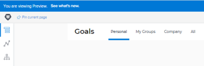

# Adobe Workfront Goals 21.1 release activity: Week van 16 november 2020

Op deze pagina worden alle verbeteringen beschreven die in de week van 30 november 2020 zijn aangebracht in de versie 21.1 voor Adobe Workfront Goals voor de voorbeeldomgeving. Deze verbeteringen zullen in het eerste kwartaal van 21.1 beschikbaar worden gesteld in de productieomgeving.

Voor een lijst van alle veranderingen beschikbaar voor de Doelen van Workfront op dit punt in de 21.1 versiecyclus, zie {de Doelen van 0} Adobe Workfront met de 21.1 versie [&#128279;](../../../../product-announcements/product-releases/goals-release-activity/goals-release-21-1.md).

Voor een lijst van alle veranderingen beschikbaar voor alle gebieden van Workfront op dit punt in de 21.1 versiecyclus, zie [ 21.1 versieoverzicht ](../../../../product-announcements/product-releases/21.1-release-activity/21-1-release-overview.md).

## Het aantal licenties voor Workfront Goals visualiseren in het gedeelte Setup

Als beheerder van Workfront, kunt u het aantal vergunningen van de Doelen van Workfront in het gebied van het Systeem van Opstelling nu bekijken. U kunt de volgende informatie weergeven:

Het totale aantal licenties voor Workfront Goals dat uw bedrijf heeft aangeschaft

Het aantal licenties voor Workfront Goals dat aan gebruikers is gekoppeld. Dit is het aantal gebruikers aan wie minstens de toegang van de Mening tot Doelstellingen in hun toegangsniveau hebben verleend.

Voor informatie over het beheren van uw vergunningstelling, zie [ beschikbare vergunningen in uw systeem ](../../../../administration-and-setup/get-started-wf-administration/manage-available-licenses-in-your-system.md) beheren.

## Het tabblad &quot;Mijn teams&quot; voor gebruikers zonder teams verwijderen

Om de verwarring van het tonen van een leeg lusje te elimineren, hebben wij het lusje &quot;Mijn Teams&quot;van gebruikers verwijderd die niet aan om het even welke teams worden toegewezen. Voorafgaand aan deze verandering, als een gebruiker niet tot om het even welke teams behoorde, was het Mijn lusje van Teams leeg.

Voor informatie over welke informatievertoningen in de Doelen van Workfront, zie [ informatie van de Filter in de Doelen van Adobe Workfront ](../../../../workfront-goals/goal-management/filter-information-wf-goals.md).

