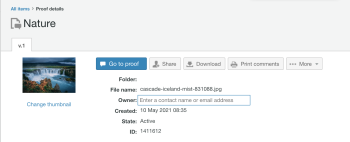

# Workfront Proefreleaseactiviteit: week van 17 mei 2021

Deze pagina bevat een beschrijving van de wijzigingen die zijn aangebracht in de Workfront Proof (stand-alone proefdruktoepassing). De hier beschreven wijzigingen zijn niet van toepassing op de proefdrukfunctionaliteit in de Adobe Workfront-toepassing.

## Menu&#39;s met gebruikersprofielen in Workfront Proof gebruiken nu typekop-velden om naar gebruikers te zoeken

>[!NOTE]
>
>Deze functie is op 20 mei 2021 beschikbaar gesteld voor de voorvertoningsomgeving. Het zal op 16 september 2021 worden vrijgegeven in de productieomgeving.

Voor het beheren van grote vervolgkeuzemenu&#39;s die alle gebruikers in het systeem weergeven, hebben we alle zoekmenu&#39;s voor gebruikersprofielen vervangen door een typehead-zoekopdracht in Adobe Workfront Proof op zichzelf. Voorbeelden van zoekmenu&#39;s voor gebruikersprofielen zijn:

* Eigenaars van proefdrukken
* Buiten kantoorcontacten
* Sjablooneigenaars

Eerder werden in alle vervolgkeuzelijsten voor het zoeken naar profielen alle gebruikers in het systeem weergegeven, waardoor een groot menu werd gemaakt.

