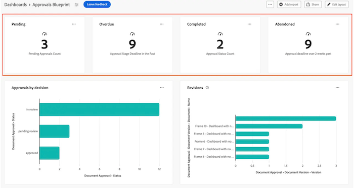

# Bouw een KPI- rapport

>[!IMPORTANT]
>
>De functie Canvasdashboards is momenteel alleen beschikbaar voor gebruikers die deelnemen aan de bètafase. Voor meer informatie, zie {de bètainformatie van de Dashboards van het 0} Canvas [.](/help/quicksilver/product-announcements/betas/canvas-dashboards-beta/canvas-dashboards-beta-information.md)

U kunt een PKI- rapport aan een Dashboard van het Canvas bouwen en toevoegen dat visueel uw zeer belangrijke gegevens van de prestatiesindicator als aantal vertegenwoordigt, dat u kunt dan gebruiken om te zien hoe uw projecten en teams presteren.

+++ Vouw uit om de vereisten voor toegang weer te geven.

<table style="table-layout:auto"> 
<col> 
</col> 
<col> 
</col> 
<tbody> 
<tr> 
   <td role="rowheader">
Adobe Workfront-plan
</td> 
   <td> 

Alle 
 
   </td> 
<tr> 
 <tr> 
   <td role="rowheader">
Adobe Workfront-licentie
</td> 
   <td> 

Huidig: Plan 
 

Nieuw: Standaard
 
   </td> 
   </tr> 
  </tr> 
  <tr> 
   <td role="rowheader">
Configuraties op toegangsniveau
</td> 
   <td>
Toegang tot rapporten, dashboards en kalenders bewerken

  </td> 
  </tr>  
</tbody> 
</table>

Voor meer detail over de informatie in deze lijst, zie [ vereisten van de Toegang in de documentatie van Workfront ](/help/quicksilver/administration-and-setup/add-users/access-levels-and-object-permissions/access-level-requirements-in-documentation.md).
+++

## Vereisten

U moet een dashboard tot stand brengen alvorens u een KPI- rapport kunt bouwen.

## Bouw een KPI- rapport in een dashboard van het Canvas

Er zijn vele configuratieopties beschikbaar voor de bouw van een KPI- rapport. In deze sectie doorlopen we het algemene proces voor het maken van een sectie.

{{step1-to-dashboards}}

1. In het linkerpaneel, klik **de Dashboards van het Canvas**.

1. Klik **Nieuw Dashboard** in de hoger-juiste hoek.

1. In **creeer dashboard** doos, ga de 2} Naam van het dashboard **en** Beschrijving **in.**

1. Klik **creëren**.

1. In **voeg rapport** doos toe, uitgezocht **creeer rapport**.

1. Voor de linkerkant, uitgezochte **KPI**.

1. In de hoger-juiste hoek, klik **creëren rapport**.

1. Volg hieronder de stappen om de **sectie van Details** te vormen:

   1. Ga een rapport **Naam** in.
   1. Ga een rapport **Beschrijving** in.

      >[!NOTE]
      > 
      > De beschrijving wordt gebruikt als een bijschrift onder de KPI-waarde. Als u geen beschrijving opgeeft, wordt een bijschrift voor u gegenereerd op basis van het aggregator- en aggregatietype dat u in de volgende stappen selecteert.

1. Volg hieronder de stappen om de **Bouw KPI** sectie te vormen:

   1. In het linkerpaneel, klik het **Bouw KPI** .

   1. Klik **Uitgezochte gebied** en specificeer dan het gebied u aan het rapport wilt toevoegen.

   1. In het **type van Samenvoeging** drop-down, selecteer hoe de gegevens omhoog rollen om de output van KPI te veroorzaken. De opties in dit veld zijn afhankelijk van het type veld dat u in de vorige stap hebt geselecteerd.

1. Volg hieronder de stappen om de **sectie van de Filter** te vormen:

   1. In het linkerpaneel, klik het **pictogram van de Filter** .

   1. Selecteer **filter uitgeven**.

   1. Klik **toevoegen voorwaarde** en specificeer dan het gebied u tegen en de bepaling wilt filtreren die bepaalt welk soort voorwaarde het gebied moet ontmoeten.

   1. (Facultatief) klik **toevoegen filtergroep** om een andere reeks het filtreren criteria toe te voegen. De standaardoperator tussen de sets is AND. Klik op de operator om deze te wijzigen in OR.

1. Volg hieronder de stappen om de **sectie van de Montages van de Kolom te vormen 0} Drilldown {:**

   1. In het linkerpaneel, klik het **Drilldown pictogram van Kolommen** . De velden in het diagram worden automatisch als kolommen weergegeven in de voorbeeldsectie aan de rechterkant.

   1. (Facultatief) om het even welke bestaande kolomconfiguraties bij te werken, selecteer de kolom u in de **Huidige kolommen** sectie wilt bijwerken en dan de gewenste informatie (b.v. etiket, verbonden status, en het formatteren regels) bijwerken.

   1. Klik **toevoegen kolom** en selecteer dan het gebied u als kolom in de lijst wilt tonen. Herhaal dit proces voor elke kolom u wilt toevoegen.

1. Volg hieronder de stappen om de **sectie van de Montages van de Groep van de Drilldown** te vormen:

   1. In het linkerpaneel, klik het **** pictogram van de de groepengroep van de 1} Groep 

   1. Klik **toevoegen groeperend** knoop en dan het gebied selecteren u als groepering wilt tot stand brengen.

1. Klik **sparen** om het rapport tot stand te brengen en het toe te voegen aan het dashboard.

