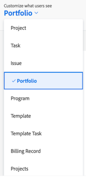

# Canvasdashboard toevoegen aan een lay-outsjabloon

>[!IMPORTANT]
>
>De functie Canvasdashboards is momenteel alleen beschikbaar voor gebruikers die deelnemen aan de bètafase. Onderdelen van het onderdeel zijn mogelijk niet compleet of werken niet zoals bedoeld in deze fase. Gelieve te dienen om het even welke terugkoppelen betreffende uw ervaring door de instructies in [ te volgen verstrekt ](/help/quicksilver/product-announcements/betas/canvas-dashboards-beta/canvas-dashboards-beta-information.md#provide-feedback) sectie in het de bètaoverzichtsartikel van de dashboards van het Canvas. 
>>Als u feedback hebt over een mogelijk probleem met een probleem of een technisch probleem, stuurt u een ticket naar Workfront Support. Voor meer informatie, zie [ de Steun van de Klant van het Contact ](/help/quicksilver/workfront-basics/tips-tricks-and-troubleshooting/contact-customer-support.md). 
>>Deze bètaversie is niet beschikbaar op de volgende cloudproviders:
>
>* Je eigen sleutel voor Amazon Web Services
>* Azure
>* Google Cloud Platform

U kunt een Canvasdashboard toevoegen aan een lay-outsjabloon, zodat deze de startpagina vervangt, in het linkerdeelvenster van een object wordt weergegeven of in Adobe Workfront op de bovenste balk wordt vastgezet.

## Toegangsvereisten

+++ Vouw uit om de vereisten voor toegang weer te geven. 

<table style="table-layout:auto"> 
<col> 
</col> 
<col> 
</col> 
<tbody> 
<tr> 
   <td role="rowheader">
Adobe Workfront-plan
</td> 
   <td> 

Alle 
 
   </td> 
<tr> 
 <tr> 
   <td role="rowheader">
Adobe Workfront-licentie
</td> 
   <td> 

Huidig: Plan 
 

Nieuw: Standaard
 
   </td> 
   </tr> 
  </tr> 
  <tr> 
   <td role="rowheader">
Configuraties op toegangsniveau
</td> 
   <td>
Toegang tot rapporten, dashboards en kalenders bewerken

  </td> 
  </tr> 
    </tr>  
        <tr> 
   <td role="rowheader">
Objectmachtigingen
</td> 
   <td>
Rechten voor het dashboard beheren

  </td> 
  </tr> 
</tbody> 
</table>

Voor meer detail over de informatie in deze lijst, zie [ vereisten van de Toegang in de documentatie van Workfront ](/help/quicksilver/administration-and-setup/add-users/access-levels-and-object-permissions/access-level-requirements-in-documentation.md).
+++

## Een canvasdashboard toevoegen aan het linkerdeelvenster

{{step-1-to-setup}}

1. In het linkerpaneel, uitgezochte **Interface**, toen **Malplaatjes van de Lay-out**.

1. Voor de **pagina van de Malplaatjes van de Lay-out**, selecteer een malplaatje.

1. Voor de pagina van malplaatjedetails, selecteer het voorwerp u het dashboard aan in **wilt toevoegen aanpassen welke gebruikers** drop-down zien.

    zien

1. De rol neer aan de bodem van de **Linkerpaneel** sectie, dan klikt **dashboard** toevoegen.

1. In **voeg douanedashboard** doos toe, ga a **Snelle verbinding** naam in.

1. In **kies een dashboard** drop-down, uitgezochte **dashboards van het Canvas**.

1. In drop-down aan het recht van **kies een dashboard**, selecteer het Dashboard van het Canvas u aan het linkerpaneel wilt toevoegen.

1. Klik **toevoegen**. Het dashboard verschijnt in de linkerpaneelsectie.

1. Klik **sparen**.

   >[!NOTE]
   >
   >Wanneer geplaatst op een het werkvoorwerp, zoals een Project, een Taak, een Uitgave, Portfolio, of Programma, zullen de resultaten die in elk rapport worden getoond tot de verslagen beperkt beschikbaar binnen dat voorwerp zijn.

## Een canvasdashboard toevoegen aan de bovenste balk

{{step-1-to-setup}}

1. In het linkerpaneel, uitgezochte **Interface**, toen **Malplaatjes van de Lay-out**.

1. Voor de **pagina van de Malplaatjes van de Lay-out**, selecteer een malplaatje.

1. In het **Hoogste navigatiegebied** sectie, klik **voeg nieuw speld** toe, dan uitgezocht **voeg een dashboard** in drop-down toe.

1. In **Vastzetten een pagina** doos, ga a **Snelle verbindingsnaam** in.

1. In **kies een dashboard** drop-down, uitgezochte **dashboards van het Canvas**.

1. In drop-down aan het recht van **kies een dashboard**, selecteer het Dashboard van het Canvas u aan de hoogste bar wilt toevoegen.

1. Klik **toevoegen**. Het dashboard wordt in de bovenste balk weergegeven.

1. Klik **sparen**.

## Canvasdashboard toevoegen als startpagina

{{step-1-to-setup}}

1. In het linkerpaneel, uitgezochte **Interface**, toen **Malplaatjes van de Lay-out**.

1. Voor de **pagina van de Malplaatjes van de Lay-out**, selecteer een malplaatje.

1. In het **Hoogste navigatiegebied** sectie, klik **Uitgezochte het landen pagina**, dan uitgezocht **voeg een dashboard** in drop-down toe.

1. In **voeg douanedashboard** doos toe, ga a **Snelle verbindingsnaam** in.

1. In **kies een dashboard** drop-down, uitgezochte **dashboards van het Canvas**.

1. In drop-down aan het recht van **kies een dashboard**, selecteer het Dashboard van het Canvas u als Startpagina wilt toevoegen.

1. Klik **toevoegen**.

1. Klik **sparen**.
