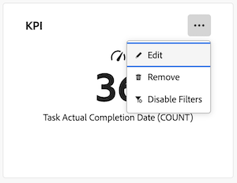

# Een rapport bewerken op een canvasdashboard

>[!IMPORTANT]
>
>De functie Canvasdashboards is momenteel alleen beschikbaar voor gebruikers die deelnemen aan de bètafase. Onderdelen van het onderdeel zijn mogelijk niet compleet of werken niet zoals bedoeld in deze fase. Gelieve te dienen om het even welke terugkoppelen betreffende uw ervaring door de instructies in [ te volgen verstrekt ](/help/quicksilver/product-announcements/betas/canvas-dashboards-beta/canvas-dashboards-beta-information.md#provide-feedback) sectie in het de bètaoverzichtsartikel van de dashboards van het Canvas. 
>>Als u feedback hebt over een mogelijk probleem met een probleem of een technisch probleem, stuurt u een ticket naar Workfront Support. Voor meer informatie, zie [ de Steun van de Klant van het Contact ](/help/quicksilver/workfront-basics/tips-tricks-and-troubleshooting/contact-customer-support.md). 
>>Deze bètaversie is niet beschikbaar op de volgende cloudproviders:
>
>* Je eigen sleutel voor Amazon Web Services
>* Azure
>* Google Cloud Platform

Nadat u rapporten aan een Dashboard van het Canvas toevoegt, kunt u de informatie van het rapport uitgeven om de gegevens te veranderen die in het dashboard tonen.

Alle wijzigingen die in een rapport worden aangebracht, zijn van invloed op alle gebruikers die toegang hebben tot het dashboard dat het bevat.

+++ Breid uit om de toegangseisen voor de functionaliteit in dit artikel weer te geven.

<table style="table-layout:auto"> 
<col> 
</col> 
<col> 
</col> 
<tbody> 
<tr> 
   <td role="rowheader">
Adobe Workfront-pakket
</td> 
   <td> 

Alle 
 
   </td> 
<tr> 
 <tr> 
   <td role="rowheader">
Adobe Workfront-licentie
</td> 
   <td> 

Standard
 

Plan
 
   </td> 
   </tr> 
  </tr> 
  <tr> 
   <td role="rowheader">
Configuraties op toegangsniveau
</td> 
   <td>
Toegang tot rapporten, dashboards en kalenders bewerken

  </td> 
  </tr>  
        <tr> 
   <td role="rowheader">
Objectmachtigingen
</td> 
   <td>
Rechten voor het dashboard beheren

  </td> 
  </tr>
</tbody> 
</table>

Voor meer detail over de informatie in deze lijst, zie [ vereisten van de Toegang in de documentatie van Workfront ](/help/quicksilver/administration-and-setup/add-users/access-levels-and-object-permissions/access-level-requirements-in-documentation.md).
+++

## Vereisten

U moet een rapport aan een dashboard toevoegen alvorens het kan worden uitgegeven.

Voor meer informatie, zie [ een dashboard van het Canvas ](/help/quicksilver/reports-and-dashboards/canvas-dashboards/create-dashboards/create-dashboards.md) creëren.

## Een rapport bewerken

{{step1-to-dashboards}}

1. In het linkerpaneel, klik **de Dashboards van het Canvas**.

1. Op de **pagina van de Dashboards van het Canvas**, klik **Meer**  in de hoger-juiste hoek van het rapport u, dan uitgezocht **uitgeven**.

    uit

1. In **vorm** dialoogdoos, geef de informatie in de secties uit die op de linkerkant worden vermeld. Deze secties zullen afhankelijk van het rapporttype variëren u uitgeeft.

1. (Optioneel) Als u een PKI-rapport bewerkt, bewerkt u de benodigde gegevens in de volgende secties:

   * **Details**
   * **bouwt KPI**
   * **Filters**
   * **Drilldown de Montages van de Kolom**
   * **Drilldown de Montages van de Groep**

   Voor meer informatie over deze secties, zie [ een KPI- rapport ](/help/quicksilver/reports-and-dashboards/canvas-dashboards/add-reports/build-kpi-report.md) bouwen.

1. (Optioneel) Als u een grafiekrapport bewerkt, bewerkt u de benodigde gegevens in de volgende secties:

   * **Details**
   * **bouwt Grafiek**
   * **Filters**
   * **Drilldown de Montages van de Kolom**
   * **Drilldown de Montages van de Groep**

   Voor meer informatie over deze secties, zie [ een grafiekrapport ](/help/quicksilver/reports-and-dashboards/canvas-dashboards/add-reports/build-chart-report.md) bouwen.

1. (Optioneel) Als u een tabelrapport bewerkt, bewerkt u de benodigde gegevens in de volgende secties:

   * **Details**
   * **bouwt Lijst**
   * **Filters**
   * **de Montages van de Groep**

   Voor meer informatie over deze secties, zie [ een lijstrapport ](/help/quicksilver/reports-and-dashboards/canvas-dashboards/add-reports/build-table-report.md) bouwen.

1. Klik **sparen** om het rapport bij te werken.

## Een bestaand rapport bewerken

Wanneer u een bestaand rapport bewerkt, overschrijven de rapportgegevens die u selecteert, de gegevens die momenteel in de widget worden weergegeven. Als u een aanvullend bestaand rapport wilt toevoegen in plaats van een rapport te vervangen, is het raadzaam een aparte rapportwidget te maken.

Voor meer informatie, zie [ een bestaand rapport aan een Dashboard van het Canvas ](/help/quicksilver/reports-and-dashboards/canvas-dashboards/add-reports/add-existing-report.md) toevoegen

{{step1-to-dashboards}}

1. In het linkerpaneel, klik **de Dashboards van het Canvas**.

1. Op de **pagina van de Dashboards van het Canvas**, klik **Meer**  in de hoger-juiste hoek van het rapport u, dan uitgezocht **uitgeven**.

1. In de **doos van de Selectie van het 0} Rapport, klik** **in lijn met het rapport toevoegen u de gegevens van het bestaande rapport wilt vervangen widget met.**
