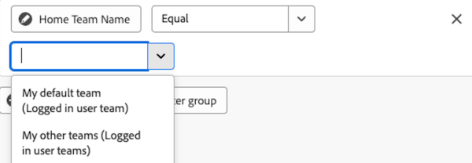

# Rapportfilters bewerken in een Canvasdashboard

>[!IMPORTANT]
>
>De functie Canvasdashboards is momenteel alleen beschikbaar voor gebruikers die deelnemen aan de bètafase. Onderdelen van het onderdeel zijn mogelijk niet compleet of werken niet zoals bedoeld in deze fase. Gelieve te dienen om het even welke terugkoppelen betreffende uw ervaring door de instructies in [ te volgen verstrekt ](/help/quicksilver/product-announcements/betas/canvas-dashboards-beta/canvas-dashboards-beta-information.md#provide-feedback) sectie in het de bètaoverzichtsartikel van de dashboards van het Canvas. 
>>Deze bètaversie is niet beschikbaar op de volgende cloudproviders:
>
>* Je eigen sleutel voor Amazon Web Services
>* Azure
>* Google Cloud Platform

U kunt rapportfilters uitgeven zodra u hen op een Dashboard van het Canvas hebt toegepast om de gegevens bij te werken die tonen aangezien een project vordert.

## Toegangsvereisten

+++ Vouw uit om de vereisten voor toegang weer te geven. 

<table style="table-layout:auto"> 
<col> 
</col> 
<col> 
</col> 
<tbody> 
<tr> 
   <td role="rowheader">
Adobe Workfront-plan
</td> 
   <td> 

Alle 
 
   </td> 
<tr> 
 <tr> 
   <td role="rowheader">
Adobe Workfront-licentie
</td> 
   <td> 

Huidig: Plan 
 

Nieuw: Standaard
 
   </td> 
   </tr> 
  </tr> 
  <tr> 
   <td role="rowheader">
Configuraties op toegangsniveau
</td> 
   <td>
Toegang tot rapporten, dashboards en kalenders bewerken

  </td> 
  </tr>  
        <tr> 
   <td role="rowheader">
Objectmachtigingen
</td> 
   <td>
Rechten voor het dashboard beheren

  </td> 
  </tr>
</tbody> 
</table>

Voor meer detail over de informatie in deze lijst, zie [ vereisten van de Toegang in de documentatie van Workfront ](/help/quicksilver/administration-and-setup/add-users/access-levels-and-object-permissions/access-level-requirements-in-documentation.md).
+++

## Vereisten

U moet een filter aan een rapport toevoegen alvorens het kan worden uitgegeven.

## Een rapportfilter bewerken

>[!NOTE]
>
>Er zijn vele beschikbare configuratiehulpmiddelen om een rapportfilter te bouwen en uit te geven. Voor meer informatie over deze hulpmiddelen, zie de volgende sectie in dit artikel: [ Overwegingen wanneer het uitgeven van een rapportfilter ](#considerations-when-editing-a-report-filter).

{{step1-to-dashboards}}

1. In het linkerpaneel, klik **de Dashboards van het Canvas**.

1. Op de **pagina van de Dashboards van het Canvas**, klik **Meer**  in de hoger-juiste hoek van het rapport dat de filter bevat u wilt uitgeven, dan uitgezocht **geeft** uit.

    uit

1. Op de linkerkant van **vorm** dialoogdoos, selecteer het **paneel van Filters**.

1. Klik **uitgeven filter**.

1. Selecteer het veld of de modifier die u wilt bewerken en pas de huidige selecties naar wens aan.

   

1. (Facultatief) klik **toevoegen filtergroep** om een andere reeks het filtreren criteria toe te voegen. De standaardoperator tussen de sets is AND. Klik op de operator om deze te wijzigen in OR.

1. Klik **sparen**.

## Overwegingen bij het bewerken van een rapportfilter

### Op datum gebaseerde jokertekenfiltervariabelen

De op datum-gebaseerde vervangingsopties kunnen in combinatie met om het even welk attribuut van de datumfilter worden gebruikt. Voor informatie over het toevoegen van een op datum-gebaseerde vervanging aan een rapport, zie het artikel [ Op datum-gebaseerde vervangingen van het Gebruik om rapporten ](../../../reports-and-dashboards/reports/reporting-elements/use-date-based-wildcards-generalize-reports.md) te generaliseren.

>[!NOTE]
>
>Als u een datum- en tijdberekening maakt die geen tijdgedeelte bevat of die de jokertekens $$TODAY of $$NOW gebruikt, gebruikt het systeem de datum volgens de UTC-zone (Coordinated Universal Time), niet volgens uw lokale tijdzone. Dit kan tot een onverwacht datumresultaat leiden.

U kunt uit de volgende op datum-gebaseerde vervangingen kiezen:

<table style="table-layout:auto"> 
 <col> 
 <col> 
 <tbody> 
  <tr valign="top"> 
   <td width="100" role="rowheader"> 
<strong>$$TODAY </strong> 
 </td> 
   <td> 
Wij adviseren dat u datum-gevoelige filters gebruikend deze vervangingskaart bouwt zodat vermijdt u bouw de filter morgen, volgende week, of volgende maand opnieuw.
 
Bijvoorbeeld, als u alle taken wilt tonen die vóór vandaag verschuldigd zijn, kunt u de volgende regel in een taakfilter gebruiken: <em> Geplande Datum van het Begin minder dan $$TODAY </em>.
 
$$TODAY is altijd gelijk aan middernacht voor de huidige dag.
 </td> 
  </tr> 
  <tr valign="top"> 
   <td width="100" role="rowheader"> 
<strong>$$NOW </strong> 
 </td> 
   <td> 
Dit is vergelijkbaar met de jokerteken $$TODAY, maar inclusief de huidige datum en tijd. $$NOW is gelijk aan de huidige datum en tijd.
 
Bijvoorbeeld, als u alle die uuringangen wilt tonen tot de huidige tijd worden verstrekt, kunt u dit doen door de volgende regel in een uurfilter te gebruiken: <em> Geplande Datum van het Begin minder dan $$NOW </em>.
 
Opmerking: dit jokerteken wordt niet ondersteund in de functie voor middelenplanning.
 </td> 
  </tr> 
 </tbody> 
</table>

U kunt de jokertekens hierboven combineren met het volgende om verschillende tijdsperioden en verschillende tijdpunten (in de toekomst of in het verleden) aan te geven:

| Attributen |   |
|---|---|
| **q** | kalenderkwartaal |
| **h** | uur |
| **d** | dag |
| **w** | week |
| **m** | maand |
| **y** | jaar |

{style="table-layout:auto"}

| **Kwalificatoren** | |
|---|---|
| **b** | begin van de periode (zonder een opgegeven kenmerk, standaard ingesteld op begin van de week: zondag) |
| **e** | Einde van de periode (zonder een opgegeven kenmerk, standaardwaarde tot einde van de week: zaterdag) |

{style="table-layout:auto"}

| **Operatoren** | |
|---|---|
| **+** | waarde toevoegen aan jokertekenwaarde |
| **-** | Waarde van jokerteken aftrekken van waarde |

{style="table-layout:auto"}

Het jokerteken `$$TODAYb+2w` verwijst bijvoorbeeld naar &quot;2 weken vanaf het begin van deze week&quot;. Jokerteken * `$$NOW+2h` verwijst naar &quot;2 uren van nu.&quot;

### Aangemeld, filtervariabelen van jokerteken van gebruiker

* Wanneer het filtreren op het gebruiker `name` attribuut, zult u **me (Logged in gebruiker)** optie bekijken.

  

* Wanneer het filtreren op een groep `name` attribuut, zult u **Mijn huisgroep (die in gebruikersgroep wordt geregistreerd)** bekijken en **Mijn andere groepen (die in gebruikersgroepen worden geregistreerd)** opties om in een filtervoorwaarde te gebruiken.

  

* Wanneer het filtreren op een team `name` attribuut, zult u **Mijn standaardteam (die in gebruikersteam wordt geregistreerd)** bekijken en **Mijn andere teams (die in gebruikersteams worden geregistreerd)** opties om van in de filtervoorwaarde te kiezen.

  

### Verwijzen naar onderliggende objecten

De beschikbare verhoudingen voor extra kolommen, filteropties, en groeperingsattributen zijn over het algemeen beperkt tot voorwerpen hoger in de objecten van Workfront hiërarchie of anders één enkele selectie op het voorwerp van de basisentiteit van het rapport hebben. Hierop zijn enkele uitzonderingen van toepassing, waaronder:

* Project > Taken
* Documentgoedkeuring > Documentgoedkeuringsfasen
* Acties voor documentgoedkeuring > Deelnemers aan werkgebied voor documentgoedkeuring

Wanneer u een van de bovenstaande relaties van bovenliggend item naar onderliggend item gebruikt, wordt in de tabel een rij weergegeven voor elke onderliggende record die is verbonden met het bovenliggende object.

### Veldoperatoren per veldtype

+++ Vouw uit om de lijst met veldoperatoren per veldtype weer te geven. 

<table>
    <tr>
        <td><b>Veldtype</b></td>
        <td><b>Voorbeeld</b></td>
       <td><b>Operatoren</b></td>
        <td><b>Jokertekens</b></td>
    </tr>
    <tr>
        <td>Naam object/verwijzing</td>
        <td>Elk native naamkenmerk of aangepaste opzoekhandeling</td>
              <td><ul>
        <li>Gelijk</li>
        <li>Niet gelijk</li>
        <li>Bevat</li>
          <li>Bevat niet</li>
            <li>Is null</li>
              <li>Is niet null</li>
        </ul></td>
        <td>Gebruiker: Naam
        <ul>
        <li>Ik (aangemeld bij gebruiker)</li>
        </ul>
        Groep: Naam
        <ul>
          <li>Mijn thuisgroep (aangemeld in gebruikersgroep)</li>
            <li>Mijn andere groepen (aangemeld in gebruikersgroepen)</li>
          </ul>
          Team: Naam
                  <ul>
          <li>Mijn standaardteam (aangemeld in gebruikersteam)</li>
            <li>Mijn andere teams (aangemeld in gebruikersteams)</li>
          </ul>
        </td>
    </tr>
    <tr>
        <td>Tekenreeks/tekstinvoer </td>
                <td>Project: Beschrijving</td>
                      <td><ul>
             <li>Gelijk</li>
        <li>Niet gelijk</li>
        <li>Bevat</li>
          <li>Bevat niet</li>
            <li>Is null</li>
              <li>Is niet null</li>
        </ul></td>
        <td></td>
    </tr>
    <tr>
        <td>Geheel getal/dubbel</td>
             <td>Project: geplande uren
          Taak: Percentage voltooid</td>
              <td><ul>
        <li>Gelijk</li>
        <li>Niet gelijk</li>
        <li>Groter dan</li>
          <li>Groter dan of gelijk aan</li>
          <li>Minder dan</li>
          <li>Kleiner dan of gelijk aan</li>
            <li>Is null</li>
              <li>Is niet null</li>
        </ul></td>
        <td></td>
    </tr>
       <tr>
        <td> Datum/Datum/tijd </td>
                    <td>Project: geplande begindatum
          Uur: Datum van ingang</td>
              <td><ul>
        <li>Gelijk</li>
        <li>Niet gelijk</li>
        </ul></td>
        <td>Door op de <b> Vastgestelde relatieve datum </b> optie van een knevel te voorzien, kunt u relatieve datumvervangingen toepassen om het rapport dynamischer te maken en zelf-aan te passen gebaseerd op gemeenschappelijke datumperiodes. 
         <ul><li>$$TODAY</li>
         <li>$$NOW</li>
         </ul>
        </td>
    </tr>
       <tr>
        <td>Boolean </td>
                  <td>Project: heeft documenten
          Taak: is Kritiek
          Gebruiker: is actief</td>
        <td><ul>
        <li>Gelijk</li>
        <li>Niet gelijk</li>
        </ul></td>
        <td> </td>
    </tr>
   </table>

+++
