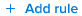

# Een tabelkolom configureren in het rapportcanvas

De kolommen in een lijst kunnen voor vertoning worden gevormd. U kunt de volgende aspecten van een kolom wijzigen:

* Naam
* Sorteren
* Machtiging bewerken
* Tekst boven
* Samenvoeging
* Voorwaardelijke opmaak

## Vereisten

Alvorens u begint, moet u in de bèta van het Canvas van de Rapportering inschrijven. Voor meer informatie, zie [ Rapporterend de bèta van het Canvas: overzicht ](/help/quicksilver/product-announcements/betas/canvas-dashboards-beta/reporting-canvas-beta-overview.md).

## Kolommen in een tabel wijzigen

1. Ga naar een bestaand rapport, klik het **Meer pictogram van het Menu**  in de rapportkopbal, dan uitgezocht **geef** uit.
1. Voor de lijstkopbal in het rapport, klik **uitgeven** pictogram  uit.

   

   >[!NOTE]
   >
   >Als u de tabel hebt gemaakt en nog geen velden hebt toegevoegd, klikt u in plaats daarvan op de knop Bewerken in het midden van de tabel.

1. (Optioneel) Voeg kolommen in de tabel toe, verplaats deze of verwijder deze. Voor meer informatie bij het uitgeven van de gebieden in een lijst, zie [ een lijstblok in het Melden van Canvas ](../../../reports-and-dashboards/reporting-canvas/table-blocks/add-or-edit-report-table.md) toevoegen of uitgeven

   | Een nieuwe kolom toevoegen | Om een kolom aan een lijst toe te voegen, of klik en sleep een gebied van het **paneel van Gebieden** op het recht van de pagina op de lijst waar u het zou willen plaatsen, of dubbelklik een gebied om het als meest rechtse kolom toe te voegen. |
   |---|---|
   | Een kolom verplaatsen | Als u de volgorde van kolommen in een tabel wilt wijzigen, klikt u op de naam van een kolom en sleept u deze naar een nieuwe locatie. |
   | Een kolom verwijderen | Als u een kolom uit een tabel wilt verwijderen, klikt u op de kolom die u wilt verwijderen en klikt u op de x aan de rechterkant van de kolomnaam. |

   {style="table-layout:auto"}

1. Als u een kolom wilt configureren, klikt u op de naam van de kolom die u wilt wijzigen in de koptekstrij van de tabel en vervolgens op een van de volgende tabbladen in het rechterdeelvenster:

   <table style="table-layout:auto"> 
    <col> class="TableStyle-TableStyle-List-options-in-stappen-Column-Column1" /&gt;
    <tbody>
     <tr data-mc-conditions="">
      <th role="rowheader" colspan="2">Tabblad Gegevens</th>
     </tr>
     <tr data-mc-conditions="">
      <td role="rowheader">Geaggregeerd op basis van</td>
      <td>
 Om (samenvatten in de kopbal) de informatie in een kolom samen te voegen, selecteer het type van samenvoeging u van <strong> wilt samenvoegen gebaseerd op </strong> drop-down menu. Welke opties beschikbaar zijn, is afhankelijk van het type gegevens in de kolom.

Als u groepen in de tabel gebruikt, wordt de samengevoegde waarde weergegeven in de groepstrij boven de kolomnaam in plaats van naast de kolomnaam.
</td>
     </tr>
     <tr data-mc-conditions="">
      <td role="rowheader">Veldindeling</td>
      <td>
(Alleen beschikbaar als de kolom datum-, percentage-, valuta- of tijdgegevens bevat, niet tekst.) Selecteer het formaat u voor de gegevens in het <b> drop-down Formaat van het Gebied </b> wilt. U kunt bijvoorbeeld percentagetekens weergeven na de getallen in een kolom of de manier wijzigen waarop datums worden weergegeven.
</td>
     </tr>
     <tr data-mc-conditions="">
      <td role="rowheader">Veld kan worden bewerkt</td>
      <td>Laat het <strong> Gebied toe is editable </strong> als u gebruikers wilt toestaan die de lijst bekijken om de naam van de kolom uit te geven.</td>
     </tr>
     <tr>
      <td role="rowheader"><strong>Sorteren</strong></td>
      <td>
Standaard sorteert de tabel op basis van de gegevens in oplopende volgorde in de kolom helemaal links. Om door de geselecteerde kolom in plaats daarvan te sorteren, klik de benedenpijl naast <strong> Soort </strong>, dan klik checkbox <b> Soort door deze kolom </b>. U kunt a <strong> dan selecteren sorterend </strong> richting (het stijgen of dalende waarden) en a <strong> de Orde van de Soort </strong> (de relatieve sorteerprioriteit van deze kolom vergeleken bij andere sorterende kolommen in de lijst).

U kunt dit proces herhalen om de tabel met maximaal vijf verschillende kolommen te sorteren. Zorg ervoor dat elke kolom de correcte <strong> Orde van de Sortering </strong> met betrekking tot om het even welke nieuwe kolommen heeft u voor het sorteren selecteert.

Opmerking: als u een kolom verwijdert die is geselecteerd om een tabel te sorteren en er een andere kolom is geselecteerd om te sorteren, wordt die kolom gebruikt om de tabel in aflopende volgorde te sorteren. Als er geen andere kolommen zijn geselecteerd om te sorteren, keert de lijst aan het gebrek terug: sorterend door zijn eerste kolom.

Wanneer u een kolom aanwijst om de tabel te sorteren, wordt naast de kolomnaam een klein vak weergegeven met een getal dat de relatieve prioriteit van die kolom aangeeft bij het sorteren van de tabel (de tabel wordt eerst gesorteerd op 1, vervolgens op 2, enzovoort) en een pijl om aan te geven of de sorteerrichting oplopend of aflopend is. 

</td>
     </tr>
    </tbody>
   </table>

   <table style="table-layout:auto"> 
    <col> 
    <col> 
    <tbody> 
     <tr> 
      <th role="rowheader" colspan="2">Het tabblad Stijl</th> 
     </tr> 
     <tr> 
      <td role="rowheader"><strong> de kolometiket van de Douane </strong> </td> 
      <td>Voer een nieuwe weergavenaam in voor de kolom (maximaal 100 tekens).</td> 
     </tr> 
     <tr> 
      <td role="rowheader">Hoektekst tonen</td> 
      <td> 
Bepaal of u verklarende tekst wilt tonen wanneer iemand over een kolomnaam beweegt.
 
Deze optie is standaard uitgeschakeld.
 </td> 
     </tr> 
     <tr> 
      <td role="rowheader">Tekst boven</td> 
      <td>(Beschikbaar slechts wanneer <strong> tonen aanwijstekst </strong> wordt toegelaten.) Pas de verklarende tekst aan die toont wanneer iemand over een kolomnaam beweegt.</td> 
     </tr> 
     <tr> 
      <td role="rowheader"><strong> Voorwaardelijke het formatteren </strong> </td> 
      <td> 
       <ol data-mc-continue="false"> 
        <li value="1"> 
Voeg  toe, bewerk , of schrap  een regel die cellen in de kolom formatteert wanneer hun waarden aan criteria voldoen u specificeert.
 
U kunt bijvoorbeeld een regel maken die het lettertype in het veld Projectstatus wijzigt in vet paars wanneer de waarde van dat veld gelijk is aan "Samenstellen".
 
Of u kunt <b> gebruiken toont een pictogram </b> om een groen vlagpictogram aan elk punt in de kolom toe te voegen die de "Huidige"status heeft.
 
  
 
Nota: Als u <strong> gebruikt toon een pictogram </strong>, zijn de andere het formatteren opties niet beschikbaar.
 
U kunt selecteren <strong> op de volledige rij </strong> van toepassing zijn als u het formatteren de volledige rij van een cel wilt beïnvloeden die aan de voorwaarde van uw regel voldoet. U kunt bijvoorbeeld projecten markeren die na een bepaalde datum worden uitgevoerd door een gele achtergrondkleur toe te passen op niet alleen de datumcellen in de kolom "Vereist", maar op de hele rij waar die datums voorkomen.
 
Tip: Aangezien u het formatteren opties aan een regel toevoegt, wordt het resulterende celformaat getoond onder <strong> Voorproef </strong> bij de bodem van het paneel.
 </li> 
        <li value="2">Wanneer u wordt gebeëindigd toevoegend een regel, klik <strong> sparen </strong>.</li> 
        <li value="3"> 
(Optioneel) Klik op <b>+ Regel toevoegen </b> om extra regels aan dezelfde kolom toe te voegen.
 
Meerdere regels voor voorwaardelijke opmaak in een tabel worden in de volgende volgorde toegepast:
 
         <ul> 
          <li> 
De regels die op volledige rijen van toepassing zijn worden eerst geëvalueerd, van links naar rechts voor elke kolom en dan van boven naar onder binnen een kolom.
 
Opmerking: Rijopmaak heeft voorrang op andere voorwaardelijke opmaak voor cellen in die rij, zelfs als ze anders aan de voorwaarde van de regel van een andere kolom zouden voldoen.
 </li> 
          <li> 
Andere regels worden hierna geëvalueerd, van boven naar beneden aangezien zij in het juiste paneel voor een kolom worden vermeld. U kunt  opgeslagen regels in dat deelvenster slepen om de volgorde te wijzigen.
 
Opmerking: cellen worden opgemaakt op basis van de eerste voorwaarde waaraan ze voldoen en worden niet verder opgemaakt, zelfs niet als ze aan andere voorwaarden voldoen.
 </li> 
         </ul> </li> 
       </ol> </td> 
     </tr> 
    </tbody> 
   </table>

1. Klik **gaan terug** pijl in de upper-left hoek van het scherm om aan uw rapport terug te keren.
