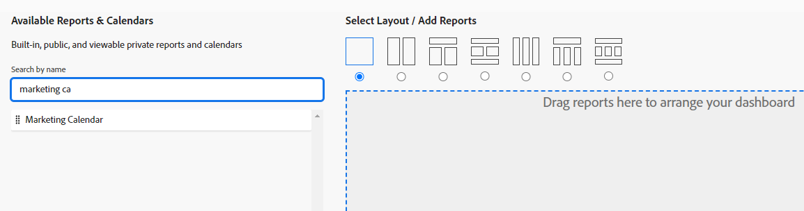

# Een dashboard maken

<!--Audited: 01/2025-->

U kunt dashboards tot stand brengen om tot informatie in Adobe Workfront snel toegang te hebben. U kunt maximaal 25 rapporten, kalenders en externe pagina&#39;s toevoegen aan dashboards die u met anderen kunt delen voor optimale samenwerking.

Meer over dashboards leren, zie [ begonnen met dashboards ](../../../reports-and-dashboards/dashboards/understanding-dashboards/get-started-dashboards.md).

## Toegangsvereisten

+++ Breid uit om de toegangseisen voor de functionaliteit in dit artikel weer te geven.

<table style="table-layout:auto"> 
 <col> 
 <col> 
 <tbody> 
  <tr> 
   <td role="rowheader">Adobe Workfront-pakket</td> 
   <td> 
Alle
 </td> 
  </tr> 
  <tr> 
   <td role="rowheader">Adobe Workfront-licentie</td> 
   <td> 
      
Standard

      
Plan

   </td> 
  </tr> 
  <tr> 
   <td role="rowheader">Configuraties op toegangsniveau</td> 
   <td> 
Toegang tot rapporten, dashboards en kalenders bewerken
</td> 
  </tr>  
  <tr> 
   <td role="rowheader">Objectmachtigingen</td> 
   <td> 
U krijgt beheermachtigingen voor de dashboards die u maakt
 </td> 
  </tr> 
 </tbody> 
</table>

Voor meer detail over de informatie in deze lijst, zie [ vereisten van de Toegang in de documentatie van Workfront ](/help/quicksilver/administration-and-setup/add-users/access-levels-and-object-permissions/access-level-requirements-in-documentation.md).

+++

## Vereisten

U moet de volgende objecten maken voordat u deze aan een dashboard kunt toevoegen:

* **Rapporten**: Voor informatie bij het creëren van rapporten, zie [ een douanerapport ](../../../reports-and-dashboards/reports/creating-and-managing-reports/create-custom-report.md) creëren.

* **Kalenders**: Voor informatie bij het creëren van kalenders, zie [ overzicht van de rapporten van de Kalender ](../../../reports-and-dashboards/reports/calendars/calendar-reports-overview.md).

U kunt bestaande externe pagina&#39;s toevoegen aan een dashboard of u kunt een pagina maken van het nieuwe dashboard. Voor informatie bij het creëren van externe pagina&#39;s, zie [ een externe Web-pagina in een dashboard ](../../../reports-and-dashboards/dashboards/creating-and-managing-dashboards/embed-external-web-page-dashboard.md) inbedden.

## Een dashboard maken

{{step1-to-dashboards}}

1. Klik **Nieuw Dashboard**.\
   Het dialoogvenster Nieuw dashboard wordt weergegeven.

1. Geef het volgende op:

   <table style="table-layout:auto">
    <col>
    <col>
    <tbody>
     <tr>
      <td role="rowheader"><strong>Naam</strong></td>
      <td>
Dit is de naam van het dashboard. We raden u aan alleen UTF-8-tekens te gebruiken om compatibiliteitsproblemen te voorkomen.

Als u geen naam opgeeft, wordt de naam van het eerste rapport op het dashboard standaard de naam van het dashboard.
</td>
     </tr>
     <tr>
      <td role="rowheader"><strong>Beschrijving (optioneel)</strong></td>
      <td>Dit is een beschrijving van het dashboard.</td>
     </tr>
    </tbody>
   </table>

1. Selecteer een lay-out door het radioknoop te klikken die aan het bij de bovenkant van **Uitgezochte Lay-out/voegt Rapporten/toevoegt Calendars** sectie beantwoordt. Dit is de lay-out waarin de rapporten, kalenders, of externe pagina&#39;s op het dashboard zullen tonen.

   De lay-out met één kolom is de standaardinstelling.

   Voor informatie over rapportlay-out op dashboards, zie [ begrijpen hoe de rapporten op een dashboard ](../../../reports-and-dashboards/dashboards/understanding-dashboards/understand-how-reports-display-dashboard.md) tonen.

   <!--
   Consider adding the information from this article above here, at some point, instead of linking to it.)
   -->

1. In de **Beschikbare Rapporten &amp; Calendars** sectie, begin de naam van een rapport, een kalender, of een externe pagina in de onderzoeksbar te typen, dan belemmering en laat vallen het rapport, de kalender, of de externe pagina in de lay-outruit aan het recht.

   >[!NOTE]
   >
   >Wanneer het zoeken naar een punt, keert het onderzoek om het even welke 2000 onlangs gecreeerd rapporten terug. Rapportnamen met Unicode-tekens worden niet geretourneerd in zoekresultaten. U kunt het beste Unicode-tekens niet opnemen bij het benoemen van objecten in Workfront door namen te typen in plaats van namen van een andere bron te kopiëren en te plakken.

   

1. (Optioneel) Klik op **Externe pagina toevoegen** om een nieuwe externe pagina aan het dashboard toe te voegen.

   Voor meer informatie over het creëren van externe pagina&#39;s en het inbedden van hen in dashboards, zie [ een externe Web-pagina in een dashboard ](../../../reports-and-dashboards/dashboards/creating-and-managing-dashboards/embed-external-web-page-dashboard.md) inbedden.

1. Klik **sparen + Sluiten**.

   Een tijdstempel wordt in de rechterbovenhoek van het dashboard weergegeven. De tijdstempel bevat de datum, tijd en tijdzone waarop het dashboard voor het laatst is vernieuwd.
