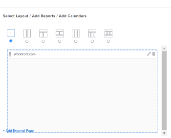

# Een externe pagina verwijderen van een dashboard

<!-- Audited: 1/2025 -->

U kunt een externe pagina van een dashboard verwijderen als het niet meer nodig is.

U kunt een externe pagina echter niet verwijderen nadat u deze hebt gemaakt in Adobe Workfront. U kunt een externe pagina alleen verwijderen met de API. Voor informatie over Workfront API, zie [&#x200B; API basiscs &#x200B;](../../../wf-api/general/api-basics.md). Voor informatie over het creëren van externe pagina&#39;s, zie [&#x200B; een externe Web-pagina in een dashboard &#x200B;](../../../reports-and-dashboards/dashboards/creating-and-managing-dashboards/embed-external-web-page-dashboard.md) inbedden.

## Toegangsvereisten

+++ Breid uit om de toegangseisen voor de functionaliteit in dit artikel weer te geven. 

<table style="table-layout:auto"> 
 <col> 
 <col> 
 <tbody> 
  <tr> 
   <td role="rowheader">Adobe Workfront-pakket</td> 
   <td> 
Alle
 </td> 
  </tr> 
  <tr> 
   <td role="rowheader">Adobe Workfront-licentie</td> 
   <td> 
      
Standard

      
Plan

   </td> 
  </tr> 
  <tr> 
   <td role="rowheader">Configuraties op toegangsniveau</td> 
   <td> 
Toegang tot rapporten, dashboards en kalenders bewerken
</td> 
  </tr>  
  <tr> 
   <td role="rowheader">Objectmachtigingen</td> 
   <td> 
Rechten voor het dashboard beheren
 </td> 
  </tr> 
 </tbody> 
</table>

Voor meer detail over de informatie in deze lijst, zie [&#x200B; vereisten van de Toegang in de documentatie van Workfront &#x200B;](/help/quicksilver/administration-and-setup/add-users/access-levels-and-object-permissions/access-level-requirements-in-documentation.md).

+++

## Een externe pagina uit een dashboard verwijderen

1. Ga naar het dashboard dat de externe pagina bevat u wilt schrappen.

1. Klik **Acties van het Dashboard**, dan klik **uitgeven**.

    uit

1. Op de rechterkant van het scherm, bepaal de plaats van de externe pagina u **schrapt en klikt pictogram van de Schrapping** .

   

1. Klik **sparen + Sluiten** in de laag-linkerhoek.

   Hierdoor wordt de externe pagina van het geselecteerde dashboard verwijderd. De externe pagina blijft in Workfront en is toegankelijk vanuit een rapport. Voor informatie, zie de &quot;Externe pagina&#39;s van de Mening in een rapport&quot;sectie in het artikel [&#x200B; een externe Web-pagina in een dashboard &#x200B;](../../../reports-and-dashboards/dashboards/creating-and-managing-dashboards/embed-external-web-page-dashboard.md) inbedden.
