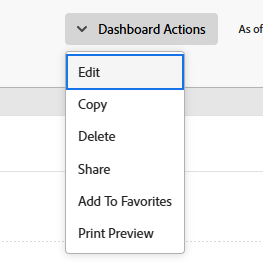

# Een externe pagina verwijderen van een dashboard

<!-- Audited: 1/2025 -->

You can remove an External Page from a dashboard if it&#39;s no longer needed.

U kunt een externe pagina echter niet verwijderen nadat u deze hebt gemaakt in Adobe Workfront. You can delete an external page only using the API. Voor informatie over Workfront API, zie [ API basiscs ](../../../wf-api/general/api-basics.md). For information about creating external pages, see [Embed an external web page in a dashboard](../../../reports-and-dashboards/dashboards/creating-and-managing-dashboards/embed-external-web-page-dashboard.md).

## Toegangsvereisten

+++ Breid uit om de toegangseisen voor de functionaliteit in dit artikel weer te geven. 

<table style="table-layout:auto"> 
 <col> 
 <col> 
 <tbody> 
  <tr> 
   <td role="rowheader">Adobe Workfront-pakket</td> 
   <td> 
Alle
 </td> 
  </tr> 
  <tr> 
   <td role="rowheader">Adobe Workfront-licentie</td> 
   <td> 
      
Standard

      
Plan

   </td> 
  </tr> 
  <tr> 
   <td role="rowheader">Configuraties op toegangsniveau</td> 
   <td> 
Toegang tot rapporten, dashboards en kalenders bewerken
</td> 
  </tr>  
  <tr> 
   <td role="rowheader">Objectmachtigingen</td> 
   <td> 
Rechten voor het dashboard beheren
 </td> 
  </tr> 
 </tbody> 
</table>

Voor meer detail over de informatie in deze lijst, zie [ vereisten van de Toegang in de documentatie van Workfront ](/help/quicksilver/administration-and-setup/add-users/access-levels-and-object-permissions/access-level-requirements-in-documentation.md).

+++

## Remove an external page from a dashboard

1. Go to the dashboard thatcontains the external page you want to delete.

1. Klik **Acties van het Dashboard**, dan klik **uitgeven**.

    uit

1. On the right side of the screen, locate the external page you want to remove and click the **Delete** icon .

   

1. Click **Save + Close** in the lower-left corner.

   Hierdoor wordt de externe pagina van het geselecteerde dashboard verwijderd. De externe pagina blijft in Workfront en is toegankelijk vanuit een rapport. For information, see the &quot;View external pages in a report&quot; section in the article [Embed an external web page in a dashboard](../../../reports-and-dashboards/dashboards/creating-and-managing-dashboards/embed-external-web-page-dashboard.md).
