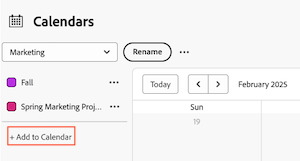

# Een bestaand kalenderrapport bewerken

 de benadrukte informatie op deze pagina verwijst naar functionaliteit nog niet algemeen beschikbaar. Het is beschikbaar slechts in het milieu van de Sandbox van de Voorproef.

U kunt een bestaande kalender wijzigen door een verbinding aan een project toe te voegen of te schrappen. U kunt ook kalendergroepen wijzigen die zijn gekoppeld aan een kalenderrapport.

>[!NOTE]
>
>U bent beperkt tot 15 groepen in een kalenderrapport.

## Toegangsvereisten

+++ Breid uit om de toegangseisen voor de functionaliteit in dit artikel weer te geven.

U moet de volgende toegang hebben om de stappen in dit artikel uit te voeren:

<table style="table-layout:auto"> 
 <col> 
 </col> 
 <col> 
 </col> 
 <tbody> 
  <tr> 
   <td role="rowheader">[!DNL Adobe Workfront plan]</td> 
   <td> 
Alle
 </td> 
  </tr> 
  <tr> 
   <td role="rowheader">[!DNL Adobe Workfront] licentie</td> 
   <td>
Nieuw: Standaard

       
of

       
Huidig: Plan
</td> 
  </tr> 
  <tr> 
   <td role="rowheader">Configuraties op toegangsniveau</td> 
   <td> 
[!UICONTROL Edit] toegang tot [!UICONTROL Reports] , [!UICONTROL Dashboards] en [!UICONTROL Calendars]
</td> 
  </tr> 
  <tr> 
   <td role="rowheader">Objectmachtigingen</td> 
   <td>[!UICONTROL Manage] toegang tot het kalenderverslag</td> 
  </tr> 
 </tbody> 
</table>

Voor meer detail over de informatie in deze lijst, zie [ vereisten van de Toegang in de documentatie van Workfront ](/help/quicksilver/administration-and-setup/add-users/access-levels-and-object-permissions/access-level-requirements-in-documentation.md).

+++

## Een bestaand kalenderrapport in productie bewerken

{{step1-to-calendars}}

1. (Optioneel) Als u de naam van het kalenderrapport wilt wijzigen, klikt u op het veld [!UICONTROL calendar name] en brengt u de gewenste wijzigingen aan. We raden u aan alleen UTF-8-tekens te gebruiken om compatibiliteitsproblemen te voorkomen.

   

   Als u het kalenderrapport met andere gebruikers of teams hebt gedeeld, wordt de gewijzigde kalendernaam automatisch bijgewerkt in hun kalendermening.

1. (Optioneel) Een project aan het kalenderrapport toevoegen:

   1. Klik op **[!UICONTROL Add to Calendar].**
   1. Typ in het veld **[!UICONTROL Project name]** de naam van een project waaraan u kalendergebeurtenissen wilt toevoegen. Klik vervolgens op de naam wanneer deze wordt weergegeven in de vervolgkeuzelijst.

      
De punten van het project en zijn bijbehorende taken en kwesties worden toegevoegd aan het kalenderrapport.

1. (Optioneel) Een kalendergroep toevoegen of een bestaande kalendergroep wijzigen:

   1. Klik boven de projectnaam op de vervolgkeuzepijl naast de projectnaam en klik vervolgens op **[!UICONTROL Edit]** .

      

   1. Kies hoe je je objecten wilt groeperen:

      * [[!UICONTROL Planned Dates] gebruiken in een kalenderrapport](../../../reports-and-dashboards/reports/calendars/use-planned-dates.md)
      * [[!UICONTROL Projected Dates] gebruiken in een kalenderrapport](../../../reports-and-dashboards/reports/calendars/use-projected-dates.md)
      * [Aangepaste datumvelden gebruiken in een kalenderrapport](../../../reports-and-dashboards/reports/calendars/use-custom-dates.md)

## Een bestaand kalenderrapport bewerken in Voorvertoning

{{step1-to-calendars}}

1. (Facultatief) om de naam van het kalenderrapport te veranderen, klik **Meer** menu en selecteer **uitgeven**.
   
Als u het kalenderrapport met andere gebruikers of teams hebt gedeeld, wordt de gewijzigde kalendernaam automatisch bijgewerkt in hun kalendermening.

1. (Optioneel) Een project aan het kalenderrapport toevoegen:
   1. Klik op **[!UICONTROL Add to Calendar].**
   1. Typ de naam van een project waarvan u kalendergebeurtenissen wilt toevoegen en klik vervolgens op de naam wanneer deze wordt weergegeven in de vervolgkeuzelijst.
   1. Klik **toevoegen**.
       toe

1. (Optioneel) Een kalendergroep toevoegen of een bestaande kalendergroep wijzigen:
   1. Klik het **Meer** menu naast de projectnaam, dan klik **uitgeven**.
       uit

   1. Kies hoe je je objecten wilt groeperen:

      * [[!UICONTROL Planned Dates] gebruiken in een kalenderrapport](../../../reports-and-dashboards/reports/calendars/use-planned-dates.md)
      * [[!UICONTROL Projected Dates] gebruiken in een kalenderrapport](../../../reports-and-dashboards/reports/calendars/use-projected-dates.md)
      * [Aangepaste datumvelden gebruiken in een kalenderrapport](../../../reports-and-dashboards/reports/calendars/use-custom-dates.md)

      
