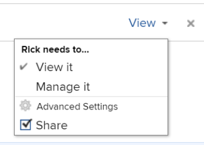

# Een kalenderrapport delen

U kunt een kalender met andere gebruikers delen en u kunt het openbaar maken, die iemand zonder [!DNL Adobe Workfront] licentie om deze weer te geven.

## Toegangsvereisten

U moet de volgende toegang hebben om de stappen in dit artikel uit te voeren:

<table style="table-layout:auto"> 
 <col> 
 </col> 
 <col> 
 </col> 
 <tbody> 
  <tr> 
   <td role="rowheader"><strong>[!DNL Adobe Workfront plan*]</strong></td> 
   <td> 
Alle
 </td> 
  </tr> 
  <tr> 
   <td role="rowheader"><strong>[!DNL Adobe Workfront] licentie*</strong></td> 
   <td> 
[!UICONTROL Review] of hoger
 </td> 
  </tr> 
  <tr> 
   <td role="rowheader"><strong>Configuraties op toegangsniveau*</strong></td> 
   <td> 
[!UICONTROL View] of hogere toegang [!UICONTROL to Reports], [!UICONTROL Dashboards], en [!UICONTROL Calendars]
 
Opmerking: Als u nog steeds geen toegang hebt, vraagt u [!DNL Workfront] beheerder als zij extra beperkingen in uw toegangsniveau plaatsen. Voor informatie over hoe een [!DNL Workfront] de beheerder kan uw toegangsniveau wijzigen, zie <a href="../../../administration-and-setup/add-users/configure-and-grant-access/create-modify-access-levels.md" class="MCXref xref">Aangepaste toegangsniveaus maken of wijzigen</a>.
 </td> 
  </tr> 
  <tr> 
   <td role="rowheader"><strong>Objectmachtigingen</strong></td> 
   <td> 
[!UICONTROL View] of hogere machtigingen voor het kalenderrapport, met toegang tot delen
 
Voor informatie over het aanvragen van aanvullende toegang raadpleegt u <a href="../../../workfront-basics/grant-and-request-access-to-objects/request-access.md" class="MCXref xref">Toegang tot objecten aanvragen </a>.
 </td> 
  </tr> 
 </tbody> 
</table>

&#42;Neem contact op met uw [!DNL Workfront] beheerder.

## Een kalender delen met [!DNL Workfront] gebruikers {#share-a-calendar-with-workfront-users}

Het delen van een kalender is vergelijkbaar met het delen van andere objecten. Meer informatie over het delen van objecten in [!DNL Adobe Workfront], zie [Overzicht van het delen van machtigingen voor objecten](../../../workfront-basics/grant-and-request-access-to-objects/sharing-permissions-on-objects-overview.md).

Kalenders die met u zijn gedeeld, worden weergegeven met een asterisk (&#42;) naast de naam van de kalender.

Een kalender delen binnen [!DNL Workfront]:

1. Ga naar de kalender die u wilt delen.
1. Klikken **[!UICONTROL Calendar Actions]** en klik vervolgens op **[!UICONTROL Sharing]**.

1. In de **[!UICONTROL Give Calendar access to]** veld, typt u de naam van de gebruiker, het team, de rol, de groep of het bedrijf die u de kalender wilt delen en klikt u op de naam wanneer deze wordt weergegeven in de vervolgkeuzelijst.\
   Zie voor meer informatie over het instellen van machtigingen [Overzicht van het delen van machtigingen voor objecten](../../../workfront-basics/grant-and-request-access-to-objects/sharing-permissions-on-objects-overview.md).

1. (Optioneel) Herhaal stap 3 voor elke gebruiker, elk team, elke rol of elke groep die u toegang tot de kalender wilt verlenen.
1. Specificeer de toestemmingen voor elke gebruiker, het team, de rol, de groep, of het bedrijf die u in Stap 3 door het drop-down menu toevoegde te klikken toevoegde, dan het toestemmingsniveau dat u wilt verlenen:

   * **[!UICONTROL View]:** Gebruikers kunnen de kalender controleren en delen.

      

   * **[!UICONTROL Manage]:** De gebruikers hebben volledige toegang tot de kalender, minus administratieve rechten, die op het toegangsniveau, plus alle toestemmingen van de Mening worden verleend.

      

      >[!NOTE]
      >
      >De [!DNL Workfront] de beheerder en de maker van de kalender kunnen machtigingen van deze entiteiten verwijderen.

1. (Optioneel) Afhankelijk van de rol van een gebruiker kunt u mogelijk op **[!UICONTROL Advanced Options]** en klik vervolgens op **[!UICONTROL Share]**&#x200B; zodat de gebruiker de kalender kan delen met andere gebruikers.

   Voor meer informatie over de toestemmingsniveaus, zie [Overzicht van het delen van machtigingen voor objecten](../../../workfront-basics/grant-and-request-access-to-objects/sharing-permissions-on-objects-overview.md).

1. (Optioneel) De kalender ter beschikking stellen van alle [!DNL Workfront] gebruikers, klik het tandwielpictogram, dan in het drop-down menu klikt **[!UICONTROL Make this visible system-wide]** om het object beschikbaar te maken voor iedereen [!DNL Workfront] gebruikers.\
   Alle gebruikers kunnen het object zien op basis van de machtigingen die u instelt.

1. Klik op **[!UICONTROL Save]**.

## Een kalender delen met een openbare koppeling

U kunt een kalender openbaar maken en een koppeling delen met personen die geen [!DNL Workfront] licentie.

1. Ga naar de kalender die u wilt delen.
1. Klikken **[!UICONTROL Calendar Actions]** en klik vervolgens op **[!UICONTROL Sharing]**.

1. Klik op het tandwielpictogram en klik vervolgens op **[!UICONTROL Make this public to external users]**.
1. Klik op **[!UICONTROL Copy link]**.
1. Klik op **[!UICONTROL Save]**.

## Een kalender delen met een persoonlijke koppeling

U kunt een persoonlijke kalenderkoppeling delen met [!DNL Workfront] gebruikers. Gebruikers moeten zich aanmelden om de kalender te bekijken wanneer ze de koppeling gebruiken.

1. Ga naar de kalender die u wilt delen.
1. Klikken **[!UICONTROL Calendar Actions]** en klik vervolgens op **[!UICONTROL Get Sharable Link]**.

1. Klik op **[!UICONTROL Copy Link]**.

   >[!NOTE]
   >
   >[!DNL Workfront] de gebruikers moeten toegang tot het kalender hebben om tot het met de verbinding toegang te hebben. Ga voor toegang naar [Een kalender delen met [!DNL Workfront] gebruikers](#share-a-calendar-with-workfront-users).\
   >Als gebruikers geen toegang hebben, kunnen ze deze aanvragen nadat ze de koppeling in hun browser hebben geplakt.
