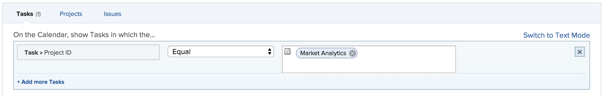

# Aangepaste datumvelden gebruiken in een kalenderrapport

Een [!UICONTROL calendar] rapport is een dynamisch rapport dat een visuele vertegenwoordiging van uw werk verstrekt. U kunt aangepaste datumvelden in een kalenderrapport gebruiken voor de volgende objecten:

* Taken
* Problemen
* Projecten

## Toegangsvereisten

U moet de volgende toegang hebben om de stappen in dit artikel uit te voeren:

<table style="table-layout:auto"> 
 <col> 
 </col> 
 <col> 
 </col> 
 <tbody> 
  <tr> 
   <td role="rowheader"><strong>[!DNL Adobe Workfront plan*]</strong></td> 
   <td> 
Alle
 </td> 
  </tr> 
  <tr> 
   <td role="rowheader"><strong>[!DNL Adobe Workfront] licentie*</strong></td> 
   <td> 
[!UICONTROL Plan] 
 </td> 
  </tr> 
  <tr> 
   <td role="rowheader"><strong>Configuraties op toegangsniveau*</strong></td> 
   <td> 
[!UICONTROL Edit] toegang tot [!UICONTROL Reports] , [!UICONTROL Dashboards] en [!UICONTROL Calendars]
 
Opmerking: als u nog steeds geen toegang hebt, vraag dan aan de [!DNL Workfront] -beheerder of deze aanvullende beperkingen op uw toegangsniveau heeft ingesteld. Voor informatie over hoe een [!DNL Workfront] beheerder uw toegangsniveau kan wijzigen, zie <a href="../../../administration-and-setup/add-users/configure-and-grant-access/create-modify-access-levels.md" class="MCXref xref"> tot douanetoegangsniveaus </a> leiden of wijzigen.
 </td> 
  </tr> 
  <tr> 
   <td role="rowheader"><strong>Objectmachtigingen</strong></td> 
   <td> 
[!UICONTROL Manage] toegang tot het kalenderverslag
 
Voor informatie bij het vragen van om extra toegang, zie <a href="../../../workfront-basics/grant-and-request-access-to-objects/request-access.md" class="MCXref xref"> de toegang van het Verzoek tot voorwerpen </a>.
 </td> 
  </tr> 
 </tbody> 
</table>

&#42; om te weten te komen welk plan, vergunningstype, of toegang u hebt, contacteer uw [!DNL Workfront] beheerder.

## Vereisten

1. U moet aangepaste datumvelden hebben en een waarde binnen het veld dat beschikbaar is in uw [!DNL Workfront] -instantie. Als u geen opstelling van de douanevorm met douanedata hebt, volg de instructies in [ Ontwerp een vorm met de vormontwerper ](/help/quicksilver/administration-and-setup/customize-workfront/create-manage-custom-forms/form-designer/design-a-form/design-a-form.md).
1. Voeg het aangepaste formulier toe aan een project, taak of uitgave die u wilt toevoegen aan de kalender en geef een datum op. Voor meer informatie, zie [ een douanevorm aan een voorwerp ](../../../workfront-basics/work-with-custom-forms/add-a-custom-form-to-an-object.md) toevoegen.

## De groep items instellen

U kunt kiezen hoe de groep items moet worden weergegeven in uw kalender.

1. Klik op het **[!UICONTROL Main Menu]** pictogram  rechtsboven in [!DNL Adobe Workfront] en klik vervolgens op **[!UICONTROL Calendars]** .

1. Selecteer de kalender waaraan u een nieuwe groep items wilt toevoegen.\
   of\
   Klik op **[!UICONTROL + New Calendar]** en voer de naam van de kalender in.

   >[!NOTE]
   >
   >U moet [!UICONTROL Edit] toegang hebben tot [!UICONTROL Reports] , [!UICONTROL Dashboards] en [!UICONTROL Calendars] in uw toegangsniveau om een kalenderrapport te maken.

1. Klik links in het scherm op **[!UICONTROL Add to Calendar]** en klik vervolgens op **[!UICONTROL Add advanced items]** .

1. Geef het volgende op:

   <table style="table-layout:auto">
    <col>
    <col>
    <tbody>
     <tr>
      <td role="rowheader"><strong>[!UICONTROL Name this group of items]</strong></td>
      <td>Typ een naam voor de groep items.</td>
     </tr>
     <tr>
      <td role="rowheader"><strong>[!UICONTROL Color]</strong></td>
      <td>Selecteer een kleur voor de groep items. Alle items worden in de geselecteerde kleur in het kalenderrapport weergegeven.</td>
     </tr>
     <tr>
      <td role="rowheader"><strong>[!UICONTROL Date Field]</strong></td>
      <td>Kies <strong>[!UICONTROL Custom dates]</strong> . </td>
     </tr>
     <tr>
      <td role="rowheader"><strong>[!UICONTROL On the calendar, show]</strong></td>
      <td>
Kies hoe u de datums wilt weergeven:

       <ul>
        <li><strong>[!UICONTROL Single Date]</strong>: In de kalender wordt het object op één datum weergegeven.</li>
        <li><strong>[!UICONTROL Duration] (Begin aan Eind) </strong>: De kalender toont het voorwerp over een spanwijdte van dagen. 
Opmerking: als u <strong>[!UICONTROL Duration]</strong> kiest, moet de opgegeven einddatum na de begindatum liggen, anders wordt het item niet weergegeven in de kalender.
</li>
       </ul></td>
     </tr>
     <tr data-mc-conditions="">
      <td role="rowheader"><strong>[!UICONTROL Custom Dates]</strong></td>
      <td>
Voer de aangepaste datumnaam in die is gekoppeld aan het object dat u wilt bijhouden.

<strong> NOTA:</strong> het onderzoek naar de naam van de douanedatum is beperkt tot 50 resultaten om prestatieskwesties te vermijden.</td>
     </tr>
    </tbody>
   </table>

1. Ga verder naar de volgende sectie.

## Objecten toevoegen aan de groep items

Nadat u hebt ingesteld hoe de items moeten worden weergegeven, moet u de objecten die u in de kalender wilt zien, aan de groep toevoegen.

1. Selecteer in de sectie **[!UICONTROL What would you like to add to the calendar?]** de optie

   * **[!UICONTROL Tasks]**
   * **[!UICONTROL Projects]**
   * **[!UICONTROL Issues]**

1. Klik op **[!UICONTROL Add Tasks]** , **[!UICONTROL Add Projects]** of **[!UICONTROL Add Issues]** , afhankelijk van het objecttype dat u aan de kalender toevoegt.\
   

1. Typ in het keuzemenu eerst de veldnaam en selecteer vervolgens de veldbron van het object dat u in de kalender wilt weergeven (bijvoorbeeld **[!UICONTROL Late Tasks]** ).
1. Stel een voorwaardelijke instructie in voor de kalendergroep.

   

   Om over het plaatsen van voorwaarden te leren, zie [ Filter en voorwaardenbepalingen ](../../../reports-and-dashboards/reports/reporting-elements/filter-condition-modifiers.md).

1. (Optioneel) Geef aanvullende objecten voor de kalendergroep op door stap 1-4 te herhalen.
1. Selecteer in het veld **[!UICONTROL Set the Tasks/Projects/Issues labels to be the...]** hoe de objecten in deze kalendergroep worden gelabeld in de kalender.

   >[!NOTE]
   >
   >Als de standaardlabelopties niet beschikbaar zijn voor een bepaald object, wordt in plaats daarvan de naam van het object weergegeven. Wanneer u bijvoorbeeld het label [!UICONTROL Parent Task] hebt geselecteerd en er geen bovenliggende taak aan het object is gekoppeld, geeft [!DNL Adobe Workfront] de objectnaam weer die u in de kalender weergeeft.

1. Klik op **[!UICONTROL Save]**.
