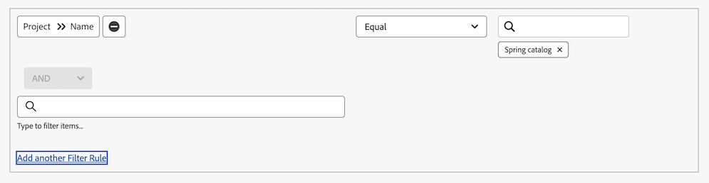

# [!UICONTROL Planned Dates] gebruiken in een kalenderrapport

<!--
The highlighted information on this page refers to functionality not yet generally available. It is available only in the Preview Sandbox environment. 
-->

Een kalenderrapport is een dynamisch rapport dat een visuele vertegenwoordiging van uw werk verstrekt. U kunt [!UICONTROL Planned Date] -velden in een kalenderrapport gebruiken voor de volgende objecten:

* Taken
* Problemen
* Projecten

## Toegangsvereisten

+++ Breid uit om de toegangseisen voor de functionaliteit in dit artikel weer te geven.

<table style="table-layout:auto"> 
 <col> 
 </col> 
 <col> 
 </col> 
 <tbody> 
  <tr> 
   <td role="rowheader">Adobe Workfront-pakket</td> 
   <td> 
Alle
 </td> 
  </tr> 
  <tr> 
   <td role="rowheader">Adobe Workfront-licentie</td> 
   <td>
Standard

       
Plan
</td> 
  </tr> 
  <tr> 
   <td role="rowheader">Configuraties op toegangsniveau</td> 
   <td> 
Toegang tot rapporten, dashboards en kalenders bewerken
</td> 
  </tr> 
  <tr> 
   <td role="rowheader">Objectmachtigingen</td> 
   <td>Toegang tot het kalenderrapport beheren</td> 
  </tr> 
 </tbody> 
</table>

Voor meer detail over de informatie in deze lijst, zie [ vereisten van de Toegang in de documentatie van Workfront ](/help/quicksilver/administration-and-setup/add-users/access-levels-and-object-permissions/access-level-requirements-in-documentation.md).

+++

## De groep items instellen

U kunt kiezen hoe de groep items moet worden weergegeven in uw kalender.

{{step1-to-calendars}}

1. Selecteer de kalender waaraan u een nieuwe groep items wilt toevoegen.
of
Klik op **[!UICONTROL + New Calendar]** en voer de naam van de kalender in.

   >[!NOTE]
   >
   >U moet Edit toegang tot Rapporten, Dashboards, en Kalenders in uw toegangsniveau hebben om een kalenderrapport tot stand te brengen.

1. Klik links in het scherm op **[!UICONTROL Add to Calendar]** en klik vervolgens op **[!UICONTROL Add advanced items]** .

1. Geef het volgende op:

   <table style="table-layout:auto">
    <col>
    <col>
    <tbody>
     <tr>
      <td role="rowheader"><strong>[!UICONTROL Name this group of items]</strong></td>
      <td>Typ een naam voor de groep items.</td>
     </tr>
     <tr>
      <td role="rowheader"><strong>[!UICONTROL Color]</strong></td>
      <td>Selecteer een kleur voor de groep items. Alle items worden in de geselecteerde kleur in het kalenderrapport weergegeven.</td>
     </tr>
     <tr>
      <td role="rowheader"><strong>[!UICONTROL Date Field]</strong></td>
      <td>
Kies <strong>[!UICONTROL Planned dates]</strong> . Voor meer informatie over geplande data raadpleegt u 

       <ul>
        <li><a href="../../../manage-work/projects/planning-a-project/project-planned-start-date.md" class="MCXref xref">Overzicht van de geplande begindatum van het project</a></li>
        <li><a href="../../../manage-work/tasks/task-information/task-planned-start-date.md" class="MCXref xref">Overzicht van de geplande startdatum van de taak</a></li>
        <li><a href="../../../manage-work/tasks/task-information/task-planned-completion-date.md" class="MCXref xref">Overzicht van de geplande voltooiing van de taak</a></li>
        <li><a href="../../../manage-work/projects/planning-a-project/project-planned-completion-date.md" class="MCXref xref">Geplande afsluitdatum van project instellen</a> </li>
       </ul></td>
     </tr>
     <tr>
      <td role="rowheader"><strong>Kies in de kalender de optie</strong></td>
      <td>
Kies hoe u de datums wilt weergeven:

       <ul>
        <li><strong>[!UICONTROL Start Date Only]</strong>: In de kalender wordt het object op één datum weergegeven.</li>
        <li><strong>[!UICONTROL End Date Only]</strong>: In de kalender wordt het object op één datum weergegeven.</li>
        <li><strong>[!UICONTROL Duration] (Begin aan Eind) </strong>: De kalender toont het voorwerp over een spanwijdte van dagen.</li>
       </ul></td>
     </tr>
     <tr data-mc-conditions="">
      <td role="rowheader"><strong>[!UICONTROL Switch to actual dates when available]</strong></td>
      <td>
De kalender schakelt automatisch over naar de werkelijke datums wanneer deze beschikbaar zijn.   Kies <strong>[!UICONTROL Yes]</strong> of <strong>[!UICONTROL No]</strong> om over te schakelen op werkelijke datums, indien beschikbaar. Zie voor meer informatie over de werkelijke datums

       <ul>
        <li><a href="../../../manage-work/projects/planning-a-project/project-actual-start-date.md" class="MCXref xref">Overzicht van het project Werkelijke Begindatum </a></li>
        <li><a href="../../../manage-work/projects/planning-a-project/project-actual-completion-date.md" class="MCXref xref">Overzicht van het project Werkelijke uitvoeringsdatum </a></li>
       </ul></td>
     </tr>
    </tbody>
   </table>

1. Ga verder naar de volgende sectie.

## Objecten toevoegen aan de groep items in Voorvertoning

Nadat u hebt ingesteld hoe de items moeten worden weergegeven, moet u de objecten die u in de kalender wilt zien, aan de groep toevoegen.

1. Selecteer in de sectie **[!UICONTROL What would you like to add to the calendar?]** de optie

   * **[!UICONTROL Tasks]**
   * **[!UICONTROL Projects]**
   * **[!UICONTROL Issues]**

1. Klik op **[!UICONTROL Add Tasks]** , **[!UICONTROL Add Projects]** of **[!UICONTROL Add Issues]** , afhankelijk van het objecttype dat u aan de kalender toevoegt.

1. Typ in het keuzemenu eerst de veldnaam en selecteer vervolgens de veldbron van het object dat u in de kalender wilt weergeven (bijvoorbeeld **[!UICONTROL Late Tasks]** ).
1. Stel een voorwaardelijke instructie in voor de kalendergroep.

   

   Om over het plaatsen van voorwaarden te leren, zie [ Filter en voorwaardenbepalingen ](../../../reports-and-dashboards/reports/reporting-elements/filter-condition-modifiers.md).

1. (Optioneel) Geef aanvullende objecten voor de kalendergroep op door stap 1-4 te herhalen.

1. Selecteer in het veld **[!UICONTROL Set the Tasks/Projects/Issues labels to be the...]** hoe de objecten in deze kalendergroep worden gelabeld in de kalender.

   >[!NOTE]
   >
   >Als de standaardlabelopties niet beschikbaar zijn voor een bepaald object, wordt in plaats daarvan de naam van het object weergegeven. Wanneer u bijvoorbeeld het label [!UICONTROL Parent Task] hebt geselecteerd en er geen bovenliggende taak aan het object is gekoppeld, geeft [!DNL Adobe Workfront] de objectnaam weer die u in de kalender weergeeft.

   
1. Klik op **[!UICONTROL Save]**.

1. Klik op **[!UICONTROL Save]**.

