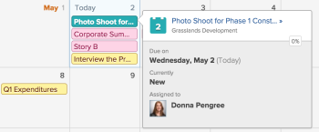

# Kalenderrapporten en gebeurtenisdetails weergeven

U kunt kalenderrapporten en gebeurtenisdetails bekijken die u creeerde of met u in Adobe Workfront werd gedeeld.

## Toegangsvereisten

U moet de volgende toegang hebben om de stappen in dit artikel uit te voeren:

<table style="table-layout:auto"> 
 <col> 
 </col> 
 <col> 
 </col> 
 <tbody> 
  <tr> 
   <td role="rowheader"><strong>[!DNL Adobe Workfront plan*]</strong></td> 
   <td> 
Alle
 </td> 
  </tr> 
  <tr> 
   <td role="rowheader"><strong>[!DNL Adobe Workfront] licentie*</strong></td> 
   <td> 
[!UICONTROL Request] of hoger
 </td> 
  </tr> 
  <tr> 
   <td role="rowheader"><strong>Configuraties op toegangsniveau*</strong></td> 
   <td> 
[!UICONTROL View] of betere toegang tot [!UICONTROL Reports] , [!UICONTROL Dashboards] , en [!UICONTROL Calendars]
 
Opmerking: als u nog steeds geen toegang hebt, vraag dan aan de [!DNL Workfront] -beheerder of deze aanvullende beperkingen op uw toegangsniveau heeft ingesteld. Voor informatie over hoe een [!DNL Workfront] beheerder uw toegangsniveau kan wijzigen, zie <a href="../../../administration-and-setup/add-users/configure-and-grant-access/create-modify-access-levels.md" class="MCXref xref"> tot douanetoegangsniveaus </a> leiden of wijzigen.
 </td> 
  </tr> 
  <tr> 
   <td role="rowheader"><strong>Objectmachtigingen</strong></td> 
   <td> 
[!UICONTROL View] of hogere machtigingen voor het kalenderrapport
 
Voor informatie bij het verzoeken van extra toegang, zie <a href="../../../workfront-basics/grant-and-request-access-to-objects/request-access.md" class="MCXref xref"> Toegang van het Verzoek tot voorwerpen </a>.
 </td> 
  </tr> 
 </tbody> 
</table>

&#42; om te weten te komen welk plan, vergunningstype, of toegang u hebt, contacteer uw [!DNL Workfront] beheerder.

## Een kalenderrapport weergeven

1. Klik op het **[!UICONTROL Main Menu]** pictogram  rechtsboven in [!DNL Adobe Workfront] en klik vervolgens op **[!UICONTROL Calendars]** .

   Afhankelijk van uw toegangsniveau, zou u de volgende vermelde kalenders kunnen zien:

   * Uw standaardkalender [!DNL Adobe Workfront]

     Workfront maakt een kalender voor u op basis van de projecten, taken en problemen die aan u zijn toegewezen of die zijn toegewezen aan teams, groepen of rollen waaraan u bent toegewezen.
   * Door u gemaakte kalenders

     Om over het creëren van kalenders te leren, zie [ overzicht van de rapporten van de Kalender ](../../../reports-and-dashboards/reports/calendars/calendar-reports-overview.md).

   * Kalenders die andere gebruikers met u hebben gedeeld

     Zie [[!UICONTROL Share a calendar] report ](../../../reports-and-dashboards/reports/calendars/share-a-calendar-report.md) voor meer informatie over het delen van kalenders.

1. (Voorwaardelijk) klik **[!UICONTROL View]** drop-down, dan selecteer de kalenderduur u wilt bekijken.\
   \
   U kunt uit de volgende meningen van het kalenderrapport kiezen:

   * **[!UICONTROL Month]**: geeft vier weken van de kalender weer
   * **[!UICONTROL Week]**: geeft een week van de kalender weer
   * **[!UICONTROL Gantt]**: geeft een doorlopende weergave van de kalender weer\

     ![[!UICONTROL Gantt] Kalenderrapport ](assets/gantt-calendar-report.png)
U kunt meer gebeurtenissen in een [!UICONTROL Gantt] -weergave zien door omlaag of zijwaarts te schuiven. Een ladend symbool verschijnt aangezien de gegevens voor de mening worden bevolkt.
   >[!NOTE]
   >
   >In de weergaven [!UICONTROL Month] en [!UICONTROL Week] hebben gebeurtenissen die nu of in de toekomst plaatsvinden (inclusief gebeurtenissen die meerdere dagen beslaan, zolang ze vandaag of een toekomstige dag bevatten) een arcering die overeenkomt met de kleur in de project- of kalendergroep. Gebeurtenissen in het verleden hebben een lichtere arcering om aan te geven dat deze niet langer actueel zijn, maar u kunt deze gebeurtenissen wel selecteren en weergeven.

1. (Optioneel) Als u de kalender weergeeft in de weergaven [!UICONTROL Month] of [!UICONTROL Week] , kunt u de kalenderweergave wijzigen met de volgende opties:

   * weekends opnemen of uitsluiten:

      1. Klik op de werkbalk **[!UICONTROL Calendar]** op **[!UICONTROL Calendar Actions]** en selecteer vervolgens in de vervolgkeuzelijst de optie **[!UICONTROL Show Weekend]** of **[!UICONTROL Hide Weekend]** .
   * De weergegeven datums snel wijzigen:

      1. Klik op de werkbalk **[!UICONTROL Calendar]** op de pijl naar links van de datumindicator om terug te gaan in de kalender of op de pijl naar rechts om naar voren te gaan.\

          te veranderen\
         De weergegeven datums worden aangepast met een interval dat is gebaseerd op de huidige kalenderweergave. Als u bijvoorbeeld de kalender weergeeft in de [!UICONTROL Week] -weergave, wordt de kalender een week vooruit of een week terug weergegeven, afhankelijk van de pijl die u selecteert.

      1. (Facultatief) om aan de huidige dag terug te keren, klik **Tod  dag**.

1. (Optioneel) Als u een kalender in een volledig scherm wilt weergeven, klikt u op de pijlen op het volledige scherm aan de rechterkant van de **[!UICONTROL Calendar]** -werkbalk.
    te veranderen\
   Druk op Esc om terug te keren naar de normale weergave van de kalender.

1. (Optioneel) Als u de gebeurtenissen voor een aan de kalender gekoppelde project- of kalendergroep wilt verbergen, wist u de project- of kalendergroep in de projectlijst.
   \
   U kunt de gebeurtenissen weer zichtbaar maken door de [!UICONTROL project] - of kalendergroep in de projectlijst te selecteren.

## Gebeurtenisdetails van kalenderrapporten weergeven

U kunt de details van een gebeurtenis in een kalender zien, voor zowel huidige als eerdere gebeurtenissen.

1. Ga naar de gebeurtenis waarvoor u de details wilt kennen, en klik dan de gebeurtenis.\
   Er wordt een detailpagina voor de gebeurtenis geopend.\
   

1. (Optioneel) Als u aanvullende details over het object wilt weergeven:

   1. Houd de muisaanwijzer boven het project, de taak of de naam van de uitgave.

      Er wordt een detailpagina voor het object geopend.\
      

   1. (Optioneel) Klik op de titel van het object om het bijbehorende project, de bijbehorende taak of uitgave te openen.
   1. (Optioneel) Als u alle geopende detailpagina&#39;s wilt sluiten, klikt u op een willekeurige plaats buiten de pagina met gebeurtenisdetails.
