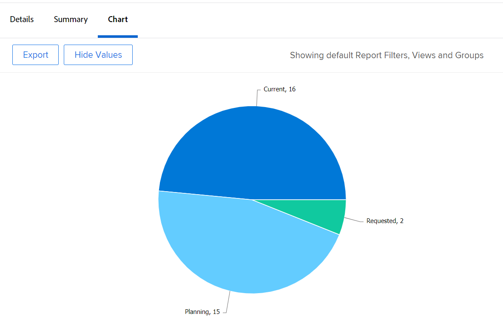

# Een diagram toevoegen aan een rapport

<!--Audited: 01/2024-->

U kunt uw rapporten verbeteren door een grafiek toe te voegen. U kunt grafieken toevoegen aan bestaande rapporten of aan rapporten die u creeert.

Alvorens u een grafiek aan een rapport toevoegt, zou u een Mening en een Groepering voor het rapport moeten tot stand brengen.

U kunt geen grafieken aan de meeste rapporten toevoegen tenzij u eerst de informatie in het rapport groepeert. Het enige diagram dat zonder groepering kan worden toegevoegd, is een diagramdiagram.

Zie voor informatie over weergaven [Overzicht van weergaven in Adobe Workfront](../../../reports-and-dashboards/reports/reporting-elements/views-overview.md).

Zie voor meer informatie over groepen [Overzicht van groepen in Adobe Workfront](../../../reports-and-dashboards/reports/reporting-elements/groupings-overview.md).

Als uw rapport teveel punten toont, wordt een grafiek niet gecreeerd. In dit geval, moet u ook een Filter aan het rapport toevoegen om het aantal resultaten in uw rapport te verminderen.

Zie voor meer informatie over filters [Overzicht van filters](../../../reports-and-dashboards/reports/reporting-elements/filters-overview.md).

## Toegangsvereisten

U moet de volgende toegang hebben om de stappen in dit artikel uit te voeren:

<table style="table-layout:auto"> 
 <col> 
 <col> 
 <tbody> 
  <tr> 
   <td role="rowheader">Adobe Workfront-plan</td> 
   <td> 
Alle
 </td> 
  </tr> 
  <tr> 
   <td role="rowheader">Adobe Workfront-licentie*</td> 
   <td> 
Huidig: Plan 

   of
   
Nieuw: Standaard
 </td> 
  </tr> 
  <tr> 
   <td role="rowheader">Configuratie op toegangsniveau</td> 
   <td> 
Toegang tot rapporten, dashboards, kalenders bewerken
 
Toegang tot filters, weergaven, groepen bewerken
 </td> 
  </tr> 
  <tr> 
   <td role="rowheader">Objectmachtigingen</td> 
   <td> 
Machtigingen beheren voor een rapport
  </td> 
  </tr> 
 </tbody> 
</table>

&#42;Neem contact op met uw Workfront-beheerder om te weten te komen welk plan, licentietype of toegang u hebt. Voor meer informatie over toegangsvereisten, zie [Toegangsvereisten in Workfront-documentatie](/help/quicksilver/administration-and-setup/add-users/access-levels-and-object-permissions/access-level-requirements-in-documentation.md).

## Een diagram toevoegen aan een rapport

1. Ga naar een bestaand rapport of maak een nieuw rapport. Voor meer informatie over het creëren van een nieuw rapport, zie [Een aangepast rapport maken](../../../reports-and-dashboards/reports/creating-and-managing-reports/create-custom-report.md).
1. (Voorwaardelijk) Als u naar een bestaand rapport ging, klik **Handelingen rapporteren** > **Bewerken**.

1. Zorg ervoor dat de **Kolommen (weergave)** tabblad is bijgewerkt om de informatie weer te geven die u in een diagram wilt weergeven in het rapport.

   Voor informatie over om de Mening voor het rapport tot stand te brengen of te wijzigen, zie [Weergaven maken of bewerken in Adobe Workfront](/help/quicksilver/reports-and-dashboards/reports/reporting-elements/create-edit-views.md).

1. Klik op de knop **Groepen** en voegt u een groepering toe.

   >[!TIP]
   >
   >* U kunt een grafiek aan een rapport slechts toevoegen wanneer de rapportresultaten worden gegroepeerd.
   >* Groepen in tekstmodus worden niet ondersteund in grafieken. Voor meer informatie over tekst-wijze groeperingen, zie [Tekstmodus in een groep bewerken](../../../reports-and-dashboards/reports/text-mode/edit-text-mode-in-grouping.md).
   >* Als u één groepering toevoegt die één metrisch vertegenwoordigt, tonen alle grafieken behalve een cirkeldiagram elk resultaat in de groepering als de zelfde kleur.

   Voor meer informatie over het maken van groepen raadpleegt u [Groepen maken in Adobe Workfront](/help/quicksilver/reports-and-dashboards/reports/reporting-elements/create-groupings.md).

1. Selecteer de **Diagram** tab.
1. Klik op een diagramtype om dit te selecteren.\
   

1. Selecteer een van de volgende typen grafieken:

   * [Kolomdiagram](#column-chart)
   * [Staafdiagram](#bar-chart)
   * [Cirkeldiagram](#pie-chart)
   * [Lijndiagram](#line-chart)
   * [Grijsgrafiek](#gauge-chart)
   * [Bubble-grafiek](#bubble-chart)

1. Klikken **Opslaan + Sluiten** om de grafiek en het rapport te bewaren.

### Kolomdiagram {#column-chart}

Als u een **Kolom** diagram naar uw rapport:

1. Begin een grafiek aan uw rapport toe te voegen, zoals die in wordt beschreven [Een diagram toevoegen aan een rapport](#add-a-chart-to-a-report).
1. In de **Linkeras (Y)** selecteert u in het veld de waarden die u op de Y-as van het diagram wilt opnemen en hoe u de informatie wilt samenvatten.
1. In de **Onderste (X) as** selecteert u in het veld Groeperen dat u in het diagram wilt opnemen.
1. (Optioneel) Selecteer **Aangepaste kleuren** om de gewenste kleuren toe te wijzen aan elk van de kolommen.\
   Voor meer informatie over het aanpassen van grafiekkleuren raadpleegt u [Grafiekkleuren aanpassen](#customize-chart-colors).

1. (Optioneel) Selecteer **Tonen in 3D** om het diagram weer te geven in een driedimensionale weergave.
1. (Optioneel) **Kolommen groeperen**: Selecteer deze optie als u wilt definiëren hoe de kolommen moeten worden gegroepeerd.\
   Selecteer een van de volgende opties:

   * Klik op een van de volgende opties om te selecteren hoe de gegroepeerde kolommen worden weergegeven:

      * **Naast elkaar**
      * **Gestapeld**
      * **Gestapeld naar 100%**

   * Selecteer de groepering die u in de grafiek van wilt omvatten van **Gegevens groeperen op** vervolgkeuzelijst.
   * (Optioneel) Selecteer **Aangepaste kleuren** om de kleuren van de kolommen aan te passen.\
     Voor meer informatie over het aanpassen van grafiekkleuren raadpleegt u [Grafiekkleuren aanpassen](#customize-chart-colors).

1. (Optioneel) Selecteer **Combinatietabel** om een extra waarde in de grafiek op te nemen, evenals hoe u de informatie wilt worden samengevat.\
   Overweeg de volgende opties:

   * **Plot op secundaire as**: Selecteer deze optie om de gegevens aan de rechterkant van het diagram te plotten.
   * **Type diagram**: Selecteer of u deze extra waarde wilt weergeven als een regel of als een derde kolom.\
     

1. Klikken **Opslaan + Sluiten** om de grafiek en het rapport te bewaren.

### Staafdiagram {#bar-chart}

Als u een **Balk** diagram naar uw rapport:

1. Begin een grafiek aan uw rapport toe te voegen, zoals die in wordt beschreven [Een diagram toevoegen aan een rapport](#add-a-chart-to-a-report).
1. In de **Onderste (X) as** selecteert u in het veld de waarden die u op de X-as van het diagram wilt opnemen en hoe u de informatie wilt samenvatten.
1. In de **Linkeras (Y)** selecteert u in het veld Groeperen dat u in het diagram wilt opnemen.
1. (Optioneel) Selecteer **Aangepaste kleuren** om de kleuren van de balken aan te passen.\
   Voor meer informatie over het aanpassen van grafiekkleuren raadpleegt u [Grafiekkleuren aanpassen](#customize-chart-colors).

1. (Optioneel) Selecteer **Tonen in 3D** om het diagram weer te geven in een driedimensionale weergave.
1. (Optioneel) Selecteer **Groepsbalken** om te bepalen hoe u de bars wilt worden gegroepeerd.\
   Selecteer een van de volgende opties:

   * Klik op een van de volgende opties om te selecteren hoe de gegroepeerde balken worden weergegeven:

      * **Naast elkaar**
      * **Gestapeld**
      * **Gestapeld naar 100%**

   * Selecteer hoe u de informatie in het diagram wilt groeperen vanuit het dialoogvenster **Gegevens groeperen op** vervolgkeuzelijst.
   * (Optioneel) Selecteer **Aangepaste kleuren** om de kleuren van uw kolommen aan te passen.\
     Voor meer informatie over het aanpassen van grafiekkleuren raadpleegt u [Grafiekkleuren aanpassen](#customize-chart-colors).

1. (Optioneel) Selecteer **Combinatietabel** om een extra waarde in de grafiek op te nemen, evenals hoe u de informatie wilt worden samengevat.\
   

1. Klikken **Opslaan + Sluiten** om de grafiek en het rapport te bewaren.

>[!IMPORTANT]
>
>Met staafdiagrammen beperken tot 23 of minder balken, omdat staafdiagrammen met meer dan 23 balken niet alle staaflabels correct weergeven.

### Cirkeldiagram {#pie-chart}

Als u een **Schijf** diagram naar uw rapport:

1. Begin een grafiek aan uw rapport toe te voegen, zoals die in wordt beschreven [Een diagram toevoegen aan een rapport](#add-a-chart-to-a-report).
1. In de **Waarden** in het veld selecteert u de waarden die u in het rapport wilt weergeven en hoe u deze wilt samenvatten.\
   In de **Bruiloft** selecteert u in het veld Groeperen dat u in het diagram wilt opnemen. De Groepering wordt vertegenwoordigd door de segmenten van de grafiek.

1. (Optioneel) Selecteer **Aangepaste kleuren** om de kleuren van de segmenten op het diagram aan te passen.\
   Voor meer informatie over het aanpassen van grafiekkleuren raadpleegt u [Grafiekkleuren aanpassen](#customize-chart-colors).

1. (Optioneel) Selecteer **Tonen in 3D** om het diagram weer te geven in een driedimensionale weergave.
1. In de **Resultaten weergeven als** in het veld selecteert u hoe de resultaten in het diagram moeten worden weergegeven. Overweeg de volgende opties:

   * **Percentage**: De grafiekresultaten worden weergegeven als een percentage.
   * **Getallen**: De grafiekresultaten worden als een getal weergegeven.\
     

1. Klikken **Opslaan + Sluiten** om de grafiek en het rapport te bewaren.

### Lijndiagram {#line-chart}

Als u een **Lijn** diagram naar uw rapport:

1. Begin een grafiek aan uw rapport toe te voegen, zoals die in wordt beschreven [Een diagram toevoegen aan een rapport](#add-a-chart-to-a-report).
1. In de **Linkeras (Y)** selecteert u in het veld de waarden die u op de Y-as van het diagram wilt opnemen en hoe u de informatie wilt samenvatten.
1. In de **Onderste (X) as** selecteert u in het veld Groeperen dat u in het diagram wilt opnemen.
1. (Optioneel) Selecteer een kleur om de kleur van de lijn aan te passen.
1. (Optioneel) Selecteer **Lijnen groeperen**, om een extra groepering voor de grafiek te selecteren.\
   (Optioneel) Selecteer **Aangepaste kleuren** om de kleuren voor uw nieuwe groepering aan te passen.\
   Voor meer informatie over het aanpassen van grafiekkleuren raadpleegt u [Grafiekkleuren aanpassen](#customize-chart-colors).

1. (Optioneel) Selecteer **Combinatietabel** om uw regels met een extra waarde te combineren.\
   Houd rekening met de volgende opties:

   * Selecteer de waarde die u in het diagram wilt opnemen en hoe u de informatie wilt samenvatten.
   * Selecteer de **Plot op secundaire as** veld voor het plotten van de gegevens aan de rechterkant van het diagram.\
     

1. Klikken **Opslaan + Sluiten** om de grafiek en het rapport te bewaren.

### Grijsgrafiek {#gauge-chart}

A **Gage** In de grafiek wordt het aantal records weergegeven dat aan bepaalde criteria voldoet. De indicator van de maat wijst op het aantal verslagen die aan de criteria voldoen die in de mening en groepering van het rapport worden geselecteerd. Een rapportgroepering wordt niet vereist om een grafiekgrafiek te vormen.

Als u een **Gage** diagram naar uw rapport:

1. Begin een grafiek aan uw rapport toe te voegen, zoals die in wordt beschreven [Een diagram toevoegen aan een rapport](#add-a-chart-to-a-report).
1. In de **Waarden** in het veld selecteert u de waarden die u in het rapport wilt weergeven en hoe u deze wilt samenvatten. Als u **Aantal records**, zijn de weergegeven waarden het voorwerp van het rapport.

1. In de **Indicatoren** selecteert u in het veld Groeperen dat u in het diagram wilt opnemen. De groepering wordt vertegenwoordigd door de indicatorlijn op de grafiek.\
   Als u een Groepering hebt die twee punten bevat, worden twee indicatoren getoond op de grafiek.\
   Bijvoorbeeld, als u een Groepering van de Status van het Project hebt, en er twee projectstatussen (Huidige en Op Greep) zijn, bevat uw Grafiek twee meters. Zij zullen wijzen op het aantal projecten dat in die status verkeert.\
   (Optioneel) Selecteer **Totaal** in de **Indicatoren** veld voor het weergeven van het totaal van de objecten die in het dialoogvenster **Waarden** veld.

1. In de **Waardebereik** geeft u het waardebereik en de kleur op die de waarden vertegenwoordigen die in het Gage-overzicht moeten worden weergegeven.
1. (Optioneel) Klik op **Nog een waardebereik toevoegen** om extra waardewaaiers aan de grafiek toe te voegen.\
   

1. Klikken **Opslaan + Sluiten** om de grafiek en het rapport te bewaren.

### Bubble-grafiek {#bubble-chart}

U kunt maximaal drie velden van één object weergeven in een **Bubble** grafiek. Dit betekent u tot vier gegevenspunten in een borstelgrafiek kunt tonen. Elke entiteit met drie bijbehorende velden wordt weergegeven als een cirkel die twee van de velden binnen haar locatie binnen de X- en Y-as uitdrukt. Het derde veld wordt weergegeven door de grootte van de cirkel.

Als u een **Bubble** diagram naar uw rapport:

1. Begin een grafiek aan uw rapport toe te voegen, zoals die in wordt beschreven [Een diagram toevoegen aan een rapport](#add-a-chart-to-a-report).
1. In de **Linkeras (Y)** selecteert u de waarden die u op de Y-as van het diagram wilt opnemen. De waarden komen uit het standpunt van het verslag. Geef op hoe de gegevens moeten worden samengevat.
1. In de **Onderste veld (X) as** selecteert u de waarden die u op de X-as van het diagram wilt opnemen. De waarden komen uit het standpunt van het verslag. Geef op hoe de gegevens moeten worden samengevat.

   >[!NOTE]
   >
   >Zorg ervoor dat u ten minste één kolom hebt die is samengevat om dit veld actief te maken.\
   >Voor meer informatie over het samenvatten van de informatie in een rapportkolom, zie [Een aangepast rapport maken](../../../reports-and-dashboards/reports/creating-and-managing-reports/create-custom-report.md).

1. In de **Bubbelgrootte** selecteert u de waarden die u wilt vertegenwoordigen door de grootte van de bellen in het diagram. De waarden komen uit het standpunt van het verslag. Geef op hoe de gegevens moeten worden samengevat.

   >[!NOTE]
   >
   >Zorg ervoor dat u ten minste één kolom hebt die is samengevat om dit veld actief te maken.\
   >Voor meer informatie over het samenvatten van de informatie in een rapportkolom, zie [Een aangepast rapport maken](../../../reports-and-dashboards/reports/creating-and-managing-reports/create-custom-report.md).

1. In de **Luchtbellen** selecteert u in het veld Groeperen dat u in het diagram wilt opnemen. De groepering wordt vertegenwoordigd door de plaatsing van de bellen op de grafiek.
1. In de **Bubbelkleur** selecteert u het veld dat u wilt weergeven door de kleuren van de bellen.

   

   De **Bubbelkleur** kan een groepering zijn u in het rapport bepaalt, maar het is slechts beschikbaar wanneer u selecteert **Naam** kolom voor het voorwerp van het rapport in **Luchtbellen** veld.

   Als u bijvoorbeeld **Taaknaam** in een taakrapport kunt u **Taakstatus** als de **Bubbelkleur** veld.

   

   Als u echter **Taakstatus** voor de **Luchtbellen** veld, kunt u geen **Bubbelkleur** veld. U kunt ook niet **Projectnaam** voor de **Bubbelkleur** veld, zelfs wanneer u **Taaknaam** voor de **Bubble** veld.

   

1. Klikken **Opslaan + Sluiten** om de veranderingen in de interfacebouwer te bewaren.

## Een diagram exporteren

U kunt een grafiek naar een .pdf- dossier uitvoeren.

Een diagram exporteren:

1. Klikken **Exporteren** om de grafiek naar .pdf uit te voeren.\
   Er wordt een .pdf-bestand naar uw computer gedownload.

1. Open het .pdf-bestand.\
   Het geëxporteerde bestand bevat de volgende gegevens:

   * Een afbeelding van het diagram.
   * Een titel die de naam van het rapport is.
   * Een unieke bestandsnaam die de naam van het rapport is.
   * Een voettekst met de datum en tijd waarop het rapport is geëxporteerd en het paginanummer.

## Grafiekkleuren aanpassen {#customize-chart-colors}

U kunt Workfront de kleuren laten selecteren van de elementen in het diagram of u kunt deze aanpassen terwijl u een diagram toevoegt aan uw rapporten. Als uw grafiek één enkele Groepering bevat die metrisch-zulke zoals een taakrapport vertegenwoordigt dat het aantal taken toont die door Ware VoltooiingsDatum-elk resultaat in de Groepering wordt gegroepeerd in de zelfde kleur wordt getoond.

U kunt slechts één kleur kiezen voor velden die worden weergegeven in de weergave van het rapport. U kunt verscheidene kleuren-voor elke optie-voor gebieden kiezen die in de Groepering van het rapport worden getoond.

>[!IMPORTANT]
>
>Voor datumvelden kunt u slechts één kleur selecteren voor diagramelementen.

Grafiekkleuren aanpassen:

1. Tijdens het maken van een rapport gaat u naar de **Diagram** in de rapportbuilder.
1. Selecteer een grafiektype om aan uw rapport toe te voegen.\
   Voor meer informatie over het toevoegen van een grafiek aan uw rapport, zie [Een diagram toevoegen aan een rapport](#add-a-chart-to-a-report).

1. Klikken **Aangepaste kleuren** als dit veld beschikbaar is.\
   Het dialoogvenster Aangepaste kleuren wordt weergegeven.\
   

   >[!NOTE]
   >
   >U kunt aangepaste kleuren koppelen aan elk veld dat u kunt groeperen en aan bepaalde velden die in een weergave kunnen worden weergegeven, inclusief aangepaste velden. De aangepaste velden of aangepaste opties voor de velden die u kiest in het dialoogvenster Aangepaste kleur, zijn hoofdlettergevoelig.

1. U kunt een van de volgende opties selecteren:

   * **Eén kleur gebruiken**: Alle elementen van het diagram worden in de geselecteerde kleur weergegeven.

      1. Typ de naam van een optie in het geselecteerde veld en selecteer vervolgens een kleur. Deze optie wordt weergegeven in de geselecteerde kleur op het diagram.
      1. (Optioneel) Geef een hexadecimale kleurwaarde op voor de kleur in plaats van een kleur te selecteren uit de beschikbare kleurvoorbeelden\
         of\
         Klik op de kleurkiezer die wordt weergegeven nadat u op de hexadecimale code hebt geklikt en selecteer een andere kleur.

   * **Kleur toevoegen**: Ga door met het toevoegen van aangepaste kleuren voor alle andere mogelijke opties van het geselecteerde veld.
   * **Alles verwijderen**: Selecteer deze optie als u alle kleuren en opties van het hierboven geselecteerde veld wilt verwijderen.
   * **Geavanceerde opties**: Kies een van de volgende opties:

      * **Geen waarde**: Selecteer dit veld en een aangepaste kleur om de kolom van het diagram weer te geven waarin items met de naam &quot;geen waarde&quot; worden gegroepeerd. Dit zijn items die niet kunnen worden gegroepeerd met een van de opties van het veld dat in de groep is geselecteerd.
      * **Alle andere waarden**: Selecteer dit veld en een aangepaste kleur om alle andere diagramelementen weer te geven waarvan de opties hierboven niet zijn geselecteerd.

        >[!NOTE]
        >
        >De kleuren die u het laatst hebt gebruikt, worden boven in het dialoogvenster Aangepaste kleuren weergegeven. Wanneer u de muis over een kleur beweegt die onlangs is gebruikt, wordt de naam van het gebied verbonden aan het getoond.

1. Klik op de X rechtsboven in het dialoogvenster Aangepaste kleuren om het dialoogvenster Aangepaste kleuren te sluiten. De kleuren die u hebt geselecteerd, worden automatisch opgeslagen.
1. Klikken **Opslaan + Sluiten** om de grafiek te bewaren en het rapport in werking te stellen.

## Een diagram verwijderen uit een rapport

Om een grafiek uit een rapport te verwijderen:

1. Open de **Diagram** tabblad van de rapportbuilder.
1. De muis over het pictogram van het grafiektype u koos en een &quot;x&quot;knoop zal op de hogere juiste hoek van het pictogram verschijnen.
1. Klik op &quot;x&quot; om het diagram te verwijderen.
1. Klikken **Opslaan + Sluiten**.

## Beperkingen tijdens werken met grafieken

Houd rekening met de volgende beperkingen wanneer u werkt met diagrammen:

* De **Voorvertoning diagram** de sectie rechts van de rapportaannemer bevat geen daadwerkelijke gegevens van uw rapport. U moet de grafiek opslaan en deze weergeven in het dialoogvenster **Diagram** om het diagram met uw gegevens weer te geven.

* Sommige diagramelementen kunnen niet worden bewerkt:

   * U kunt het lettertype en de tekengrootte niet wijzigen op de waarden van elk element.
   * U kunt de namen van de assen in het diagram niet wijzigen.

* U kunt de legenda van het diagram niet bewerken.
* Wanneer u berekende velden gebruikt voor uw groepen, kunt u niet op de diagramelementen klikken.
* Het meest aantal gegevenspunten u in een grafiek kunt tonen is vier, in een borstelgrafiek. Alle andere grafiektypes tonen twee of een maximum van drie gegevenspunten.
