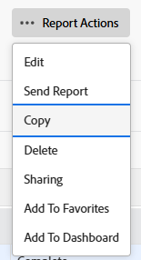
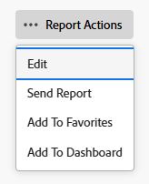
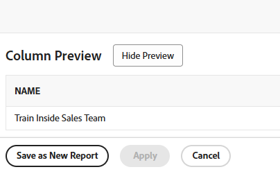

# Een kopie van een rapport maken

<!-- Audited: 11/2024 -->

You can create a copy of any report that you have access to. You can either create an exact copy of a custom report or you can save a new version of a default report. After you copy a report, you become the owner of the copied report and it displays in the My Reports section.

## Toegangsvereisten

+++ Vouw uit om de toegangsvereisten voor de functionaliteit in dit artikel weer te geven. 

<table style="table-layout:auto"> 
 <col> 
 <col> 
 <tbody> 
  <tr> 
   <td role="rowheader">Adobe Workfront-pakket</td> 
   <td> 
Alle
 </td> 
  </tr> 
  <tr> 
   <td role="rowheader">Adobe Workfront-licentie</td> 
   <td> 
      
Standard

      
Plan

   </td>
  </tr> 
  <tr> 
   <td role="rowheader">Configuratie op toegangsniveau</td> 
   <td> 
Toegang tot rapporten, dashboards, kalenders bewerken
 
Toegang tot filters, weergaven, groepen bewerken
 </td> 
  </tr> 
  <tr> 
   <td role="rowheader">Objectmachtigingen</td> 
   <td> 
Toestemmingen aan een rapport weergeven
  </td> 
  </tr> 
 </tbody> 
</table>

Voor meer detail over de informatie in deze lijst, zie [ vereisten van de Toegang in de documentatie van Workfront ](/help/quicksilver/administration-and-setup/add-users/access-levels-and-object-permissions/access-level-requirements-in-documentation.md).

+++

## Een exacte kopie van een rapport maken

If you want to make a copy of a custom report, do the following:

1. Klik het **[!UICONTROL Main Menu]** pictogram  in de hoger-juiste hoek van Adobe Workfront, of (als beschikbaar), klik het **[!UICONTROL Main Menu]** pictogram  in de upper-left hoek, dan klik **[!UICONTROL Reports]**.

1. Click **All Reports**, then open a report.

1. Click **Report Actions**, then **Copy**.

   >[!TIP]
   >
   >Als het rapport een standaardrapport is, verschijnt de optie van het Exemplaar niet in het menu van de Acties van het Rapport.\
   >Voor informatie over hoe te om een exemplaar van een standaardrapport tot stand te brengen, zie [ een nieuwe versie van een rapport ](#create-a-new-version-of-a-report) creëren.

   

   A copy of the original report is created with the default name of _[Name of the original report]_ _(Copy)_. For example, a copy of the report &quot;Q4 Completed Tasks&quot; would be named &quot;Q4 Completed Tasks (Copy)&quot;.

1. (Optional) To rename the report, click **Report Actions** then **Edit**. Type a new name in the text box in the top left corner, then click **Save + Close** when finished.

1. (Optional) To share the new version of the report with other users, click **Report Actions**, then **Sharing**.

   >[!NOTE]
   >
   >De delende informatie brengt niet naar het gekopieerde rapport over van de originele versie.\
   >Voor informatie over hoe te zien wie het vorige rapport met werd gedeeld, zie [ een rapport over het melden van activiteiten ](../../../reports-and-dashboards/reports/report-usage/create-report-reporting-activities.md#identify) creëren.

1. (Optioneel) Als u beheermachtigingen hebt voor het oorspronkelijke rapport en het oorspronkelijke rapport niet meer nodig is, kunt u het verwijderen om overbodige dubbele rapporten in Workfront te verwijderen.

   Ga als volgt te werk om het oorspronkelijke rapport te verwijderen:

   1. Navigeer naar het rapport.

   1. Klik **de Acties van het Rapport**, dan **Schrapping**.

   1. Klik **ja, schrap het** om te bevestigen dat u het rapport wilt schrappen.

## Een nieuwe versie van een rapport maken {#create-a-new-version-of-a-report}

Als u een exemplaar van een ingebouwd rapport wilt tot stand brengen, doe het volgende:

1. Klik het **pictogram van het 1} pictogram van het Belangrijkste Menu** 

1. Klik **Rapporten**, dan **Alle Rapporten**.
1. Click the name of a built-in report to open it.
1. Click **Report Actions**, then **Edit**.

   

1. Make any modifications you need to in the following tabs of the report:

   * **Kolommen (Mening)**: Voor meer informatie over het aanpassen van meningen, zie het artikel [ Overzicht van Meningen in Adobe Workfront ](../../../reports-and-dashboards/reports/reporting-elements/views-overview.md).
   * **Groepen**: Voor meer informatie over het aanpassen van groeperingen, zie het artikel [ Overzicht van Groepen in Adobe Workfront ](../../../reports-and-dashboards/reports/reporting-elements/groupings-overview.md).
   * **Filters**: Voor meer informatie over het aanpassen van filters, zie het overzicht van artikel [ Filters ](../../../reports-and-dashboards/reports/reporting-elements/filters-overview.md).
   * **Grafiek**: Voor meer informatie over het aanpassen van een rapportgrafiek, zie het artikel [ een grafiek aan een rapport ](../../../reports-and-dashboards/reports/creating-and-managing-reports/add-chart-report.md) toevoegen.

1. In de hoger-juiste hoek, klik **Montages van het Rapport**.
1. Op het **gebied van de Titel van het 0} Rapport, geef het rapport een nieuwe naam.**
1. Klik **Gedaan**.
1. Klik **sparen als Nieuw Rapport**.

   

1. (Facultatief) om de nieuwe versie van het rapport met andere gebruikers te delen, klik **Acties van het Rapport**, toen **het Delen**.
