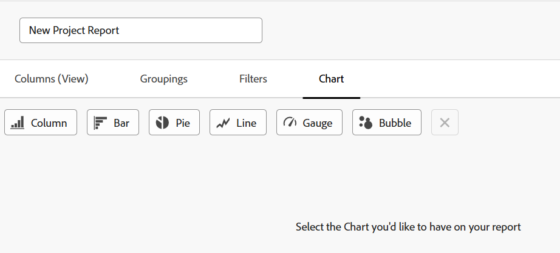

# Een aangepast rapport maken

<!--Audited: 10/2024-->

U kunt toegang tot de informatie verlenen die uw organisatie in Adobe Workfront nodig heeft door rapporten te maken. U kunt alle ingebouwde rapporten gebruiken die beschikbaar zijn in Workfront, of u kunt uw aangepaste rapporten helemaal zelf samenstellen.

Voor meer informatie over ingebouwde rapporten, zie [&#x200B; de ingebouwde rapporten van Adobe Workfront van het Gebruik &#x200B;](../../../reports-and-dashboards/reports/using-built-in-reports/use-workfront-built-in-reports.md).

Voor informatie over het creëren van een rapport door het te kopiëren, zie [&#x200B; een exemplaar van een rapport &#x200B;](../../../reports-and-dashboards/reports/creating-and-managing-reports/create-copy-report.md) creëren.

Zie de sectie Leren op de website van Adobe Experience League voor meer informatie over het maken en beheren van rapporten, waaronder klassen, video&#39;s en zelfstudies.

## Toegangsvereisten

+++ Breid uit om de toegangseisen voor de functionaliteit in dit artikel weer te geven.

U moet het volgende hebben:

<table style="table-layout:auto"> 
 <col> 
 <col> 
 <tbody> 
  <tr> 
   <td role="rowheader">Adobe Workfront-plan</td> 
   <td> 
Alle
 </td> 
  </tr> 
  <tr> 
   <td role="rowheader">Adobe Workfront-licentie</td> 
   <td> 
Nieuw: Standaard 

   of
   
Huidig: Plan 
 </td> 
  </tr> 
  <tr> 
   <td role="rowheader">Configuraties op toegangsniveau</td> 
   <td> 
Toegang tot rapporten, dashboards, kalenders bewerken
 
Toegang tot filters, weergaven, groepen bewerken
</td> 
  </tr> 
  <tr> 
   <td role="rowheader">Objectmachtigingen</td> 
   <td> 
U krijgt beheermachtigingen voor de rapporten die u maakt.
</td> 
  </tr> 
 </tbody> 
</table>

Voor informatie, zie [&#x200B; vereisten van de Toegang in de documentatie van Workfront &#x200B;](/help/quicksilver/administration-and-setup/add-users/access-levels-and-object-permissions/access-level-requirements-in-documentation.md).

+++

## Een rapport maken {#create-a-report}

{{step1-to-reports}}

1. Klik **Nieuw Rapport**, dan selecteer het objecten type dat u voor het rapport wilt.

   De rapportbuilder laadt.

   Voor specifieke informatie over beschikbare objecten rapporten, zie het sectie [&#x200B; Rapport over voorwerpen &#x200B;](../../../workfront-basics/navigate-workfront/workfront-navigation/understand-objects.md#reporting-on-objects) in het artikel [&#x200B; voorwerpen in Adobe Workfront &#x200B;](../../../workfront-basics/navigate-workfront/workfront-navigation/understand-objects.md) begrijpen.

   

   >[!TIP]
   >
   >U kunt ook een rapport maken door een kopie van een bestaand rapport te maken. Voor meer informatie, zie [&#x200B; een exemplaar van een rapport &#x200B;](../../../reports-and-dashboards/reports/creating-and-managing-reports/create-copy-report.md) creëren.

1. (Optioneel) Als u de titel van uw nieuwe rapport wilt bewerken, voert u de gewenste rapporttitel in het tekstveld in de linkerbovenhoek van de rapportbuilder in. We raden u aan alleen UTF-8-tekens te gebruiken om compatibiliteitsproblemen te voorkomen.

1. In de rapportaannemer, voeg het volgende aan uw rapport toe:

   <table style="table-layout:auto"> 
    <col> 
    <col> 
    <thead> 
     <tr> 
      <th>Functie</th> 
      <th>Beschrijving</th> 
     </tr> 
    </thead> 
    <tbody> 
     <tr> 
      <td>Kolommen (weergave)</td> 
      <td> 
Het toevoegen van kolommen aan uw rapport bepaalt welke informatie uw rapport bevat.
 
Leren hoe te om een kolom toe te voegen, zie <a href="#add-columns-view-to-a-report" class="MCXref xref"> kolommen (mening) aan een rapport </a> toevoegen. 
 </td> 
     </tr> 
     <tr> 
      <td>Groepen</td> 
      <td> 
Het toevoegen van groeperingen aan uw rapport bepaalt hoe uw rapport wordt georganiseerd.
 
Leren hoe te om een groepering toe te voegen, zie <a href="#add-groupings-to-a-report" class="MCXref xref"> groeperingen aan een rapport </a> toevoegen.
 </td> 
     </tr> 
     <tr> 
      <td>Filters</td> 
      <td> 
Het toevoegen van filterregels aan uw rapport bepaalt informatie u in uw rapport ziet.
 
Leren hoe te om een filter toe te voegen, zie <a href="#add-filters-to-a-report" class="MCXref xref"> filters aan een rapport </a> toevoegen.
 </td> 
     </tr> 
     <tr> 
      <td>Diagram</td> 
      <td> 
Het toevoegen van een grafiek aan uw rapport bepaalt hoe de informatie in uw rapport visueel wordt voorgesteld.
 
Leren hoe te om een grafiek toe te voegen, zie <a href="#add-a-chart-to-a-report" class="MCXref xref"> een grafiek aan een rapport </a> toevoegen.
 </td> 
     </tr> 
    </tbody> 
   </table>

1. Op om het even welk punt tijdens het proces van de rapportverwezenlijking, is de klik **&#x200B;**&#x200B;van toepassing om uw veranderingen te bewaren.
1. Nadat u wordt gebeëindigd, klik **sparen + Sluiten**.

### Kolommen (weergave) toevoegen aan een rapport {#add-columns-view-to-a-report}

1. Begin creërend een rapport zoals die in [&#x200B; wordt beschreven creeer een rapport &#x200B;](#create-a-report) sectie in dit artikel.
1. In de rapportbouwer, selecteer de **Kolommen (Mening)** tabel om de kolommen te identificeren om in het rapport te verschijnen.
1. (Optioneel) Klik op **Een bestaande weergave toepassen** en klik op de naam van een weergave in het vervolgkeuzemenu om een bestaande weergave te gebruiken.

   Voor meer informatie over het creëren van een mening, zie [&#x200B; Overzicht van Meningen in Adobe Workfront &#x200B;](../../../reports-and-dashboards/reports/reporting-elements/views-overview.md).

1. (Facultatief) om een bestaande kolom te verwijderen, klik de kolom die u wilt verwijderen, dan klik **x** naast de huidige naam in de kolomkopbal.

1. Om een nieuwe kolom toe te voegen, klik **Kolom** toevoegen.

   of

   Om een bestaande kolom te veranderen, klik de kolom, **verwijdert** pictogram  aan het recht van het huidige gebied in **tonen op dit kolomgebied** gebied in de upper-left hoek van de rapportbouwer, en begint een nieuw gebied te typen, dan het te klikken wanneer het in de lijst toont.

   Voor meer informatie over de gebieden u in de kolommen ziet, zie [&#x200B; Verklarende woordenlijst van de terminologie van Adobe Workfront &#x200B;](../../../workfront-basics/navigate-workfront/workfront-navigation/workfront-terminology-glossary.md).

    toe

1. (Facultatief) in het **gebied van de Montages van de Kolom**, uitgezochte **Soort door deze kolom** om de waarden in de kolom of in het stijgen op dalende alfabetische orde te sorteren, dan erop te wijzen of de lijst deze kolom als zijn eerste soort zou moeten gebruiken.

   U kunt veelvoudige niveaus van soorten in een rapportmening hebben als u door de waarde in één kolom eerst wilt sorteren, de waarde in een tweede kolom tweede, etc.

   Als meerdere resultaten identiek zijn volgens de eerste sorteercriteria, worden ze gesorteerd in de volgorde van de tweede sorteercriteria. Als meerdere resultaten identiek zijn volgens de eerste en tweede sorteercriteria, worden ze gesorteerd op basis van de derde sortering, enz.

   >[!NOTE]
   >
   >Als u een veld toevoegt dat verwijst naar een object dat te ver verwijderd is van het object waarop u rapporteert, kunt u mogelijk niet sorteren op dit veld.\
   >Een uitgiftenrapport kan bijvoorbeeld niet worden gesorteerd op het veld Projecteigenaar omdat het verwijst naar 3 extra objecten: Project, Eigenaar en Naam. Nochtans, kunt u dit gebied aan een probleemrapport nog toevoegen en de informatie voor het zien.

   <!--outdated: To learn more about cross-object references in reports, see the section "Advanced Reporting Part 1 of 3" in the [Reports and Dashboards Learning Path](https://one.workfront.com/s/learningpath2/workfront-reporting-MC7MZT2BOL2ZC2LMJ4MA3EMHOCNY?tabset-dc70e=2).-->

1. (Facultatief) als u groeperingen gebruikt en u (bijeengevoegde) de informatie in een kolom wilt samenvatten, **samenvatten deze kolom door** drop-down lijst in het **gebied van de Montages van de Kolom**, dan de optie selecteren u wilt gebruiken om de informatie in de kolom samen te voegen.

   De samengevoegde informatie wordt weergegeven in de kolom in de rijen voor cijfergroepering.

   

   Voor meer informatie over het samenvatten van gegevens in een kolom, zie [&#x200B; Overzicht van Meningen in Adobe Workfront &#x200B;](../../../reports-and-dashboards/reports/reporting-elements/views-overview.md).

   >[!NOTE]
   >
   >De volgende uitzonderingen zijn van toepassing op bovenliggende objecten (bijvoorbeeld bovenliggende taken) wanneer u waarden samenvoegt voor de volgende velden in groepen:
   >
   >* Alle velden voor getallen en valuta&#39;s, met uitzondering van werkelijke uren (bijvoorbeeld geplande of werkelijke loonkosten, geplande of werkelijke kosten, geplande of werkelijke kosten, geplande of geplande uren) bevatten alleen de waarden voor de kindertaken en zelfstandige taken. De waarden voor de bovenliggende taken of ouders van ouders worden niet samengevoegd.
   >* Werkelijke uren tellen de waarden voor de hoofdbovenliggende en zelfstandige taken samen; ze tellen de getallen voor de bovenliggende taken of de onderliggende taken niet samen.
   >* Aangepaste gegevensvelden voor getal- en valutawaarden bevatten alle taken: ouders, kinderen, ouders van ouders en zelfstandige taken.

   Voor meer informatie over het gebruiken van groeperingen in een rapport, zie [&#x200B; Overzicht van Groepen in Adobe Workfront &#x200B;](../../../reports-and-dashboards/reports/reporting-elements/groupings-overview.md).

1. (Facultatief) klik **Geavanceerde Opties** om de volgende informatie voor de kolom te specificeren:

   <table style="table-layout:auto"> 
    <col> 
    <col> 
    <tbody> 
     <tr> 
      <td role="rowheader">Aangepast kolomlabel</td> 
      <td> 
Geef een aangepast label voor de kolom op. Dit label vervangt het standaardlabel.
 </td> 
     </tr> 
     <tr> 
      <td role="rowheader">Veldindeling</td> 
      <td> 
Selecteer de indeling waarin u de waarden voor de velden in de kolom wilt weergeven.
 </td> 
     </tr> 
     <tr> 
      <td role="rowheader">Deze kolom tonen wanneer deze zich op een dashboard bevindt</td> 
      <td> 
Selecteer deze optie om deze kolom op een dashboard te tonen, wanneer het rapport naast elkaar met een ander rapport wordt getoond. Als deze optie is uitgeschakeld, wordt deze kolom niet weergegeven wanneer u het rapport weergeeft op een dashboard waar rapporten naast elkaar worden weergegeven.
 </td> 
     </tr> 
     <tr> 
      <td role="rowheader">Kolomregels</td> 
      <td> 
Klik <strong> voeg een Regel voor deze Kolom </strong> toe om voorwaardelijk formatteren aan de kolom toe te voegen. Nadat u een regel hebt toegevoegd, kunt u veld- en tekststijlen definiëren voor de weergave van velden die overeenkomen met die regel. Klik <strong> toevoegen Regel </strong> nadat u het bepalen van de regel hebt gebeëindigd. Voor meer informatie over voorwaardelijk formatteren in een mening, zie <a href="../../../reports-and-dashboards/reports/reporting-elements/use-conditional-formatting-views.md" class="MCXref xref"> Voorwaardelijk het Gebruik formatteren in meningen </a>.
 </td> 
     </tr> 
    </tbody> 
   </table>

1. Klik **toepassen** om uw veranderingen tot nu toe toe toe te passen en het rapport met de volgende opties verder uit te geven.

   Klik **sparen + Sluiten** als u klaar bent met het uitgeven van de kolommen in het rapport en u het rapport wilt bewaren.

### Groepen toevoegen aan een rapport {#add-groupings-to-a-report}

1. Begin creërend een rapport zoals die in [&#x200B; wordt beschreven creeer een rapport &#x200B;](#create-a-report) sectie in dit artikel.
1. In de rapportbouwer, selecteer het **lusje van Groepen** om te identificeren hoe u punten in het rapport wilt groeperen.
1. Klik **toevoegen groepering** om een nieuwe groepering toe te voegen.

   of

   Kies **een Bestaande Groepering** toepassen om een bestaande groepering te selecteren wanneer het in de lijst toont.

    toe

1. Typ het veld dat u als groep wilt toevoegen. Als het veld beschikbaar is, wordt het gevuld voor elk object waaraan het kan worden gekoppeld. Klik op de naam van het veld om het aan die groep toe te voegen.
1. (Facultatief) u kunt verkiezen om een groepering op tekstwijze te bouwen, door **Schakelaar aan de Wijze van de Tekst te klikken**. Voor meer informatie over het gebruiken van tekstwijze, zie [&#x200B; Overzicht van de Wijze van de Tekst &#x200B;](../../../reports-and-dashboards/reports/text-mode/understand-text-mode.md).

   Voor meer informatie over het creëren van nieuwe groeperingen, zie [&#x200B; Overzicht van Groepen in Adobe Workfront &#x200B;](../../../reports-and-dashboards/reports/reporting-elements/groupings-overview.md).

1. (Optioneel) Selecteer **deze groepering samenvouwen door gebrek** als u de resultaten in deze groepering wilt doen ineenstorten eerder dan uitgevouwen tonen.

   Deze instelling is standaard uitgeschakeld en de resultaten van de groepering worden altijd weergegeven in een uitgevouwen lijst.

   >[!TIP]
   >
   >* Wanneer u groepen handmatig aanpast wanneer u een lijst weergeeft, onthoudt Workfront uw handmatige voorkeur totdat u zich afmeldt. Wanneer u zich weer aanmeldt, wordt de lijst weergegeven volgens deze instelling.
   >* De resultaten van een groepering tonen altijd uitgevouwen na de toegang tot hen van een grafiekelement.

1. (Facultatief) klik **Schakelaar aan de Groepering van de Matrijs**, om een matrixgroepering te bouwen en uw resultaten in een netformaat te tonen.

   Voor meer informatie over de bouw van een matrixrapport, zie [&#x200B; een matrixrapport &#x200B;](../../../reports-and-dashboards/reports/creating-and-managing-reports/create-matrix-report.md) creëren.

1. Klik **toepassen** om uw veranderingen tot nu toe toe toe te passen en het rapport met de volgende opties verder uit te geven.

   Klik **sparen + Sluiten** als u klaar bent met het uitgeven van de groeperingen in het rapport en u het rapport wilt bewaren.

### Filters toevoegen aan een rapport {#add-filters-to-a-report}

1. Begin creërend een rapport zoals die in [&#x200B; wordt beschreven creeer een rapport &#x200B;](#create-a-report) sectie in dit artikel.
1. In de rapportbouwer, selecteer het **lusje van Filters** om de hoeveelheid informatie te identificeren die u het rapport wilt omvatten.
1. Klik **toevoegen een Regel van de Filter** om een douanefilter toe te voegen.\
   of\
   Kies **een Bestaande Filter** toepassen om een bestaand filter te gebruiken.

    toe

1. Als u **klikte voeg een Regel van de Filter** toe, begin het gebied te typen dat u als filter wilt toevoegen. Als het veld beschikbaar is, wordt het gevuld voor elk object waaraan het kan worden gekoppeld. Klik op de naam van het veld om het aan dat filter toe te voegen.\
   Gebruik filtermodifiers om het filter te maken. Voor meer informatie over filterbepalingen, zie [&#x200B; Filter en voorwaardenbepalingen &#x200B;](../../../reports-and-dashboards/reports/reporting-elements/filter-condition-modifiers.md).

   Voor meer informatie over het creëren van nieuwe filters, zie [&#x200B; Overzicht van Filters &#x200B;](../../../reports-and-dashboards/reports/reporting-elements/filters-overview.md).

1. (Facultatief) u kunt verkiezen om een filter op tekstwijze te bouwen door **Schakelaar aan de Wijze van de Tekst te klikken**.

   Voor meer informatie over het gebruiken van tekstwijze, zie [&#x200B; Overzicht van de Wijze van de Tekst &#x200B;](../../../reports-and-dashboards/reports/text-mode/understand-text-mode.md).

1. Klik **toepassen** wanneer u gebeëindigd bent het uitgeven van de filters in het rapport om uw veranderingen tot dusverre toe toe te passen en het rapport met de volgende opties te blijven uitgeven.

   Klik **sparen + Sluiten** als het rapport en u het rapport wilt bewaren.

### Een diagram toevoegen aan een rapport {#add-a-chart-to-a-report}

1. Begin creërend een rapport zoals die in [&#x200B; wordt beschreven creeer een rapport &#x200B;](#create-a-report) sectie in dit artikel.
1. In de rapportbouwer, selecteer het **lusje van de Grafiek**, dan selecteer het type van grafiek u wilt toevoegen.

    toe

   Voor meer informatie over de bouw van een grafiek in een rapport, zie [&#x200B; een grafiek aan een rapport &#x200B;](../../../reports-and-dashboards/reports/creating-and-managing-reports/add-chart-report.md) toevoegen.

1. Klik **toepassen** om uw veranderingen tot nu toe toe toe te passen en het rapport met de volgende opties verder uit te geven.

   Klik **sparen + Sluiten** als u het uitgeven van het rapport gebeëindigd bent en u het rapport wilt bewaren.
