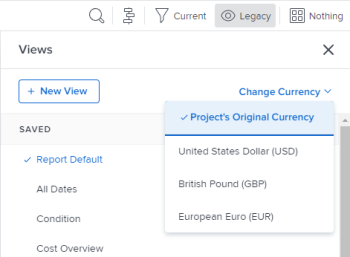

# Rapporten met financiële gegevens maken met unieke wisselkoersen

Als er in Adobe Workfront meerdere wisselkoersen zijn geconfigureerd, kunt u de financiële waarden in rapporten en lijsten zodanig instellen dat deze in een andere valuta dan de standaardvaluta worden weergegeven.

>[!IMPORTANT]
>
>Als u een munt buiten de standaardmunt in een Mening selecteert, ziet u niet meer de verbindingen **Meer Taken** toevoegen en **voegt Meer Kwesties** bij de bodem van een projectlijst toe.

Voor informatie over hoe te om de standaardmunt voor een bepaald project te veranderen, zie [ Verandering de projectmunt ](../../../manage-work/projects/project-finances/change-project-currency.md).

Als het verslag projecten met één munt bevat, worden de bedragen in groepen ook weergegeven in de standaardvaluta van het systeem.

## Toegangsvereisten

U moet de volgende toegang hebben om de stappen in dit artikel uit te voeren:

<table style="table-layout:auto"> 
 <col> 
 <col> 
 <tbody> 
  <tr> 
   <td role="rowheader">Adobe Workfront-abonnement*</td> 
   <td> 
Alle
 </td> 
  </tr> 
  <tr> 
   <td role="rowheader">Adobe Workfront-licentie*</td> 
   <td> 
Plan 
 </td> 
  </tr> 
  <tr> 
   <td role="rowheader">Configuraties op toegangsniveau*</td> 
   <td> 
Toegang tot rapporten, dashboards, kalenders bewerken
 
Toegang tot filters, weergaven, groepen bewerken
 
Opmerking: als u nog steeds geen toegang hebt, vraag dan aan de Workfront-beheerder of deze aanvullende beperkingen op uw toegangsniveau heeft ingesteld. Voor informatie over hoe een beheerder van Workfront uw toegangsniveau kan wijzigen, zie <a href="../../../administration-and-setup/add-users/configure-and-grant-access/create-modify-access-levels.md" class="MCXref xref"> tot douanetoegangsniveaus </a> leiden of wijzigen.
 </td> 
  </tr> 
  <tr> 
   <td role="rowheader">Objectmachtigingen</td> 
   <td> 
Machtigingen beheren voor een rapport
 
Voor informatie bij het vragen van om extra toegang, zie <a href="../../../workfront-basics/grant-and-request-access-to-objects/request-access.md" class="MCXref xref"> de toegang van het Verzoek tot voorwerpen </a>.
 </td> 
  </tr> 
 </tbody> 
</table>

&#42; om te weten te komen welk plan, vergunningstype, of toegang u hebt, contacteer uw beheerder van Workfront.

## Vereisten

Voordat u alternatieve valuta&#39;s kunt weergeven zoals in deze sectie wordt beschreven, moet de Workfront-beheerder eerst meerdere valuta&#39;s inschakelen en configureren in het gedeelte Setup van Workfront. Voor informatie, zie [ de wisselkoersen van de Opstelling ](../../../administration-and-setup/manage-workfront/exchange-rates/set-up-exchange-rates.md).

## Financiële waarden toepassen op een rapport {#apply-financial-values-to-a-report}

Financiële waarden tussen valuta&#39;s omzetten bij het werken met rapporten:

1. Ga naar het rapport waar u financiële waarden wilt omzetten in een andere valuta.
1. Klik de **drop-down lijst van de Mening**, klik **Valuta van de Verandering**, dan selecteer één van de volgende valuta die u financiële waarden in wilt tonen:

   * Oorspronkelijke valuta van het project
   * Alle overige valuta&#39;s

     >[!TIP]
     >
     >U kunt alleen valuta&#39;s kiezen die eerder in Setup zijn geselecteerd.

   Met deze optie kunt u snel financiële waarden in een rapport omzetten tussen rentewaarden.

   

   <!--
   
(NOTE: drafted this tip because I think this is confusing; this is in the step above.)

   -->

   <!--
   <note type="tip">
   You can also select the Change Currency option to convert financial values in other lists.
    
   
    
    
   </note>
   -->

## De standaardvaluta weergeven voor meerdere projecten met verschillende valuta&#39;s

Wanneer u de munt op het projectniveau aanpast en u informatie van alle projecten in het zelfde rapport wilt tonen, bestaan de volgende scenario&#39;s:

* Als u een rapport maakt dat financiële informatie ophaalt uit twee of meer projecten waarop verschillende valuta&#39;s zijn toegepast, geeft het samenvattingsoverzicht standaard de standaardvaluta van het systeem weer, zoals geselecteerd door de Workfront-beheerder.
* Als u een rapport maakt voor twee of meer projecten die dezelfde valuta hebben, maar verschillen van de standaardvaluta van het systeem, worden de bedragen in de groepen weergegeven met de standaardvaluta van het systeem.
* Als u een rapport maakt voor twee of meer projecten met taaktaken die zijn gekoppeld aan een valutaoverschrijving, converteert Workfront de financiële informatie van de overschreven valutakoersen van de rol naar de valuta van het project (wanneer u de oorspronkelijke valuta van het project in de weergave selecteert) of naar een andere valuta die u selecteert wanneer u het rapport weergeeft. Voor informatie over het met voeten treden van de munt van een baanrol, zie [ baanrollen ](../../../administration-and-setup/set-up-workfront/organizational-setup/create-manage-job-roles.md) creëren en beheren.

Twee projecten met aangepaste valuta&#39;s weergeven in een rapport:

1. Maak twee projecten met verschillende toegepaste valuta.

   

1. Log uren op beide projecten.

   Voor meer informatie over logboektijd, zie [ tijd van het Logboek ](../../../timesheets/create-and-manage-timesheets/log-time.md).

1. Klik het **Belangrijkste pictogram van het Menu** , dan klik **Meldend**.
1. Klik **Nieuw Rapport**, toen **Rapport van het Project**.
1. In de **Kolommen (Mening)** tabel, voeg een **Ware Kostenkolom** toe en vat het door **Som** samen.

   Voor informatie over hoe te om een kolom tot stand te brengen, zie [ Overzicht van Meningen in Adobe Workfront ](../../../reports-and-dashboards/reports/reporting-elements/views-overview.md).

1. In het **lusje van Groepen**, pas a **Geplande Datum van de Voltooiing** groepering toe.

   Voor informatie over hoe te om een groepering tot stand te brengen, zie [ Overzicht van Groepen in Adobe Workfront ](../../../reports-and-dashboards/reports/reporting-elements/groupings-overview.md).

1. In het **lusje van Filters**, voeg een filter voor **Naam van het Project** toe en selecteer de twee projecten met de verschillende valuta&#39;s.

   Voor informatie over hoe te om een filter tot stand te brengen, zie [ Overzicht van Filters ](../../../reports-and-dashboards/reports/reporting-elements/filters-overview.md).

1. Klik **sparen + Sluiten**.

   Het totaal van **Ware Kosten** wordt getoond in de Groepering die de systeemstandaardmunt, ongeacht de munt van de projecten in het rapport gebruikt.

    wordt getoond

   Als de twee projecten verschillende valuta&#39;s van elkaar hebben, verschijnt de systeemstandaardvaluta ook in de Groepering van het rapport.

## Toon de Valuta van het Project in een rapport op het projectniveau

Als een groepering op een taak of een uurlijst binnen een project wordt toegepast, worden de sommen in het groeperen getoond in de munt van het project.

1. Maak een project met een aangepaste valuta, anders dan de standaardvaluta van het systeem.
1. Ga naar het project en zorg ervoor dat het uren omvat die voor taken zijn geregistreerd.

   Voor meer informatie over logboektijd, zie [ tijd van het Logboek ](../../../timesheets/create-and-manage-timesheets/log-time.md).

   >[!NOTE]
   >
   >De taken zouden aan gebruikers of baanrollen met Tarief per de kostentarieven van uren moeten worden toegewezen.

1. Klik **Taken**.
1. Vouw het **drop-down menu van de Mening** uit en selecteer **Nieuwe Mening**.
1. Voeg **Ware Kosten** in de nieuwe Mening als nieuwe kolom toe, en vat het door **Som** samen.
1. Klik **Gedaan**, dan klik **sparen Mening**.
1. Breid **het groeperen** drop-down menu uit en selecteer **Nieuwe Groepering**.
1. Voeg **Ware Datum van de Voltooiing** in nieuwe groepering als nieuw gebied toe, dan klik **sparen Groepering**.

   De **Ware Kostprijs** kolom vat in de nieuwe Groepering samen en toont het totaal in de munt van het project.

## Rapporten bewerken met unieke valuta&#39;s

De financiële gebieden in een rapport zijn niet editable tot u het rapport verandert plaatsend om de originele munt voor projecten te tonen.

Een financieel veld in een rapport online bewerken:

1. Navigeer naar een rapport.

   >[!NOTE]
   >
   >Als de standaardvaluta niet wordt weergegeven voor een lijst in een ander gebied, kunt u de weergave bewerken en de standaardvaluta weergeven.\
   >Voor informatie over hoe te om de munt in een Mening te veranderen, zie de sectie in dit artikel [ financiële waarden op een rapport ](#apply-financial-values-to-a-report) toepassen.

1. Klik **de Acties van het Rapport**, dan uitgezocht **uitgeven**.
1. Klik **Montages van het Rapport**.
1. Klik de **drop-down Van de StandaardValuta**, dan uitgezochte **Oorspronkelijke Valuta van het Project**.

   

1. Klik **Gedaan**.
