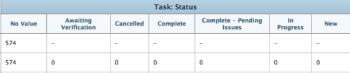

# Een matrixrapport maken

Matrix-rapporten bevatten samenvattingsgegevens in een samengevoegde tabelindeling, zodat het eenvoudiger is deze weer te geven dan wanneer ze in een lijst worden weergegeven, zoals in een traditioneel rapport.

## Wanneer gebruikt u een matrixrapport

U kunt een matrixrapport voor om het even welk rapport tot stand brengen dat 2 of meer Groepen bevat. Een traditioneel rapport kan tot 3 Groepen bevatten, en een matrixrapport kan tot 4 Groepen bevatten.

Bijvoorbeeld, wilt u een rapport van het Uur tot stand brengen dat de uren toont die tijdens een periode van drie maanden worden geregistreerd, en u wilt dat het rapport volgens wie de uren, evenals door maand en week ingaan wordt georganiseerd.

## Hoe gegevens in een matrixrapport worden weergegeven

De informatie in het matrixrapport wordt altijd getoond als numerieke waarde. In de meeste gevallen, zijn de kolommen die een numerieke waarde bevatten best voor het tonen in een matrixrapport (zoals het geregistreerde uren en daadwerkelijke kosten).

Andere kolommen (zoals Status) kunnen echter nog steeds worden weergegeven in het matrixrapport, zoals in de volgende afbeelding wordt getoond:\

## Toegangsvereisten

+++ Breid uit om de toegangseisen voor de functionaliteit in dit artikel weer te geven.

U moet de volgende toegang hebben om de stappen in dit artikel uit te voeren:

<table style="table-layout:auto"> 
 <col> 
 <col> 
 <tbody> 
  <tr> 
   <td role="rowheader">Adobe Workfront-abonnement*</td> 
   <td> 
Alle
 </td> 
  </tr> 
  <tr> 
   <td role="rowheader">Adobe Workfront-licentie*</td> 
      <td> 
      
Nieuw:

         <ul>
         <li>
Standaard
</li>
         </ul>
      
Huidige:

         <ul>
         <li>
Plan
</li>
         </ul>
   </td>
  </tr> 
  <tr> 
   <td role="rowheader">Configuraties op toegangsniveau*</td> 
   <td>
Toegang tot rapporten, dashboards, kalenders bewerken
 
Toegang tot filters, weergaven, groepen bewerken
</td> 
  </tr> 
  <tr> 
   <td role="rowheader">Objectmachtigingen</td> 
   <td> 
Machtigingen beheren voor een rapport
</td> 
  </tr> 
 </tbody> 
</table>

*For informatie, zie [ vereisten van de Toegang in de documentatie van Workfront ](/help/quicksilver/administration-and-setup/add-users/access-levels-and-object-permissions/access-level-requirements-in-documentation.md).

+++

## Een matrixrapport instellen

1. Creeer een traditioneel rapport dat numerieke gegevens in de rapportoutput bevat.\
   Voor informatie over hoe te om een rapport tot stand te brengen, zie [ een douanerapport ](../../../reports-and-dashboards/reports/creating-and-managing-reports/create-custom-report.md) creëren.

1. Ga naar het rapport dat u in Stap 1 creeerde, klik **Acties van het Rapport**, dan uitgezocht **geef** uit.

1. (Voorwaardelijk) als u reeds een Mening creeerde en u het op dit rapport wilt toepassen, klik **een Bestaande Mening** toepassen, dan de Mening van de drop-down lijst selecteren.
1. (Voorwaardelijk) Als u een nieuwe Mening voor het rapport wilt tot stand brengen, voltooi de volgende stappen:

   1. Klik de **Kolommen (Mening)** tabel, dan selecteer een kolom die u in het matrixrapport wilt worden samengevat.
   1. In het **gebied van de Montages van de Kolom**, klik **vat deze kolom door** drop-down lijst samen, dan selecteer één van de beschikbare opties om de informatie samen te vatten.

      >[!IMPORTANT]
      >
      >Als deze optie niet is geselecteerd, wordt de informatie uit de kolom niet correct weergegeven in het matrixrapport.

      

   1. Herhaal dit proces voor elke kolom in het lusje van Kolommen (Mening), dan klik **Gedaan**.

1. Klik de **Groepen** tabel.
1. (Voorwaardelijk) als u reeds een Groepering creeerde en u het op dit rapport wilt toepassen, **toepassen een Bestaande Groepering**, dan selecteren de Groepering van de drop-down lijst.
1. (Voorwaardelijk) als u een nieuwe matrixgroepering voor het rapport wilt tot stand brengen, voltooi de volgende stappen:

   1. Selecteer **Schakelaar aan de Groepering van de Matrijs** in de hoger-juiste hoek van de bouwerinterface.
   1. In de **sectie van de Groepen van de Rij**, identificeer de rij groepering, die de horizontale groeperingen van de lijst vestigt.
   1. (Facultatief) om extra rij toe te voegen groeperen, **voeg secundaire Groepering van de Rij** toe.
   1. In de **sectie van de Groepen van de Kolom**, identificeer de kolomgroepering, die de verticale groeperingen van de lijst vestigt.
   1. (Facultatief) om een extra kolom toe te voegen groeperen, **voeg secundaire Kolomgroepering** toe.
   1. (Voorwaardelijk) Als u een groepering door datum toevoegt, specificeer ook of de resultaten door dag, week, maand, kwartaal of jaar worden gegroepeerd.\
      

   1. (Voorwaardelijk) als u aan groep door datum selecteerde en resultaten door kwartaal te tonen, bijvoorbeeld, specificeer of u kwarten zonder gegevens wilt tonen door **te selecteren toont kwarten zonder resultaten** checkbox.\
      

      >[!NOTE]
      >
      >**toon kwarten zonder resultaten** gebied is slechts beschikbaar voor matrixgroeperingen, en niet voor standaardgroeperingen.\
      >Alleen de kwartalen zonder gegevens tussen twee kwartalen met geldige gegevens geven nul weer voor de gegevenswaarden op het matrixtabblad. De kwartalen die geen gegevens hebben die aan het begin en het eind van het tijdkader worden gevestigd door uw filter wordt geselecteerd verschijnen bij allen niet in de matrixgroepering die. De kwartalen zonder resultaten zullen niet in een groepering op het lusje van Details van het rapport tonen.

1. (Facultatief en voorwaardelijk) klik {de Montages van de Matrijs 0} **, dan selecteer van de volgende opties:**\
   **toon de Tellingen van het Verslag:** selecteer deze optie om een rij met het totale aantal ingangen voor het bepaalde gebied te tonen.\
   **toon de Kolom van de Waarde:** selecteer deze optie om de volgende informatie in de matrijs te tonen:

   * Aantal records
   * De kolom Waarde

     >[!NOTE]
     >
     >Deze kolom bevat informatie die beschrijft wat de gegevens in elke rij vertegenwoordigen.\
     >De volgende uitzonderingen zijn van toepassing op bovenliggende objecten (bijvoorbeeld bovenliggende taken) wanneer u waarden samenvoegt voor de volgende velden in groepen:
     >
     >   
     >   
     >   * Alle getallen en valutavelden behalve Werkelijke uren (bijvoorbeeld Geplande/Werkelijke loonkosten, Geplande/Werkelijke kosten, Geplande/Werkelijke kosten, Geplande/Geplande uren) tellen alleen de waarden voor de kindertaken en standalone taken samen. De waarden voor de bovenliggende taken of ouders van ouders worden niet samengevoegd.
     >   * Werkelijke uren tellen de waarden voor de hoofdbovenliggende en zelfstandige taken samen; ze tellen de getallen voor de bovenliggende taken of de onderliggende taken niet samen.
     >   * Aangepaste gegevensvelden voor getal- en valutawaarden bevatten alle taken: ouders, kinderen, ouders van ouders en zelfstandige taken. Als u het matrixrapport aan vertoning Geplande Uren of Werkelijke Uren in de **kolom van de Waarde** creeerde, ben zich ervan bewust dat uren of kosteninformatie voor om het even welke oudervoorwerpen (zoals oudertaken) niet in het matrixrapport worden getoond. Om uren op oudervoorwerpen te bekijken, moet u de **Details** tabel bekijken.
     >   
     >   
     >

   **Voorwaardelijke Regels:** opstelling om het even welke het formatteren regels voor waarden die worden bijeengevoegd.\
   Nadat u een regel hebt toegevoegd, kunt u veld- en tekststijlen definiëren voor de weergave van velden die overeenkomen met die regel. Klik **toevoegen Regel** nadat u het bepalen van de regel gebeëindigd hebt, toen **Gedaan** om de regel te bewaren.

1. Klik het **lusje van Filters** om te bepalen welke informatie in het rapport zal tonen.
1. (Voorwaardelijk) als u reeds een Filter creeerde en u het op dit rapport wilt toepassen, klik **een Bestaand Filter** toepassen, dan selecteer de Filter van de drop-down lijst.
1. (Voorwaardelijk) Als u een nieuwe Filter voor dit rapport wilt tot stand brengen, zie [ Filter en voorwaardenbepalingen ](../../../reports-and-dashboards/reports/reporting-elements/filter-condition-modifiers.md)

   <!--
   <MadCap:conditionalText data-mc-conditions="QuicksilverOrClassic.Draft mode">
   and
   <a href="../../../reports-and-dashboards/reports/reporting-elements/advanced-filter-condition-qualifiers.md" class="MCXref xref">Advanced Filter and condition qualifiers </a>
   </MadCap:conditionalText>
   -->

   voor informatie over de verschillende aanduidingen die u kunt gebruiken bij het maken van filters.

1. Klik **sparen+Sluiten** om het matrixrapport te bewaren en te bekijken.
