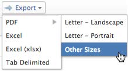

# Gegevens exporteren

<!-- Audited: 12/2023 -->

U kunt Adobe Workfront-gegevens uit verschillende lijsten, rapporten, dashboards en zoekopdrachten exporteren.

Enkele redenen voor het exporteren van gegevens zijn:

* U wilt een gedrukte kopie van uw gegevens aan iemand buiten Workfront verstrekken.
* U wilt de resultaten van een rapport als gehechtheid naar een externe gebruiker verzenden.
* U wilt een externe back-up van uw Workfront-gegevens maken.
* Er geldt een limiet voor het weergeven van slechts 2.000 resultaten op één pagina in de Workfront-webtoepassing. Als uw rapport meer dan 2.000 produceert, kunt u het rapport naar om het even welke beschikbare formaten uitvoeren en alle resultaten in het rapport in één lijst bekijken.

U kunt of een rapport manueel, van de interface van Workfront uitvoeren, of u kunt een levering voor een rapport plannen en dat rapport zal naar u op een recentere tijd worden verzonden. Voor meer informatie bij het plannen van geleverde rapporten, zie [Overzicht van levering rapporteren](../../../reports-and-dashboards/reports/creating-and-managing-reports/set-up-report-deliveries.md).

De informatie in dit artikel is niet van toepassing op de volgende exporttransacties:

* Gegevens uit grafiekrapporten exporteren.

  Voor meer informatie over het uitvoeren van een grafiekrapport, zie [Een diagram toevoegen aan een rapport](../../../reports-and-dashboards/reports/creating-and-managing-reports/add-chart-report.md).

* Informatie exporteren uit het Gantt-diagram.

  Zie voor meer informatie over het exporteren van de Gantt-grafiek [De Gantt-grafiek exporteren naar PDF](../../../manage-work/gantt-chart/use-the-gantt-chart/export-gantt-chart-to-pdf.md).

* Informatie exporteren vanuit de bronnenplanner.

  Voor meer informatie over het uitvoeren van de informatie van de Planner van het Middel, zie &quot;Optie van de Uitvoer&quot;in [Overzicht van de navigatie in de bronnenplanner](../../../resource-mgmt/resource-planning/resource-planner-navigation.md).

## Toegangsvereisten

+++ Breid uit om de toegangseisen voor de functionaliteit in dit artikel weer te geven.

U moet de volgende toegang hebben om de stappen in dit artikel uit te voeren:

<table style="table-layout:auto"> 
 <col> 
 </col> 
 <col> 
 </col> 
 <tbody> 
  <tr> 
   <td role="rowheader">Adobe Workfront-plan</td> 
   <td> 
Alle
 </td> 
  </tr> 
  <tr> 
   <td role="rowheader">Adobe Workfront-licentie</td> 
   <td>
    
Nieuw: Licht of hoger

    
of

    
Huidig: Controleren of hoger
 </td> 
  </tr> 
  <tr> 
   <td role="rowheader">Configuraties op toegangsniveau</td> 
   <td> 
Geef rapporten of meer toegang tot rapporten, dashboards en kalenders om rapporten te exporteren
 
Toegang tot de objecten die u in een lijst weergeeft of vergroten om de lijst te exporteren
 </td> 
  </tr> 
  <tr> 
   <td role="rowheader">Objectmachtigingen</td> 
   <td> 
De mening of hogere toestemmingen aan een rapport of een dashboard om het rapport of het dashboard uit te voeren
 
Geef de objecten die u in een lijst weergeeft of hoger de machtigingen weer om de lijst te exporteren
 </td> 
  </tr> 
 </tbody> 
</table>

Zie voor meer informatie over de informatie in deze tabel [Toegangsvereisten in Workfront-documentatie](/help/quicksilver/administration-and-setup/add-users/access-levels-and-object-permissions/access-level-requirements-in-documentation.md).

+++

## Vereisten

Het rapport moet worden gemaakt voordat u de gegevens kunt exporteren.

Zie voor meer informatie over het maken van rapporten [Een aangepast rapport maken](/help/quicksilver/reports-and-dashboards/reports/creating-and-managing-reports/create-custom-report.md) of [Een kopie van een rapport maken](/help/quicksilver/reports-and-dashboards/reports/creating-and-managing-reports/create-copy-report.md).

## Exportindelingen en -beperkingen

### Exportindelingen {#export-formats}

De informatie kan in de volgende formaten worden uitgevoerd:

* PDF (Letter liggend of Staand, Legal, Ledger en A4)
* Excel (.xls)
* Excel (.xlsx)
* Door tabs gescheiden

>[!NOTE]
>
>U kunt dashboards alleen afdrukken of exporteren naar een .pdf-bestand.

### Exportlimieten {#export-limits}

<!--
NOTE: Alina: [! This information is shared between "Exporting Data" and "Setting Up Report Deliveries."]
-->

Er gelden verschillende beperkingen voor de manier waarop rapporten in Workfront worden weergegeven en voor de manier waarop ze via handmatige export, een geleverd rapport of de API worden geëxporteerd.

* **50.000 cellen:** Het maximumaantal cellen dat in een rapport wordt toegestaan uitvoeren voor de dossiers van Excel.
* **50.000 rijen:** Het aantal rijen gegevens dat is toegestaan in een rapport dat wordt geëxporteerd voor bestanden met de indeling .pdf en Tab gescheiden.

   * Voor Excel .xls- dossiers, is deze grens **65.000 rijen**.
   * Voor Excel .xlsx-bestanden is deze limiet **100.000 rijen**.
   * Deze grenzen sluiten de kolomrubrieken, evenals rijen voor groepen in het rapport uit. Bijvoorbeeld, als u 6 groeperingen in een rapport hebt, en 50.000 rijen van gegevens, zal het uitgevoerde dossier 50.000 rijen hebben.

  >[!IMPORTANT]
  >
  >Het uitvoeren van een rapport dat een inzamelingsverwijzing binnen een kolom omvat kan in een fout resulteren, zelfs als het rapport anders binnen de vermelde uitvoergrenzen is. Als de verzameling waarnaar wordt verwezen te groot is, wordt het exportproces onderbroken en resulteert dit in een fout.
  >
  >U voorkomt deze fout door kolommen die verwijzen naar grote verzamelingen uit te sluiten of de grootte van de verzamelingen waarnaar wordt verwezen, te reduceren voordat u gaat exporteren.
  >

  Als uw rapport meer items bevat dan deze limiet, wordt een fout weergegeven als u wilt dat het exporteren niet is gelukt. Verlaag het aantal items dat u op het scherm ziet tot een getal dat kleiner is dan of gelijk is aan deze limiet om de resultaten te kunnen exporteren.

  Als uw rapport meer dan 50.000/65.000/100.000 rijen heeft en u alle gegevens wilt uitvoeren, adviseren wij dat u filters of herinneringen gebruikt om kleinere ladingen gegevens te verkrijgen, en veelvoudige uitvoeren uit te voeren.

  Zie voor informatie over het gebruik van filters [Overzicht van filters](../../../reports-and-dashboards/reports/reporting-elements/filters-overview.md).

  Voor informatie over het gebruiken van herinneringen, zie [Een vraag toevoegen aan een rapport](../../../reports-and-dashboards/reports/creating-and-managing-reports/add-prompt-report.md).

* Deze grenswaarden gelden voor:

   * Een handmatige export van een rapport.
   * Een gepland rapport.
   * Een export via een API-integratie.
   * Gegevens geëxporteerd via een trap-start.

     Zie voor meer informatie over het exporteren van gegevens via het starten [Gegevens exporteren uit Adobe Workfront via Kick-start](../../../administration-and-setup/manage-workfront/using-kick-starts/export-data-from-wf-via-kick-starts.md).

     >[!NOTE]
     >
     >U kunt 50.000 rijen exporteren in een startbestand, hoewel u de gegevens alleen kunt exporteren naar een Excel-bestand.

   * Gebruiksinformatie voor een project exporteren.

     Voor meer informatie over het uitvoeren van gebruiksinformatie voor een project, zie [Overzicht van het verslag over het gebruik van hulpbronnen](../../../reports-and-dashboards/reports/using-built-in-reports/resource-utilization-report.md#exporting-utilization-information-for-a-project).

* **10 MB bestandsgrootte:** Maximale bestandsgrootte voor elk geëxporteerd rapport dat is gepland voor levering. Als een geëxporteerd bestand dat is gekoppeld aan een e-mailbericht groter is dan 5 MB, wordt een koppeling waarnaar het bestand kan worden gedownload per e-mail verzonden in plaats van het bijgevoegde geëxporteerde rapport.
* **65.530 hyperlinks:** Dit is een door Excel opgelegde limiet voor documenten die meer dan 65.530 hyperlinks bevatten. Deze documenten kunnen niet worden geopend wanneer ze handmatig worden geëxporteerd of in een bezorgd rapport worden verzonden. Een Excel-document kan slechts 200 rijen gegevens bevatten, maar als het document meer dan 65.530 koppelingen bevat, wordt het document niet geopend. Deze limiet geldt alleen voor Excel-bestanden en niet voor de andere ondersteunde indelingen. 
* **256 kolommen**: Dit is een door Excel opgelegde limiet voor documenten die meer dan 256 kolommen bevatten. Deze documenten kunnen niet handmatig worden geëxporteerd of in een bezorgd rapport worden verzonden. Deze limiet geldt alleen voor Excel-bestanden en niet voor de andere ondersteunde indelingen.

Als u probeert gegevens te exporteren die de limiet overschrijden, ontvangt u mogelijk niet alle verwachte gegevens in de exportbewerking. In plaats daarvan wordt een gewijzigd verslag binnen de limiet opgesteld.

Bovendien worden rapporten die langer dan 60 minuten duren, gestopt.

Neem contact op met de technische ondersteuning van Workfront als u problemen hebt met uw limiet.

## Gegevens exporteren

### Gegevens exporteren uit een rapport of lijst {#export-data-from-a-report-or-list}

1. Ga naar het rapport of de lijst die u wilt exporteren.
1. Selecteer de items die u wilt exporteren. (Als u afzonderlijke items selecteert, worden alleen de geselecteerde items geëxporteerd.)

   Selecteer bijvoorbeeld in een project de taken die u wilt exporteren.

   of

   Laat alle items uitgeschakeld om de volledige lijst te exporteren.

1. Klikken **Exporteren** Selecteer vervolgens een indeling.

   <!--
   This note doesn't seem to be true (I tested with e reviewer and they could export the dashboard and its reports), and there's another article all about exporting dashboards. Lisa 12/23
   >[!NOTE]
   >
   >To export a Dashboard report, you must have a Plan license.  
   >
   -->

   of

   Klik op de knop **Exporteren** pictogram Selecteer vervolgens een indeling.

   Welke PDF-exportopties beschikbaar zijn, is afhankelijk van de landinstellingen in de Workfront-gebruikersinstellingen:

   * Noord-Amerika - letter (standaardwaarde), legal, grootboek, A4

     <!--   
        
     -->

   * Alle locaties buiten Noord-Amerika - A3, A4 (standaard), letter, legal, grootboek

     <!--   
        
     -->

1. (Voorwaardelijk) Afhankelijk van het besturingssysteem dat u gebruikt, hebt u mogelijk de mogelijkheid om het bestand te openen of op te slaan. Open het bestand met de bijbehorende toepassing of sla het op de vaste schijf op.
1. Doorgaan met [Het geëxporteerde document gebruiken](#use-the-exported-document).

### Gegevens exporteren uit een dashboard {#export-data-from-a-dashboard}

U kunt de gegevens van een dashboard afdrukken of exporteren als .pdf-bestand.

Ga voor meer informatie over het exporteren van gegevens van een dashboard naar [Een dashboard exporteren](../../../reports-and-dashboards/dashboards/creating-and-managing-dashboards/export-dashboard.md).

## Het geëxporteerde document gebruiken {#use-the-exported-document}

* [Bestandsnamen](#file-names)
* [Titels](#titles)
* [Tijdstempels](#timestamps)
* [Opmaak](#formatting)
* [Koppelingen](#links)
* [Branding](#branding)

### Bestandsnamen {#file-names}

Of u nu een lijst met objecten of een rapport exporteert, het geëxporteerde bestand heeft een bestandsnaam en een titel. U kunt het geëxporteerde bestand op uw computer vinden door naar de bestandsnaam te verwijzen. De titel van het rapport geeft gebruikers een indicatie van wat het geëxporteerde bestand vertegenwoordigt wanneer u het met hen deelt.

#### Bestandsnamen voor geëxporteerde lijsten {#file-names-for-exported-lists}

Wanneer u een lijst met objecten exporteert, wordt het objecttype in het geëxporteerde bestand weergegeven in de bestandsnaam en in de titel van de lijst.

Wanneer u een lijst met taken of problemen exporteert, worden de **Bestandsnaam** kan een van de volgende zijn:

* Wanneer u taak en uitgiftenlijsten in een project uitvoert:

   * *The_project_name_Exported_Tasks*(*in de indelingen PDF, Excel, Excel (.xlsx) of Door tabs gescheiden)*
   * *The_project_name_Exported_Issues*(*in de indelingen PDF, Excel, Excel (.xlsx) of Door tabs gescheiden)*

* Wanneer u taak en uitgiftenlijsten in een taak (subtaken) uitvoert:

   * **The_project_name_the_task_name_Exported_Tasks**(*in de indelingen PDF, Excel, Excel (.xlsx) of Door tabs gescheiden)*
   * **The_project_name_the_task_name_Exported_Issues**(*in de indelingen PDF, Excel, Excel (.xlsx) of Door tabs gescheiden)*

Wanneer u een lijst met andere objecten uit een project naar een PDF-bestand exporteert, geeft de bestandsnaam van het geëxporteerde document het type object aan dat u hebt geëxporteerd.\
De bestandsnaam kan bijvoorbeeld als volgt zijn:

* *Geëxporteerde_Gebruikers*, bij het exporteren van het tabblad Personen in het project *in de indelingen PDF, Excel, Excel (.xlsx) of Door tabs gescheiden)*
* *Exported_Risks*, bij het exporteren van een lijst met risico&#39;s voor het project *in de indelingen PDF, Excel, Excel (.xlsx) of Door tabs gescheiden)*

#### Bestandsnamen voor geëxporteerde rapporten {#file-names-for-exported-reports}

Wanneer u een rapport exporteert, krijgt het geëxporteerde rapport de volgende bestandsnaam:

*The_report_name*(*in de indelingen PDF, Excel, Excel (.xlsx) of Door tabs gescheiden)*

### Titels {#titles}

Wanneer u een lijst met objecten exporteert, heeft alleen het bestand in de indeling PDF een titel. Als u een lijst of een rapport naar Excel, Excel (.xlsx), of Door tabs gescheiden formaten uitvoert, heeft het dossier geen titel.

#### Titels voor geëxporteerde lijsten {#titles-for-exported-lists}

Wanneer u taak en uitgeeft lijsten in een project naar een dossier van PDF uitvoert, is de titel van het uitgevoerde document één van het volgende:

* *Projectnaam - Geëxporteerde taken*
* *Projectnaam - Geëxporteerde problemen*

Wanneer u taak- en uitgavelijsten in een taak exporteert naar een PDF-bestand, is de tegel van het geëxporteerde document een van de volgende:

* *Projectnaam - Taaknaam - Geëxporteerde taken*
* *Projectnaam - Taaknaam - Geëxporteerde problemen*

Wanneer u een lijst met andere objecten uit een project exporteert naar een PDF-bestand, geeft de titel van het geëxporteerde document het type objecten aan dat u hebt geëxporteerd.\
De titel kan bijvoorbeeld als volgt zijn:

* *Geëxporteerde gebruikers*, bij het exporteren van het tabblad Personen in het project.
* *Geëxporteerde risico&#39;s*, bij het exporteren van een lijst met risico&#39;s voor het project.

#### Titels voor geëxporteerde rapporten {#titles-for-exported-reports}

Een rapport dat naar een PDF-bestand wordt geëxporteerd, heeft een titel.

Als het rapport wordt uitgevoerd naar Excel, Excel (.xlsx) of Door tabs gescheiden formaten, zal het uitgevoerde rapport geen titel hebben. De titel van het geëxporteerde bestand is de naam van het rapport zoals deze wordt weergegeven in de Workfront-webtoepassing.

Als het rapport een beschrijving heeft, wordt het opgenomen in het geëxporteerde bestand.

### Tijdstempels {#timestamps}

Er wordt een tijdstempel weergegeven in het geëxporteerde document vanuit de context van de gebruiker die het item heeft geëxporteerd.

De tijdstempel bevat:

* Datum
* Tijd
* Tijdzone waarop het item is geëxporteerd

Afhankelijk van het type document dat u exporteert, worden tijdstempels op verschillende locaties weergegeven:

* **PDF:** Tijdstempels worden weergegeven op de voettekst van elke pagina en in de bestandsnaam.
* **Excel:** Tijdstempels worden weergegeven in de bestandsnaam.

### Opmaak {#formatting}

Wanneer u een project naar .pdf uitvoert, worden om het even welke subtaken getoond zoals ingesprongen aan hun oudertaken. Bovenliggende taken worden niet samengevouwen in geëxporteerde lijsten.

U ontvangt altijd het standaardlusje van een rapport wanneer een rapport voor een levering wordt verzonden of gepland, tenzij het rapport een speciale mening heeft.

Als uw rapport speciale opmaak heeft in de webtoepassing, moet het rapport worden geleverd met de speciale opmaak wanneer de tabbladen Details en Matrix worden geleverd, alleen voor .pdf- en Excel-bestanden.

>[!NOTE]
>
>Als de gegevens die u exporteert gedeelde kolommen bevatten en u exporteert naar een indeling die is gescheiden door Excel of Tab, worden deze kolommen gescheiden in het geëxporteerde bestand.

Voor meer informatie over hoe te om het formatteren in een rapport aan te passen, zie [Voorwaardelijke opmaak gebruiken in weergaven](../../../reports-and-dashboards/reports/reporting-elements/use-conditional-formatting-views.md).

### Koppelingen {#links}

Koppelingen kunnen verwijzen naar elk object in Workfront dat koppelingen ondersteunt. Wanneer u een lijst in Workfront naar .pdf exporteert, blijven alle ondersteunde koppelingen in het oorspronkelijke document actief in het geëxporteerde document.

>[!TIP]
>
>Indien de regel `valueformat=HTML` wordt weergegeven in de tekstmodus voor een aangepaste veldkolom en de koppelingswaarden worden niet weergegeven in een geëxporteerd .pdf-bestand. U moet dan aanvullende coderegels invoeren in de tekstmodus.
>
>Bijvoorbeeld, als u een douanegebied genoemd Open Q1 Projecten hebt die verbindingen bevatten, zou u de volgende code toevoegen:
>
>`link.url=customDataLabelsAsString(Open Q1 Projects)`
>`linkedname=direct`

Wanneer u naar een Excel-indeling exporteert, worden alleen koppelingen naar objecten in Workfront in het geëxporteerde bestand opgenomen. Deze koppelingen worden alleen ondersteund op plaatsen waar u koppelingen in geëxporteerde Excel-documenten kunt toestaan, zoals rapportleveringen.

## Branding {#branding}

>[!IMPORTANT]
>
>Branding is alleen van toepassing op organisaties die nog niet aan boord zijn van Adobe Experience Cloud.
>
>Als uw organisatie is aangemeld bij Adobe Experience Cloud, is branding niet beschikbaar.

Als uw Workfront-beheerder aangepaste branding heeft toegevoegd aan uw Workfront-instantie voor de algemene navigatiebalk, bevatten de geëxporteerde .pdf-bestanden ook uw persoonlijke logo.

Gegevens die in andere indelingen worden geëxporteerd, kunnen niet worden gepersonaliseerd met uw logo.

Zie voor meer informatie over het brandmerken van uw Workfront-instantie en de algemene navigatiebalk [Adobe Workfront-exemplaar merkbaar](../../../administration-and-setup/customize-workfront/brand-workfront/brand-your-workfront-instance.md).
