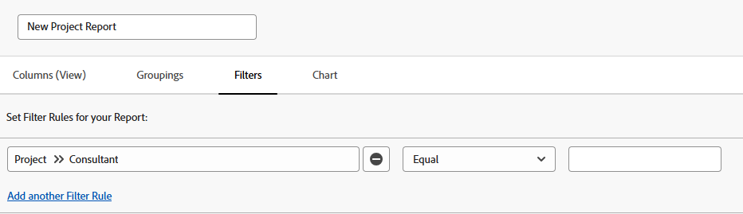

# Verwijs een douaneformulier in een rapport

U kunt naar de aangepaste formulieren van een object verwijzen in de weergaven, filters en groepen van een rapport voor dat object.

U kunt verwijzen naar de inhoud van aangepaste formulieren die u in een rapport wilt opnemen, of u kunt verwijzen naar informatie over de aangepaste formulieren die u zelf in een rapport wilt opnemen.

## Toegangsvereisten

U moet de volgende toegang hebben om de stappen in dit artikel uit te voeren:

<table style="table-layout:auto"> 
 <col> 
 <col> 
 <tbody> 
  <tr> 
   <td role="rowheader">Adobe Workfront-abonnement*</td> 
   <td> 
Alle
 </td> 
  </tr> 
  <tr> 
   <td role="rowheader">Adobe Workfront-licentie*</td> 
   <td> 
Plan 
 </td> 
  </tr> 
  <tr> 
   <td role="rowheader">Configuraties op toegangsniveau*</td> 
   <td> 
Toegang tot rapporten, dashboards, kalenders bewerken
 
Toegang tot filters, weergaven, groepen bewerken
 
Opmerking: Als u nog steeds geen toegang hebt, vraagt u de Workfront-beheerder of deze aanvullende beperkingen op uw toegangsniveau instelt. Voor informatie over hoe een beheerder van Workfront uw toegangsniveau kan wijzigen, zie <a href="../../../administration-and-setup/add-users/configure-and-grant-access/create-modify-access-levels.md" class="MCXref xref">Aangepaste toegangsniveaus maken of wijzigen</a>.
 </td> 
  </tr> 
  <tr> 
   <td role="rowheader">Objectmachtigingen</td> 
   <td> 
Rechten voor een rapport beheren
 
Voor informatie over het aanvragen van aanvullende toegang raadpleegt u <a href="../../../workfront-basics/grant-and-request-access-to-objects/request-access.md" class="MCXref xref">Toegang tot objecten aanvragen </a>.
 </td> 
  </tr> 
 </tbody> 
</table>

&#42;Neem contact op met uw Workfront-beheerder om te weten te komen welk plan, licentietype of toegang u hebt.

## Vereisten

Het aangepaste formulier moet bestaan voordat u ernaar kunt verwijzen in een rapport.

Zie voor meer informatie over het maken van aangepaste formulieren [Een aangepast formulier maken of bewerken](../../../administration-and-setup/customize-workfront/create-manage-custom-forms/create-or-edit-a-custom-form.md).

## Verwijzen naar de inhoud van aangepaste formulieren

U kunt verwijzen naar velden in aangepaste formulieren. Nadat een aangepast formulier op een object is toegepast, zijn alle velden die aan dat aangepaste formulier zijn gekoppeld, beschikbaar om in een rapport naar een ander veld in het object te worden verwezen, net als alle andere velden in het object.

>[!NOTE]
>
>Voor velden met meerdere opties zijn alle opties beschikbaar in de filters en vragen van het rapport, inclusief de opties die verborgen zijn.\
>Raadpleeg het artikel voor meer informatie over het verbergen van keuzen in een aangepast veld met meerdere opties [Een aangepast formulier maken of bewerken](../../../administration-and-setup/customize-workfront/create-manage-custom-forms/create-or-edit-a-custom-form.md).

Wanneer u het rapport maakt, gebruikt u gewoon het objecttype van het formulier als de veldbron en gebruikt u de naam van het aangepaste veld als de veldnaam.

U kunt bijvoorbeeld een aangepast formulier toepassen op alle projecten die het aangepaste veld bevatten **Consultant**. Als u een rapport wilt maken met alle projecten waar Olivia Kim de consultant is, gebruikt u de opdracht **Project** objecttype als veldbron en gebruik **Consultant** als de veldnaam. De filterkwalificatie instellen op **Gelijk** Typ dan Olivia Kim.

Raadpleeg het artikel voor meer informatie over het maken van een rapport [Een aangepast rapport maken](../../../reports-and-dashboards/reports/creating-and-managing-reports/create-custom-report.md).

## Referentiegegevens over aangepaste formulieren

U kunt verwijzen naar informatie over aangepaste formulieren, zoals de naam van aangepaste formulieren die aan een object zijn gekoppeld.

&#x200B; Afhankelijk van het element (Weergave, Filter of Groepering) kunt u naar een van de volgende opties verwijzen:

* Het primaire aangepaste formulier dat op een object wordt toegepast:

   Dit is het formulier dat het eerst wordt weergegeven op de pagina Details van het object.

* Alle aangepaste formulieren (als er meerdere aangepaste formulieren op een object zijn toegepast)

U kunt naar aangepaste formulieren verwijzen in Weergaven, Filters en Groepen:

* [Verwijzing douaneformulieren in een rapportmening (Kolom)](#reference-custom-forms-in-a-report-view-column)
* [Verwijzing douaneformulieren in een rapportfilter](#reference-custom-forms-in-a-report-filter)
* [Verwijzing douaneformulieren in een rapport Groepering](#reference-custom-forms-in-a-report-grouping)

### Verwijzing douaneformulieren in een rapportmening (Kolom) {#reference-custom-forms-in-a-report-view-column}

Alle aangepaste formulieren weergeven die aan een object zijn gekoppeld:

1. Een rapport maken zoals wordt beschreven in het artikel [Een aangepast rapport maken](../../../reports-and-dashboards/reports/creating-and-managing-reports/create-custom-report.md).
1. Op de **Kolommen** vouwt u het objecttype uit waarop het aangepaste formulier waarnaar u wilt verwijzen, is toegepast en klikt u vervolgens op **Categorienaam**.\
   Als u bijvoorbeeld alle aangepaste formulieren wilt weergeven die aan een taak zijn gekoppeld, vouwt u de opdracht **Taak** veldbron, en klik dan **Categorienaam** veldnaam.\
   

Alleen het primaire aangepaste formulier weergeven dat aan het object is gekoppeld:

1. Een rapport maken zoals wordt beschreven in het artikel [Een aangepast rapport maken](../../../reports-and-dashboards/reports/creating-and-managing-reports/create-custom-report.md).
1. Op de **Kolommen** tabblad, vouwt u de **Categorie** veldbron, en klik dan **Naam** veldnaam.\
   

### Verwijzing douaneformulieren in een rapportfilter {#reference-custom-forms-in-a-report-filter}

Filteren op alle aangepaste formulieren die aan het objecttype zijn gekoppeld:

1. Een rapport maken zoals wordt beschreven in het artikel [Een aangepast rapport maken](../../../reports-and-dashboards/reports/creating-and-managing-reports/create-custom-report.md).
1. Op de **Filters** tab, uitvouwen **Categorieën** en klik vervolgens op **Naam**.\
   

1. Selecteer de voorwaarde-aanduiding die u wilt gebruiken:

   * Is leeg
   * Is niet leeg
   * Bevat
   * Bevat niet
   * Gelijk
   * Niet gelijk

   Raadpleeg het artikel voor meer informatie over elke kwalificatie [Filter- en voorwaardenmodificatoren](../../../reports-and-dashboards/reports/reporting-elements/filter-condition-modifiers.md).

   >[!NOTE]
   >
   >Als het veld waarnaar u filtert meerdere opties heeft en u de opdracht **Niet gelijk** of **Bevat niet** kwalificeertekens, worden de resultaten die alleen de door u opgegeven keuze bevatten, uitgefilterd. Als het veld aanvullende opties bevat, inclusief de opgegeven optie, worden die resultaten niet uit het rapport gefilterd. Dit omvat het filtreren voor veelvoudige Douane Forms als zij aan het zelfde voorwerp in bijlage zijn.

1. Typ de naam van het aangepaste formulier waarop u wilt filteren en klik vervolgens op de naam wanneer dit wordt weergegeven in de vervolgkeuzelijst.
1. (Optioneel) Klik op **Een andere filterregel toevoegen** Herhaal vervolgens stap 2-4 om extra filterregels te maken.
1. Klikken **Opslaan en sluiten**.

Alleen filteren op het primaire aangepaste formulier dat is gekoppeld aan het objecttype:

1. Een rapport maken zoals wordt beschreven in het artikel [Een aangepast rapport maken](../../../reports-and-dashboards/reports/creating-and-managing-reports/create-custom-report.md).
1. Op de **Filters** tabblad, vouwt u de **Categorie** veldbron, en klik dan **Naam** veldnaam.\
   

1. Selecteer de voorwaarde-aanduiding die u wilt gebruiken:

   * Is leeg
   * Is niet leeg
   * Bevat
   * Bevat niet
   * Gelijk
   * Niet gelijk

   Raadpleeg het artikel voor meer informatie over elke kwalificatie [Filter- en voorwaardenmodificatoren](../../../reports-and-dashboards/reports/reporting-elements/filter-condition-modifiers.md).

1. Typ de naam van het aangepaste formulier waarop u wilt filteren en klik vervolgens op de naam wanneer dit wordt weergegeven in de vervolgkeuzelijst.
1. (Optioneel) Klik op **Een andere filterregel toevoegen** Herhaal vervolgens stap 2-4 om extra filterregels te maken.
1. Klikken **Opslaan en sluiten**.

### Verwijzing douaneformulieren in een rapport Groepering {#reference-custom-forms-in-a-report-grouping}

>[!NOTE]
>
>U kunt items alleen groeperen op het primaire aangepaste formulier dat aan het object is gekoppeld. u kunt geen items groeperen in alle formulieren die aan het object zijn gekoppeld.

1. Een rapport maken zoals wordt beschreven in het artikel [Een aangepast rapport maken](../../../reports-and-dashboards/reports/creating-and-managing-reports/create-custom-report.md).
1. Op de **Groepen** tab, uitvouwen **Categorie** en klik vervolgens op **Naam**.\
   
