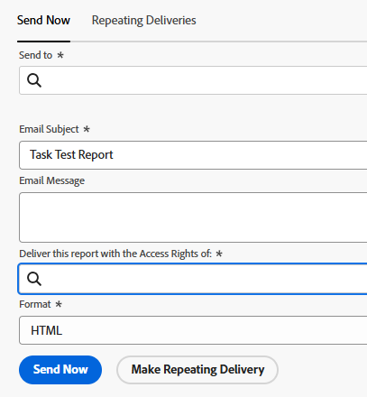

# Een rapport uitvoeren en leveren met de toegangsrechten van een andere gebruiker

<!-- Audited: 11/2024 -->

Door gebrek, kunnen de gebruikers de voorwerpen in een rapport slechts zien dat zij toestemmingen aan Mening hebben.

U kunt alle gebruikers toestaan om de zelfde resultaten in een rapport als een andere gebruiker, ongeacht hun toegangsniveau of toestemmingsniveau op de voorwerpen binnen het rapport te zien.

Als u een rapport met de toegangsrechten van een andere gebruiker in werking stelt die hogere toegang (bijvoorbeeld, de toegangsrechten van een beheerder van Adobe Workfront) heeft, kunnen alle gebruikers die toestemmingen hebben om het rapport te bekijken de informatie in het rapport als gebruiker zien die in de rapportbouwer wordt gespecificeerd. U kunt dit instellen voor zowel rapporten die gebruikers vinden in de Workfront-interface als voor rapporten die als bijlage bij een e-mailbericht aan gebruikers worden bezorgd.

>[!TIP]
>
>U zou **dit rapport met de Rechten van de Toegang van moeten vervangen:** gebied met een actieve gebruiker slechts wanneer u het rapport met de toegangsrechten van die gebruiker wilt tonen. Bijvoorbeeld, zou een werk-vergunning gebruiker geen toestemmingen kunnen hebben om alle punten in een rapport te zien dat door een plan-vergunning gebruiker of een Beheerder van het Systeem wordt gebouwd, tenzij het rapport met de toegangsrechten van een Planner of een Beheerder van het Systeem toont.\
>Als het rapport met gebruikers met gelijkaardige toegang zoals de gebruiker wordt gedeeld die in **wordt gespecificeerd stel dit rapport met de Rechten van de Toegang van in werking:** gebied, kunt u dit gebied leeg verlaten.

## Toegangsvereisten

+++ Breid uit om de toegangseisen voor de functionaliteit in dit artikel weer te geven.

U moet de volgende toegang hebben om de stappen in dit artikel uit te voeren:

<table style="table-layout:auto"> 
 <col> 
 <col> 
 <tbody> 
  <tr> 
   <td role="rowheader">Adobe Workfront-abonnement*</td> 
   <td> <p>Alle</p> </td> 
  </tr> 
  <tr> 
   <td role="rowheader">Adobe Workfront-licentie*</td> 
      <td> 
      <p>Nieuw:</p>
         <ul>
         <li><p>Standaard</p></li>
         </ul>
      <p>Huidige:</p>
         <ul>
         <li><p>Plan</p></li>
         </ul>
   </td>
  </tr> 
  <tr> 
   <td role="rowheader">Configuraties op toegangsniveau*</td> 
   <td> <p>Toegang tot rapporten, dashboards, kalenders bewerken</p> <p>Toegang tot filters, weergaven, groepen bewerken</p></td> 
  </tr> 
  <tr> 
   <td role="rowheader">Objectmachtigingen</td> 
   <td> <p>Toestemmingen aan een rapport (om het geleverde rapport te bekijken)</p><p>Rechten beheren voor een rapport (om het rapport uit te voeren)</p></td> 
  </tr> 
 </tbody> 
</table>

*For informatie, zie [&#x200B; vereisten van de Toegang in de documentatie van Workfront &#x200B;](/help/quicksilver/administration-and-setup/add-users/access-levels-and-object-permissions/access-level-requirements-in-documentation.md).

+++

## Een rapport weergeven met de toegangsrechten van een andere gebruiker

Het bevolken van **stelt dit Rapport met de Rechten van de Toegang van in werking:** het gebied verzekert een rapport de zelfde gegevens bevat, ongeacht welke gebruiker tot het rapport toegang heeft. Het rapport wordt weergegeven zoals het zou zijn voor de opgegeven gebruiker.

De gebruikers die tot het rapport toegang hebben moeten minstens de toestemmingen van de Mening op het rapport hebben om het te kunnen zien. Als de gebruiker in de **wordt vermeld stel dit Rapport met de Rechten van de Toegang van in werking:** gebied wordt gedeactiveerd, toont het rapport niet meer voor andere gebruikers die het rapport met wordt gedeeld.

Een rapport uitvoeren met de toegangsrechten van een andere gebruiker:

1. Klik het **[!UICONTROL Main Menu]** pictogram  in de hoger-juiste hoek van Adobe Workfront, of (als beschikbaar), klik het **[!UICONTROL Main Menu]** pictogram  in de upper-left hoek, dan klik **[!UICONTROL Reports]**.

1. Selecteer het rapport dat u wilt weergeven met de toegangsrechten van een andere gebruiker.
1. Klik **de Acties van het Rapport**, dan klik **uitgeven**.

1. Klik **Montages van het Rapport**.

1. In de **looppas dit rapport met de Rechten van de Toegang van:** gebied, begin de naam van de gebruiker te typen die u het rapport wilt tonen als, dan het selecteren wanneer u het in de lijst ziet.\
   

   >[!NOTE]
   >
   >De gebruikers met een lager toegangsniveau dat wordt toegestaan om rapporten te bouwen hebben niet de capaciteit om een gebruiker buiten zich voor **in werking te stellen dit Rapport met de Rechten van de Toegang van:** gebied te selecteren.

1. Klik **Gedaan**.
1. Klik **sparen + Sluiten**.\
   Het rapport toont nu voor alle gebruikers die het rapport wordt gedeeld met alsof het door de gebruiker werd bekeken die in **wordt gespecificeerd dit rapport met de Rechten van de Toegang van:** gebied in werking stellen.

>[!IMPORTANT]
>
>Het ingaan van een gebruiker buiten het programma geopende gebruiker voor **stel dit rapport met de Rechten van de Toegang van in werking:** gebied beïnvloedt de informatie die in het rapport wordt getoond als het rapport een filter bevat dat een vervanging gebruikt die naar de het programma geopende gebruiker verwijst. Het rapport toont volgens de waarde die in **wordt gespecificeerd stelt dit rapport met de Rechten van de Toegang van in werking:** gebied eerder dan wat in de vervangingsfilter wordt bepaald.
>
>Voor meer informatie over vervangingen voor gebruikersgebieden, zie de &quot;Op gebruiker-gebaseerde variabelen&quot;sectie in [&#x200B; overzicht van de de filtervariabelen van de Weigerkaart &#x200B;](../../../reports-and-dashboards/reports/reporting-elements/understand-wildcard-filter-variables.md).

## Een rapport leveren met de toegangsrechten van een andere gebruiker

U kunt rapporten instellen die als bijlage bij een e-mailbericht moeten worden bezorgd. U kunt opstelling deze geleverde rapporten aan vertoning aangezien zij voor gebruikers van een hoger toegangsniveau tonen, zodat kunnen alle gebruikers de zelfde informatie in de geleverde rapporten zien. De gebruikers die het rapport zullen zien dat in e-mail wordt geleverd moeten aan Send aan lijst van ontvangers binnen de rapportlevering worden toegevoegd. Voor meer informatie bij vestiging een rapport voor levering, zie het artikel [&#x200B; de leveringsoverzicht van het Rapport &#x200B;](../../../reports-and-dashboards/reports/creating-and-managing-reports/set-up-report-deliveries.md).

Een rapport leveren met de toegangsrechten van een andere gebruiker:

1. Klik het **pictogram van het 1&rbrace; pictogram van het Belangrijkste Menu  in de hoger-juiste hoek van Workfront, dan klik** Rapporten **.**

1. Selecteer het rapport dat u wilt leveren met de toegangsrechten van een andere gebruiker.
1. Klik op de naam van het rapport om het te selecteren.
1. Klik **Acties van het Rapport**.
1. Klik **verzenden Rapport**.

1. In **lever dit rapport met de Rechten van de Toegang van:** gebied, begin de naam van de gebruiker te typen die u het rapport wilt tonen aangezien wanneer het in e-mail wordt geleverd, dan het selecteren wanneer u het in de lijst ziet. Het gebrek is de naam van de gebruiker die het rapport bouwt.\
   

   >[!NOTE]
   >
   >De gebruikers met een lager toegangsniveau dat wordt toegestaan om rapporten te bouwen hebben niet de capaciteit om een gebruiker buiten zich voor **te selecteren leveren dit Rapport met de Rechten van de Toegang van:** gebied.

1. Selecteer het **Formaat** u het rapport in e-mail wilt tonen:

   * HTML
   * PDF
   * Excel
   * Excel (.xlsx)
   * TSV

1. Klik **verzenden nu** om het onmiddellijk te verzenden.\
   of\
   Klik **maken Herhalende Levering** om een terugkomende levering voor het rapport te plannen.\
   Voor meer informatie over rapportleveringen, zie het artikel [&#x200B; de leveringsoverzicht van het Rapport &#x200B;](../../../reports-and-dashboards/reports/creating-and-managing-reports/set-up-report-deliveries.md).

## Beperkingen voor rapporten met een Source-kolom

De volgende rapporten tonen een kolom van Source waar u informatie over het oudervoorwerp kunt bekijken:

* Problemen melden
* Uur-rapporten
* Documentrapporten

Als de gebruikers geen toestemmingen aan het oudervoorwerp van een kwestie, een uur, of een document hebben, toont de kolom van Source van het rapport leeg, zelfs wanneer het rapport aan vertoning wordt gevormd, of met de toegangsrechten van een andere gebruiker moet worden geleverd.

Om informatie over het oudervoorwerp in het rapport te tonen, adviseren wij toevoegend een kolom voor het oudervoorwerp waar u de naam van de ouder kunt tonen.

U kunt bijvoorbeeld het volgende toevoegen aan een rapport met een Source-kolom:

* De kolommen van de Naam van het Project, van de Naam van de Taak, of van de Naam van de Uitgave aan een document of uurrapport.
* De kolommen van de Naam van het Project of van de Naam van de Taak aan een probleemrapport.
* Een kolom die expressies in tekstmodus gebruikt die naar alle drie objecten verwijzen. Hieronder ziet u een voorbeeld van een uurrapport:

  ```
  displayname=Custom Source
  
  linkedname=opTask
  
  namekey=view.relatedcolumn
  
  namekeyargkey.0=opTask
  
  namekeyargkey.1=name
  
  textmode=true
  
  valueexpression=IF(!ISBLANK({opTaskID}),{opTask}.{name},IF(!ISBLANK({taskID}),{task}.{name},IF(!ISBLANK({projectID}),{project}.{name},IF(!ISBLANK({timesheetID}),CONCAT({owner}.{name}," ",{timesheet}.{startDate}," - ",{timesheet}.{endDate}),""))))
  
  valueformat=HTML
  ```

  Voor informatie over de meningen van de tekstwijze, zie [&#x200B; een mening uitgeven gebruikend tekstwijze &#x200B;](../text-mode/edit-text-mode-in-view.md).
