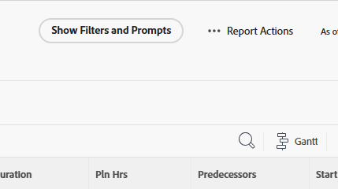

# Een rapport uitvoeren

U kunt om het even welk rapport in werking stellen dat u toegang tot Mening hebt.

<!-- Audited: 11/2024 -->

<!--
NOTE: ***Linked to Getting Started with Reporting.***This information is obsolete, because asynchronous timeline is not enabled for all customers (used to be included in the "Viewing a Cached Report" section): Some reports in Workfront can take a significant time to load. If your report takes longer than 30 seconds to load, your report is cached after it is finished loading, and a message is displayed in the upper-right corner of the page indicating that the report being viewed is a saved report from a specific time.

After a report is cached, it is available for the next 12 hours. Any user who runs the report (as described in "Running a Report") sees the cached report.)
-->

## Toegangsvereisten

+++ Vouw uit om de toegangsvereisten voor de functionaliteit in dit artikel weer te geven. 

<table style="table-layout:auto"> 
 <col> 
 <col> 
 <tbody> 
  <tr> 
   <td role="rowheader">Adobe Workfront-pakket</td> 
   <td> 
Alle
 </td> 
  </tr> 
  <tr> 
   <td role="rowheader">Adobe Workfront-licentie</td> 
   <td> 
      
Standard

      
Plan

   </td>
  </tr> 
  <tr> 
   <td role="rowheader">Configuraties op toegangsniveau</td> 
   <td> 
Toegang tot rapporten, dashboards, kalenders weergeven
</td> 
  </tr> 
  <tr> 
   <td role="rowheader">Objectmachtigingen</td> 
     <td> 
Toestemmingen aan een rapport weergeven
</td> 
  </tr> 
 </tbody> 
</table>

Voor meer detail over de informatie in deze lijst, zie [&#x200B; vereisten van de Toegang in de documentatie van Workfront &#x200B;](/help/quicksilver/administration-and-setup/add-users/access-levels-and-object-permissions/access-level-requirements-in-documentation.md).

+++

## Een rapport uitvoeren

1. Klik het **[!UICONTROL Main Menu]** pictogram  in de hoger-juiste hoek van Adobe Workfront, of (als beschikbaar), klik het **[!UICONTROL Main Menu]** pictogram  in de upper-left hoek, dan klik **[!UICONTROL Reports]**.

1. Selecteer een van de volgende opties:

   * **Mijn Rapporten:** Rapporten die u hebt gecreeerd.
   * **Gedeeld met me:** Rapporten die andere gebruikers met u hebben gedeeld.
   * **Alle Rapporten:** Alle rapporten in het systeem dat u toegang tot hebt.

1. Klik op de naam van het rapport dat u wilt uitvoeren.\
   of\
   Als het rapport gebruikend herinneringen werd gecreeerd, selecteer de aangewezen informatie van de drop-down menu&#39;s, dan klik **Rapport van de Looppas**.\
   Voor meer informatie over herinneringen, zie [&#x200B; een herinnering aan een rapport &#x200B;](../../../reports-and-dashboards/reports/creating-and-managing-reports/add-prompt-report.md) toevoegen.\
   De inhoud van de rapportvertoning met een timestamp in de hoger-juiste hoek van het rapport die de datum, de tijd, en de tijdzone omvat toen het rapport van de context van de gebruiker werd in werking gesteld die het rapport in werking stelde.

1. (Facultatief) klik het **pictogram van de Opnieuw laden**  om de resultaten in een rapport te verfrissen als het rapport in uw browser voor een tijdje is getoond.

1. (Voorwaardelijk) als het rapport filters of herinneringen gebruikt, klik **tonen Filters en Vragen** om een lijst van filters en herinneringen te tonen die op het rapport worden gebruikt u bekijkt. Als het rapport slechts filters of slechts herinneringen bevat, **toon Filters** of **toon Prompts** in plaats daarvan verschijnt.

   

   De informatie wordt onder de rapportnaam aan de linkerkant van de pagina weergegeven. Voor herinneringen, is dit informatie over de snelle selecties die bij de looppas van het rapport werden gemaakt, zoals die in Stap 3 worden beschreven.

1. Als u Aangepaste vragen gebruikt, worden deze niet weergegeven. Alleen het systeem vraagt de weergave. Aangepaste filters worden altijd weergegeven.

## Een rapport in cache weergeven

Uw rapport kan in de cache worden geplaatst als het al een tijdje in uw browser wordt weergegeven. U kunt een rapport in de cache forceren om opnieuw te laden wanneer u een van de volgende handelingen uitvoert:

* Bewerk de rapportinstellingen en sla het rapport op.
* Wijzig de weergave, groep of filter.
* Klik het **pictogram van de Opnieuw laden** 
Deze optie is beschikbaar in de rechterbovenhoek van de pagina in het berichtvak waarin wordt aangegeven op welke tijd het rapport is opgeslagen of in de rechterbovenhoek van het dashboard waarop het rapport is geplaatst. Voor meer informatie over het opnieuw laden van dashboards, zie de sectie &quot;Dashboards van de Vertoning&quot;in het artikel [&#x200B; worden begonnen met dashboards &#x200B;](../../../reports-and-dashboards/dashboards/understanding-dashboards/get-started-dashboards.md).

* U kunt elke gewenste pagina van het rapport openen na de eerste pagina door naar de tabbladen Overzicht, Matrix of Diagram te gaan.
