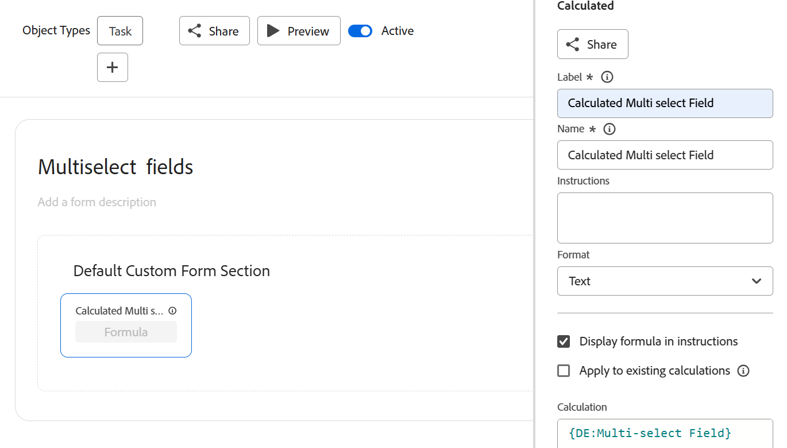
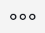
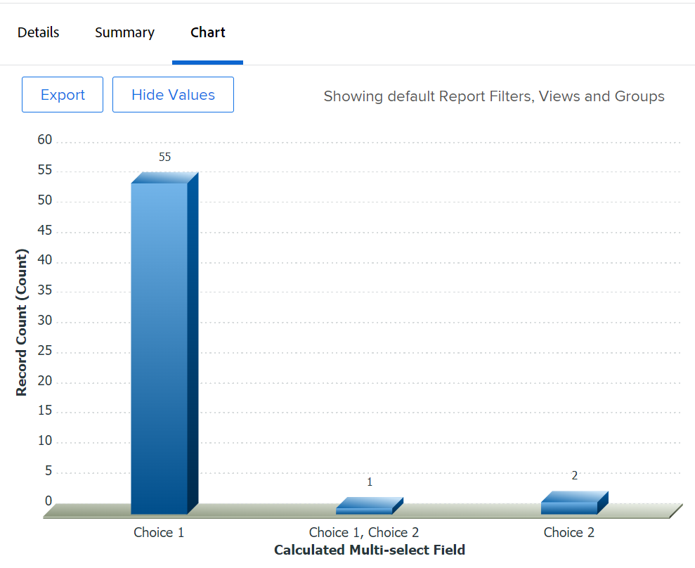

# Een rapport in een diagram weergeven op basis van een aangepast veld met meerdere selecties

<!--Audited: 11/2024-->

<!--The highlighted information on this page refers to functionality not yet generally available. It is available for all customers in the Preview environment and for a select group of customers in the Production environment.-->

In plaats van een diagram te maken met een aangepast veld met meerdere selecties, raden we u aan aparte velden te maken voor elke optie van een aangepast veld met meerdere selecties.

Voorbeelden van aangepaste velden met meerdere selecties zijn:

* Selectievakjes
* Meerdere vervolgkeuzemenu&#39;s selecteren

Voor informatie over het gebruiken van tekstwijze, zie het overzicht van de Wijze van de Tekst van artikel [&#x200B; &#x200B;](../../../reports-and-dashboards/reports/text-mode/understand-text-mode.md).

Als het echter niet mogelijk is afzonderlijke velden te hebben voor elke optie van een veld met meerdere selecties, kunt u een rapport aan de hand van een aangepast veld met meerdere selecties weergeven door berekende aangepaste velden te gebruiken om de keuzen van het veld met meerdere selecties eerst te groeperen. Daarna, kunt u het rapport door de berekende gebieden in kaart brengen.

>[!NOTE]
>
>Items waarvoor een van de gekozen opties is geselecteerd, worden slechts één keer geteld.
>
>For example, if you have a Checkbox custom field with Choice 1 and Choice 2 as options, and you attach the form to tasks, the tasks that have both Choice 1 and Choice 2 display in a separate chart element than the tasks that have only Choice 1 or Choice 2 selected.
>
>Tasks that have Choice 1 selected do not display in the same chart element as the tasks which have the Choice 1 and Choice 2 selected.

## Toegangsvereisten

+++ Breid uit om de toegangseisen voor de functionaliteit in dit artikel weer te geven. 

<table style="table-layout:auto"> 
 <col> 
 <col> 
 <tbody> 
  <tr> 
   <td role="rowheader">Adobe Workfront-pakket</td> 
   <td> 
Alle
 </td> 
  </tr> 
  <tr> 
   <td role="rowheader">Adobe Workfront-licentie</td> 
   <td> 
   
Medewerker of verzoek om een filter te wijzigen 

   
Standaard of Plan om een rapport te wijzigen

  </tr> 
  <tr> 
   <td role="rowheader">Configuraties op toegangsniveau</td> 
   <td> 
Toegang tot rapporten, dashboards, kalenders bewerken om een rapport te wijzigen
 
Toegang tot filters, weergaven en groepen bewerken om een filter te wijzigen
 </td> 
  </tr> 
  <tr> 
   <td role="rowheader">Objectmachtigingen</td> 
   <td> 
Machtigingen beheren voor een rapport
  </td> 
  </tr> 
 </tbody> 
</table>

Voor meer detail over de informatie in deze lijst, zie [&#x200B; vereisten van de Toegang in de documentatie van Workfront &#x200B;](/help/quicksilver/administration-and-setup/add-users/access-levels-and-object-permissions/access-level-requirements-in-documentation.md).

+++

## Vereisten

Voordat u begint, moet u een berekend aangepast veld maken waarin de waarden worden weergegeven die in het aangepaste veld voor meerdere selecties zijn geselecteerd. Voor informatie, zie [&#x200B; een berekend douanegebied bouwen dat verwijzingen een multi-uitgezochte sectie van het douanegebied &#x200B;](#build-a-calculated-custom-field-that-references-a-multi-select-custom-field) in dit artikel.

## Een rapport weergeven op basis van meerdere geselecteerde aangepaste velden

<!--

(NOTE: this moved to its own article, linked in the Note above!)

-->

U kunt geen grafiek in een rapport bouwen door naar een multi-select douanegebied van verwijzingen te verwijzen. In plaats daarvan kunt u een berekend veld maken waarmee de waarden van het aangepaste veld voor meerdere selecties voor een bepaald object en een bepaalde groep worden vastgelegd in het berekende veld. 

* [&#x200B; bouwt een berekend douanegebied dat verwijzingen een multi-uitgezochte douanegebied &#x200B;](#build-a-calculated-custom-field-that-references-a-multi-select-custom-field)
* [Bouw een grafiek die verwijzingen een berekend douanegebied](#build-a-chart-that-references-a-calculated-custom-field)

### Build a calculated custom field that references a multi-select custom field {#build-a-calculated-custom-field-that-references-a-multi-select-custom-field}

To build a calculated field that references a multi-select custom field, you must have the following prerequisites:

* A multi-select custom field in a custom form.\
  For information about building custom forms and adding custom fields to them, see the article [Create a custom form](/help/quicksilver/administration-and-setup/customize-workfront/create-manage-custom-forms/form-designer/design-a-form/design-a-form.md).

* A custom form with the multi-select custom field attached to objects.
* Waarden voor het aangepaste veld met meerdere selecties voor elk object.

To build the calculated custom field that references the multi-select custom field:

1. Create a custom form, or edit an existing one.

   Voor informatie over het creëren van douaneformulieren, zie [&#x200B; een douaneformulier &#x200B;](/help/quicksilver/administration-and-setup/customize-workfront/create-manage-custom-forms/form-designer/design-a-form/design-a-form.md) creëren.

1. Select the object or objects that you plan to use with the custom form.
1. Klik **toevoegen een Gebied**, dan **Berekend** om het multi-uitgezochte douanegebied aan de vorm toe te voegen.

1. In het **vakje van het Etiket**, noem het nieuwe berekende gebied om erop te wijzen dat het multi-select douanegebied van verwijzingen voorziet.

   Bijvoorbeeld: &quot;Berekend multiselect veld&quot;.

1. In het **vakje van de Berekening**, ga de volgende code in:

   `{DE:Multi-select Custom Field}`

   Hiermee voegt u de geselecteerde keuzen in het aangepaste veld voor meerdere selecties toe aan het berekende aangepaste veld. Als het formulier bijvoorbeeld is gekoppeld aan taken en Keuze 1 is geselecteerd in het aangepaste veld voor meerdere selecties, wordt in het berekende aangepaste veld de waarde Keuze 1 weergegeven. Als Keus 1 en Keuze 2 voor een verschillende taak worden geselecteerd, toont het berekende douanegebied de waarde &quot;Keus 1, Keuze 2&quot;.

1. Replace &quot;Multi-select Custom Field&quot; with the actual name of your multi-select custom field, as it appears in Workfront.

   

1. (Optional) If the multi-select custom field is already on this form and if this form is already attached to objects, enable the **Apply to existing calculations** option.

   This ensures that the new calculated field is automatically populated with the value from the multi-select custom field as it is added to the forms already attached to the objects.

1. Klik **toepassen**.
1. Klik **sparen en Sluiten**.

   Het berekende aangepaste veld wordt toegevoegd aan het aangepaste formulier en als het formulier momenteel aan objecten is gekoppeld, wordt in het veld informatie uit het aangepaste veld met meerdere selecties ingevuld.

### Bouw een grafiek die verwijzingen een berekend douanegebied {#build-a-chart-that-references-a-calculated-custom-field}

1. (Optioneel) Als u wilt dat alle berekende velden waarop u een diagram wilt maken, zijn gevuld met waarden, moet u de aangepaste expressies opnieuw berekenen voor alle objecten in uw rapport.
Voor informatie over het opnieuw berekenen van uitdrukkingen, zie [&#x200B; informatie op douanegebieden &#x200B;](/help/quicksilver/workfront-basics/work-with-custom-forms/edit-custom-forms.md) uitgeven.

   <!--from the Details tab of the report select all the objects that contain the custom form with both the multi-select custom field and the calculated custom field, then click **Edit**. 
   1. (Optional and conditional) Select the **Recalculate Custom Expressions** field, then click **Save Changes**.  
    
   >[!NOTE]
   >
   >This option has been eliminated from editing projects in bulk.  You can still recalculate expressions for projects in bulk by clicking the **More** icon  at the top of a project list, then **Recalculate Expressions**. -->

1. Ga naar het rapport waar u de grafiek voor het berekende gebied wilt toevoegen dat multi-select douaneveld van verwijzingen voorziet.
1. Klik **de Acties van het Rapport**, dan **uitgeven**.

1. Selecteer het <strong> lusje van Groepen </strong>, dan klik <strong> groepering </strong> toevoegen.
1. Voeg het <strong> Berekende Multi uitgezochte Gebied </strong> toe u als uw groepering creeerde.
1. Selecteer het <strong> lusje van de Grafiek </strong>, en voeg een grafiek aan uw rapport toe.

   Bijvoorbeeld, kies a **Kolom** grafiek.
     voor informatie over het toevoegen van een grafiek aan een rapport, zie de sectie <a href="../../../reports-and-dashboards/reports/creating-and-managing-reports/create-custom-report.md#add-a-chart" class="MCXref xref"> een grafiek aan een rapport </a> in het artikel <a href="../../../reports-and-dashboards/reports/creating-and-managing-reports/create-custom-report.md" class="MCXref xref"> een douanerapport </a> creëren.
1. Op het **Onderste (X) gebied van de As**, selecteer het <strong> Berekende Multi uitgezochte Gebied </strong> om in de grafiek te tonen.
1. Klik <strong> sparen + Sluiten </strong>.

   Het rapport toont de resultaten die door het Berekende Multi uitgezochte Gebied in een grafiek worden gegroepeerd.

   
