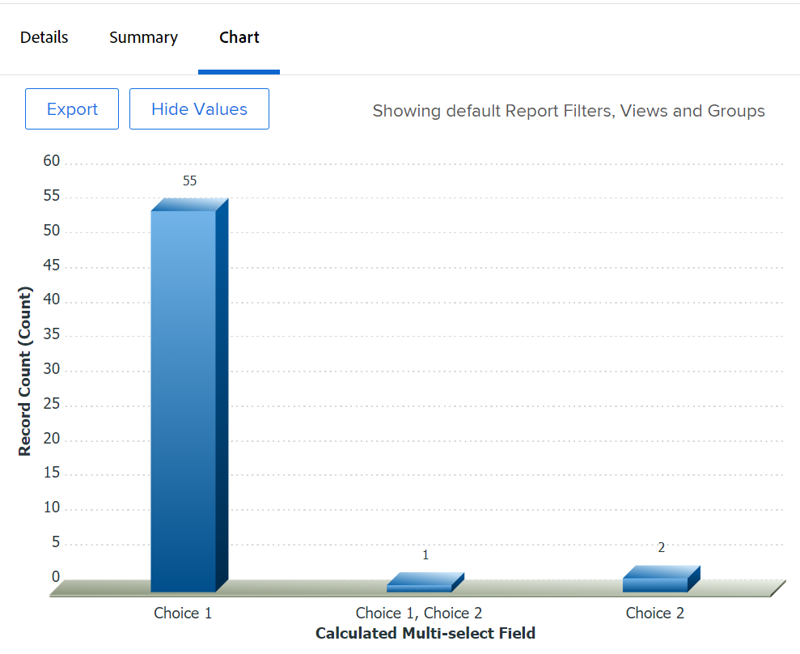

# Een rapport in een diagram weergeven op basis van een aangepast veld met meerdere selecties

<!--The highlighted information on this page refers to functionality not yet generally available. It is available for all customers in the Preview environment and for a select group of customers in the Production environment.-->

In plaats van een diagram te maken met een aangepast veld met meerdere selecties, raden we u aan aparte velden te maken voor elke optie van een aangepast veld met meerdere selecties.

Voorbeelden van aangepaste velden met meerdere selecties zijn:

* Selectievakjes
* Meerdere vervolgkeuzemenu&#39;s selecteren

Zie het artikel voor informatie over het gebruik van de tekstmodus [Overzicht van de tekstmodus](../../../reports-and-dashboards/reports/text-mode/understand-text-mode.md).

Als het echter niet mogelijk is afzonderlijke velden te hebben voor elke optie van een veld met meerdere selecties, kunt u een rapport aan de hand van een aangepast veld met meerdere selecties weergeven door berekende aangepaste velden te gebruiken om de keuzen van het veld met meerdere selecties eerst te groeperen. Daarna, kunt u het rapport door de berekende gebieden in kaart brengen.

>[!NOTE]
>
>Items waarvoor een van de gekozen opties is geselecteerd, worden slechts één keer geteld.
>
>Als u bijvoorbeeld een aangepast veld Selectievakje hebt met Keuze 1 en Keuze 2 als opties, en u het formulier koppelt aan taken, worden de taken die zowel Keuze 1 als Keuze 2 hebben, weergegeven in een afzonderlijk diagramelement dan de taken waarvoor Alleen Keuze 1 of Keuze 2 is geselecteerd.
>
>De taken die Keuze 1 hebben geselecteerd tonen niet in het zelfde grafiekelement zoals de taken die Keuze 1 en Keuze 2 hebben geselecteerd.

## Toegangsvereisten

U moet de volgende toegang hebben om de stappen in dit artikel uit te voeren:

<table style="table-layout:auto"> 
 <col> 
 <col> 
 <tbody> 
  <tr> 
   <td role="rowheader">Adobe Workfront-abonnement*</td> 
   <td> 
Alle
 </td> 
  </tr> 
  <tr> 
   <td role="rowheader">Adobe Workfront-licentie*</td> 
   <td> 
Plan 
 </td> 
  </tr> 
  <tr> 
   <td role="rowheader">Configuraties op toegangsniveau*</td> 
   <td> 
Toegang tot rapporten, dashboards, kalenders bewerken
 
Toegang tot filters, weergaven, groepen bewerken
 
Opmerking: als u nog steeds geen toegang hebt, vraag dan aan de Workfront-beheerder of deze aanvullende beperkingen op uw toegangsniveau heeft ingesteld. Voor informatie over hoe een beheerder van Workfront uw toegangsniveau kan wijzigen, zie <a href="../../../administration-and-setup/add-users/configure-and-grant-access/create-modify-access-levels.md" class="MCXref xref">Aangepaste toegangsniveaus maken of wijzigen</a>.
 </td> 
  </tr> 
  <tr> 
   <td role="rowheader">Objectmachtigingen</td> 
   <td> 
Machtigingen beheren voor een rapport
 
Voor informatie over het aanvragen van aanvullende toegang raadpleegt u <a href="../../../workfront-basics/grant-and-request-access-to-objects/request-access.md" class="MCXref xref">Toegang tot objecten aanvragen </a>.
 </td> 
  </tr> 
 </tbody> 
</table>

&#42;Neem contact op met uw Workfront-beheerder om te weten te komen welk plan, licentietype of toegang u hebt.

## Vereisten

Voordat u begint, moet u een berekend aangepast veld maken waarin de waarden worden weergegeven die in het aangepaste veld voor meerdere selecties zijn geselecteerd. Zie voor meer informatie de [Een berekend aangepast veld maken dat verwijst naar een aangepast veld met meerdere selecties](#build-a-calculated-custom-field-that-references-a-multi-select-custom-field) in dit artikel.

## Een rapport weergeven op basis van meerdere geselecteerde aangepaste velden

<!--

(NOTE: this moved to its own article, linked in the Note above!)

-->

U kunt geen grafiek in een rapport bouwen door naar een multi-select douanegebied van verwijzingen te verwijzen. In plaats daarvan kunt u een berekend veld maken waarmee de waarden van het aangepaste veld voor meerdere selecties voor een bepaald object en een bepaalde groep worden vastgelegd in het berekende veld. 

* [Een berekend aangepast veld maken dat verwijst naar een aangepast veld met meerdere selecties](#build-a-calculated-custom-field-that-references-a-multi-select-custom-field)
* [Bouw een grafiek die verwijzingen een berekend douanegebied](#build-a-chart-that-references-a-calculated-custom-field)

### Een berekend aangepast veld maken dat verwijst naar een aangepast veld met meerdere selecties {#build-a-calculated-custom-field-that-references-a-multi-select-custom-field}

Als u een berekend veld wilt maken dat verwijst naar een aangepast veld met meerdere selecties, moet u aan de volgende voorwaarden voldoen:

* Een aangepast veld met meerdere selecties in een aangepast formulier.\
  Zie het artikel voor informatie over het maken van aangepaste formulieren en het toevoegen van aangepaste velden aan deze formulieren [Een aangepast formulier maken of bewerken](../../../administration-and-setup/customize-workfront/create-manage-custom-forms/create-or-edit-a-custom-form.md).

* Een aangepast formulier waaraan het aangepaste veld voor meerdere selecties is gekoppeld.
* Waarden voor het aangepaste veld met meerdere selecties voor elk object.

U kunt als volgt het berekende aangepaste veld bouwen dat verwijst naar het aangepaste veld voor meerdere selecties:

1. Een aangepast formulier maken of een bestaand formulier bewerken.

   Zie voor informatie over het maken van aangepaste formulieren [Een aangepast formulier maken of bewerken](../../../administration-and-setup/customize-workfront/create-manage-custom-forms/create-or-edit-a-custom-form.md).

1. Selecteer het object of de objecten die u wilt gebruiken voor het aangepaste formulier.
1. Klikken **Veld toevoegen** vervolgens **Berekend** om het aangepaste veld voor meerdere selecties toe te voegen aan het formulier.

1. In de **Label** geeft u het nieuwe berekende veld een naam om aan te geven dat het naar het aangepaste veld voor meerdere selecties verwijst.

   Bijvoorbeeld: &quot;Berekend veld voor meerdere selecties.&quot;

1. In de **Berekening** voert u de volgende code in:

   `{DE:Multi-select Custom Field}`

   Hiermee voegt u de geselecteerde keuzen in het aangepaste veld voor meerdere selecties toe aan het berekende aangepaste veld. Als het formulier bijvoorbeeld is gekoppeld aan taken en Keuze 1 is geselecteerd in het aangepaste veld voor meerdere selecties, wordt in het berekende aangepaste veld de waarde Keuze 1 weergegeven. Als Keus 1 en Keuze 2 voor een verschillende taak worden geselecteerd, toont het berekende douanegebied de waarde &quot;Keus 1, Keuze 2&quot;.

1. Vervang &quot;Aangepast veld met meerdere selecties&quot; door de werkelijke naam van het aangepaste veld met meerdere selecties, zoals dit wordt weergegeven in Workfront.

   

1. (Optioneel) Als het aangepaste veld voor meerdere selecties al op dit formulier staat en als dit formulier al aan objecten is gekoppeld, schakelt u het selectievakje **Vorige berekeningen bijwerken (op de achtergrond)** -optie.

   Dit zorgt ervoor dat het nieuwe berekende veld automatisch wordt gevuld met de waarde uit het aangepaste veld voor meerdere selecties, aangezien dit veld wordt toegevoegd aan de formulieren die al aan de objecten zijn gekoppeld.

1. Klikken **Gereed**.
1. Klikken **Opslaan + Sluiten**.

   Het berekende aangepaste veld wordt toegevoegd aan het aangepaste formulier en als het formulier momenteel aan objecten is gekoppeld, wordt in het veld informatie uit het aangepaste veld met meerdere selecties ingevuld.

### Bouw een grafiek die verwijzingen een berekend douanegebied {#build-a-chart-that-references-a-calculated-custom-field}

1. (Optioneel) Als u wilt dat alle berekende velden waarop u een diagram wilt maken, worden gevuld met waarden, selecteert u op het tabblad Details van het rapport alle objecten die het aangepaste formulier bevatten met zowel het aangepaste veld voor meerdere selecties als het berekende aangepaste veld en klikt u vervolgens op **Bewerken**.
1. (Optioneel en voorwaardelijk) Selecteer de optie **Aangepaste expressies opnieuw berekenen** veld, klik vervolgens op **Wijzigingen opslaan**.\
   

   >[!NOTE]
   >
   >Deze optie is verwijderd uit het bulksgewijs bewerken van projecten.  U kunt expressies voor projecten in bulk nog steeds opnieuw berekenen door op de knop **Meer** pictogram  boven aan een projectlijst, dan **Expressies opnieuw berekenen**.

1. Ga naar het rapport waar u de grafiek voor het berekende gebied wilt toevoegen dat multi-select douaneveld van verwijzingen voorziet.
1. Klikken **Handelingen rapporteren** vervolgens **Bewerken**.

1. Selecteer de <strong>Groepen</strong> tab, en klik vervolgens op <strong>Groepering toevoegen</strong>.
1. Voeg de <strong>Berekend multiselect veld</strong> hebt u als groep gemaakt.
1. Selecteer de <strong>Diagram</strong> en voeg een grafiek aan uw rapport toe.

   Kies bijvoorbeeld een **Kolom** grafiek.
    Voor informatie over het toevoegen van een grafiek aan een rapport, zie de sectie <a href="../../../reports-and-dashboards/reports/creating-and-managing-reports/create-custom-report.md#add-a-chart" class="MCXref xref">Een diagram toevoegen aan een rapport</a> in het artikel <a href="../../../reports-and-dashboards/reports/creating-and-managing-reports/create-custom-report.md" class="MCXref xref">Een aangepast rapport maken</a>.
1. In de **Onderste (X) as** veld selecteert u de <strong>Berekend multiselect veld</strong> in het diagram weer te geven.
1. Klikken <strong>Opslaan + Sluiten</strong>.

   Het rapport toont de resultaten die door het Berekende Multi-uitgezochte Gebied in een grafiek worden gegroepeerd.

   