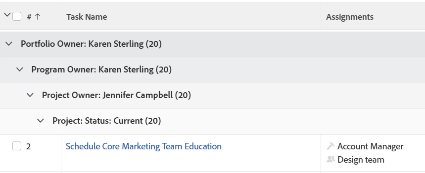

# Groepering: taakgroepering op vier niveaus voor eigenaar Portfolio, programmaeigenaar, projecteigenaar en projectstatus

<!--Audited: 10/2024-->

This task Grouping provides 4 levels of Grouping. In this case, tasks are grouped by Portfolio Owner, Program Owner, Project Owner, and Project Status. You can only have up to 3 levels of Grouping using the standard interface. To add a fourth level, you must use Text Mode. You cannot group reports by more than 4 criteria at the same time.

## Toegangsvereisten

+++ Breid uit om de toegangseisen voor de functionaliteit in dit artikel weer te geven. 

<table style="table-layout:auto"> 
 <col> 
 <col> 
 <tbody> 
  <tr> 
   <td role="rowheader">Adobe Workfront-pakket</td> 
   <td> 
Alle
 </td> 
  </tr> 
  <tr> 
   <td role="rowheader">Adobe Workfront-licentie</td> 
   <td> 
   
Bijdrager of verzoek om een filter te wijzigen 

   
Standaard of Plan om een rapport te wijzigen

  </tr> 
  <tr> 
   <td role="rowheader">Configuraties op toegangsniveau</td> 
   <td> 
Toegang tot rapporten, dashboards, kalenders bewerken om een rapport te wijzigen
 
Toegang tot filters, weergaven en groepen bewerken om een filter te wijzigen
 </td> 
  </tr> 
  <tr> 
   <td role="rowheader">Objectmachtigingen</td> 
   <td> 
Machtigingen beheren voor een rapport
  </td> 
  </tr> 
 </tbody> 
</table>

Voor meer detail over de informatie in deze lijst, zie [&#x200B; vereisten van de Toegang in de documentatie van Workfront &#x200B;](/help/quicksilver/administration-and-setup/add-users/access-levels-and-object-permissions/access-level-requirements-in-documentation.md).

+++

## Create a 4-level task Grouping for Portfolio Owner, Program Owner, Project Owner, and Project Status

Deze groep toepassen:

1. Ga naar een lijst met taken.
1. Van het **drop-down menu van de Groepering**, uitgezochte **Nieuwe Groepering**.

1. Klik **Schakelaar aan de Wijze van de Tekst**.
1. Remove the text in the **Group your Report** area.
1. Replace the text in the box displayed with the following code:
   <pre>group.0.linkedname=project group.0.name=Portfolio Owner group.0.notime=false group.0.valuefield=project:portfolio:owner:name group.0.valueformat=string group.1.linkedname=project group.1.name=Program Owner group.1.notime=false group.1.valuefield=project:program:owner:name group.1.valueformat=string group.2.linkedname=projectOwnerMM group.2.listgrouingparsedmethod=nested(project).nested(owner).string(name) group.2.namekey=projectownermm group.2.notime=false group.2.valuefield=projectOwnerMM:name group.2.valueformat=string group.3.enumclass=com.attask.common.constants.ProjectStatusEnum group.3.linkedname=project group.3.namekey=view.relatedcolumn group.3.namekeyargkey.0=project group.3.namekeyargkey.1=status group.3.notime=false group.3.valuefield=project:status group.3.valueformat=val</pre>

1. Click **Done**, then **Save Grouping**.
1. (Optional) Update the name for the grouping, then click **Save Grouping**.
