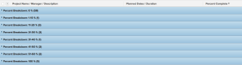

# Groeperen: uitsplitsing naar projectpercentage 2

In deze groepering van douaneproject, kunt u projecten tonen die door een waaier van hun percenten volledige waarden worden gegroepeerd. De onderverdelingen geven een percentage aan van de volledige waarde van stappen van 10 procentpunten: 0-10%, 11-20%, 21-30% enz.

De volgende groepering organiseert projecten door het percentage volledige waarde in één van deze groepen:

* 0%
* 1-10%
* 11-20%
* 21-30%
* 31-40%
* 41-50%
* 51-60%
* 61-70%
* 71-80%
* 81-90%
* 91-99%
* 100%

## Toegangsvereisten

U moet de volgende toegang hebben om de stappen in dit artikel uit te voeren:

<table style="table-layout:auto"> 
 <col> 
 <col> 
 <tbody> 
  <tr> 
   <td role="rowheader">Adobe Workfront-abonnement*</td> 
   <td> 
Alle
 </td> 
  </tr> 
  <tr> 
   <td role="rowheader">Adobe Workfront-licentie*</td> 
   <td> 
Verzoek om een groepering te wijzigen 

   
Plan om een rapport te wijzigen
 </td> 
  </tr> 
  <tr> 
   <td role="rowheader">Configuraties op toegangsniveau*</td> 
   <td> 
Toegang tot rapporten, dashboards, kalenders bewerken om een rapport te wijzigen
 
Toegang tot filters, weergaven en groepen bewerken om een groep te wijzigen
 
<b>OPMERKING</b>

Als u nog steeds geen toegang hebt, vraagt u de Workfront-beheerder of deze aanvullende beperkingen op uw toegangsniveau instelt. Voor informatie over hoe een beheerder van Workfront uw toegangsniveau kan wijzigen, zie <a href="../../../administration-and-setup/add-users/configure-and-grant-access/create-modify-access-levels.md" class="MCXref xref">Aangepaste toegangsniveaus maken of wijzigen</a>.
 </td>
</tr>  
  <tr> 
   <td role="rowheader">Objectmachtigingen</td> 
   <td> 
Rechten voor een rapport beheren
 
Voor informatie over het aanvragen van aanvullende toegang raadpleegt u <a href="../../../workfront-basics/grant-and-request-access-to-objects/request-access.md" class="MCXref xref">Toegang tot objecten aanvragen </a>.
 </td> 
  </tr> 
 </tbody> 
</table>

&#42;Neem contact op met uw Workfront-beheerder om te weten te komen welk plan, licentietype of toegang u hebt.

## Uitsplitsing naar projectpercentage per groep

Deze groep toepassen:

1. Ga naar een lijst met projecten.
1. Van de **Groepering** vervolgkeuzelijst, selecteert u **Nieuwe groepering**.

1. Klikken **Overschakelen naar tekstmodus**.
1. Verwijder de tekst in het vak en plak de volgende code in de beschikbare ruimte:
   <pre>group.0.linkedname=direct groep.0.name=Percent Break-down group.0.notime=false group.0.valueexpression=IF({percentComplete}=0,"0 %", IF({percentComplete}&lt;=11,"1-10 %", IF({percentComplete}&lt;=21,"11-20 %", IF({percentComplete}&lt;=31,"21-30 %", IF({percentComplete} &lt;41, "31-40 %", IF ({percentComplete}&lt;51, "41-50 %", IF ({percentComplete}&lt;61, "51-60 %", IF ({percentComplete}&lt;71, "61-70 %", IF ({percentComplete}&lt;81,"7 1-80 %", IF ({percentComplete}&lt;91, "81-90 %", IF ({percentComplete}&lt;100, "91-99 %", "100 %"))))) textmode=true</pre>

1. Klikken **Groepering opslaan**.
