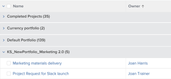

# Groeperen: de weergavenaam in een groep bewerken

<!--Audited: 01/2024-->

U kunt de namen van groepen wijzigen in iets wat de gebruikers beter bekend is.

Bijvoorbeeld, wanneer u de standaardPortfolio Naam groepering op een lijst van projecten toepast, verschijnt de naam van de groepering als *Portfolio: Naam:`<name of portfolio>`*.

U kunt deze groepering wijzigen in de tekstmodus om een naam weer te geven die beter leesbaar is.

## Toegangsvereisten

+++ Vouw uit om de toegangsvereisten voor de functionaliteit in dit artikel weer te geven. 

<table style="table-layout:auto"> 
 <col> 
 <col> 
 <tbody> 
  <tr> 
   <td role="rowheader">Adobe Workfront-pakket</td> 
   <td> 
Alle
 </td> 
  </tr> 
  <tr> 
   <td role="rowheader">Adobe Workfront-licentie</td> 
   <td> 
   
Medewerker of verzoek om een filter te wijzigen 

   
Standaard of Plan om een rapport te wijzigen

  </tr> 
  <tr> 
   <td role="rowheader">Configuraties op toegangsniveau</td> 
   <td> 
Toegang tot rapporten, dashboards en kalenders bewerken om een rapport te wijzigen
 
Toegang tot filters, weergaven en groepen bewerken om een filter te wijzigen
 </td> 
  </tr> 
  <tr> 
   <td role="rowheader">Objectmachtigingen</td> 
   <td> 
Machtigingen voor een rapport beheren
  </td> 
  </tr> 
 </tbody> 
</table>

Voor meer detail over de informatie in deze lijst, zie [ vereisten van de Toegang in de documentatie van Workfront ](/help/quicksilver/administration-and-setup/add-users/access-levels-and-object-permissions/access-level-requirements-in-documentation.md).

+++

## De weergavenaam in een groep bewerken

De weergavenaam in een projectgroep wijzigen:

1. Ga naar een lijst met projecten.
1. Van **het Groeperen** drop-down menu, uitgezochte **Nieuwe Groepering**.

1. Klik **toevoegen groepering**, en beginnen &quot;Naam van Portfolio&quot;in de **Groep te typen door:** gebied, dan selecteer het wanneer het in de lijst toont.

1. Klik **Schakelaar aan de Wijze van de Tekst**.
1. Voer een van de volgende handelingen uit:

   * Voeg de volgende code aan de bestaande tekst beschikbaar in de **Groep toe uw vakje van het Rapport**:

     `group.0.displayname=Your Value`

     Voeg bijvoorbeeld de volgende code toe om de weergavenaam te wijzigen in &quot;Portfolio&quot;:

     `group.0.displayname=Portfolio`

   * Verwijder alle regels in de tekstmodusinterface van de groep waarin het woord &quot;naam&quot; staat en voeg vervolgens de regel toe:

     `group.0.name=Your Value`

     Voeg bijvoorbeeld de volgende code toe om de weergavenaam te wijzigen in &quot;Portfolio&quot;:

     `group.0.name=Portfolio`

     >[!TIP]
     >
     >U kunt ook de regels `group.0.name=` en `group.0.displayname=` leeg laten. In dat geval wordt in de groep de waarde weergegeven waarop u groepeert.

     

1. Klik **Gedaan**, dan **sparen Groepering**.
1. (Facultatief) werk de groeperingsnaam bij, dan klik **sparen Groepering**.

   De standaardnaam voor de groepering wordt gewijzigd op basis van de gegevens in de tekstmodus.
