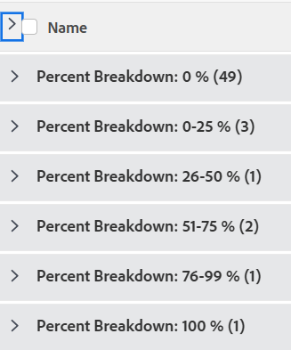

# Groepering: verdeling taakpercentage 1

<!--Audited: 10/2024-->

In deze groepering van douaneproject, kunt u projecten tonen die door een waaier van hun percenten volledige waarden worden gegroepeerd. De uitsplitsingen geven het percentage aan dat de volledige waarde is in stappen van 25 procentpunten: 0-25%, 25-50% enzovoort.

De volgende groepering organiseert taken door het percentage volledige waarde in 6 verschillende groepen:

* 0%
* 1-25%
* 26-50%
* 51-75%
* 76-99%
* 100%



## Toegangsvereisten

+++ Breid uit om de toegangseisen voor de functionaliteit in dit artikel weer te geven. 

<table style="table-layout:auto"> 
 <col> 
 <col> 
 <tbody> 
  <tr> 
   <td role="rowheader">Adobe Workfront-pakket</td> 
   <td> <p>Alle</p> </td> 
  </tr> 
  <tr> 
   <td role="rowheader">Adobe Workfront-licentie</td> 
   <td> 
   <p>Medewerker of verzoek om een filter te wijzigen </p>
   <p>Standaard of Plan om een rapport te wijzigen</p>
  </tr> 
  <tr> 
   <td role="rowheader">Configuraties op toegangsniveau</td> 
   <td> <p>Toegang tot rapporten, dashboards, kalenders bewerken om een rapport te wijzigen</p> <p>Toegang tot filters, weergaven en groepen bewerken om een filter te wijzigen</p> </td> 
  </tr> 
  <tr> 
   <td role="rowheader">Objectmachtigingen</td> 
   <td> <p>Machtigingen beheren voor een rapport</p>  </td> 
  </tr> 
 </tbody> 
</table>

Voor meer detail over de informatie in deze lijst, zie [&#x200B; vereisten van de Toegang in de documentatie van Workfront &#x200B;](/help/quicksilver/administration-and-setup/add-users/access-levels-and-object-permissions/access-level-requirements-in-documentation.md).

+++

## Uitsplitsing groep naar taakpercentage

Deze groep toepassen:

1. Ga naar een takenlijst.
1. Van **het Groeperen** drop-down menu, uitgezochte **Nieuwe Groepering**.
1. Klik **toevoegen groepering**.

1. Klik **Schakelaar aan de Wijze van de Tekst**.
1. Verwijder de tekst in de **Groep door** gebied.
1. Vervang de tekst door de volgende code:

   ```
   group.0.linkedname=direct
   group.0.name=Percent Breakdown
   group.0.notime=false
   group.0.valueexpression=IF({percentComplete}=0,"0 %",IF({percentComplete}<=26,"0-25 %",IF({percentComplete}<=51,"26-50 %",IF({percentComplete}<=76,"51-75 %",IF({percentComplete}<100,"76-99 %","100 %")))))
   group.0.valueformat=string
   ```

1. Klik **Gedaan** > **sparen Groepering**.
1. (Facultatief) werk de groeperingsnaam bij, dan klik **sparen Groepering**.
