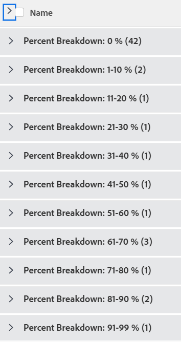

# Groepering: verdeling taakpercentage 2

<!--Audited: 10/2024-->

In deze aangepaste taakgroep kunt u taken weergeven die zijn gegroepeerd op een bereik van hun procentuele volledige waarden. De uitsplitsingen geven het percentage aan dat de volledige waarde is in stappen van 10 procentpunten: 1-10%, 11-20% enzovoort.

De volgende groepering organiseert projecten door het percentage volledige waarde in één van deze groepen:

* 0%
* 1-10%
* 11-20%
* 21-30%
* 31-40%
* 41-50%
* 51-60%
* 61-70%
* 71-80%
* 81-90%
* 91-99%
* 100%



## Toegangsvereisten

+++ Breid uit om de toegangseisen voor de functionaliteit in dit artikel weer te geven.

U moet de volgende toegang hebben om de stappen in dit artikel uit te voeren:

<table style="table-layout:auto"> 
 <col> 
 <col> 
 <tbody> 
  <tr> 
   <td role="rowheader">Adobe Workfront-plan</td> 
   <td> <p>Alle</p> </td> 
  </tr> 
  <tr> 
   <td role="rowheader">Adobe Workfront-licentie*</td> 
   <td> 
    <p>Nieuw:</p>
   <ul><li><p>Medewerker om een filter te wijzigen </p></li>
   <li><p>Standaard voor het wijzigen van een rapport</p></li> </ul>

<p>Huidige:</p>
   <ul><li><p>Verzoek om een filter te wijzigen </p></li>
   <li><p>Plan om een rapport te wijzigen</p></li> </ul></td> 
  </tr> 
  <tr> 
   <td role="rowheader">Configuraties op toegangsniveau</td> 
   <td> <p>Toegang tot rapporten, dashboards, kalenders bewerken om een rapport te wijzigen</p> <p>Toegang tot filters, weergaven en groepen bewerken om een filter te wijzigen</p> </td> 
  </tr> 
  <tr> 
   <td role="rowheader">Objectmachtigingen</td> 
   <td> <p>Machtigingen beheren voor een rapport</p>  </td> 
  </tr> 
 </tbody> 
</table>

*For informatie, zie [ vereisten van de Toegang in de documentatie van Workfront ](/help/quicksilver/administration-and-setup/add-users/access-levels-and-object-permissions/access-level-requirements-in-documentation.md).

+++

## Uitsplitsing groep naar taakpercentage

Deze groep toepassen:

1. Ga naar een takenlijst.
1. Van **het Groeperen** drop-down menu, uitgezochte **Nieuwe Groepering**.
1. Klik **toevoegen groepering**.

1. Klik **Schakelaar aan de Wijze van de Tekst**.
1. Verwijder de tekst in de **Groep door** gebied.
1. Vervang de tekst door de volgende code:

   ```
   group.0.linkedname=direct
   group.0.name=Percent Breakdown
   group.0.notime=false
   group.0.valueexpression=IF({percentComplete}=0,"0 %",IF({percentComplete}<=11,"1-10 %",IF({percentComplete}<=21,"11-20 %",IF({percentComplete}<=31,"21-30 %",IF({percentComplete}<41,"31-40 %",IF({percentComplete}<51,"41-50 %",IF({percentComplete}<61,"51-60 %",IF({percentComplete}<71,"61-70 %",IF({percentComplete}<81,"71-80 %",IF({percentComplete}<91,"81-90 %",IF({percentComplete}<100,"91-99 %","100 %")))))))))))
   textmode=true
   ```

1. Klik **Gedaan** > **sparen Groepering**.
1. (Facultatief) werk de groeperingsnaam bij, dan klik **sparen Groepering**.
