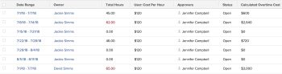

# Weergave: de kosten van overwerk berekenen in een tijdlijnweergave

<!--Audited: 11/2024-->

Overuren worden niet standaard berekend in Adobe Workfront, maar u kunt wel een rapport met een tijdlijnrapport maken dat overwerk berekent.

Als de gebruiker in zijn profiel aan een kostenpercentage per uur is gekoppeld, kunt u ook de hoeveelheid kosten voor de overuren van die gebruiker berekenen.\
Voor informatie over het associëren van gebruikers met Kosten per de tarieven van het Uur, zie het artikel [&#x200B; Mijn Montages &#x200B;](../../../workfront-basics/manage-your-account-and-profile/configuring-your-user-profile/configure-my-settings.md) vormen.

>[!NOTE]
>
>Het gebied van Overwerk dat u aan een mening van de Chronologie in een lijst of een rapport kunt toevoegen toont de informatie die op het gebied van Overuren van timesheet wordt gevonden. Deze informatie wordt manueel bijgewerkt door een gebruiker met toegang om timesheet te wijzigen. Voor meer informatie over het gebied van Overuren in een timesheet, zie het artikel [&#x200B; overzicht van de lay-out van de Tijdopnemer &#x200B;](../../../timesheets/timesheets/timesheet-layout.md).



## Toegangsvereisten

+++ Breid uit om de toegangseisen voor de functionaliteit in dit artikel weer te geven.

U moet de volgende toegang hebben om de stappen in dit artikel uit te voeren:

<table style="table-layout:auto"> 
 <col> 
 <col> 
 <tbody> 
  <tr> 
   <td role="rowheader">Adobe Workfront-plan</td> 
   <td> <p>Alle</p> </td> 
  </tr> 
  <tr> 
   <td role="rowheader">Adobe Workfront-licentie*</td> 
   <td> 
    <p>Nieuw:</p>
   <ul><li><p>Medewerker om een filter te wijzigen </p></li>
   <li><p>Standaard voor het wijzigen van een rapport</p></li> </ul>

<p>Huidige:</p>
   <ul><li><p>Verzoek om een filter te wijzigen </p></li>
   <li><p>Plan om een rapport te wijzigen</p></li> </ul></td> 
  </tr> 
  <tr> 
   <td role="rowheader">Configuraties op toegangsniveau</td> 
   <td> <p>Toegang tot rapporten, dashboards, kalenders bewerken om een rapport te wijzigen</p> <p>Toegang tot filters, weergaven en groepen bewerken om een filter te wijzigen</p> </td> 
  </tr> 
  <tr> 
   <td role="rowheader">Objectmachtigingen</td> 
   <td> <p>Machtigingen beheren voor een rapport</p>  </td> 
  </tr> 
 </tbody> 
</table>

*For informatie, zie [&#x200B; vereisten van de Toegang in de documentatie van Workfront &#x200B;](/help/quicksilver/administration-and-setup/add-users/access-levels-and-object-permissions/access-level-requirements-in-documentation.md).

+++

## De kosten voor overwerk berekenen in een tijdlijnweergave

U voegt als volgt een berekende kolom Overuren toe aan een tijdlijnweergave:

1. Ga naar een lijst met tijdbladen.

1. Klik het **drop-down menu van de Mening**, dan klik **Nieuwe Mening**.

1. Klik **toevoegen Kolom**.
1. Klik **Schakelaar aan de Wijze van de Tekst**, dan klik **uitgeven de Wijze van de Tekst**.
1. Op **geef de Wijze van de Tekst** vakje uit, verwijder de tekst in de doos, dan kopieer en kleef de volgende code van de tekstwijze:

   ```
   displayname=Calculated Overtime Cost
   linkedname=direct
   namekey=totalHours
   querysort=totalHours 
   textmode=true
   valueexpression=IF({totalHours}>40,({totalHours}-40)*{user}.{costPerHour},{totalHours}*{user}.{costPerHour})
   valueformat=currencyStringCurrencyRounded
   ```

   >[!NOTE]
   >
   >Deze berekening veronderstelt dat de gebruiker gewoonlijk een week van 40 uur werkt.

1. Klik **Gedaan**, dan noem de nieuwe mening en klik **sparen Mening** in een lijst van timesheets.

   De kosten van overwerk van elke gebruiker worden getoond in de **Berekende Kostprijs van Overwerk** kolom.


