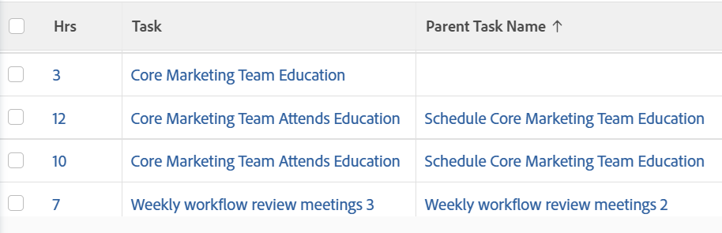

# Weergeven: uren met bovenliggende taakgegevens

In deze uurweergave ziet u de naam van de taak waarin de uren zijn vastgelegd, plus de naam van de bovenliggende taak.

## Toegangsvereisten

U moet de volgende toegang hebben om de stappen in dit artikel uit te voeren:

<table style="table-layout:auto"> 
 <col> 
 <col> 
 <tbody> 
  <tr> 
   <td role="rowheader">Adobe Workfront-abonnement*</td> 
   <td> 
Alle
 </td> 
  </tr> 
  <tr> 
   <td role="rowheader">Adobe Workfront-licentie*</td> 
   <td> 
Verzoek om een weergave te wijzigen 

   
Plan om een rapport te wijzigen
 </td> 
  </tr> 
  <tr> 
   <td role="rowheader">Configuraties op toegangsniveau*</td> 
   <td> 
Toegang tot rapporten, dashboards, kalenders bewerken om een rapport te wijzigen
 
Toegang tot filters, weergaven en groepen bewerken om een weergave te wijzigen
 
<b>OPMERKING</b>

Als u nog steeds geen toegang hebt, vraagt u de Workfront-beheerder of deze aanvullende beperkingen op uw toegangsniveau instelt. Voor informatie over hoe een beheerder van Workfront uw toegangsniveau kan wijzigen, zie <a href="../../../administration-and-setup/add-users/configure-and-grant-access/create-modify-access-levels.md" class="MCXref xref"> tot douanetoegangsniveaus </a> leiden of wijzigen.
 </td>
</tr>  
  <tr> 
   <td role="rowheader">Objectmachtigingen</td> 
   <td> 
Machtigingen beheren voor een rapport
 
Voor informatie bij het vragen van om extra toegang, zie <a href="../../../workfront-basics/grant-and-request-access-to-objects/request-access.md" class="MCXref xref"> de toegang van het Verzoek tot voorwerpen </a>.
 </td> 
  </tr> 
 </tbody> 
</table>

&#42; om te weten te komen welk plan, vergunningstype, of toegang u hebt, contacteer uw beheerder van Workfront.

## Uren weergeven met informatie over bovenliggende taken

1. Ga naar een lijst met uren.
1. Van het **drop-down menu van de Mening**, uitgezochte **Nieuwe Mening**.

1. In het **gebied van de Voorproef van de Kolom**, elimineer alle kolommen behalve één.
1. Klik de kopbal van de resterende kolom, dan klik **Schakelaar aan de Wijze van de Tekst**.
1. De muis over het gebied van de tekstwijze, en klikt **klikt om tekst** uit te geven.
1. Verwijder de tekst u in het **vakje van de Wijze van de Tekst** vindt, en vervang het met de volgende code:
   <pre>column.0.aggregator.displayformat=doubleAsString   column.0.aggregator.function=SUM   column.0.aggregator.namekey=hours   column.0.aggregator.valueField=hours   column.0.aggregator.valueFormat=doubleAsDouble   column.0.descriptionkey=hours   column.0.0 link.linkproperty.0.name=ID   column.0.link.linkproperty.0.valueField=ID   column.0.link.linkproperty.0.valueformat=int   column.0.link.lookup=link.view   column.0.link.valueField=objCode   column.0.link.valueformat=  column.0.linkedname=direct   column.0.listsort=doubleAsDouble (uren)   column.0.namekey=hours.abbr   column.0.querysort=hours   column.0.shortview=false   column.0.stretch=100   column.0.valueField=hours   column.0.valueformat=doubleAsString   column.0.width=150   column.1.descriptionkey=task   column.1.link.linkproperty.0.name=ID   column.1.link.linkproperty.0.value=task:ID   column.1.link.linkproperty.0.valueformat=int   column.1.link.lookup=link.view   column.1.link.valuefield=task:objCode   column.1.link.valueformat=val   column.1.linkedname=task  .1.listsort=nested (taak).string(naam)   column.1.namekey=task   column.1.querysort=task:name   column.1.shortview=false   column.1.stretch=0   column.1.valuefield=task:name   column.1.valuefefefefefex at=HTML   column.1.width=150   column.2.description=Parent Naam van de Taak   column.2.link.linkproperty.0.name=ID   column.2.link.linkproperty.0.valueField=task :parent: identiteitskaart   column.2.link.linkproperty.0.valuFormat=int   column.2.link.lookup=link.view   column.2.link.valueField=task:objCode   column.2.link.valueformat=val   column.2.linkedname=task   column.2.listsort=nested (taak:ouder).string)   6} column.2.name=Parent Naam van de Taak   column.2.querysort=task :parent: naam   column.2.shortview=false   column.2.stretch=0   column.2.valueField=task :parent: naam   column.2.valueformat=HTML   column.2.width=150</pre>

1. Klik **sparen Mening**.
