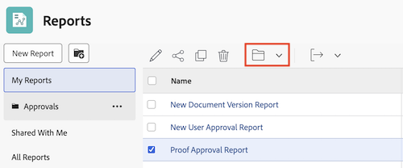

# Rapporten openen en ordenen

Met rapporten in Adobe Workfront kunt u informatie over objecten in het systeem bekijken of bewerken. U kunt uw eigen rapporten maken, de rapporten organiseren die u maakt en rapporten weergeven die met u zijn gedeeld of die openbaar zijn gedeeld.

## Toegangsvereisten

U moet de volgende toegang hebben om de stappen in dit artikel uit te voeren:

<table style="table-layout:auto"> 
 <col> 
 <col> 
 <tbody> 
  <tr> 
   <td role="rowheader">Adobe Workfront-abonnement*</td> 
   <td> 
Alle
 </td> 
  </tr> 
  <tr> 
   <td role="rowheader">Adobe Workfront-licentie*</td> 
   <td> 
Plan 
 </td> 
  </tr> 
  <tr> 
   <td role="rowheader">Configuraties op toegangsniveau*</td> 
   <td> 
Toegang tot rapporten, dashboards, kalenders bewerken
 
Toegang tot filters, weergaven, groepen bewerken
 
Opmerking: als u nog steeds geen toegang hebt, vraag dan aan de Workfront-beheerder of deze aanvullende beperkingen op uw toegangsniveau heeft ingesteld. Voor informatie over hoe een beheerder van Workfront uw toegangsniveau kan wijzigen, zie <a href="../../../administration-and-setup/add-users/configure-and-grant-access/create-modify-access-levels.md" class="MCXref xref"> tot douanetoegangsniveaus </a> leiden of wijzigen.
 </td> 
  </tr> 
  <tr> 
   <td role="rowheader">Objectmachtigingen</td> 
   <td> 
Machtigingen beheren voor een rapport
 
Voor informatie bij het vragen van om extra toegang, zie <a href="../../../workfront-basics/grant-and-request-access-to-objects/request-access.md" class="MCXref xref"> de toegang van het Verzoek tot voorwerpen </a>.
 </td> 
  </tr> 
 </tbody> 
</table>

&#42; om te weten te komen welk plan, vergunningstype, of toegang u hebt, contacteer uw beheerder van Workfront.

## Rapporten weergeven

Om tot rapporten toegang te hebben die u hebt gecreeerd of die met u gedeeld of openbaar gedeeld:

1. Van het **Belangrijkste Menu** , klik **Rapporten**.

1. Klik op een van de volgende opties, afhankelijk van het rapport dat u wilt weergeven:

   * Klik **Mijn Rapporten** om rapporten te bekijken die u hebt gecreeerd.
   * Klik **Gedeeld met me** om rapporten te bekijken die anderen met u hebben gedeeld.
   * Klik **Alle Rapporten** om zowel rapporten te bekijken die u en die hebt gecreeerd die met u of openbaar gedeeld zijn gedeeld.

## Rapporten organiseren die u maakt

U kunt mappen gebruiken om de rapporten te ordenen die u maakt. U kunt geen rapporten organiseren die met u zijn gedeeld, openbaar, of systeemrapporten zijn gedeeld.

* [&#x200B; creeer een nieuwe omslag voor rapporten &#x200B;](#create-a-new-folder-for-reports)
* [Rapporten toevoegen aan een map](#add-reports-to-a-folder)

### Nieuwe map maken voor rapporten {#create-a-new-folder-for-reports}

1. Van het **Belangrijkste Menu** , klik **Rapporten**.

1. Klik het **Nieuwe pictogram van de Omslag**.\
   

1. Geef een naam voor de nieuwe map op en druk op Enter.
1. Van de **Mijn omslag van Rapporten**, voeg rapporten aan de nieuwe omslag toe.\
   Voor informatie over het toevoegen van een rapport aan een nieuwe omslag, zie [&#x200B; rapporten aan een omslag &#x200B;](#add-reports-to-a-folder) sectie in dit artikel toevoegen.

   >[!NOTE]
   >
   >U kunt nieuwe omslagen aan **slechts toevoegen Mijn omslag van Rapporten**. U kunt geen nieuwe omslagen of rapporten aan **toevoegen die met me** of **worden gedeeld Alle omslagen van Rapporten**.

### Rapporten toevoegen aan een map {#add-reports-to-a-folder}

1. Van het **Belangrijkste Menu** , klik **Rapporten**.

1. Klik **Mijn Rapporten**.\
   of\
   Klik om het even welke die omslag onder **wordt genesteld Mijn die Rapporten** omslag.

1. Selecteer het rapport, dan klik het pictogram van de omslag  bij de bovenkant van de lijst.

1. Kies de map waaraan u het rapport wilt toevoegen.

   

   >[!NOTE]
   >
   >U kunt rapporten van **slechts bewegen Mijn die Rapporten** omslag aan andere die omslagen onder **worden genesteld Mijn Rapporten**. U kunt geen rapporten van of aan **bewegen met me** wordt gedeeld of **Alle Rapporten** omslag aan of van andere omslagen die.

