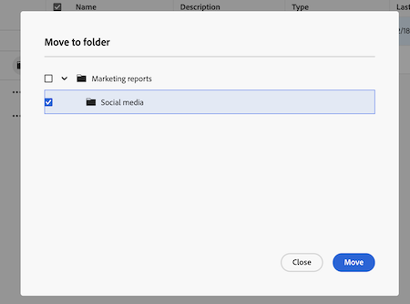

# Deelbare rapportmappen gebruiken

 de informatie op deze pagina verwijst naar functionaliteit nog niet algemeen beschikbaar. Het is beschikbaar slechts in het milieu van de Sandbox van de Voorproef.

<!-- This article is linked in the UI -->

U kunt deelbare rapportomslagen gebruiken om rapporten te organiseren en die omslagen met andere gebruikers te delen. Deze eigenschap wordt ontworpen voor teams die grote volumes van rapporten beheren en scalable, verenigbare toegangscontrole vereisen.

## Toegangsvereisten

+++ Breid uit om de toegangseisen voor de functionaliteit in dit artikel weer te geven. 

<table style="table-layout:auto"> 
 <col> 
 <col> 
 <tbody> 
  <tr> 
   <td role="rowheader">Adobe Workfront-pakket</td> 
   <td> 
Alle
 </td> 
  </tr> 
  <tr> 
   <td role="rowheader">Adobe Workfront-licentie</td> 
   <td> 
   
alle
 </td> 
  </tr> 
  <tr> 
   <td role="rowheader">Configuraties op toegangsniveau</td> 
   <td> 
Toegang tot rapporten, dashboards, kalenders bewerken
 
Toegang tot filters, weergaven, groepen bewerken
</td> 
  </tr> 
  <tr> 
   <td role="rowheader">Objectmachtigingen</td> 
   <td> 
Machtigingen beheren voor een rapport
</td> 
  </tr> 
 </tbody> 
</table>

Voor meer detail over de informatie in deze lijst, zie [&#x200B; vereisten van de Toegang in de documentatie van Workfront &#x200B;](/help/quicksilver/administration-and-setup/add-users/access-levels-and-object-permissions/access-level-requirements-in-documentation.md).

+++

## Mapmachtigingen begrijpen

De deelbare rapportomslagen gebruiken twee toestemmingsniveaus:

* **Mening**: De gebruikers kunnen rapporten in de omslag openen, maar zij kunnen omslagdetails uitgeven, geen punten toevoegen of verwijderen, of de omslag schrappen. U kunt gebruikers met de toegang van de Mening toestaan om de omslag te delen door **het Aandeel** toe te laten plaatsend wanneer u toegang verleent.
* **leidt**: De gebruikers kunnen omslagdetails uitgeven en rapportpunten toevoegen of bewegen. Ze krijgen ook beheertoegang tot rapporten in de map. U kunt gebruikers met Manage toegang toestaan om de omslag te delen of omslagen te schrappen door **Aandeel** toe te laten en **schrapt** montages wanneer u toegang verleent.

Aanvullend gedrag:

* Systeembeheerders kunnen alle mappen zien.
* Andere gebruikers zien alleen mappen waartoe ze toegang hebben.
* Machtigingen die zijn verleend aan een bovenliggende map, gelden voor alle submappen en rapporten in die mapstructuur.
* Gebruikers met toegang tot een submap kunnen de bovenliggende mappen voor navigatie zien, maar mappen op hetzelfde niveau alleen als er toegang is verleend.

## Een deelbare rapportmap maken

Alleen systeembeheerders kunnen mappen op hoofdniveau maken. Nadat een deelbare map is gemaakt, kunnen gebruikers met beheertoegang submappen maken.

{{step1-to-reports}}

1. Zet de **Aandeelbare rapportomslagen** knevel aan.
1. Klik **creeer omslag**.
1. Voer een naam in voor de map.
1. Klik **creëren**.

## Een submap maken in een deelbare rapportmap

U kunt tot 3 niveaus van subfolders binnen een shareable rapportomslag tot stand brengen. Submappen nemen machtigingen over van de bovenliggende map, maar u kunt ook unieke machtigingen voor elke submap instellen.

{{step1-to-reports}}

1. Zoek de map waarin u een submap wilt maken.
1. Klik **Meer** > **toevoegen subfolder**.
1. Voer een naam in voor de submap.
1. Klik **creëren**.

## Een rapportmap delen met andere gebruikers

Wanneer u een map deelt met gebruikers, overerven zij toegang tot alle submappen in die mappenstructuur.

{{step1-to-reports}}

1. Zoek de map die u wilt delen.
1. Klik **Meer** > **Aandeel**.
1. Voeg gebruikers, teams, rollen, groepen of bedrijven toe.
1. Kies **Mening** of **leiden** toegang:
   * Gebruikers kunnen rapporten openen in de map als ze toegang tot de weergave krijgen. U kunt gebruikers met de toegang van de Mening ook toestaan om de omslag opnieuw te delen door **Aandeel** in de extra montages te selecteren.
   * Gebruikers kunnen de toegang beheren om mapgegevens te bewerken en items toe te voegen of te verwijderen. U kunt gebruikers met Manage toegang ook toestaan om omslagen te schrappen of de omslag te delen door **Schrapping** en **Aandeel** in de extra montages te selecteren.
1. Klik **sparen**.

   

## Een rapport verplaatsen naar een deelbare map

Om een rapport in een omslag te bewegen, moet u **hebben leiden** rechten op zowel het rapport als de shareable omslag.

{{step1-to-reports}}

1. Schakel het selectievakje naast het rapport dat u wilt verplaatsen in.
1. Klik **Beweging aan omslag** in de actiebar bij de bodem van het scherm.
1. Vind de omslag u het rapport wilt bewegen aan, dan klik **Beweging**. De rapportboom wordt doen ineenstorten door gebrek, zodat kunt u de omslagen moeten uitbreiden om de bestemmingsomslag te vinden.

   

## Een deelbare rapportmap verwijderen

Wanneer u een map verwijdert, worden ook de submappen in die map verwijderd. U moet **hebben leidt** toegang tot de omslag om het te schrappen. De rapporten in de omslag worden niet geschrapt en kunnen nog in de belangrijkste rapportlijst worden gevonden.

De rapportmachtigingen die via de mapmachtigingen zijn verleend, worden verwijderd wanneer de map wordt verwijderd. De toestemmingen van het rapport die rechtstreeks van het rapport worden verleend of van een dashboard worden geërft blijven op zijn plaats.

{{step1-to-reports}}

1. Klik **Meer** > **Schrapping**.
1. Klik **ja, schrap het** om te bevestigen.

## Nieuwe lijstervaring voor deelbare mappen

Wanneer u deelbare mappen opent in het gebied Rapporten, ziet u een nieuwe lijstervaring waarmee u uw mappen en rapporten eenvoudig kunt weergeven en beheren. Voor meer informatie over de nieuwe lijstervaring, zie [&#x200B; Uitgebreide lijsten van het Gebruik &#x200B;](/help/quicksilver/workfront-basics/navigate-workfront/use-lists/enhanced-lists.md).

>[!NOTE]
>
>Geavanceerde velden worden niet ondersteund in de uitgebreide lijst. Als u met deze velden wilt werken, kunt u een rapport maken.
