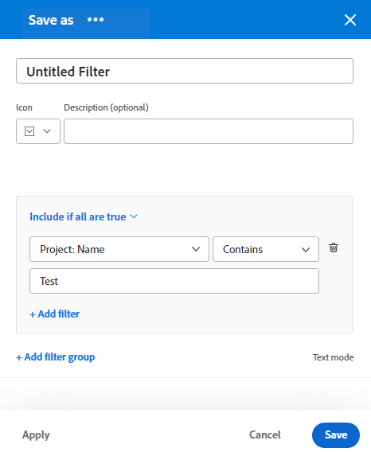
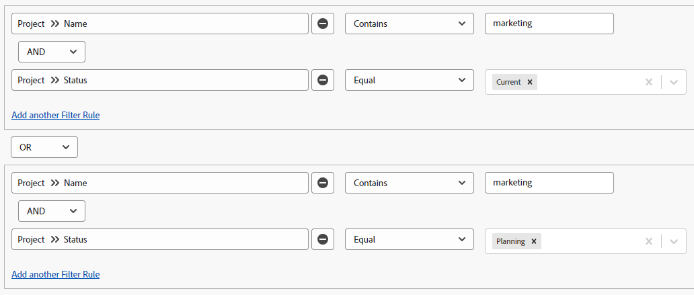

# Filters maken of bewerken in Adobe Workfront

<!-- Audited: 11/2024 -->

U kunt de hoeveelheid informatie beperken die u op het scherm weergeeft in een lijst met items met een filter. U kunt bepaalde criteria definiëren op basis van bepaalde gegevens over een object en alleen de objecten weergeven die aan deze criteria voldoen.

U kunt de volgende typen filters toepassen in Adobe Workfront:

* Snelle filters in een lijst met objecten om een item te zoeken met een trefwoord. Dit zijn tijdelijke filters die u niet kunt opslaan voor toekomstig gebruik.

  Voor informatie over snelle filters, zie [ de snelle filter op een lijst ](../../../workfront-basics/navigate-workfront/use-lists/apply-quick-filter-list.md) toepassen.

* Permanente filters die u kunt opslaan en meerdere keren kunt gebruiken in meerdere lijsten en rapporten. In dit artikel wordt beschreven hoe u een permanent filter kunt maken of een bestaand filter in een lijst of rapport kunt bewerken.

* Filters in andere gebieden van Workfront, buiten lijsten en rapporten.

  Voor een lijst van alle filters in Workfront en de gebieden waar u hen kunt toepassen, zie [ Overzicht van Filters ](../../../reports-and-dashboards/reports/reporting-elements/filters-overview.md).

## Toegangsvereisten

+++ Breid uit om de toegangseisen voor de functionaliteit in dit artikel weer te geven.

U moet de volgende toegang hebben om de stappen in dit artikel uit te voeren:

<table style="table-layout:auto"> 
 <col> 
 <col> 
 <tbody> 
  <tr> 
   <td role="rowheader"><strong>Adobe Workfront-abonnement*</strong></td> 
   <td> 
Alle
 </td> 
  </tr> 
  <tr> 
   <td role="rowheader"><strong>Adobe Workfront-licentie*</strong></td> 
   <td> 
      
Nieuw:

         <ul>
         <li>
Medewerker om een filter te wijzigen
</li>
         <li>
Standaard om een filter in een rapport te wijzigen
</li>
         </ul>
      
Huidige:

         <ul>
         <li>
Verzoek om een filter te wijzigen
</li>
         <li>
Plan om een filter in een rapport te wijzigen
</li>
         </ul>
   </td>
  </tr> 
  <tr> 
   <td role="rowheader"><strong>Configuraties op toegangsniveau*</strong></td> 
   <td> <ul><li>
Toegang tot filters, weergaven en groepen bewerken
</li></ul>

Om een filter in een rapport uit te geven, moet u de volgende configuratie van het toegangsniveau hebben, naast Edit toegang tot Filters, Weergaven, en Groepen:

<ul><li>
Toegang tot rapporten, dashboards en kalenders bewerken
</li></ul>   
   </td> 
  </tr> 
  <tr> 
   <td role="rowheader"><strong>Objectmachtigingen*</strong></td> 
   <td> 
Rechten voor een filter beheren
</td> 
  </tr> 
 </tbody> 
</table>

*For informatie, zie [ vereisten van de Toegang in de documentatie van Workfront ](/help/quicksilver/administration-and-setup/add-users/access-levels-and-object-permissions/access-level-requirements-in-documentation.md).

+++

## Typen filteropbouwinterfaces

U kunt filters tot stand brengen gebruikend de types van filterbouwers die in de hieronder lijst worden beschreven:

<table style="table-layout:auto">
<col>
<col>
<col>
<tbody>
<tr>
<td><strong>Het type Builder</strong></td>
<td><strong>Object Filter</strong></td>
<td><strong>Indien beschikbaar</strong></td>
</tr>
<tr>
<td>Standard builder</td>
<td>
<ul>
<li> 
Projecten
 </li>
<li> 
Taken 
 </li>
<li> 
Problemen
 </li>
<li> 
Portfolio's
 </li>
<li> 
Programma's
 </li>
<li> 
Gebruikers
 </li>
<li> 
Sjablonen
 </li>
<li> 
Groepen
 </li>
</ul>
</td>
<td>
<ul>
<li> 
Lijsten 
 </li>
</ul>
<ul>
<li> 
De lijst van Projecten in de Planner van het Scenario
 
Voor de Scenario Planner is een aanvullende licentie vereist. Voor informatie over de Planner van het Scenario van Workfront, zie <a href="../../../scenario-planner/scenario-planner-overview.md"> het overzicht van de Planner van het Scenario </a>. 
 </li>
</ul>

<b>OPMERKING:</b>
 
Standaardbuilders voor filters zijn niet beschikbaar in rapporten.
</td>
</tr>
<tr>
<td>Verouderde bouwer</td>
<td>Alle objecten </td>
<td>Lijsten en rapporten</td>
</tr>
</tbody>
</table>

Voor informatie over de voorwerpen van Workfront, zie [ voorwerpen in Adobe Workfront ](/help/quicksilver/workfront-basics/navigate-workfront/workfront-navigation/understand-objects.md) begrijpen.

Houd rekening met het volgende wanneer u filters maakt met behulp van de verschillende interfaces:

* U kunt de standaardbuilder vinden op dezelfde plaatsen als waar u de oudere filterinterface vindt voor de gebieden die in de bovenstaande tabel worden vermeld.
* De standaard builder is de standaardeigenschap voor alle gebieden waar het beschikbaar is. Om aan de bouwer van de erfenisfilter over te schakelen, klik **Meer** menu naast [!UICONTROL **Filters**] en selecteer [!UICONTROL **Ga terug naar Oudere Filters**].

  

* Opgeslagen filters zijn beschikbaar in beide builders, ongeacht welke ervaring u gebruikte om ze oorspronkelijk te bouwen. Als u bijvoorbeeld een filter hebt gemaakt met de verouderde builder, kunt u dit ook vinden en wijzigen in de standaardbuilderinterface.

  >[!TIP]
  >
  >Een filter &quot;Alle&quot; wordt niet opgenomen in de standaardbuilder, omdat alle lijstitems worden weergegeven wanneer er geen filters worden toegepast. Klik [!UICONTROL **ontruimen allen**] op het hoogste recht van de bouwer om het even welke actieve filters te ontruimen en alle punten te tonen. Als [!UICONTROL **ontruim allen**] wordt gedimd, dan worden geen filters toegepast.

* De standaard en erfenisbouwers hebben een lichtjes verschillende syntaxis wanneer het bouwen van veelvoudige-instructiefilters die EN en OF exploitanten combineren. Hierdoor kunnen deze filters anders worden weergegeven wanneer u overschakelt van de ene naar de andere builder.

  >[!INFO]
  >
  >Het volgende scenario bestaat:
  >
  >1. Met de standaardbuilder kunt u een filter maken met de volgende syntaxis:
  >
  >      `(A OR B) AND C`
  >
  >1. De schakelaar aan de erfenisbouwer en geeft de filter uit gebruikend de syntaxis van de erfenisbouwer zoals die in de sectie [ wordt beschreven leidt tot of geeft een filter in de erfenisbouwer ](#create-filter-in-legacy-builder) in dit artikel uit. In de syntaxis voor de verouderde builder worden de filterinstructies als volgt weergegeven:
  >
  >      `A AND C`
  >      `OR`
  >      `B AND C`
  >
  >1. Wijzig het filter in de oudere interface.
  >1. Ga terug naar de standaardbuilder. De filterinstructie wordt weergegeven volgens de logica die wordt ondersteund in de verouderde builder, zoals hierboven beschreven.
  >
  >      Het filter wordt als volgt weergegeven in de standaardbuilderinterface:
  >  
  >      `A AND C`
  >      `OR`
  >      `B AND C`
  > 
  >      Dit gebeurt omdat het filter is gewijzigd in de oudere interface.

## Een filter maken of bewerken in de standaardbuilder

U kunt op de volgende manieren filters maken met de standaardbuilderinterface:

* Van kras
* Een bestaand filter bewerken
* Een bestaand filter dupliceren
* Een bestaand filter dupliceren, bewerken en opslaan als een nieuw filter

Maak een filter met de standaardbuilderinterface:

1. Ga naar een lijst waar u een filter wilt tot stand brengen of die het filter bevat u wilt aanpassen.
1. Klik het **pictogram van de Filter** pictogram  om de bouwerinterface te openen.

   

1. Bekijk de volgende lijsten met filters:

   <table style="table-layout:auto">
   <col>
   <col>
   <tbody>
   <tr>
   <td role="rowheader"><strong>Favoriet</strong></td>
   <td>Filters die u als favorieten hebt gemarkeerd. Wanneer u een filter favoriete, wordt de originele plaats getoond onder de filternaam, en het wordt verborgen van de originele lijst tenzij u het als favoriet verwijdert.</td>
   </tr>
   <tr>
   <td role="rowheader"><strong>Opgeslagen</strong></td>
   <td>Filters die u zelf hebt gemaakt en opgeslagen. In deze lijst worden standaard opgeslagen filters weergegeven in de volgorde van de laatst opgeslagen filters, maar u kunt de filternamen slepen om de lijst handmatig opnieuw te rangschikken.</td>
   </tr>
   <tr>
   <td role="rowheader"><strong>Standaardwaarden systeem</strong></td>
   <td>De standaardfilters van het systeem van Workfront, en filters die de beheerder van Workfront aan uw lijst van filters, of op het systeemniveau of in uw lay-outmalplaatje toevoegde.</td>
   </tr>
   <tr>
   <td role="rowheader"><strong>Gedeeld met mij</strong></td>
   <td>Filters die anderen met u hebben gemaakt en gedeeld of die op het hele systeem worden gedeeld.</td>
   </tr>
   </tbody>
   </table>

1. Voer een van de volgende handelingen uit:

   * Klik **Nieuwe filter** om een filter van kras tot stand te brengen.
   * Beweeg over een bestaand filter dat u toestemmingen hebt om te leiden en **te klikken geeft** pictogram  uit om het uit te geven.

     of

     Beweeg over een bestaand filter dat u toestemmingen hebt om te bekijken, **Meer** menu  te klikken Meer menu, en **te klikken dupliceert** om de bestaande filter te kopiëren en een exemplaar uit te geven.

   

1. (Voorwaardelijk) Afhankelijk van het feit of u objecten wilt zoeken die overeenkomen met alle instructies in een filtergroep of een van de instructies in een filtergroep, kunt u een van de volgende opties selecteren:

   <table style="table-layout:auto">
   <col>
   <col>
   <tbody>
   <tr>
   <td role="rowheader"><strong>Opnemen als alles waar is</strong></td>
   <td>De objecten die door het filter worden gevonden, moeten overeenkomen met alle filtercriteria in een filtergroep. In dit geval, worden de filterverklaringen verbonden door de exploitant AND. Dit is de standaardselectie.</td>
   </tr>
   <tr>
   <td role="rowheader"><strong>Opnemen indien van toepassing</strong></td>
   <td>De objecten die door het filter worden gevonden, moeten overeenkomen met alle filtercriteria in een filtergroep. In dit geval worden de filterinstructies verbonden door de operator OR.</td>
   </tr>
   </tbody>
   </table>

   

   Voor meer informatie over filterexploitanten, zie [ Overzicht van Filters ](/help/quicksilver/reports-and-dashboards/reports/reporting-elements/filters-overview.md).

1. Klik op het vervolgkeuzemenu met velden om een lijst weer te geven met onlangs gebruikte velden en stel velden voor waarop u wilt filteren. De voorgestelde velden worden momenteel weergegeven in de lijst waarop u filtert.

   U kunt ook selecteren **doorbladert gebieden** om een lijst van alle gebieden te bekijken u door kunt filtreren. De velden in de geavanceerde zoekopdracht worden gegroepeerd op objectcategorie.

    te filtreren

1. Klik op de vervolgkeuzelijst met opties om een optie te selecteren. De standaardbepaling is &quot;evenaart.&quot;

   Voor meer informatie, zie [ Filter en voorwaardenbepalingen ](/help/quicksilver/reports-and-dashboards/reports/reporting-elements/filter-condition-modifiers.md).

   >[!TIP]
   >
   >Terwijl u het filter maakt, worden de resultaten direct in de lijst weergegeven. Als het filterdeelvenster de lijst bedekt, kunt u deze sluiten om de weergave te zien. De informatie die u hebt ingevoerd, blijft in de builder staan wanneer u het deelvenster opnieuw opent.

1. Typ de waarde van een veld waarop u wilt filteren. Typ bijvoorbeeld de naam van een uitgave als u op `Issue:Name` wilt filteren. Selecteer de waarde wanneer deze in de lijst wordt weergegeven.

   >[!TIP]
   >
   >Afhankelijk van de optie die u hebt geselecteerd, kunt u meerdere waarden selecteren.

1. Klik **filter** toevoegen om een ander gebied te selecteren voeg een het filtreren criteria aan de filterverklaring toe.
1. (Facultatief) klik het **pictogram van de Schrapping  om bestaande filterverklaringen te verwijderen.**

   of

   Klik **ontruimen allen** om alle het filtreren criteria te ontruimen.

1. (Facultatief) klik **toevoegen filtergroep** om een andere reeks het filtreren criteria toe te voegen. De standaardexploitant tussen de reeksen is **EN**. Klik de exploitant om het in **OF** te veranderen.

   >[!TIP]
   >
   >Wellicht wilt u een andere filtergroep gebruiken wanneer u de groepen via een andere operator wilt laten verbinden dan de operator in een filterinstructie.

   >[!INFO]
   >
   >Wanneer u filtert voor projecten die &quot;marketing&quot;in de naam bevatten die of niet volledig zijn en niet op Greep zijn, kunt u de volgende veelvoudige filtergroepen gebruiken:
   >`(Project: Name Contains Marketing AND Project: Percent Complete Does not equal 100)`
   >`OR`
   >`(Project: Name Contains Marketing AND Project: Status Does not equal On Hold)`
   >In dit geval, wordt elke filterverklaring verbonden door EN, en de filtergroepen worden verbonden door OF.

1. (Facultatief) klik **wijze van de Tekst** om verder bouwend de filter gebruikend tekstwijze.

   

   De interface van de tekstmodus wordt geopend.

   

   >[!TIP]
   >
   >We raden u aan zoveel mogelijk van het filter te maken met de standaardbuilderinterface en alleen tekstmodus te gebruiken wanneer u de filters moet wijzigen die alleen in de tekstmodus worden ondersteund.

   Voor meer informatie over het creëren van een filter gebruikend de interface van de tekstwijze, zie [ een filter uitgeven gebruikend tekstwijze ](/help/quicksilver/reports-and-dashboards/reports/text-mode/edit-text-mode-in-filter.md).

1. Klik **de tekstwijze van de Uitgang** om aan de standaard bouwerinterface terug te keren.

   >[!WARNING]
   >
   >Sommige instructies in de tekstmodus worden niet ondersteund in de standaardbuilder of de oudere interface. Als u de tekstmodus afsluit wanneer u deze typen instructies hebt gemaakt, wordt mogelijk een waarschuwingsbericht gegenereerd.

1. (Optioneel) Klik op **Toepassen** om het filter toe te passen op de lijst en de resultaten te zien.

   Als het filter geen resultaten oplevert, is de lijst leeg.

1. Klik **sparen als nieuw** om de filter voor toekomstig gebruik te bewaren.

   

1. Selecteer **Naamloze Filter** en typ in plaats daarvan de naam van de nieuwe filter.

   >[!TIP]
   >
   >Geef het filter een naam, zodat u het later kunt vinden. Als u het filter geen naam geeft, wordt het filter Naamloos filter in het systeem genoemd.

1. Selecteer een pictogram voor de nieuwe filter van het **drop-down menu van het Pictogram**.

   

1. (Optioneel) Voeg een beschrijving van het filter toe om aan te geven wat er uniek aan is. De beschrijving wordt onder de filternaam in de lijst met filters weergegeven.

   >[!TIP]
   >
   >Het klikken **annuleert** op elk ogenblik neemt u terug naar het gebied van de filterbouw.

1. Klik **sparen**. Het filter wordt opgeslagen in de lijst Opgeslagen en wordt toegepast op de lijst met items.
1. (Facultatief) om een filter naar de Favoriete lijst te bewegen, over om het even welk filter in de filterlade te bewegen en het **pictogram van de Favoriet  te klikken Favoriete.**

   of

   Beweeg over om het even welk filter in de filterlade, klik het Meer menu , en klik **Favoriet**.

1. (Optioneel) Klik op de knop **Stapelfilters** om gestapelde filters te activeren. Met deze optie kunt u meerdere opgeslagen filters toepassen. De filterregels worden toegepast in de volgorde waarin u ze selecteert.

   >[!TIP]
   >
   >Er is geen limiet voor het aantal filters dat u kunt selecteren.
   >
   >Wanneer u meerdere filters selecteert, moet tegelijkertijd aan alle bijbehorende voorwaarden worden voldaan om overeenkomende resultaten weer te geven.

   

   Het aantal filters dat u hebt geselecteerd, wordt weergegeven naast het filterpictogram boven aan de lijst met items.

   

1. (Optioneel) Voer een van de volgende handelingen uit:

   * Deel het filter met anderen of maak het systeembreed beschikbaar. Voor meer informatie, zie [ een filter, mening, of groepering ](/help/quicksilver/reports-and-dashboards/reports/reporting-elements/share-filter-view-grouping.md) delen.

   * Verwijder het filter als het niet meer geldig is of als het niet meer gedupliceerd is. U kunt alleen filters verwijderen die u bezit. U kunt filters verwijderen die met u zijn gedeeld. Voor informatie, zie [ filters, meningen, en groeperingen ](/help/quicksilver/reports-and-dashboards/reports/reporting-elements/remove-filters-views-groupings.md) verwijderen.

## Een filter maken of bewerken in de verouderde builder {#create-filter-in-legacy-builder}

U kunt oudere filters op de volgende manieren maken in lijsten en rapporten:

* Van kras
* Een bestaand filter bewerken en opslaan als een nieuw filter

Ongeacht de methode die u gebruikt om filters te maken, lijkt het alsof u een geheel nieuw filter maakt of een bestaand filter gebruikt.

1. Ga naar een lijst of een rapport die het filter bevat dat u wilt aanpassen.
1. Klik het **pictogram van de Filter  pictogram van de Filter** &lbrace;, dan klik het **Meer** pictogram  en klik **Ga terug naar Verouderde Filters**.

   >[!TIP]
   >
   >De rapportmaker moet ervoor zorgen dat filters worden bewerkt om de vervolgkeuzelijst Filter in een rapport te kunnen bekijken. Het filter Standaard rapporteren wordt standaard toegepast op een rapport. Het filter Standaard rapporteren kan alleen worden aangepast wanneer u het rapport bewerkt.

1. Klik op **+ Nieuw filter** boven aan de lijst met filters.

   of

   Beweeg over de filter die u wilt wijzigen en **klikken geeft** pictogram  uit.

   De builder voor het aanpassen van de filterlanceringen.

1. Voer een van de volgende handelingen uit:

   * Wijzig bestaande filterregels door op de bestaande regel te klikken en een nieuwe optie te selecteren.
   * Voeg een filterregel toe door **te klikken voeg een andere Regel van de Filter** toe, begin het typen van de naam van de optie waarvoor u een regel in het **Begin toe te voegen typt gebiedsnaam** vakje, dan het wanneer het in de drop-down lijst verschijnt.

     De gebieden verbonden aan het voorwerp van uw filter zijn vermeld in het **Begin typend gebiedsnaam** vakje.

   * Klik **EN** OF **OF** wanneer het toevoegen van een filterregel.\
     Wanneer het toevoegen van filterregels, gebruik de filterbepalingen om de voorwaarde van uw filter te vestigen. Voor meer informatie over filterbepalingen, zie [ Filter en voorwaardenbepalingen ](../../../reports-and-dashboards/reports/reporting-elements/filter-condition-modifiers.md).

     >[!NOTE]
     >
     >Wanneer u een groep EN verklaringen door veelvoudige OF verklaringen verbindt, moet u de gebieden herhalen die niet tussen OF verklaringen voor elke groep verklaringen veranderen.
     >
     >
     >
     >Wanneer u een filter voor taken bouwt die het woord &quot;marketing&quot;bevatten en in projecten met een status van Huidige of Planning zijn, moet u de volgende filterregels hebben:
     >
     >`Task: Name Contains Marketing`
     >`AND`
     >`Project: Status Equals Current`
     >`OR`
     >`Task: Name Contains Marketing`
     >`AND`
     >`Project: Status Equals Planning`
     >
     >Hoewel de Taak: Naam bevat &quot;marketing&quot;verandert niet tussen de twee EN filtergroepen, moet het in de tweede groep worden herhaald.

   * Verwijder een bestaande filterregel door op het pictogram X te klikken.

1. (Facultatief) klik **Schakelaar aan de Wijze van de Tekst** om een filter toe te voegen gebruikend de interface van de Wijze van de Tekst.

   Voor meer informatie over het creëren van een filter gebruikend de interface van de tekstwijze, zie [ een filter uitgeven gebruikend tekstwijze ](../../../reports-and-dashboards/reports/text-mode/edit-text-mode-in-filter.md).

1. Klik **sparen Filter** om een filter tot stand te brengen of geselecteerde te vervangen met uw veranderingen.

   of

   Klik **sparen als Nieuwe Filter** om een nieuw filter van geselecteerde tot stand te brengen.

   Het nieuwe filter wordt weergegeven in de lijst met filters en wordt automatisch toegepast op de lijst of het rapport dat u hebt geselecteerd.

1. (Optioneel) Voer een van de volgende handelingen uit:

   * U kunt filters delen die u met andere gebruikers maakt, of deze in het hele systeem beschikbaar maken. Voor informatie, zie [ een filter, mening, of groepering ](/help/quicksilver/reports-and-dashboards/reports/reporting-elements/share-filter-view-grouping.md) delen.
   * Verwijder de filters die u niet meer in de lijst wilt weergeven. Voor informatie, zie [ filters, meningen, en groeperingen ](/help/quicksilver/reports-and-dashboards/reports/reporting-elements/remove-filters-views-groupings.md) verwijderen.

