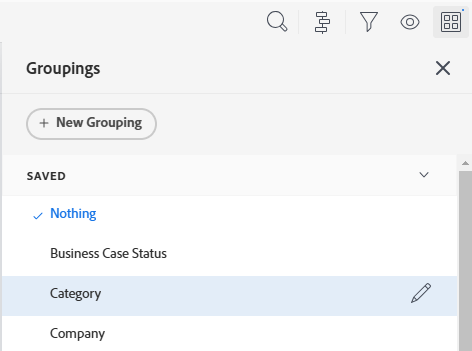

# Bestaande groepen bewerken

<!--

(NOTE: This is the third part of a former artcle split in 3: two how-tos and one refernece article about creating and customizing groupings)

-->

U kunt een bestaande groep aanpassen die u oorspronkelijk hebt gemaakt of die met u is gedeeld. Vervolgens kunt u de groep opslaan als een nieuwe groep.

## Toegangsvereisten

U moet de volgende toegang hebben om de stappen in dit artikel uit te voeren:

<table style="table-layout:auto"> 
 <col> 
 <col> 
 <tbody> 
  <tr> 
   <td role="rowheader"><strong>Adobe Workfront-abonnement*</strong></td> 
   <td> 
Alle
 </td> 
  </tr> 
  <tr> 
   <td role="rowheader"><strong>Adobe Workfront-licentie*</strong></td> 
   <td> 
Aanvraag of hoger 
 </td> 
  </tr> 
  <tr> 
   <td role="rowheader"><strong>Configuraties op toegangsniveau*</strong></td> 
   <td> 
Toegang tot filters, weergaven, groepen bewerken
 
Toegang tot rapporten, dashboards, kalenders bewerken om een groep in een rapport te bewerken
 
Opmerking: als u nog steeds geen toegang hebt, vraag dan aan de Workfront-beheerder of deze aanvullende beperkingen op uw toegangsniveau heeft ingesteld. Voor informatie over hoe een beheerder van Workfront uw toegangsniveau kan wijzigen, zie <a href="../../../administration-and-setup/add-users/configure-and-grant-access/create-modify-access-levels.md" class="MCXref xref"> tot douanetoegangsniveaus </a> leiden of wijzigen.
 </td> 
  </tr> 
  <tr> 
   <td role="rowheader"><strong>Objectmachtigingen</strong></td> 
   <td> 
Rechten beheren voor een rapport om een groep in een rapport te bewerken
 
Rechten voor een groep beheren 
 
Voor informatie bij het vragen van om extra toegang, zie <a href="../../../workfront-basics/grant-and-request-access-to-objects/request-access.md" class="MCXref xref"> de toegang van het Verzoek tot voorwerpen </a>.
 </td> 
  </tr> 
 </tbody> 
</table>

&#42; om te weten te komen welk plan, vergunningstype, of toegang u hebt, contacteer uw beheerder van Workfront.

## Vereisten

U moet een groep maken voordat u deze kunt bewerken.

Voor informatie bij het creëren van een groepering, zie [ groepen in Adobe Workfront ](../../../reports-and-dashboards/reports/reporting-elements/create-groupings.md) creëren.

## Procedure

1. Ga naar een lijst met objecten die de groepering bevat die u wilt aanpassen.
1. Klik het **Groeperen** pictogram.
1. Selecteer de groepering die u wilt aanpassen, dan klik **uitgeven** pictogram.

   

   De interfacebouwer voor het aanpassen van de groepering opent.

1. In de **sectie van de Voorproef van de Groepering**, klik **Voeg Groepering** toe om te bepalen hoe u informatie in het rapport wilt worden georganiseerd. Hieronder ziet u een voorbeeld van hoe de groep er in het rapport uitziet.

1. Typ de naam van het veld dat de manier aangeeft waarop u de gegevens in het rapport wilt indelen en klik vervolgens op de naam wanneer deze wordt weergegeven in de vervolgkeuzelijst.
1. (Facultatief en voorwaardelijk) wanneer het bekijken van een bijgewerkte lijst, uitgezochte **Vouw deze groepering door gebrek** samen als u de resultaten in de groepering wilt doen ineenstorten eerder dan uitgevouwen tonen. Deze instelling is standaard uitgeschakeld en de resultaten van de groepering worden altijd weergegeven in de uitgevouwen lijst.

   Voor informatie over bijgewerkte en erfenislijsten, zie de sectie &quot;het verschil tussen bijgewerkte en erfenislijsten&quot;in artikel [ begonnen worden met lijsten in Adobe Workfront ](../../../workfront-basics/navigate-workfront/use-lists/view-items-in-a-list.md).

   <!--
   
(NOTE: the tips repeat in the Create grouping article and Common uses of text mode)

   -->

   >[!TIP]
   >
   >* Wanneer u groepen handmatig aanpast wanneer u een lijst weergeeft, onthoudt Workfront uw handmatige voorkeur totdat u zich afmeldt. Wanneer u zich weer aanmeldt, wordt de lijst weergegeven volgens deze instelling.
   >* De resultaten van een groepering tonen altijd uitgevouwen na de toegang tot hen van een grafiekelement of in een erfenislijst. In deze gevallen wordt deze instelling genegeerd.

1. Herhaal stap 4, 5 en 6 om extra groepen te definiëren.\
   U kunt maximaal drie groepen definiëren voor het ordenen van informatie. U kunt uw gegevens verder ordenen met maximaal vier groepen door een matrixrapport te maken. Voor meer informatie over matrixrapporten, zie [ een matrixrapport ](../../../reports-and-dashboards/reports/creating-and-managing-reports/create-matrix-report.md) creëren.

1. Klik **sparen als Nieuwe Groepering** om de huidige groepering met uw veranderingen te vervangen.
