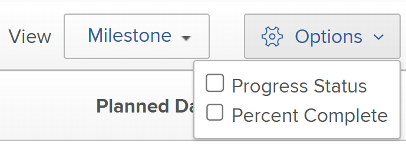

# De milestone-weergave gebruiken

U kunt de mening van de Mijlpaal op een projectlijst of een rapport toepassen.

Voordat u de milestone-weergave kunt gebruiken, moeten de mijlpalen zijn geconfigureerd, moeten de milestone-paden aan projecten worden toegevoegd en moeten de mijlpalen worden gekoppeld aan taken, zoals beschreven in de artikelen [Een milestone-pad maken](../../../administration-and-setup/customize-workfront/configure-approval-milestone-processes/create-milestone-path.md) en [Mijlpalen koppelen aan taken](../../../manage-work/tasks/manage-tasks/associate-milestones-with-tasks.md).

De mening van de Mijlpaal is beschikbaar wanneer het bekijken van een projectlijst of een projectrapport. De volgende secties beschrijven om de milestone mening te bekijken en te gebruiken.

## Toegangsvereisten

U moet de volgende toegang hebben om de stappen in dit artikel uit te voeren:

<table style="table-layout:auto"> 
 <col> 
 </col> 
 <col> 
 </col> 
 <tbody> 
  <tr> 
   <td role="rowheader"><strong>Adobe Workfront-abonnement*</strong></td> 
   <td> 
Alle
 </td> 
  </tr> 
  <tr> 
   <td role="rowheader"><strong>Adobe Workfront-licentie*</strong></td> 
   <td> 
Werk of hoger 
 </td> 
  </tr> 
  <tr> 
   <td role="rowheader"><strong>Configuraties op toegangsniveau*</strong></td> 
   <td> 
Toegang tot rapporten, dashboards, kalenders weergeven of vergroten
 
<b>OPMERKING</b>

Als u nog steeds geen toegang hebt, vraagt u de Workfront-beheerder of deze aanvullende beperkingen op uw toegangsniveau instelt. Voor informatie over hoe een beheerder van Workfront uw toegangsniveau kan wijzigen, zie <a href="../../../administration-and-setup/add-users/configure-and-grant-access/create-modify-access-levels.md" class="MCXref xref">Aangepaste toegangsniveaus maken of wijzigen</a>.
 </td>
</tr> 
  <tr> 
   <td role="rowheader"><strong>Objectmachtigingen</strong></td> 
   <td> 
De toestemmingen van de mening op een projectrapport om de mening van de Mijlpaal op een rapport toe te passen
 
Voor informatie over het aanvragen van aanvullende toegang raadpleegt u <a href="../../../workfront-basics/grant-and-request-access-to-objects/request-access.md" class="MCXref xref">Toegang tot objecten aanvragen </a>.
 </td> 
  </tr> 
 </tbody> 
</table>

&#42;Neem contact op met uw Workfront-beheerder om te weten te komen welk plan, licentietype of toegang u hebt.

## Overschakelen naar de milestone-weergave {#switch-to-the-milestone-view}

1. Ga naar de lijst van projecten of naar het projectrapport dat de mijlpalen bevat u wilt bekijken.
1. Klik op de knop **Weergave** vervolgkeuzemenu en vervolgens op **Mijlsteen**.

   De lijst of het rapport wordt weergegeven in een Mijlsteenweergave.

   Zie de sectie voor informatie over de mijlpaalweergave [Overzicht van de mijlpaalweergave](#milestone-view-overview) in dit artikel.

## Overzicht van de mijlpaalweergave {#milestone-view-overview}

De mening van de Mijlpaal is beschikbaar op projectlijsten en projectrapporten. In deze weergave kunt u snel alle mijlpalen weergeven die zijn gekoppeld aan taken binnen de projecten die u bekijkt.

>[!NOTE]
>
>De milestone-weergave is niet beschikbaar in de volgende gebieden:
>* Tijdschema&#39;s, in de projectlijst wanneer het toevoegen van een project.

Voor informatie over hoe te om op de mening van de Mijlpaal over te schakelen, zie de sectie [Overschakelen naar de milestone-weergave](#switch-to-the-milestone-view) in dit artikel.

### Fragmenten uit de Mijlsteenweergave

Wanneer het toepassen van de mening van de Mijlpaal op een lijst van projecten, tonen de projecten in de volgende secties:

* De projecten die met een Weg van de Mijlpaal worden geassocieerd worden eerst getoond, die onder de naam van hun respectieve Wegen van de Mijlsteen worden vermeld.

   Workfront sorteert de projecten in de eerste sectie aan de volgende criteria, in deze orde:

   1. Mijlpad-id. U kunt identiteitskaart van de Weg van de Mijlpaal in een rapport van de Weg van de Mijlpaal bekijken.

   2. Het gebied selecteerde als eerste sorterend gebied voor de projectlijst in de mening eerder toegepast op de projectlijst, alvorens u de mening van de Mijlpaal selecteerde.

* De projecten niet verbonden aan een vertoning van de Weg van Milestobe daarna, in de Niet toegewezen sectie. Workfront sorteert de projecten in de Unassiged sectie door het gebied dat als eerste sorterend gebied voor de projectlijst in de mening eerder op de projectlijst wordt toegepast, alvorens u de mening van de Mijlpaal selecteerde.

### Projectinformatie in de milestone-weergave

Wanneer het bekijken van een projectlijst of een projectrapport in de mening van de Mijlpaal, is de volgende informatie beschikbaar:

* **Geplande datums of geprojecteerde datums:** Geef op of u geplande datums of geprojecteerde datums wilt weergeven in de milestone-weergave.\
   Datums worden weergegeven voor het begin en de voltooiing en voor elke mijlpaal in het pad van de mijlpaal.\
   Als u Geplande Datums bekijkt en u hebt ook Manage toegang tot het project, kunt u de volgende data direct van de mening van de Mijlpaal uitgeven: (Als u Geprojecteerde datums weergeeft, kunnen de datums niet worden bewerkt omdat de geprojecteerde datums worden berekend en niet handmatig kunnen worden gewijzigd.)

   * **Begindatums van project:** Als een project van de Datum van het Begin gepland is, kunt u de Datum van het Begin van het project manueel veranderen, en de Datum van de Voltooiing wordt dan berekend.
   * **Voltooiingsdata van project:** Als een project van de Datum van de Voltooiing gepland is, kunt u de Datum van de Voltooiing van het project manueel veranderen, en de Datum van het Begin wordt dan berekend.
   * **Voltooiingsdatums taak:** U kunt Voltooiing voor taken rechtstreeks vanuit de Mijlsteenweergave handmatig bijwerken.

* **Percentage voltooid:** Toont het voltooiingspercentage van elke taak en project.\
   U kunt de weergave van het voltooiingspercentage uitschakelen, zoals wordt beschreven in de sectie [Vorm welke informatie in de mening van de Mijlpaal toont](#configure-what-information-displays-in-the-milestone-view) in dit artikel.\
   U kunt het voltooiingspercentage rechtstreeks vanuit de milestone-weergave aanpassen, zoals wordt beschreven in de sectie [Percentage van voltooiing aanpassen voor taken in de weergave Mijlpaal](#adjust-percent-complete-for-tasks-in-the-milestone-view) in dit artikel.

* **Taakstatuspictogrammen:** Er wordt een statuspictogram weergegeven naast elk project en elke taak in de Mijlsteenweergave.

   * Op tijd\
      

   * Achter\
      

   * Risico\
      

   * Late\
      
   U kunt de weergave van deze statuspictogrammen uitschakelen, zoals beschreven in de sectie [Vorm welke informatie in de mening van de Mijlpaal toont](#configure-what-information-displays-in-the-milestone-view) in dit artikel.\
   Raadpleeg het artikel voor meer informatie over elk statustype [Overzicht van status voortgang van taak](../../../manage-work/tasks/task-information/task-progress-status.md).

* **Taakstatusarcering voor voltooide taken**: Nadat een taak is gemarkeerd als Voltooid, wordt de achtergrond van de taak gearceerd weergegeven in de milestone-weergave om aan te geven of de taak op tijd of te laat is voltooid:

   * **Rode arcering voor taakkolom**: De achtergrond van een taak is rood als de status van de voortgang is **Late**.

   * **Groene arcering voor taakkolom**: De achtergrond van een taak is groen wanneer de status van de voortgang is **Op tijd**.

* **Projectstatusschaduw voor de kolommen Start en Voltooiing van het project**:

   * **Beginkolom project**: De achtergrond van de kolom van het Begin van het Project is rood of groen slechts wanneer de Ware Datum van het Begin wordt bevolkt:

      * **Rode arcering voor de kolom Start van project**: De achtergrond van de kolom van het Begin van het Project is rood wanneer de Voortgangsstatus van het project is **Late**.

      * **Groene arcering voor de kolom Start van project**: De achtergrond van de kolom van het Begin van het Project is groen wanneer de Voortgangsstatus van het project is **Op tijd**.
   * **Kolom Projectvoltooiing**: De achtergrond van de kolom Voltooiing van project is rood of groen slechts wanneer de Ware Datum van Voltooiing wordt bevolkt:

      * **Rode arcering voor de kolom Voltooien van project**: De achtergrond van de kolom van de Voltooiing van het Project is rood wanneer de Voortgangsstatus van het project is **Late**.

      * **Groene arcering voor de kolom Projectvoltooiing**: De achtergrond van de kolom van de Voltooiing van het Project is groen wanneer de Voortgangsstatus van het project is **Op tijd**.
   * Er wordt geen kleurschaduw toegewezen aan de kolommen Start en Voltooiing wanneer de taken de status Voortgang hebben van Op risico of Achter.

   

* **Projectnaam**: De projectnaam wordt getoond met een verbinding aan het project.
* **Pictogram Projectvoorwaarde**: Een pictogram wordt getoond naast de projectnaam, die op de voorwaarde van het project wijst.

## Vorm welke informatie in de mening van de Mijlpaal toont {#configure-what-information-displays-in-the-milestone-view}

U kunt vormen of de volgende elementen in de mening van de Mijlpaal worden getoond:

* Pictogrammen voor de voortgangsstatus
* Percentage voltooide projecten en taken

Door gebrek, de pictogrammen van de projectstatus en het percentage voltooide van projecten tonen.

Wijzigingen die u aanbrengt in deze opties, zijn alleen op u van toepassing. andere gebruikers worden niet beïnvloed. De wijzigingen die u aanbrengt, blijven behouden wanneer u zich opnieuw aanmeldt bij Adobe Workfront.

Om te vormen of de pictogrammen van de projectstatus en voltooiingspercentage van projecten tonen:

1. Ga naar de lijst van projecten of naar het projectrapport dat de mijlpalen bevat u wilt bekijken.
1. Klik op de knop **Weergave** vervolgkeuzemenu en vervolgens op **Mijlsteen**.\
   Als u een lijst van projecten binnen een Portfolio of een Programma bekijkt, selecteer **Mijlsteen** subtab.

1. Klikken **Opties** in de rechterbovenhoek van de milestone-weergave.\
   

1. Selecteer een van de volgende opties:

   <table style="table-layout:auto"> 
    <col> 
    <col> 
    <tbody> 
     <tr> 
      <td role="rowheader">Voortgangsstatus</td> 
      <td> 
Selecteer deze optie om statuspictogrammen voor de voortgang weer te geven naast elk project en elke taak.
 
Deze optie is standaard ingeschakeld.
 </td> 
     </tr> 
     <tr> 
      <td role="rowheader">Percentage voltooid</td> 
      <td> 
Selecteer deze optie om het voltooiingspercentage naast elk project en elke taak weer te geven.
 
Deze optie is standaard ingeschakeld.
 </td> 
     </tr> 
    </tbody> 
   </table>

## Percentage van voltooiing aanpassen voor taken in de weergave Mijlpaal {#adjust-percent-complete-for-tasks-in-the-milestone-view}

U kunt het percentage Voltooien aanpassen voor taken in de mening van de Mijlpaal. U kunt het percentage niet aanpassen dat is voltooid voor een bovenliggende taak (een taak die subtaken bevat).

Om het percentage aan te passen volledig voor een taak in de mening van de Mijlpaal:

1. Ga naar de lijst van projecten of naar het projectrapport dat de mijlpalen bevat u wilt bekijken.
1. Klik op de knop **Weergave** vervolgkeuzemenu en vervolgens op **Mijlsteen**.

1. (Voorwaardelijk) Als de voltooiingspercentages niet worden weergegeven in de Mijlsteenweergave, klikt u op **Opties** in de rechterbovenhoek van de Milestone-weergave en zorg er vervolgens voor dat **Percentage voltooid** is ingeschakeld.

1. Klik op het voltooiingspercentage onder een taak, geef een nieuw percentage op en druk op Enter.
