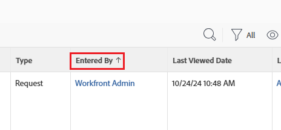

# Aan de slag met rapporten

<!-- Audited: 12/2023 -->

Rapporten geven inzicht in wat er met gebruikers en het werk gebeurt. Met rapporten kunt u informatie over objecten weergeven in Adobe Workfront.

Voor informatie over het begrip van voorwerpen en hoe zij in de toepassing van Workfront kunnen worden gemeld, zie [&#x200B; de objecten van Adobe Workfront overzicht &#x200B;](../../../workfront-basics/navigate-workfront/workfront-navigation/understand-objects.md).

## Rapportelementen

Rapporten zijn een combinatie van de volgende drie elementen in Workfront:

<table style="table-layout:auto"> 
 <col> 
 <col> 
 <tbody> 
  <tr> 
   <td role="rowheader">Weergave</td> 
   <td> <li>Bepaalt de kolommen in uw rapport en welke informatie u in elke kolom kunt omvatten.</li> <li>Voor informatie over meningen, zie <a href="../../../reports-and-dashboards/reports/reporting-elements/views-overview.md" class="MCXref xref"> Overzicht van Meningen in Adobe Workfront </a>.</li> </td> 
  </tr> 
  <tr> 
   <td role="rowheader">Groepering</td> 
   <td> <li>Hiermee categoriseert u informatie op basis van een gemeenschappelijke informatie en geeft u de resultaten van het rapport onder koppen weer.</li> <li>Voor informatie over groeperingen, zie <a href="../../../reports-and-dashboards/reports/reporting-elements/groupings-overview.md" class="MCXref xref"> Overzicht van Groepen in Adobe Workfront </a>.</li> </td> 
  </tr> 
  <tr> 
   <td role="rowheader">Filter</td> 
   <td> <li>Bepaalt de hoeveelheid informatie die in een rapport wordt weergegeven.</li> <li>Voor informatie over filters, zie <a href="../../../reports-and-dashboards/reports/reporting-elements/filters-overview.md" class="MCXref xref"> Overzicht van Filters </a>.</li> <li>Voor informatie over filterbepalingen, zie <a href="../../../reports-and-dashboards/reports/reporting-elements/filter-condition-modifiers.md" class="MCXref xref"> Filter en voorwaardenbepalingen </a>.</li> <li>U kunt filteren door vervangingen te gebruiken, om uw filters algemener te maken en hen meer flexibiliteit van gebruik te geven.</li> <li>Voor informatie over het gebruiken van vervangingen in filters, zie <a href="../../../reports-and-dashboards/reports/reporting-elements/understand-wildcard-filter-variables.md" class="MCXref xref"> de filtervariabelen van de Vervanging </a>.</li> </td> 
  </tr> 
 </tbody> 
</table>

>[!NOTE]
>
>Wanneer u een nieuw filter, een nieuwe weergave of een nieuwe groepering in een lijst selecteert, blijft die selectie behouden, zelfs als u zich afmeldt bij Workfront of uw browser sluit.

Voor informatie over rapportelementen, zie [&#x200B; Rapporterende elementen: filters, meningen, en groeperingen &#x200B;](../../../reports-and-dashboards/reports/reporting-elements/reporting-elements-filters-views-groupings.md).

Om uw rapporten te verbeteren, kunt u de volgende elementen toevoegen:

* Een grafiek: een visuele weergave van de resultaten in uw rapport.\
  Voor informatie over grafiekrapporten, zie [&#x200B; een grafiek aan een rapport &#x200B;](../../../reports-and-dashboards/reports/creating-and-managing-reports/add-chart-report.md) toevoegen.

* Een matrixgroepering: vat de informatie van het rapport in een bijeengevoegde lijstformaat samen.\
  Voor informatie over matrixrapporten, zie [&#x200B; een matrixrapport &#x200B;](../../../reports-and-dashboards/reports/creating-and-managing-reports/create-matrix-report.md) creëren.

* Een vraag: een open filter dat u kunt aanpassen en toepassen verschillend telkens als u het rapport in werking stelt.\
  Voor informatie over herinneringen, zie [&#x200B; een herinnering aan een rapport &#x200B;](../../../reports-and-dashboards/reports/creating-and-managing-reports/add-prompt-report.md) toevoegen.

Wanneer het bouwen van een rapport, kunt u om het even welk van deze elementen individueel in de rapportbouwer wijzigen.

Een andere manier om de relevantie van de informatie in uw rapporten te verbeteren, is door voorwaardelijke opmaak toe te passen op uw weergaven. Voor informatie over het gebruiken van voorwaardelijke het formatteren, zie [&#x200B; Voorwaardelijk het gebruiken formatteren in meningen &#x200B;](../../../reports-and-dashboards/reports/reporting-elements/use-conditional-formatting-views.md).

## Systeemrapporten

Workfront biedt verschillende systeemrapporten die standaard in uw systeem worden geladen.\
Na het invoeren van informatie in uw systeem kunt u deze rapporten gebruiken om de informatie visueel weer te geven.

Voor meer informatie over hoe te om tot systeemrapporten toegang te hebben en welke systeemrapporten beschikbaar zijn, zie [&#x200B; ingebouwde rapporten van Adobe Workfront van het Gebruik &#x200B;](../../../reports-and-dashboards/reports/using-built-in-reports/use-workfront-built-in-reports.md).

## Rapporten maken

Naast de systeemrapporten die Workfront levert, kunt u ook uw eigen aangepaste rapporten maken die voldoen aan de behoeften van uw organisatie.

Als u een rapport wilt maken, kunt u een van de volgende handelingen uitvoeren:

* Maak een volledig nieuw rapport.
* Kopieer een bestaand rapport.

  U moet minstens toestemming van de Mening hebben om een rapport te kopiëren dat door iemand anders wordt gecreeerd. Voor meer informatie over het kopiëren van een rapport, zie [&#x200B; een exemplaar van een rapport &#x200B;](../../../reports-and-dashboards/reports/creating-and-managing-reports/create-copy-report.md) creëren.

Voor informatie over het creëren van rapporten, zie [&#x200B; een douanerapport &#x200B;](/help/quicksilver/reports-and-dashboards/reports/creating-and-managing-reports/create-custom-report.md) creëren.

### Vereisten voor het maken van rapporten {#prerequisites-for-creating-reports}

* U moet een Standard- of Plan-licentie hebben om uw eigen rapporten te maken.

  Voor informatie over de de licentietypen van Workfront, zie [&#x200B; Overzicht van Vergunningen &#x200B;](../../../administration-and-setup/add-users/access-levels-and-object-permissions/wf-licenses.md) voor de huidige vergunningen, en [&#x200B; het Nieuwe vergunningsoverzicht &#x200B;](/help/quicksilver/administration-and-setup/add-users/how-access-levels-work/licenses-overview.md) voor de nieuwe vergunningen.

* Uw Workfront-beheerder moet u toegang geven tot Rapporten bewerken op uw Toegangsniveau.

  Voor informatie over het verlenen van toegang tot Edit rapporten, zie [&#x200B; Toegang verlenen tot rapporten, dashboards, en kalenders &#x200B;](../../../administration-and-setup/add-users/configure-and-grant-access/grant-access-reports-dashboards-calendars.md).

* Uw Workfront-beheerder moet u toegang geven tot Filters, Weergaven en Groepen bewerken in uw toegangsniveau.

  Voor informatie over het verlenen van toegang tot Edit filters, meningen, en groeperingen, zie [&#x200B; toegang van de Verlening tot filters, meningen, en groeperingen &#x200B;](../../../administration-and-setup/add-users/configure-and-grant-access/grant-access-fvg.md).

* U moet één object definiëren waarover u wilt rapporteren. Rapporten zijn objectspecifiek in Workfront en u moet eerst een objecttype selecteren voordat u het rapport kunt gaan samenstellen. U kunt alleen rapporteren over objecten die beschikbaar zijn in de Workfront-interface.

### Eigendom rapporteren {#report-ownership}

Wanneer u een rapport in Workfront creeert, wordt u de standaardeigenaar van het rapport en het toont in uw Mijn sectie van Rapporten. U kunt de eigenaar van een rapport niet wijzigen.

Wanneer u een rapport kopieert, wordt u automatisch de eigenaar van het gekopieerde rapport.
Voor informatie bij het kopiëren van rapporten, zie [&#x200B; een exemplaar van een rapport &#x200B;](../../../reports-and-dashboards/reports/creating-and-managing-reports/create-copy-report.md) creëren.

U kunt zien wie een rapport bezit door **te herzien ingegaan door** gebied.

### Rapporten maken in de builderinterface {#create-reports-in-the-builder-interface}

Wij adviseren dat u de interface van het rapportgebouw eerst gebruikt om een nieuw rapport te bouwen. De interface biedt een gestroomlijnde reeks hulpmiddelen aan die u door het samenstellen van elementen lopen om het gewenste rapport tot stand te brengen. U hebt objecten en velden die u kunt selecteren in lijsten en toevoegen aan alle rapportelementen.\
Voor meer informatie over het creëren van rapporten in de interface van het rapportgebouw, zie [&#x200B; een douanerapport &#x200B;](../../../reports-and-dashboards/reports/creating-and-managing-reports/create-custom-report.md) creëren.

Voor een lijst van voorwerpen die u kunt melden, zie het [&#x200B; Rapport over voorwerpen &#x200B;](../../../workfront-basics/navigate-workfront/workfront-navigation/understand-objects.md#report-on-objects) sectie in het artikel [&#x200B; de voorwerpen van Adobe Workfront overzicht &#x200B;](../../../workfront-basics/navigate-workfront/workfront-navigation/understand-objects.md).

Voor meer informatie over de gebieden die u in rapporten kunt tonen, zie [&#x200B; Verklarende woordenlijst van de terminologie van Adobe Workfront &#x200B;](../../../workfront-basics/navigate-workfront/workfront-navigation/workfront-terminology-glossary.md).

### Rapporten maken in de tekstmodus {#create-reports-in-text-mode}

Mogelijk kunt u bepaalde velden in de builderinterface niet vinden, maar deze zijn wel beschikbaar in de API.\
Voor informatie over welke gebieden in API beschikbaar zijn, zie de artikel [&#x200B; API Ontdekkingsreiziger &#x200B;](../../../wf-api/general/api-explorer.md).

Voor informatie over hoe te om de API Ontdekkingsreiziger te gebruiken, zie het artikel [&#x200B; Gebruikend de API Ontdekkingsreiziger &#x200B;](../../../wf-api/general/using-api-explorer.md).

>[!NOTE]
>
>U kunt niet in de interface van Workfront op voorwerpen rapporteren die niet beschikbaar in de rapportbouwer zijn. Nochtans, kunt u over gebieden rapporteren verbonden aan de voorwerpen in de rapportbouwer als die gebieden door API beschikbaar zijn. Hiervoor moet u de interface Tekstmodus gebruiken.

Met de Tekstmodus kunt u complexere weergaven, filters, groepen en aanwijzingen maken door het mogelijk te maken velden te gebruiken die niet beschikbaar zijn in de standaardmodusinterface.

#### terminologie voor tekstmodus {#text-mode-terminology}

U moet een specifieke syntaxis gebruiken om de interface van de Wijze van de Tekst van Workfront te gebruiken.

Voor meer details over de syntaxis van Workfront voor tekstwijze, zie [&#x200B; overzicht van de de wijzesyntaxis van de Tekst &#x200B;](../../../reports-and-dashboards/reports/text-mode/text-mode-syntax-overview.md).

#### Berekende kolommen, voorwaardelijke opmaak en andere toepassingen van de tekstmodus {#calculated-columns-conditional-formatting-and-other-uses-of-text-mode}

Buiten de rapportage over velden die niet beschikbaar zijn in de builderinterface, kunt u de Tekstmodus gebruiken om berekeningen of vergelijkingen tussen bepaalde velden weer te geven.

Voor een lijst van het gemeenschappelijkste gebruik van de Wijze van de Tekst in een rapport, zie [&#x200B; Overzicht van gemeenschappelijk gebruik voor de Wijze van de Tekst &#x200B;](../../../reports-and-dashboards/reports/text-mode/understand-common-uses-text-mode.md).

Voor informatie over het omvatten van berekende douanegegevens in rapporten, zie [&#x200B; Berekende douanegegevens in rapporten &#x200B;](../../../reports-and-dashboards/reports/calc-cstm-data-reports/calculated-custom-data-reports.md).

Voor informatie over het vergelijken van gebieden in voorwaardelijk het formatteren, zie [&#x200B; gebieden in voorwaardelijk het formatteren &#x200B;](../../../reports-and-dashboards/reports/text-mode/compare-fields-conditional-formatting.md) vergelijken.

In rapporten kunt u ook naar verzamelingsvelden verwijzen met de tekstmodus.\
Voor informatie over het gebruiken van de Wijze van de Tekst om inzamelingsinformatie in een rapport te tonen, zie [&#x200B; inzamelingen van de Verwijzing in een rapport &#x200B;](../../../reports-and-dashboards/reports/text-mode/reference-collections-report.md).

#### Voorbeelden van tekstmodi {#text-mode-samples}

We hebben een bibliotheek met voorbeelden van de meest gebruikte weergaven, filters en groepen die u kunt maken met de tekstmodus.

Om deze bibliotheek te doorbladeren en sommige steekproeven te gebruiken wij aanbieden, zie de artikel [&#x200B; mening van de Douane, filter, en groeperende steekproeven: artikelindex &#x200B;](../../../reports-and-dashboards/reports/custom-view-filter-grouping-samples/custom-view-filter-grouping-samples.md).

## De tabbladen van een verslag

Een rapport kan verscheidene lusjes bevatten wanneer u het rapport in de interface in werking stelt.

Voor informatie over het runnen van een rapport, zie het artikel [&#x200B; in werking stellen een rapport &#x200B;](../../../reports-and-dashboards/reports/creating-and-managing-reports/run-report.md).

Op elk lusje, toont de informatie u in het rapport in lichtjes verschillende formaten omvat. Kies de indeling die het best aansluit bij de behoeften van uw organisatie.

U kunt om het even welk lusje tot het standaardlusje van het rapport maken. Het standaardlusje is het eerste lusje dat toont wanneer u de naam van een rapport klikt om het te openen, en het is het lusje dat toont wanneer u het rapport op een dashboard plaatst.

### Tabblad Details {#details-tab}

Het lusje van Details van een rapport toont het voorwerp van de rapporten en de attributen die u voor dat voorwerp in een lijstvorm kiest. Elk rapport heeft een tabblad Details.

>[!IMPORTANT]
>
>De informatie in het lusje van Details kan verschillend van het lusje van de Grafiek tonen dat op uw tijdzone wordt gebaseerd.\
>Bijvoorbeeld, voltooide een gebruiker in Californië een taak bij 9 :30 pm PST op 12 Februari. Wanneer een gebruiker in New York een rapport bekijkt dat deze taakvoltooiing omvat, toont de Ware Datum van de Voltooiing als Februari 13 in zowel het lusje van Details als de details van de Grafiek omdat het om 12 :30 am EST op 13 Februari werd voltooid. Nochtans, in de grafiek, is het inbegrepen in de 12 van Februari groepering tot u het grafiekelement uitbreidt.

### Tabblad Samenvatting {#summary-tab}

Rapporten die een groepering bevatten, hebben een tabblad Overzicht.

Dezelfde informatie die wordt weergegeven in de vorm van een lijst op het tabblad Details, wordt samengevat en samengevoegd op basis van de groepen in het rapport op het tabblad Overzicht.

Voor informatie over groeperingen, zie [&#x200B; Overzicht van Groepen in Adobe Workfront &#x200B;](../../../reports-and-dashboards/reports/reporting-elements/groupings-overview.md).

### Het tabblad Matrix {#matrix-tab}

Rapporten die een Matrixgroepering bevatten, hebben een tabblad Matrix.

Dezelfde informatie die op het tabblad Details in de lijstindeling wordt weergegeven, wordt weergegeven in een tabelindeling, gegroepeerd op de groepen in het rapport op het tabblad Matrix.

Wanneer u een Matrix-groepering toevoegt aan een rapport, wordt het tabblad Samenvatting vervangen door het tabblad Matrix.

Voor informatie over de bouw van een Groepering van de Matrijs, zie het artikel [&#x200B; een matrixrapport &#x200B;](../../../reports-and-dashboards/reports/creating-and-managing-reports/create-matrix-report.md) creëren.

### Tabblad Diagram {#chart-tab}

Rapporten met een diagram hebben een tabblad Diagram.

Overweeg een grafiek in uw rapporten op te nemen voor onechte dashboards voor uw managers. Grafieken zijn een beknopte manier om de informatie in een rapport weer te geven. U kunt een grafiekelement uitbreiden door het te klikken om de punten te tonen inbegrepen in dat element.

>[!IMPORTANT]
>
>Wanneer u een grafiekelement klikt, kan de uitgebreide informatie verschillend van de grafiek tonen die op uw tijdzone wordt gebaseerd.\
>Bijvoorbeeld, voltooide een gebruiker in Californië een taak bij 9 :30 pm PST op 12 Februari. Wanneer een gebruiker in New York een rapport bekijkt dat deze taakvoltooiing omvat, toont de Ware Datum van de Voltooiing als Februari 13 in zowel het lusje van Details als de details van de Grafiek omdat het om 12 :30 am EST op 13 Februari werd voltooid. Nochtans, in de grafiek, is het inbegrepen in de 12 van Februari groepering tot u het grafiekelement uitbreidt.

Voor informatie over de bouw van een rapport met een grafiek, zie het artikel [&#x200B; een grafiek aan een rapport &#x200B;](../../../reports-and-dashboards/reports/creating-and-managing-reports/add-chart-report.md) toevoegen.

### Tabblad Vragen {#prompts-tab}

Rapporten met een vraag hebben een tabblad Vragen.

Een herinnering staat u toe om een filter aan een rapport toe te voegen telkens als u het rapport in werking stelt. Wanneer u een herinnering aan het rapport toevoegt, wordt het lusje van Vragen automatisch het standaardlusje van het rapport. Dit kan niet worden gewijzigd in een ander tabblad.

Voor informatie over de bouw van een herinnering voor een rapport, zie het artikel [&#x200B; een herinnering aan een rapport &#x200B;](../../../reports-and-dashboards/reports/creating-and-managing-reports/add-prompt-report.md) toevoegen.

## Rapporten delen

Nadat u een rapport hebt gemaakt, kunt u het rapport delen met andere gebruikers.

### Het delen toestemmingen aan een rapport geven {#give-sharing-permissions-to-a-report}

U kunt een andere gebruiker toestemming geven om een rapport dat u maakt, weer te geven of te beheren. U kunt een andere gebruiker een machtigingsniveau geven dat gelijk is aan of lager is dan dat van u. U kunt een rapport ook openbaar maken gebruikend het delen toestemmingen. Voor informatie over het delen van een rapport, zie [&#x200B; een rapport in Adobe Workfront &#x200B;](../../../reports-and-dashboards/reports/creating-and-managing-reports/share-report.md) delen.

### Een rapportlevering plannen {#schedule-a-report-delivery}

U kunt een rapport voor levering plannen. De gebruikers u het rapport met deelt ontvangen een e-mail met een gehechtheid van de rapportresultaten. De bijlage kan de volgende notaties hebben:

* HTML
* PDF
* Excel
* .TSV

Voor informatie over het plannen van een rapportlevering, zie [&#x200B; de leveringsoverzicht van het Rapport &#x200B;](../../../reports-and-dashboards/reports/creating-and-managing-reports/set-up-report-deliveries.md).

### De resultaten van een rapport exporteren {#export-the-results-of-a-report}

U kunt de resultaten van een rapport exporteren naar de volgende bestandsindelingen:

* PDF
* Excel (.xls en .xlsx formaten)
* Door tabs gescheiden

Voor informatie over het uitvoeren van de resultaten van een rapport, zie [&#x200B; gegevens van de Uitvoer &#x200B;](../../../reports-and-dashboards/reports/creating-and-managing-reports/export-data.md).

Nadat het rapport naar een van deze indelingen is geëxporteerd, kunt u het rapport delen met andere gebruikers door het als bijlage te e-mailen of af te drukken.

### Een rapport toevoegen aan een dashboard {#add-a-report-to-a-dashboard}

U kunt een rapport aan een dashboard toevoegen en het dashboard met andere gebruikers delen. Voor informatie over het toevoegen van rapporten aan een dashboard, zie [&#x200B; een rapport aan een dashboard &#x200B;](../../../reports-and-dashboards/dashboards/creating-and-managing-dashboards/add-report-dashboard.md) toevoegen.

## Kalenders maken

Als u de gegevens in een kalenderindeling wilt weergeven, kunt u kalenders maken in plaats van rapporten.

Voor informatie over de bouw van en het gebruiken van kalenders, zie [&#x200B; overzicht van de rapporten van de Kalender &#x200B;](../../../reports-and-dashboards/reports/calendars/calendar-reports-overview.md).

## Rapportgebruik

Nadat u rapporten hebt gemaakt en deze met andere gebruikers hebt gedeeld, kunt u bijhouden hoe vaak deze rapporten worden gebruikt.
Voor informatie over rapportgebruik, met inbegrip van hoe vaak zij, door welke gebruiker worden bekeken, en welke dashboards zij tonen, zie het artikel [&#x200B; het gebruiksoverzicht van het Rapport &#x200B;](../../../reports-and-dashboards/reports/report-usage/report-usage-overview.md).

## Algemene termen die worden gebruikt in verband met rapporten

De volgende termen worden gebruikt voor Workfront-rapporten:

<table style="table-layout:auto"> 
 <col> 
 <col> 
 <thead> 
  <tr> 
   <th><strong> Term of Woorden </strong> </th> 
   <th><strong> Definitie </strong> </th> 
  </tr> 
 </thead> 
 <tbody> 
  <tr> 
   <td>Geavanceerde opties</td> 
   <td> 
Verwijst naar de verbinding op het lusje van Kolommen (Mening) van de rapportbouwer die de capaciteit verstrekt om het volgende te doen:
 
    <ul> 
     <li>Stel de voorwaardelijke opmaak van de kolommen voor tekst en afbeeldingen in op basis van criteria die u selecteert.</li> 
     <li>Geef de kolom een nieuwe naam.</li> 
     <li>Maak de waarden in uw kolom op.</li> 
    </ul> 
U kunt bijvoorbeeld alle bovenliggende taken vet weergeven of de Geplande voltooiingsdatum rood weergeven als de taak te laat is.
 </td> 
  </tr> 
  <tr> 
   <td>Kenmerk</td> 
   <td> Het veld van een object zoals gedefinieerd in de database. Deze wordt gebruikt in een tekstmodusexpressie.   Bijvoorbeeld, wordt het gebied van de Status getoond als <em> status </em> wanneer gebruikt in een uitdrukking van de Wijze van de Tekst. </td> 
  </tr> 
  <tr> 
   <td>Bean of JavaBean</td> 
   <td>Een Bean vertegenwoordigt een herbruikbaar-programmeringselement. De term Bean identificeert relaties tussen verschillende objecten in de Workfront-toepassing. Het is belangrijk dat u vertrouwd bent met deze relaties wanneer u aanvullende kenmerken van een object probeert weer te geven die niet beschikbaar zijn in de standaard rapportagegereedschappen.</td> 
  </tr> 
  <tr> 
   <td>Builder Interface of Report Builder</td> 
   <td>De interface van de Bouwer is de reeks drop-down menu's die gebieden bevatten die in de lusjes van Kolommen (Mening), van de Filter, en van de Groepering worden getoond. Het verstrekt een intuïtieve afbeelding van de verhoudingen van Bean helpen in het identificeren van de kolommen in een mening, de criteria van een filter, en de gemeenschappelijke attributen van een groepering.</td> 
  </tr> 
  <tr> 
   <td>Camel Case</td> 
   <td> 
Camel Case verwijst naar een specifieke manier om programmeringselementen aan koord samen te schrijven multi-word attributen. Wanneer u een kenmerk in Camel Case typt, is de eerste letter van het eerste woord in kleine letters geschreven, is er geen ruimte tussen de woorden en is de eerste letter van elk volgend woord in hoofdletters.
 
Bijvoorbeeld, zou de Groep van het Huis als <em> homeGroup </em> worden geschreven, de Pool van het Middel <em> resourcePool </em> zijn, en de Ware Datum van het Begin zou <em> actualStartDate </em> zijn.
 </td> 
  </tr> 
  <tr> 
   <td>Diagram</td> 
   <td> 
Een lusje binnen de rapportaannemer, een rapportlusje, nadat u het rapport, evenals een facultatief element van een rapport opslaat dat u toestaat om een grafiek aan om het even welk rapport toe te voegen. U moet een Groepering in het rapport bepalen alvorens u een grafiek kunt tot stand brengen.
 
Hier volgt een overzicht van typen grafieken die aan elk rapport kunnen worden toegevoegd: 
 
    <ul> 
     <li>Kolom</li> 
     <li>Balk</li> 
     <li>Schijf</li> 
     <li>Lijn</li> 
     <li>Gage</li> 
     <li>Bubble</li> 
    </ul> 
Voor meer informatie over het toevoegen van grafieken aan rapporten, zie het artikel <a href="../../../reports-and-dashboards/reports/creating-and-managing-reports/add-chart-report.md" class="MCXref xref"> een grafiek aan een rapport </a> toevoegen.
 </td> 
  </tr> 
  <tr> 
   <td>Details</td> 
   <td>Dit is één van de lusjes van een rapport, nadat u sparen het rapport. Het toont de bevindingen van uw rapport, dat in de mening en de groepering van uw keus wordt getoond.</td> 
  </tr> 
  <tr> 
   <td>Uitdrukking</td> 
   <td>Een uitdrukking is een geschreven formule in de Wijze van de Tekst om informatie over te brengen die moet worden gezocht of worden getoond wanneer het gebruiken van de interface van de Wijze van de Tekst. Het is doorgaans één regel in een grotere instructie Tekstmodus.</td> 
  </tr> 
  <tr> 
   <td>Velden</td> 
   <td> 
Verwijst naar de kenmerken van uw objecten. De status is bijvoorbeeld een veld voor projecten, taken of problemen. Portfolio Manager is een veld voor het Portfolio-object.
 
U kunt ook aangepaste velden hebben die u zelf maakt en aan aangepaste formulieren toevoegt.  voor informatie over het creëren van douaneformulieren, zie het artikel <a href="/help/quicksilver/administration-and-setup/customize-workfront/create-manage-custom-forms/form-designer/design-a-form/design-a-form.md"> een douaneformulier </a> creëren.
 </td> 
  </tr> 
  <tr> 
   <td>Veldnaam </td> 
   <td>De waarde van een attribuut dat in een mening wordt getoond, of in de voorwaarde van een filter, of als gemeenschappelijk element van een groepering wordt gebruikt. De opties voor Veldnaam zijn afhankelijk van het veld Source.</td> 
  </tr> 
  <tr> 
   <td>Field Source </td> 
   <td>De waarde van een object dat wordt weergegeven in een weergave, of wordt gebruikt in de voorwaarde van een filter, of als het gemeenschappelijke element van een groep. De opties in het veld Source zijn afhankelijk van het objecttype van het element UI dat wordt gemaakt. Met Veld Source kunt u verwijzen naar kenmerken van andere objecten dan het objecttype van het interface-element.</td> 
  </tr> 
  <tr> 
   <td>Filter</td> 
   <td>A main report element that determines which results display in the report.</td> 
  </tr> 
  <tr> 
   <td>Formulier </td> 
   <td>Wordt door elkaar gebruikt met "Aangepast formulier". Velden en secties worden toegevoegd aan formulieren. Deze worden vervolgens gekoppeld aan een object om het aantal velden dat u aan een object kunt koppelen, uit te breiden.</td> 
  </tr> 
  <tr> 
   <td>Groepering </td> 
   <td>Een hoofdrapportelement dat aangeeft hoe een lijst met resultaten wordt georganiseerd. De groepering leidt tot horizontale bars door het rapport om de resultaten te groeperen door gemeenschappelijke die attributen worden bepaald wanneer het creëren van het. Groepen worden gebruikt in Matrixrapporten om gegevens samen te voegen, evenals in grafieken, om de assen van grafieken te bepalen.</td> 
  </tr> 
  <tr> 
   <td>Object- of objecttype</td> 
   <td> Een object is een Workfront-toepassingselement (bijvoorbeeld Project, Task, Group, Company, Filter). Het Type van Objecten wordt gebruikt wanneer het creëren van een nieuw rapport, een mening, een filter, of het groeperen om te identificeren welk voorwerp de nadruk van het rapport is. Rapporten kunnen slechts één objecttype hebben, dat het belangrijkste object van het rapport is.  de voorwerpen van de ouder kunnen in het zelfde rapport worden van verwijzingen voorzien.  voor meer informatie over de hiërarchie van voorwerpen, zie de sectie "Begrijpend de Interdependentie en de Hiërarchie van Voorwerpen"in het artikel <a href="../../../workfront-basics/navigate-workfront/workfront-navigation/understand-objects.md" class="MCXref xref"> Adobe Workfront bezwaar hebben overzicht </a>.</td> 
  </tr> 
  <tr> 
   <td>Vragen</td> 
   <td> 
Een facultatief rapportelement dat aan een rapport kan worden toegevoegd wanneer u een verschillende filter moet gebruiken telkens als u het rapport in werking stelt.
 
Voor informatie over herinneringen, zie <a href="/help/quicksilver/reports-and-dashboards/reports/creating-and-managing-reports/add-prompt-report.md" class="MCXref xref"> een herinnering aan een rapport </a> toevoegen.
 </td> 
  </tr> 
  <tr> 
   <td>Voorwaarde- of kwalificatiebepalingen</td> 
   <td> 
Dit gebied verschijnt op de volgende gebieden van een rapport:
 
    <ul> 
     <li>Op het tabblad Filter</li> 
     <li>Het scherm Geavanceerde opties voor de kolom in de Kolommen (Mening) tabel. Als u een kwalificatie definieert, kunt u de veldnaam vergelijken met een ander veld of een andere waarde.</li> 
     <li> In een aangepaste prompt 
Voor informatie over herinneringen, zie <a href="/help/quicksilver/reports-and-dashboards/reports/creating-and-managing-reports/add-prompt-report.md" class="MCXref xref"> een herinnering aan een rapport </a> toevoegen.
.</li> 
    </ul> 
Bijvoorbeeld, wanneer het bouwen van een filter voor taken met een Geplande Datum van de Voltooiing van vandaag, zou u <strong> Gelijk </strong> op uw gebied van de Kwalificatie, en de datum van vandaag op het gebied van de Datum selecteren:
 
<em> Taak&gt; Geplande Datum van de Voltooiing&gt;Gelijk&gt; (de datum van vandaag) </em> 
 
In dit scenario is de Kwalificatie <strong> Gelijk </strong>.  voor meer informatie over bepalende eigenschappen, zie de artikel <a href="../../../reports-and-dashboards/reports/reporting-elements/filter-condition-modifiers.md" class="MCXref xref"> Filter en voorwaardenbepalingen </a>.
 </td> 
  </tr> 
  <tr> 
   <td>Rapport </td> 
   <td>De combinatie van een weergave, een filter en (soms) een groep. Het doel van een rapport is gegevens over de interface constant te tonen, informatie te verdelen, en de behoefte te elimineren om het zelfde onderzoek of de vraag op een regelmatige basis in werking te stellen.</td> 
  </tr> 
  <tr> 
   <td>Instructie</td> 
   <td>Bestaat uit verscheidene uitdrukkingen die worden samengesteld om te bepalen welke informatie in een rapport wanneer het gebruiken van de Wijze van de Tekst toont. Een verklaring kan voor een mening, filter, groepering, of voor een Herinnering van de Douane in een rapport worden gecreeerd.</td> 
  </tr> 
  <tr> 
   <td>Samenvatting</td> 
   <td>Dit is één van de lusjes van een rapport, nadat u sparen het rapport. Dit lusje wordt gecreeerd slechts wanneer u het groeperen voor het rapport bepaalt. Het vat informatie samen die op de groepering wordt gebaseerd die tijdens rapportverwezenlijking wordt bepaald en geeft een snel overzicht van de bijeengevoegde voorwerpen van het rapport. Het toont niet elk voorwerp in het rapport, enkel die die worden bijeengevoegd.</td> 
  </tr> 
  <tr> 
   <td>Interface voor tekstmodus</td> 
   <td>Verstrekt de capaciteit om de code van douanemeningen, filters, groeperingen, en herinneringen tot stand te brengen of te wijzigen die oorspronkelijk door de Interface van de Bouwer worden gecreeerd. Voorgesteld wordt dat rapportelementen eerst worden gemaakt via de Builder-interface en vervolgens worden omgezet in de tekstmodus nadat ze zijn opgeslagen om de codering van geavanceerde weergaven, filters, groepen of aanwijzingen te vereenvoudigen.</td> 
  </tr> 
  <tr> 
   <td>Gebruikersinterface (UI)</td> 
   <td>Verwijst naar de componenten of bouwstenen van wat op het scherm van een gebruiker op om het even welk bepaald ogenblik toont.</td> 
  </tr> 
  <tr> 
   <td>Weergave (of kolommen)</td> 
   <td>Een van de belangrijkste elementen van een verslag. Het identificeert de kolomkopballen die in de lijst van een rapport zullen worden getoond.</td> 
  </tr> 
 </tbody> 
</table>
