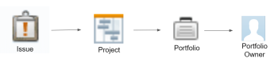

# Complexe tekstmodusfilters maken met EXISTS-instructies

<!-- Audited: 01/2025 -->

<!--
<p data-mc-conditions="QuicksilverOrClassic.Draft mode">(NOTE: do not EVER&nbsp;delete this article as long as Text Mode still exists in the system.&nbsp;Google ordered this article to be written and we wrote it with the help of consultants, so the use case is very complex and very hard to understand without this. It is also very much used by many customers)</p>
-->

<!--
<p data-mc-conditions="QuicksilverOrClassic.Draft mode">(NOTE:&nbsp;Alina: **~ Replace screen shot of icons when list/ reporting UI changes)</p>
-->

>[!IMPORTANT]
>
>Dit artikel vereist een grondig inzicht in de Adobe Workfront API en de rapportinterface voor de tekstmodus. Voor informatie over Workfront API, zie [&#x200B; API basiscs &#x200B;](../../../wf-api/general/api-basics.md).\
>Voor informatie over het gebruiken van tekstwijze, zie [&#x200B; Overzicht van de Wijze van de Tekst &#x200B;](../../../reports-and-dashboards/reports/text-mode/understand-text-mode.md).

## Overzicht van objectrelaties in Workfront

Alle objecten zijn gekoppeld aan andere objecten in de Workfront-database.

Als u de hiërarchie en de onderlinge afhankelijkheid van objecten begrijpt, kunt u beter achterhalen naar welke objecten in rapporten kan worden verwezen.

Voor informatie over welke voorwerpen in Workfront en over hun hiërarchie en onderlinge afhankelijkheid zijn, zie [&#x200B; de objecten van Adobe Workfront overzicht &#x200B;](../../../workfront-basics/navigate-workfront/workfront-navigation/understand-objects.md).

Wanneer u filters maakt, kunt u naar andere objecten verwijzen die met het object van het filter zijn verbonden binnen maximaal twee relatieniveaus met behulp van de standaardrapportinterface.

U kunt bijvoorbeeld naar de Portfolio-id in een emissiefilter verwijzen om alleen problemen weer te geven voor projecten die aan een bepaald portfolio zijn gekoppeld met de standaardinterface. In dit geval is de portfolio 2 niveaus verwijderd van emissies.

U kunt echter niet naar de Portfolio-eigenaar verwijzen in een emissiefilter met de standaardinterface om alleen problemen weer te geven van projecten die zijn gekoppeld aan portfolio&#39;s waarbij de eigenaar een specifieke gebruiker is. U moet de tekstmodus gebruiken om toegang te krijgen tot het veld Naam eigenaar van Portfolio, dat drie niveaus verwijderd is van de problemen.



Voor een volledige lijst van voorwerpen in Workfront, zie de [&#x200B; API Ontdekkingsreiziger &#x200B;](../../../wf-api/general/api-explorer.md).

Voor informatie over hoe te om de API Ontdekkingsreiziger te navigeren en voorwerpen te vinden, zie [&#x200B; Gebruikend de API Ontdekkingsreiziger &#x200B;](../../../wf-api/general/using-api-explorer.md).

Wanneer u filters maakt, moet u complexe instructies maken in de interface voor tekstmodus om naar deze typen objecten te verwijzen.

Voor informatie over de bouw van complexe filters, zie het [&#x200B; Overzicht van de complexe filters van de tekstwijze die het 1&rbrace; sectie van verklaringen van het Gebruik &lbrace;van dit artikel BESTAAN.](#overview-of-complex-text-mode-filters-that-use-exists-statements)

## Overzicht van complexe tekstmodusfilters die EXISTS-instructies gebruiken {#overview-of-complex-text-mode-filters-that-use-exists-statements}

Houd rekening met het volgende wanneer u filters maakt die meerdere niveaus in de objecthiërarchie of het filter beslaan voor ontbrekende objecten:

* U moet complexe filters maken wanneer u wilt verwijzen naar objecten die niet rechtstreeks met het filterobject zijn verbonden.
* U moet een EXISTS verklaring gebruiken om het volgende te doen:

   * Maak filters die meerdere niveaus omspannen.
   * Maak filters die zoeken naar objecten die ontbreken.\
     Bijvoorbeeld, wanneer het bouwen van een gebruikersrapport, kunt u voor gebruikers filtreren die geen tijd voor een bepaalde periode hebben geregistreerd.

Houd rekening met de volgende regels wanneer u EXISTS-instructies in een filter gebruikt:

* Er zijn drie objecten waarnaar u in een EXISTS-filter kunt verwijzen:

   * Het object van het filter (Origineel object).
   * Het object waarnaar u wilt verwijzen (doelobject).
   * Het object dat het origineel en de doelobjecten met elkaar verbindt, voor het geval ze niet rechtstreeks met elkaar zijn verbonden (Object koppelen).

* Filters die gebruikmaken van EXISTS bevatten twee afzonderlijke instructies die zijn gekoppeld met een isgelijkteken:

   * De instructie vóór het gelijkteken verwijst naar het object waarnaar u verwijst (de koppeling of het doelobject).
   * De instructie na het gelijkteken verwijst naar het object waarvan u verwijst (het oorspronkelijke object).

* U moet de objectcode van het object Koppelen gebruiken om uw instructies te verbinden.\
  U kunt de objectcode van alle objecten vinden in de API Explorer.\
  Voor informatie over de API Ontdekkingsreiziger, zie [&#x200B; API Ontdekkingsreiziger &#x200B;](../../../wf-api/general/api-explorer.md).

* Wanneer een object Koppelen ontbreekt omdat het origineel en de doelobjecten rechtstreeks met elkaar zijn verbonden, kunt u de objectcode van het doelobject gebruiken in plaats van het object Koppelen.
* U kunt naar meerdere velden (doelvelden) op hetzelfde object (doelobject) verwijzen. In dat geval moet u de regels verbinden die naar de velden verwijzen door AND.\
  Voor een voorbeeld van het filtreren voor meer dan één gebied dat tot het Voorwerp van het Doel behoort, zie [&#x200B; Voorbeeld 4: Filter door veelvoudige gebieden: taken door de Naam van de Eigenaar van Portfolio en de sectie van identiteitskaart van het Scorecard van de Uitlijning van Portfolio &#x200B;](#example-4-filter-by-multiple-fields-tasks-by-portfolio-owner-name-and-portfolio-alignment-scorecard-id) in dit artikel.

* De enige bepaling die voor een EXISTS verklaring wordt gesteund is NOTEXISTS.

## Toegangsvereisten

+++ Breid uit om de toegangseisen voor de functionaliteit in dit artikel weer te geven.

<table style="table-layout:auto"> 
 <col> 
 <col> 
 <tbody> 
  <tr> 
   <td role="rowheader">Adobe Workfront-pakket</td> 
   <td> <p>Alle</p> </td> 
  </tr> 
  <tr> 
   <td role="rowheader">Adobe Workfront-licentie</td> 
   <td> 
     <p>Standard</p>
     <p>Plan</p>
   </td> 
  </tr> 
  <tr> 
   <td role="rowheader">Configuraties op toegangsniveau</td> 
   <td> <p>Toegang tot filters, weergaven, groepen bewerken</p> <p>Toegang tot rapporten, dashboards, kalenders bewerken om filters in een rapport te bewerken</p></td> 
  </tr> 
  <tr> 
   <td role="rowheader">Objectmachtigingen</td> 
   <td><p>Rechten beheren voor een rapport om filters in een rapport te bewerken</p> <p>Machtigingen voor een filter beheren om het te bewerken</p></td> 
  </tr> 
 </tbody> 
</table>

Voor meer detail over de informatie in deze lijst, zie [&#x200B; vereisten van de Toegang in de documentatie van Workfront &#x200B;](/help/quicksilver/administration-and-setup/add-users/access-levels-and-object-permissions/access-level-requirements-in-documentation.md).

+++

## Filters voor complexe tekstmodus maken die meerdere niveaus in de objecthiërarchie beslaan

<!--
<p data-mc-conditions="QuicksilverOrClassic.Draft mode">(NOTE: Alina: ***[This information is somewhat duplicated from the section below: Create Text-Mode Filters for Missing Objects])</p>
-->

U kunt een filter maken dat naar objecten verwijst op meerdere niveaus van de objecthiërarchie waarin het filterobject bestaat. U kunt bijvoorbeeld een filter voor uitgaven maken voor problemen die zich voordoen in projecten die niet aan een bepaalde Portfolio-eigenaar zijn gekoppeld.

U moet altijd een EXISTS verklaring en de interface van de tekstwijze gebruiken om dit filter te bouwen.

Voor voorbeelden van filters, zie [&#x200B; Voorbeeld 1: Filter voor kwesties door de sectie van de Naam van de Eigenaar van Portfolio &#x200B;](#example-1-filter-for-issues-by-portfolio-owner-name) in dit artikel.

Een filter maken dat zich uitstrekt over meerdere niveaus in de objecthiërarchie:

1. Identificeer het voorwerp van uw filter. Dit object wordt het oorspronkelijke object genoemd.\
   Bijvoorbeeld Issue.

1. Identificeer het veld waarop u wilt filteren. Wij verwijzen naar dit voorwerp als het Gebied van het Doel dat tot een Voorwerp van het Doel behoort.\
   Bijvoorbeeld het veld ownerID (Doelveld), dat tot Portfolio (doelobject) behoort.

1. (Voorwaardelijk) als het Oorspronkelijke Voorwerp (Uitgave) en het Gebied van het Doel (ownerID) niet direct met elkaar worden verbonden, moet u een derde voorwerp vinden, een Verbonden Voorwerp (Project) dat hen verbindt. Het object Koppelen moet ten minste één veld hebben waarnaar wordt verwezen op de tabbladen Velden of Verwijzingen van het oorspronkelijke object (het veld Koppelen dat wordt weergegeven op het oorspronkelijke object) en het moet ook een koppelingsveld hebben naar het doelobject dat wordt weergegeven op de tabbladen Velden of Verwijzingen van het object Koppelen. Het veld Koppelen aan het doelobject dat wordt weergegeven op het object Koppelen (of het veld Koppelen dat wordt weergegeven op het object Koppelen) moet overeenkomen met het veld Doel.

   Bijvoorbeeld, (Project) identiteitskaart (het Gebied van de Verbinding die op het Oorspronkelijke Voorwerp wordt getoond) van Kwesties (Origineel Voorwerp) van verwijzingen wordt voorzien. (Portfolio) ownerID (het Gebied van de Verbinding met het Voorwerp van het Doel) wordt getoond op het lusje van Gebieden van het Project (het Verbindende Voorwerp). Portfolio ownerID is ook een veld op het doelobject (Portfolio). Het koppelingsveld op het koppelingsobject komt overeen met het doelveld.\
   

1. Gebruikend de API Ontdekkingsreiziger, identificeer de **Code van Objecten** van het Linking Voorwerp (Project).\
   De Objectcode voor Project is bijvoorbeeld PROJ.\
   

1. Maak een filter voor het oorspronkelijke object.\
   Maak bijvoorbeeld een filter Uitgave.\
   Voor informatie over het creëren van filters, zie [&#x200B; Overzicht van Filters &#x200B;](../../../reports-and-dashboards/reports/reporting-elements/filters-overview.md).

1. Klik **Schakelaar aan de Wijze van de Tekst** dan **uitgeven de Wijze van de Tekst**.
1. Plak het volgende voorbeeld van de formule in de tekstmodusinterface van het nieuwe filter en vervang de voorbeeldtekst door de juiste objecten en velden:

   ```
   EXISTS:A:$$OBJCODE=<Object code of the Linking Object>
   EXISTS:A:<Linking Field on the Linking Object>=FIELD:<Linking Field displayed on the Original Object>
   EXISTS:A:<Target Object>:<Target Field>=<Your value for the Target Field>
   ```

   Voor een voorbeeld dat de gebieden gebruikt die wij hierboven hebben geïdentificeerd, zie [&#x200B; Voorbeeld 1: Filter voor kwesties door de sectie van de Naam van de Eigenaar van Portfolio &#x200B;](#example-1-filter-for-issues-by-portfolio-owner-name) in dit artikel.

1. Klik **sparen Filter**.

## Filters voor complexe tekstmodus maken voor ontbrekende objecten

<!--
<p data-mc-conditions="QuicksilverOrClassic.Draft mode">(NOTE: Alina: **^[This information is somewhat duplicated from the section above: Create Text-Mode Filters that Span Multiple Levels in the Object Hierarchy])</p>
-->

U kunt een filter maken dat verwijst naar objecten die ontbreken. U kunt bijvoorbeeld een gebruikersfilter maken waarin wordt aangegeven welke gebruikers zich niet hebben aangemeld bij Workfront.

U moet altijd gebruiken *BESTAAT* verklaring en de interface van de tekstwijze om deze filter te bouwen.

Zie de volgende secties in dit artikel voor voorbeelden van filters voor ontbrekende objecten:

* [&#x200B; Voorbeeld 2: Filter voor ontbrekende voorwerpen: douanegebieden die niet in enige douaneformulieren &#x200B;](#example-2-filter-for-missing-objects-custom-fields-that-do-not-appear-in-any-custom-forms) verschijnen
* [Voorbeeld 3: Filter voor ontbrekende objecten: gebruikers die de tijd gedurende een bepaalde periode niet hebben geregistreerd](#example-3-filter-for-missing-objects-users-who-did-not-log-time-for-a-certain-period-of-time)

Een filter maken dat naar ontbrekende objecten verwijst:

1. Identificeer het voorwerp van uw filter. Dit object wordt het oorspronkelijke object genoemd.\
   Bijvoorbeeld Parameter of Aangepast veld.

1. Identificeer het veld waarop u wilt filteren. Wij verwijzen naar dit voorwerp als het Gebied van het Doel dat tot een Voorwerp van het Doel behoort.\
   Het veld categoryID (doelveld) behoort bijvoorbeeld tot categorie (doelobject).

1. Omdat het Originele Voorwerp (Parameter) en het Gebied van het Doel (categoryID) niet direct met elkaar worden verbonden, moet u een derde voorwerp vinden, een Verbonden Voorwerp (een Parameter van de Categorie) die hen verbindt. Het object Koppelen moet ten minste één veld hebben waarnaar wordt verwezen op de tabbladen Velden of Verwijzingen van het oorspronkelijke object (het veld Koppelen dat wordt weergegeven op het oorspronkelijke object) en het moet ook een koppelingsveld hebben naar het doelobject dat wordt weergegeven op de tabbladen Velden of Verwijzingen van het object Koppelen. Het veld Koppelen aan het doelobject dat wordt weergegeven op het object Koppelen (of het veld Koppelen dat wordt weergegeven op het object Koppelen) moet overeenkomen met het veld Doel.

   Bijvoorbeeld, wordt identiteitskaart van de Parameter van de Categorie (het Verbonden Gebied dat op het Oorspronkelijke Voorwerp wordt getoond) van Parameter van Verwijzing voorzien (Origineel Voorwerp). parameterID (Link Field to the Target Object) wordt weergegeven op het tabblad Velden van de Categorieparameter (Linking Object). Het veld Koppelen aan het doelobject dat wordt weergegeven op het object Koppelen komt overeen met het doelveld.

1. Gebruikend de API Ontdekkingsreiziger, identificeer de **Code van Objecten** van het Gekoppelde Voorwerp (de Parameter van de Categorie).\
   Bijvoorbeeld, is de Code van Objecten voor de Parameter van de Categorie CTGYPA.\
   

1. Maak een filter voor het oorspronkelijke object.\
   Maak bijvoorbeeld een parameterfilter.\
   Voor informatie over het creëren van filters, zie [&#x200B; Overzicht van Filters &#x200B;](../../../reports-and-dashboards/reports/reporting-elements/filters-overview.md).

1. Klik **Schakelaar aan de Wijze van de Tekst** dan **uitgeven de Wijze van de Tekst**.
1. (Voorwaardelijk) Als u filtert voor objecten die ontbreken, plakt u het volgende voorbeeld van de formule in de tekstmodusinterface van het nieuwe filter en vervangt u de voorbeeldtekst door de juiste objecten en velden:

   ```
   EXISTS:A:$$OBJCODE=<Object code of the Linking Object>
   EXISTS:A:<Linking Field displayed on the Linking Object>=FIELD:<Linking Field displayed on the Original Object>
   EXISTS:A:$$EXISTSMOD=NOTEXISTS
   ```

   Voor een voorbeeld om op de Gebieden van de Douane te melden die niet met Douane Forms worden geassocieerd, zie [&#x200B; Voorbeeld 2: Filter voor ontbrekende voorwerpen: douanegebieden die niet in om het even welke 1&rbrace; sectie van douaneformulieren &lbrace;in dit artikel verschijnen.](#example-2-filter-for-missing-objects-custom-fields-that-do-not-appear-in-any-custom-forms)

1. Klik **sparen Filter**.

## Voorbeelden van tekstmodusfilters die meerdere niveaus in de objecthiërarchie beslaan

Gebruik deze voorbeelden om tekstmodusfilters met EXISTS-instructies te bouwen.

### Voorbeeld 1: Filter voor problemen op naam van Portfolio-eigenaar {#example-1-filter-for-issues-by-portfolio-owner-name}

Met de interface van de tekstmodus kunt u een filter maken voor een lijst met uitgaven om alleen problemen weer te geven die zich voordoen in projecten die zijn gekoppeld aan een portfolio waarvan de eigenaar een specifieke gebruiker is.

Om kwesties door de Naam van de Eigenaar van Portfolio te filtreren:

1. Maak een filter Uitgave.\
   Voor informatie over het creëren van filters, zie [&#x200B; Overzicht van Filters &#x200B;](../../../reports-and-dashboards/reports/reporting-elements/filters-overview.md).

1. Klik **Schakelaar aan de Wijze van de Tekst** dan **uitgeven de Wijze van de Tekst**.
1. Raadpleeg de volgende algemene code:

   ```
   EXISTS:A:$$OBJCODE=<Object code of the Linking Object>
   EXISTS:A:<Linking Field on the Linking Object>=FIELD:<Linking Field displayed on the Original Object>
   EXISTS:A:<Target Object>:<Target Field>=<Your value for the Target Field>
   ```

1. Plak de volgende code in de **Vastgestelde Regels van de Filter voor uw gebied van het Rapport** hierboven om de generische code te vervangen:

   ```
   EXISTS:A:$$OBJCODE=PROJ
   EXISTS:A:ID=FIELD:projectID
   EXISTS:A:portfolio:ownerID=4d94d7da001699b19edf50de15682221
   ```

   >[!NOTE]
   >
   >* Het oorspronkelijke object is het object van het rapport: Issue
   >* Het doelobject is Portfolio.
   >* Het object Linking is Project.
   >* Het doelveld en het koppelingsveld naar het doelobject waarnaar vanuit het koppelingsobject wordt verwezen, zijn ownerID.
   >* De objectcode van het object Koppelen hier is PROJ.
   >* Het verbindingsgebied dat op het Originele Voorwerp wordt getoond is projectID en het Verbindende Gebied is identiteitskaart

1. Vervang de waarde van het Gebied van het Doel (ownerID) in de laatste verklaring met een Gebruiker - identiteitskaart van uw milieu.
1. Klik **sparen Filter**.

### Voorbeeld 2: Filter voor ontbrekende objecten: aangepaste velden die niet in aangepaste formulieren voorkomen {#example-2-filter-for-missing-objects-custom-fields-that-do-not-appear-in-any-custom-forms}

Met behulp van de interface van de tekstmodus kunt u een filter maken om aangepaste velden (parameters) weer te geven die niet zijn gekoppeld aan Aangepaste Forms (categorieën). Dit filter koppelt Parameters aan Categorieën, die door een ander voorwerp, de Parameter van de Categorie worden verbonden. Omdat de twee gebieden niet direct met elkaar worden verbonden en omdat u voor ontbrekende informatie filtreert, moet u een EXISTS verklaring gebruiken.

>[!IMPORTANT]
>
>Een parameter is een veld dat bestaat in de veldbibliotheek waarnaar wordt verwezen in een aangepast formulier. Een categorieparameter is de versie van een veld dat op een specifiek formulier wordt weergegeven. Als hetzelfde veld bijvoorbeeld op 5 formulieren wordt weergegeven, zijn er 1 parameter en 5 categorieparameters in de Workfront-database.

Filteren voor aangepaste velden die niet zijn gekoppeld aan een aangepast formulier:

1. Maak een parameter of een filter Aangepast veld.\
   Voor informatie over het creëren van filters, zie [&#x200B; Overzicht van Filters &#x200B;](../../../reports-and-dashboards/reports/reporting-elements/filters-overview.md).

1. Klik **Schakelaar aan de Wijze van de Tekst** dan **uitgeven de Wijze van de Tekst**.
1. Raadpleeg de volgende algemene code:

   ```
   EXISTS:A:$$OBJCODE=<Object code of the Linking Object>
   EXISTS:A:<Linking Field displayed on the Linking Object>=FIELD:<Linking Field displayed on the Original Object>
   EXISTS:A:$$EXISTSMOD=NOTEXISTS
   ```

1. Plak de volgende code in de **Vastgestelde Regels van de Filter voor uw gebied van het Rapport** hierboven om de generische code te vervangen:

   ```
   EXISTS:A:$$OBJCODE=CTGYPA
   EXISTS:A:parameterID=FIELD:ID
   EXISTS:A:$$EXISTSMOD=NOTEXISTS
   ```

   >[!NOTE]
   >
   >* Het oorspronkelijke object is het object van het rapport: Parameter.
   >* Het doelobject is categorie.
   >* Het object Linking is een categorieparameter.
   >* De objectcode van het object Koppelen is CTGYPA.
   >* Het koppelingsveld naar het doelobject is parameterID, omdat parameterID bestaat in zowel de tabel met gekoppelde objecten als de tabel met doelobjecten.
   >* Het koppelingsveld dat op het oorspronkelijke object wordt weergegeven, is een id (van de categorieparameter).

1. Klik **sparen Filter**.

### Voorbeeld 3: Filter voor ontbrekende objecten: gebruikers die de tijd gedurende een bepaalde periode niet hebben geregistreerd {#example-3-filter-for-missing-objects-users-who-did-not-log-time-for-a-certain-period-of-time}

Gebruikend de interface van de tekstwijze, kunt u een filter bouwen om gebruikers te bekijken die niet tijd voor een bepaalde tijdspanne registreerden. Dit filter koppelt Gebruikers aan Uren, die direct met elkaar worden verbonden. Nochtans, moet u een EXISTS verklaring en de interface van de tekstwijze gebruiken om voor ontbrekende informatie te kunnen filtreren.

Hiermee filtert u voor gebruikers die zich vorige week niet hebben aangemeld:

1. Maak een gebruikersfilter.\
   Voor informatie over het creëren van filters, zie [&#x200B; Overzicht van Filters &#x200B;](../../../reports-and-dashboards/reports/reporting-elements/filters-overview.md).

1. Klik **Schakelaar aan de Wijze van de Tekst** dan **uitgeven de Wijze van de Tekst**.
1. Raadpleeg de volgende algemene code:

   ```
   EXISTS:A:$$OBJCODE=<Object code of the Linking Object>
   EXISTS:A:<Linking Field displayed on the Linking Object>=FIELD:<Linking Field displayed on the Original Object>
   EXISTS:A:$$EXISTSMOD=NOTEXISTS
   ```

1. Plak de volgende code in de **Vastgestelde Regels van de Filter voor uw gebied van het Rapport** hierboven om de generische code te vervangen:

   ```
   EXISTS:A:$$OBJCODE=HOUR
   EXISTS:A:ownerID=FIELD:ID
   EXISTS:A:entryDate=$$TODAYb-1w
   EXISTS:A:entryDate_Range=$$TODAYe-1w
   EXISTS:A:entryDate_Mod=between
   EXISTS:A:$$EXISTSMOD=NOTEXISTS
   ```

   >[!NOTE]
   >
   >* Het originele voorwerp is het voorwerp van het rapport: Gebruiker.
   >* Het doelobject is Uur.
   >* In dit voorbeeld hebt u geen koppelingsobject nodig omdat Gebruikers en uren rechtstreeks zijn verbonden in de Workfront-database.
   >* Omdat er geen Verbonden Voorwerp is, moet u de Code van Objecten van het Voorwerp van het Doel gebruiken: UUR.
   >* Het koppelingsveld naar het doelobject is ownerID (die wordt weergegeven op het oorspronkelijke object; het koppelingsobject ontbreekt).
   >* Het koppelingsveld dat op het oorspronkelijke object wordt weergegeven, is een id (van het uur) (die wordt weergegeven op het doelobject; het koppelingsobject ontbreekt).
   >* De EXISTS :A: entryDate verklaring verwijst naar gebieden die het Voorwerp van het Doel (Uur) bepalen en de zelfde syntaxis zoals in een regelmatige filterverklaring gebruiken. Dit zorgt ervoor dat u slechts die gebruikers toont die geen tijd voor een specifieke periode, in dit geval, de vorige week registreerden.
   >* De bepaling NOTEXISTS wijst erop dat wij punten (Uren) zoeken die niet voor het voorwerp van het rapport (Gebruikers) bestaan.

1. Klik **sparen Filter**.

### Voorbeeld 4: Filteren op meerdere velden: taken op Portfolio Owner Name en Portfolio Alignment Scorecard ID {#example-4-filter-by-multiple-fields-tasks-by-portfolio-owner-name-and-portfolio-alignment-scorecard-id}

Met de interface van de tekstmodus kunt u een filter maken dat naar meer dan één veld in het doelobject verwijst. In dit geval moeten de filterinstructies die verwijzen naar de doelvelden, via AND worden verbonden.

U kunt bijvoorbeeld een takenlijst filteren om alleen taken weer te geven die aan de volgende criteria voldoen:

* Ze bevinden zich op een project dat is gekoppeld aan een portfolio waarvan de eigenaar een specifieke gebruiker is.
* Zij zijn op een project verbonden aan een portefeuille de waarvan projecten niet met een specifieke groeperingsscorecard worden geassocieerd.

U kunt als volgt taken filteren op de Portfolio Owner Name en Portfolio Alignment Scorecard ID:

1. Maak een taakfilter.\
   Voor informatie over het creëren van filters, zie [&#x200B; Overzicht van Filters &#x200B;](../../../reports-and-dashboards/reports/reporting-elements/filters-overview.md).

1. Klik **Schakelaar aan de Wijze van de Tekst** dan **uitgeven de Wijze van de Tekst**.
1. Plak de volgende code in het **Vastgestelde Regels van de Filter voor uw gebied van het Rapport**:

   ```
   EXISTS:A:$$OBJCODE=PROJ
   EXISTS:A:ID=FIELD:projectID
   EXISTS:A:portfolio:ownerID=4d80ce5200000528787d57807732a33f
   AND:A:EXISTS:A:$$EXISTSMOD=NOTEXISTS
   AND:A:EXISTS:A:$$OBJCODE=PROJ
   AND:A:EXISTS:A:ID=FIELD:projectID
   AND:A:EXISTS:A:portfolio:alignmentScoreCardID=4da387b00001cbc732bb259355c33dad
   ```

   >[!NOTE]
   >
   >* Het oorspronkelijke object is het object van het filter Taak.
   >* Het doelobject is Portfolio.
   >* Het eerste doelveld is ownerID.
   >* Het tweede doelveld is de ID van het uitlijningsscorebord.
   >* Het object Linking is Project.
   >* De objectcode van het object Koppelen is PROJ.
   >* Het koppelingsveld naar het doelobject is de id (van de Portfolio).
   >* Het verbindingsgebied dat op het Originele Voorwerp wordt getoond is projectID.
   >* Vervang de ownerID door een gebruikersnaam uit uw omgeving.

1. Klik **sparen Filter**.
