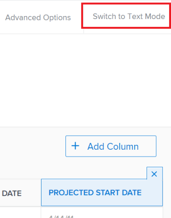

# Een weergave bewerken in de tekstmodus

<!--

NOTE: add a section in this article: /Content/Reports and Dashboards/Reports/Reporting Elements/create-customize-views.html *** Also, draft this area in the Text Mode overview article) 

-->

U kunt een weergave in een lijst of rapport bewerken met de tekstmodus om toegang te krijgen tot velden die niet beschikbaar zijn in de standaardinterface en om complexere weergaven te maken.

## Toegangsvereisten

U moet de volgende toegang hebben om de stappen in dit artikel uit te voeren:

<table style="table-layout:auto"> 
 <col> 
 <col> 
 <tbody> 
  <tr> 
   <td role="rowheader">Adobe Workfront-abonnement*</td> 
   <td> 
Alle
 </td> 
  </tr> 
  <tr> 
   <td role="rowheader">Adobe Workfront-licentie*</td> 
   <td> 
Plan 
 </td> 
  </tr> 
  <tr> 
   <td role="rowheader">Configuraties op toegangsniveau*</td> 
   <td> 
Toegang tot filters, weergaven, groepen bewerken
 
Toegang tot rapporten, dashboards, kalenders bewerken om rapportelementen in een rapport te bewerken
 
Opmerking: Als u nog steeds geen toegang hebt, vraagt u de Workfront-beheerder of deze aanvullende beperkingen op uw toegangsniveau instelt. Voor informatie over hoe een beheerder van Workfront uw toegangsniveau kan wijzigen, zie <a href="../../../administration-and-setup/add-users/configure-and-grant-access/create-modify-access-levels.md" class="MCXref xref">Aangepaste toegangsniveaus maken of wijzigen</a>.
 </td> 
  </tr> 
  <tr> 
   <td role="rowheader">Objectmachtigingen</td> 
   <td> 
Rechten beheren voor een rapport om weergaven in een rapport te bewerken
 
Machtigingen beheren voor een weergave om deze te bewerken
 
Voor informatie over het aanvragen van aanvullende toegang raadpleegt u <a href="../../../workfront-basics/grant-and-request-access-to-objects/request-access.md" class="MCXref xref">Toegang tot objecten aanvragen </a>.
 </td> 
  </tr> 
 </tbody> 
</table>

&#42;Neem contact op met uw Workfront-beheerder om te weten te komen welk plan, licentietype of toegang u hebt.

## Vereisten

Voordat u de tekstmodus in een rapport of lijst gaat gebruiken, moet u altijd op de hoogte zijn van de syntaxis in de tekstmodus van Workfront.

Zie voor meer informatie:

* [Overzicht van de tekstmodus](../../../reports-and-dashboards/reports/text-mode/understand-text-mode.md)
* [Overzicht van syntaxis in tekstmodus](../../../reports-and-dashboards/reports/text-mode/text-mode-syntax-overview.md)
* [Voorbeelden van aangepaste weergaven, filters en groeperingen](../../../reports-and-dashboards/reports/custom-view-filter-grouping-samples/custom-view-filter-grouping-samples.md)

## Tekstmodus in een weergave bewerken

Het bewerken van een weergave in de tekstmodus is identiek voor rapporten en lijsten. De toegang tot van de mening van een rapport of van een lijst verschilt.

>[!TIP]
>
>Wij adviseren dat u zoveel mogelijk van de mening in standaardwijze bouwt, dan het in tekstwijze omzet om het uit te geven.

Voor informatie over het bouwen van meningen, zie [Overzicht van weergaven in Adobe Workfront](../../../reports-and-dashboards/reports/reporting-elements/views-overview.md).

Voor informatie over het creëren van een rapport, zie [Een aangepast rapport maken](../../../reports-and-dashboards/reports/creating-and-managing-reports/create-custom-report.md).

1. Voer een van de volgende handelingen uit:

   1. Ga naar het rapport en klik op **Handelingen rapporteren** > **Bewerken** > **Kolommen (weergave)** tab.
   1. Als u vanuit een lijst toegang wilt tot de weergave, gaat u naar de lijst en vanuit de **Weergave** vervolgkeuzelijst, houdt u de muis boven de weergave die u wilt wijzigen en klikt u op de knop **Bewerken** pictogram .

      De weergavebuilder wordt geopend.

1. Selecteer een kolom in de weergave.

   of

   Selecteer **Kolommen (weergave)** van de rapportbouwer, dan selecteer een kolom.

   >[!TIP]
   >
   >Als u een weergave wilt bewerken in de tekstmodus, moet u één kolom tegelijk bewerken.

1. Klikken **Overschakelen naar tekstmodus** in de rechterbovenhoek van de builder.

   >[!NOTE]
   >
   >Als u een kolom bewerkt in de tekstmodus, voegt Workfront de `textmode=true` coderegel naar de kolom. Dit geeft aan dat de kolom wordt gewijzigd in de tekstmodus.

   

   In de volgende tabel worden de belangrijkste regels in een weergave in tekstmodus weergegeven:

   <!--
   
(NOTE: make this a snippet and add it to the grouping article too)

   -->

   <table style="table-layout:auto"> 
    <col> 
    <col> 
    <thead> 
     <tr> 
      <th>Voorbeeldregel</th> 
      <th>Beschrijving</th> 
     </tr> 
    </thead> 
    <tbody> 
     <tr> 
      <td> 
<strong>taxiveld</strong>=
 </td> 
      <td> 
Dit is de naam van het object of van het veld zoals deze wordt weergegeven in de database. Voor meer informatie over hoe objecten en velden in de database worden weergegeven, raadpleegt u <a href="../../../wf-api/general/api-explorer.md" class="MCXref xref">API Explorer</a>.
 
De volgende scenario's bestaan:
 
       <ol> 
        <li value="1"> 
 Als de naam van het veld dat u weergeeft een woordgroep is in plaats van een enkel zelfstandig naamwoord, moet u de syntaxis van het hoofdlettergebruik gebruiken voor het <code>valuefield</code>. Voor de geplande begindatum van een taak is de code bijvoorbeeld: 
 
Example: </b>"><b>Voorbeeld: </b><code>valuefield=plannedStartDate</code> 
 </li> 
        <li value="2"> 
Als u een aangepast veld wilt weergeven, <code>valuefield</code> waarde is de daadwerkelijke naam van het gebied, zoals u het in de interface ziet. Voor een aangepast veld met de naam "Meer informatie" is de code bijvoorbeeld:
 
Example: </b>"><b>Voorbeeld: </b><code>valuefield=More information</code> 
 </li> 
        <li value="3"> 
Als u objecten wilt weergeven die verwant zijn aan andere objecten in een weergave, gebruikt u de opdracht <code>valuefield</code> coderegel de objectnamen en -kenmerken worden gescheiden door dubbele punten. 
 
Een kolom in een taakweergave die bijvoorbeeld de naam van de eigenaar van de Portfolio zou weergeven, heeft de volgende waarde voor de veldwaarde:
 
Example: </b>"><b>Voorbeeld: </b><code>valuefield=project:portfolio:owner:name</code> 
 
Dit wijst erop dat van het voorwerp van het rapport (taak), u tot het volgende verwante voorwerp (project) kunt toegang hebben, van daar, kunt u tot het volgende verwante voorwerp van project (portefeuille) toegang hebben, dan de portefeuteigenaar (eigenaar) en toen hun naam (naam). 
 </li> 
       </ol> 
Zie de sectie voor informatie over hoe objecten met elkaar verbinden <a href="../../../workfront-basics/navigate-workfront/workfront-navigation/understand-objects.md#understanding-interdependency-and-hierarchy-of-objects" class="MCXref xref">Interdependentie en hiërarchie van objecten</a> in <a href="../../../workfront-basics/navigate-workfront/workfront-navigation/understand-objects.md" class="MCXref xref">Objecten in Adobe Workfront begrijpen</a>.
 
Opmerking: Als u een veld kiest in de tekstmodus dat niet geldig is in de standaardinterface, kunt u niet terugschakelen naar de standaardinterface in de kolom.
 </td> 
     </tr> 
     <tr> 
      <td><strong>valueformat=</strong> </td> 
      <td> 
Deze lijn vertegenwoordigt het formaat dat wordt gebruikt om te tonen <code>valuefield</code>. De <code>valueformat</code> Hiermee geeft u aan of een object of veld wordt weergegeven als tekst, getal, percentage of datum.
 
We raden u aan <code>HTML</code> voor uw <code>valueformat</code>, vooral bij gebruik <code>valueexpression</code>, zodat uw gegevens zo accuraat mogelijk worden weergegeven. 
 
Voor informatie over extra waarden voor deze lijn raadpleegt u <a href="../../../reports-and-dashboards/reports/text-mode/use-conditional-formatting-text-mode.md" class="MCXref xref">Voorwaardelijke opmaak gebruiken in tekstmodus</a>.
 </td> 
     </tr> 
     <tr> 
      <td> 
<strong>valueexpression=</strong> 
 </td> 
      <td> 
U kunt deze regel toevoegen ter vervanging <code>valuefield</code>, als u een berekend veld wilt weergeven in de kolom.
 
U moet de <code>valuefield</code> van de objecten tussen accolades telkens wanneer u deze gebruikt in een <code>valueexpression</code>.
 
De volgende scenario's bestaan: 
 
       <ol> 
        <li value="1"> 
Als u een veld in hoofdletters in een kolom wilt weergeven, gebruikt u:
 
Example: </b>"><b>Voorbeeld: </b><code>valueexpression=UPPER({valuefield})</code> 
 
De <code>valuefield</code> van het object wordt gespeld zoals het wordt weergegeven in de API Explorer. 
 </li> 
        <li value="2">Als u meerdere items wilt toevoegen <code>valuefields</code> door ze samen te voegen , moet je ze met een punt scheiden .</li> 
        <li value="3"> 
Bijvoorbeeld, als u de naam van de Primaire Ontvanger van een taak wilt tonen gebruikend <code>valueexpression</code>gebruikt u:
 
Example: </b>"><b>Voorbeeld: </b><code>valueexpreesion={assignedTo}.{name}</code> 
 </li> 
        <li value="4"> 
Als u een aangepast veld wilt gebruiken in een <code>valueexpression</code> regel die u voor de naam van het veld moet opgeven <code>DE:</code> om aan te geven dat het een aangepast veld is. De naam van het veld wordt gespeld zoals deze wordt weergegeven in de interface. 
 
Belangrijk: Wanneer u een aangepast veld gebruikt dat in een aangepaste formuliersectie is geplaatst waarvoor bepaalde gebruikers beperkte machtigingen hebben, is de berekening van de waarde-expressie leeg wanneer die gebruikers deze berekening in een rapport bekijken. Voor informatie over het aanpassen van machtigingen voor aangepaste formuliersecties raadpleegt u <a href="../../../administration-and-setup/customize-workfront/create-manage-custom-forms/create-or-edit-a-custom-form.md" class="MCXref xref">Een aangepast formulier maken of bewerken</a>.
 
Als u bijvoorbeeld een aangepast veld hebt met de naam "Naam ontwikkelaar" en u dit veld in hoofdletters wilt weergeven in een kolom, kunt u het volgende gebruiken <code>valueexpression</code> dit aan te geven:
 
Example: </b>"><b>Voorbeeld: </b><code>valueexpression=UPPER({DE:Developer Name}</code>) 
 
Wanneer u naar een aangepast Typeahead-tekstveld verwijst, gebruikt u de volgende expressie om naar de naam van het object te verwijzen dat is geselecteerd in een veld met de naam "Naam ontwikkelaar":
 
<code>valueexpression=UPPER({DE:Developer Name:name})</code> 
 </li> 
       </ol> </td> 
     </tr> 
     <tr> 
      <td> 
<strong>descriptionKey= / description=</strong> 
 </td> 
      <td> 
Deze regel definieert de tekst van knopinfo terwijl u de muis boven de naam van de kolom houdt. In dit geval wordt een toets gebruikt om de naamwaarde in de beschrijvingstekst te vertalen. Als u de beschrijving wilt wijzigen, wijzigt u deze regel als volgt: 
 
Example: </b>"><b>Voorbeeld: </b><code>description=Your Value</code>.
 </td> 
     </tr> 
     <tr> 
      <td><strong>namekey= / name=</strong> </td> 
      <td> 
Deze regel definieert het kolomlabel. In dit geval wordt de verkorte waarde op basis van de sleutel gebruikt.
 
Als u de kolomnaam wilt wijzigen, kunt u deze waarde wijzigen in: 
 
Example: </b>"><b>Voorbeeld: </b><code>name=Your Value</code> 
 
<code>Name</code> kunt u elke gewenste tekst voor de kolomnaam invoeren, terwijl<code>namekey</code> vereist u een sleutel ingaat die wordt gebruikt om de naam van een kolom te vertalen.
 
Als u de kolomnaam wilt wijzigen, kunt u ook het dialoogvenster <code>displayname </code>regel, als er geen regel is.
 </td> 
     </tr> 
     <tr> 
      <td><strong>displayname =</strong> </td> 
      <td> 
U kunt de volgende regel toevoegen om de naam van een kolom te wijzigen, waardoor de instelling <code>namekey/name</code> waarde:
 
Example: </b>"><b>Voorbeeld: </b><code>displayname=Your Value</code> 
 </td> 
     </tr> 
     <tr> 
      <td><strong>querysort=</strong> </td> 
      <td>Deze regel definieert hoe de resultaten worden gesorteerd wanneer op de kolomkop wordt geklikt. Als deze niet aanwezig is, kan de kolom niet worden gesorteerd nadat het rapport is uitgevoerd.</td> 
     </tr> 
     <tr> 
      <td><strong>width=</strong> </td> 
      <td> 
Deze lijn geeft het aantal pixels aan dat voor de kolom wordt gebruikt. Als de regel wordt weggelaten of is ingesteld op 0 (nul), wordt de kolom niet weergegeven in de weergave.
 
Wanneer u dit veld handmatig wijzigt in de tekstmodus, moet u ook het gereedschap <code>usewidths=true</code> aan uw kolom.
 </td> 
     </tr> 
     <tr> 
      <td><strong>usewidths=true</strong> </td> 
      <td> 
U moet deze regel gebruiken in aanvulling op de <code>width=</code> lijn bij het aanpassen van de breedte van een kolom. 
 </td> 
     </tr> 
     <tr> 
      <td><strong>makeFieldEditable=</strong> </td> 
      <td> 
Deze regel definieert of de waarde in een kolom inline bewerkbaar is of niet. Als deze regel gelijk is <strong>true</strong>De waarde in de kolom kan inline worden bewerkt. Als deze regel gelijk is <code>false</code>De waarde in de kolom kan niet inline worden bewerkt.
 </td> 
     </tr> 
     <tr> 
      <td><strong>link.valueField=</strong> </td> 
      <td> 
Voeg deze regel alleen in als u wilt dat de waarde in een kolom wordt weergegeven en koppelt aan het object dat eraan is gekoppeld. Met de koppeling wordt de detailpagina van het object geopend. Deze waarde moet overeenkomen met <code>valuefield=</code> lijn. Wanneer u dit invoegt, moet u ook de opdracht <code>link.valueformat=</code> lijn. 
 
 U kunt bijvoorbeeld <code>link.valuefield=priority</code> in een weergave voor problemen en de Prioriteit van de uitgave wordt weergegeven als een koppeling. Als u op deze koppeling klikt, wordt de pagina Issue geopend.
 </td> 
     </tr> 
     <tr> 
      <td><strong>link.valueformat=</strong> </td> 
      <td> 
Deze regel alleen invoegen wanneer u het gereedschap <code>link.valuefield</code> lijn om een koppeling naar de waarde in een kolom toe te voegen. Met de koppeling wordt de detailpagina van het object geopend. Deze waarde moet overeenkomen met <code>valueformat=</code> regel en geeft de indeling aan die wordt gebruikt om de <code>valuefield</code>. 
 
Belangrijk: Wanneer u de tekstmodus bekijkt in een ingebouwde kolom die ook een koppeling bevat, ziet u een aantal regels die verwijzen naar de koppeling. Sommige van deze regels worden mogelijk niet meer ondersteund of zijn niet nodig wanneer u uw eigen aangepaste kolom maakt in de tekstmodus en de koppelingsinstructies eraan toevoegt. De regels die verplicht zijn bij het toevoegen van een gekoppelde waarde zijn<code> link.valuefield</code> en <code>link.valueformat</code>. 
 </td> 
     </tr> 
     <tr> 
      <td><strong>aggregator.function=</strong> </td> 
      <td> 
Dit verwijst naar de manier waarop de waarden van elke kolom worden samengevat. Er zijn meerdere regels waarmee wordt begonnen <code>aggregator.</code> en ze verwijzen allemaal naar de aggregator die de resultaten van de kolom samenvat. 
 
Als algemene regel geldt dat de <code>aggregator.</code> lijnen komen overeen met die van het kolomobject. 
 
       
Example: </b>">
        <b>Voorbeeld: </b> 
        
De Geplande kolom van Uren in een taakrapport dat door Som wordt samengevat kan als het volgende kijken: 
 
        

         <pre>textmode=true</pre>
         <pre>valueField=workRequired</pre>
         <pre>valueformat=compound</pre>
         <pre>aggregator.function=SUM</pre>
         <pre>aggregator.valuefield=workRequired</pre>
         <pre>aggregator.displayformat=minutesAsHoursString</pre>
         <pre>aggregator.valueformat=compound</pre>
         <pre>namekey=workRequired</pre>
         <pre>shortview=false</pre> 
        
 
       
 
       

        De <code>aggregator. </code>lijnen kunnen een <code>valuefield </code>of <code>valueexpression</code>
       
 </td> 
     </tr> 
    </tbody> 
   </table>

1. Klikken **Toepassen** als u de wijzigingen wilt opslaan en de weergave wilt blijven bewerken.
1. Klikken **Opslaan + Sluiten** om uw rapport op te slaan.

   of

   Klikken **Weergave opslaan** om de weergave in een lijst op te slaan.
