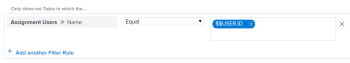

# Veelgestelde vragen over rapporten

<!--Audited: 05/2025-->

<!--

(NOTE: Alina: ***This is the ONE anchor article for all FAQs about Reporting. Add a new FAQ in the TOC at the top first, then add the answer as a section at the bottom.)

-->

Hier volgen vaak gestelde vragen over rapporten.

## Toegangsvereisten

+++ Vouw uit om de vereisten voor toegang weer te geven.

U moet de volgende toegang hebben om de stappen in dit artikel uit te voeren:

<table style="table-layout:auto"> 
 <col> 
 </col> 
 <col> 
 </col> 
 <tbody> 
  <tr> 
   <td role="rowheader">Adobe Workfront-plan</td> 
   <td> 
Alle
 </td> 
  </tr> 
  <tr> 
   <td role="rowheader">Adobe Workfront-licentie*</td> 
   <td>
Nieuw: Standaard
 
   
Huidig: Werk of hoger
 </td> 
  </tr> 
  <tr> 
   <td role="rowheader">Configuraties op toegangsniveau</td> 
   <td> 
Toegang tot rapporten, dashboards, kalenders bewerken
  </td> 
  </tr> 
  <tr> 
   <td role="rowheader">Objectmachtigingen</td> 
   <td> 
Machtigingen beheren voor een rapport
  </td> 
  </tr> 
 </tbody> 
</table>

*Voor meer informatie, zie [ vereisten van de Toegang in de documentatie van Workfront ](/help/quicksilver/administration-and-setup/add-users/access-levels-and-object-permissions/access-level-requirements-in-documentation.md).

+++

## Waarom toont mijn douaneberekening voor een uurverschil niet het correcte resultaat in een kolom?

<!--this section is linked from the Actual Hours article for Tasks in the Task Information folder; edit the links or do not delete or change this section-->

Op een projectrapport heb ik een berekening die Legacy Actual Hours van Geplande Uren aftrekt.

Het resultaat dat ik heb bereikt is onjuist.

<!--this changed with this issue in May 2025; Actual Hours changed from actualWorkRequired to actualWorkRequiredDouble: https://experience.adobe.com/#/@adobeinternalworkfront/so:hub-Hub/workfront/task/68108e860000120e90a79cb82e5811c2/updates : On a project report I have a calculation that subtracts Actual Hours (2) from Planned Hours (4). The result I am getting is 120 when it should be 2.  -->

Mijn berekening is:

`valueexpression=SUB(workRequired,actualWorkRequired)`

### Antwoord

De meeste velden die uren gebruiken in Workfront worden in minuten opgeslagen. Als u deze velden gebruikt in een berekening, wordt het resultaat meestal in minuten weergegeven. U verkrijgt het resultaat in uren door het resultaat van de berekening of het veld waarnaar u verwijst, door 60 te delen.

De juiste berekening is:

`valueexpression=SUB(workRequired,actualWorkRequired)/60`

>[!NOTE]
>
>Als u Werkelijke uren in uw berekening gebruikt, gebruik `actualWorkRequiredDouble` voor het waardegebied. Werkelijke uren worden in uren opgeslagen. Geplande uren worden in minuten opgeslagen.
>
>De juiste berekening voor Werkelijke uren is:
>>`valueexpression=SUB(workRequired/60,actualWorkRequiredDouble)`

## Waarom wordt de waarde van elk van mijn diagramelementen in een rapport niet getoond op de grafiek?

### Antwoord

Als u meer dan 50 grafiekelementen in een rapportgrafiek hebt, toont de waarde van elk element niet in de grafiek.

Wanneer u minder dan 50 elementen in een grafiek hebt, de waarde van elk element toont in de grafiek. Overweeg een filter toe te voegen of de groeperingen in het rapport te wijzigen om de hoeveelheid punten te beperken u in elk element van de grafiek toont.

## Waarom retourneert mijn verslag te veel resultaten om het diagram weer te geven?

Als ik een rapport met een grafiek stel, zie ik de foutmelding &quot;Wow daar... Dit rapport retourneerde een heleboel gegevens die de grafiek onleesbaar maken. U kunt de resultaten verkleinen door een filter toe te voegen of de groepen in het diagram te wijzigen.&quot;

### Antwoord

Deze fout betekent dat uw grafiek tot 618 verschillende resultaten-voor voorbeeld, meer dan 618 bars in een staafgrafiek bevat. Als u het weergaveprobleem wilt verhelpen, moet u de resultaten verfijnen door het huidige filter en de selecties te wijzigen.

Voor informatie bij het wijzigen van filters en groeperingen, zie het overzicht van artikelen [ Filters ](../../../reports-and-dashboards/reports/reporting-elements/filters-overview.md) en [ Overzicht van Groepen in Adobe Workfront ](../../../reports-and-dashboards/reports/reporting-elements/groupings-overview.md).

## Waarom zie ik mijn taken (of kwesties) wanneer ik tot het zelfde rapport (of kalender) toegang heb zoals mijn medewerker en zij hun taken in plaats daarvan zien?

### Antwoord

Het rapport of de kalender zouden een variabele van de vervangingsfilter kunnen hebben die aan de gebruiker richt die het programma wordt geopend. In dit geval, toont het rapport informatie die op de gebruiker wordt gebaseerd die het programma wordt geopend. Pas het filter aan om het jokerteken te verwijderen dat naar de aangemelde gebruiker wijst.\

Voor een volledige lijst van op gebruiker-gebaseerde het filtervariabelen overzicht van de Vervanging, zie [ overzicht van de de filtervariabelen van de Vervanging ](../../../reports-and-dashboards/reports/reporting-elements/understand-wildcard-filter-variables.md).

## Waarom lijken de gegevens in mijn verslag onvolledig?

### Antwoord

Dit kan in de meeste gevallen gebeuren als u een beperkte toegang hebt waardoor u items in het systeem niet kunt zien. Bovendien worden de items die u wilt zien niet met u gedeeld.

De maker van het rapport kan het rapport uitgeven om het met de toegangsrechten van een systeembeheerder in werking te stellen, of om het even welke gebruiker van het Plan die toegang heeft om de gegevens te zien.

Voor meer informatie, zie [ Looppas en lever een rapport met de toegangsrechten van een andere gebruiker ](../../../reports-and-dashboards/reports/creating-and-managing-reports/run-deliver-report-access-rights-another-user.md).

## Hoe kan ik rapporteren over taken (of kwesties) waaraan ik ben toegewezen, of ik nu de eigenaar van ben of niet?

### Antwoord

Om alle taken of kwesties te zien die aan u worden toegewezen, of u de Eigenaar (of Primaire Ontvanger) bent of niet, gebruik het volgende filter in een taak of een uitgiftenrapport:

1. Open een taak- of uitgifterapport.
1. Op het **lusje van Filters**, klik **voeg een Regel van de Filter** toe.

1. Op het **Begin typend gebiedsnaam..** gebied, begin **Naam van de Gebruikers van de Taak** te typen, dan het te selecteren wanneer het in de lijst verschijnt.

   >[!NOTE]
   >
   >Gebruik niet **Toegewezen aan het gebied van de Naam**, aangezien dit filters slechts voor de taken en kwesties waarvoor u de Primaire Toegewezen, of Eigenaar bent.

1. Selecteer de **Gelijke** bepaling.
1. Typ *$$USER.ID* in het tekstvak en selecteer het in de vervolgkeuzelijst die wordt weergegeven.\
   Dit zorgt ervoor dat u alle taken en kwesties ziet die aan de het programma geopende gebruiker worden toegewezen. U kunt het jokerteken vervangen door een specifieke gebruikersnaam.\
    worden toegewezen

1. Klik **sparen + Sluiten**.

## Waarom worden de Add Kwesties/voegt de verbindingen van Taken niet getoond bij de bodem van mijn Kwesties en lijsten van Taken op een project?

### Antwoord

Eerst, zorg ervoor dat u de correcte toegang en de toestemmingen hebt om kwesties en taken aan een project toe te voegen. In dit geval, zou u **moeten zien uitgeven** en **voegt de verbindingen van Taken** bij de bodem van de **Kwesties** en **Taken** lijsten toe.

Er zijn echter een paar dingen die voorkomen dat deze koppelingen worden weergegeven:

* Als u het snelle filter hebt toegepast op deze lijsten, worden de koppelingen niet weergegeven. Verwijder het snelle filter en de verbindingen zouden moeten tonen zodat kunt u kwesties en taken aan uw projecten toevoegen.\
  Voor informatie over de snelle filter, zie [ begonnen worden met lijsten in Adobe Workfront ](../../../workfront-basics/navigate-workfront/use-lists/view-items-in-a-list.md).

* Als u a **Groepering** hebt toegepast op deze lijsten, tonen de verbindingen niet. Verwijder de **Groepering** en de verbindingen zouden moeten tonen zodat kunt u kwesties en taken aan uw projecten toevoegen.\
  Voor informatie over het creëren van Groepen, zie [ Overzicht van Groepen in Adobe Workfront ](../../../reports-and-dashboards/reports/reporting-elements/groupings-overview.md).

* Als u a **Mening** hebt die op deze lijsten wordt toegepast die een valuta anders dan de standaardmunt voor het project heeft geselecteerd, tonen de verbindingen niet. Verander de **Mening** aan **Originele Munt van het Project** en de verbindingen zouden moeten tonen zodat kunt u kwesties en taken aan uw projecten toevoegen.\
  Voor meer informatie bij het veranderen van de munt in uw Mening, zie [ financiële gegevensrapporten met unieke wisselkoersen ](../../../reports-and-dashboards/reports/creating-and-managing-reports/create-financial-data-reports-unique-exchange-rates.md) creëren.

## Vernieuwt de informatie in mijn rapport of dashboard automatisch?

### Antwoord

De informatie in rapporten of dashboards verfrist zich niet automatisch.

De informatie kan manueel in een caching rapport worden verfrist.\
Voor meer informatie over het verfrissen van een caching rapport, zie [ een rapport ](../../../reports-and-dashboards/reports/creating-and-managing-reports/run-report.md) in werking stellen.

De informatie kan manueel in een caching dashboard worden verfrist.\
Voor meer informatie over het verfrissen van een caching dashboard, zie de sectie [ dashboards van de Vertoning ](../../../reports-and-dashboards/dashboards/understanding-dashboards/get-started-dashboards.md#running-dashboards) in het artikel [ begonnen met dashboards ](../../../reports-and-dashboards/dashboards/understanding-dashboards/get-started-dashboards.md).

## Kan ik de eigenaar van een rapport wijzigen?

### Antwoord

U kunt de eigenaar van een rapport niet wijzigen. Nochtans, kan de gebruiker die het rapport creeerde andere gebruikers toestaan om het rapport uit te geven. De manier u gebruikers kunt toestaan om een rapport uit te geven hangt van het type van gebruiker af u bent.

* De beheerders van het systeem kunnen gebruikers met een vergunning van het Plan toestaan om rapporten uit te geven door de Edit optie in de rij van Rapporten te vormen om de toegang te omvatten tot Create een rapport.\
  Voor meer informatie, zie [ toegang van de Verlening tot rapporten, dashboards, en kalenders ](../../../administration-and-setup/add-users/configure-and-grant-access/grant-access-reports-dashboards-calendars.md).

* Eindgebruikers die toegang hebben tot het maken en delen van rapporten, kunnen afzonderlijke rapporten bewerken door deze te delen en andere gebruikers de machtiging Beheren te geven.\
  Voor meer informatie, zie [ een rapport in Adobe Workfront ](../../../reports-and-dashboards/reports/creating-and-managing-reports/share-report.md) delen.

Als u toestemmingen hebt om een rapport te bekijken of te beheren, kunt u een exemplaar van het rapport ook maken, dat u dan de eigenaar van door gebrek zult zijn. Meer over het kopiëren van een rapport leren, zie [ een exemplaar van een rapport ](../../../reports-and-dashboards/reports/creating-and-managing-reports/create-copy-report.md) creëren.

## Waarom heb ik geen toegang tot een rapport dat eigendom is van een gedeactiveerde gebruiker?

### Antwoord

Soms, is de eigenaar van het rapport ook de gebruiker die in **wordt gespecificeerd dit rapport met de Rechten van de Toegang van:** gebied op het rapport in werking stellen. Als de **looppas dit rapport met de Rechten van de Toegang van:** gebruiker wordt gedeactiveerd, toont het rapport niet meer voor gebruikers die het rapport hebben dat met hen wordt gedeeld. Wanneer dit gebeurt, kunt u het rapport toegankelijk maken opnieuw door **dit Rapport met de Rechten van de Toegang van te verlaten:** leeg of een actieve gebruiker op het gebied in te gaan.

Om meer over **te leren stel dit Rapport met de Rechten van de Toegang van in werking:** gebied, zie [ Looppas en lever een rapport met de toegangsrechten van een andere gebruiker ](../../../reports-and-dashboards/reports/creating-and-managing-reports/run-deliver-report-access-rights-another-user.md). Voor informatie bij het identificeren van alle rapporten die door gedeactiveerde gebruikers worden bezeten, zie [ een rapport over het melden van activiteiten ](../../../reports-and-dashboards/reports/report-usage/create-report-reporting-activities.md) creëren.

## Hoe heb ik toegang tot een dashboard dat een rapport bevat dat door een geschrapte gebruiker wordt bezeten?

### Antwoord

Wanneer u een gebruiker schrapt, kunt u tot om het even welke rapporten nog toegang hebben die zij, nochtans, om het even welke dashboards creeerden die het rapport omvatten ook worden geschrapt. Dit betekent dat u niet meer tot het volgende kunt toegang hebben:

* Een dashboard dat het rapport bevat
* Een aangepaste sectie die een dashboard van het rapport bevat

Meer over de implicaties leren van het schrappen van een gebruiker, zie [ gebruikers van de Schrapping ](../../../administration-and-setup/add-users/create-and-manage-users/delete-a-user.md).

Als u de toegang van de Mening tot het rapport hebt, kunt u het volgende doen:

1. Maak een kopie van het rapport.\
   Leren hoe te om een exemplaar van een rapport tot stand te brengen, zie [ een exemplaar van een rapport ](../../../reports-and-dashboards/reports/creating-and-managing-reports/create-copy-report.md) creëren.

1. Werk het dashboard bij om het gekopieerde rapport op te nemen.\
   Leren hoe te om een dashboard uit te geven, zie [ een dashboard ](../../../reports-and-dashboards/dashboards/creating-and-managing-dashboards/edit-dashboard.md) uitgeven.
