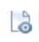

# Ingebouwde statuspictogrammen in weergaven

<!-- Audited: 11/2024 -->

<!--(NOTE: ALina: ***Link this from the Understanding Fields in Lists and Reports.)-->

U kunt het veld Ingebouwde statuspictogrammen als een kolom in uw weergaven toevoegen om de zichtbaarheid te vergroten in belangrijke punten van uw objecten. Met Statuspictogrammen kunt u in één oogopslag zien wanneer de volgende voorwaarden bestaan:

* Een object bevat documenten
* Een object is gekoppeld aan een goedkeuringsproces
* Aan een object zijn aanvullende notities gekoppeld
* Een last is factureerbaar of terugbetaalbaar
* Een taak bevindt zich op een kritiek pad
* Een gebruiker behoort tot een bedrijf, een team, of persoonlijk gevestigd in een verschillende tijdzone

Overweeg het volgende:

* De meeste indicatoren in het veld Statuspictogrammen zijn snelle koppelingen naar het werkelijke object of gebied van het object dat ze vertegenwoordigen.

* Als een van de items die door de pictogrammen worden vertegenwoordigd, niet aanwezig is in het object, wordt het pictogram dat het ontbrekende item vertegenwoordigt, grijs weergegeven in de kolom Statuspictogrammen in plaats van in een gekleurde afbeelding.

  

  Voor meer informatie, zie het [ Overzicht van de Pictogrammen van de Status en sectie van Vlaggen ](#overview-of-status-icons-and-flags) in dit artikel.

* In sommige meningen, wordt het **gebied van de Pictogrammen van de Status 0} genoemd** Vlaggen **of** Pictogrammen van de Mening **.**\
  U kunt de vormgeving van de pictogrammen in het veld Statuspictogrammen niet aanpassen.

* U kunt het aantal pictogrammen niet bewerken in het veld Statuspictogrammen.

## Toegangsvereisten

+++ Breid uit om de toegangseisen voor de functionaliteit in dit artikel weer te geven. 

<table style="table-layout:auto"> 
 <col> 
 <col> 
 <tbody> 
  <tr> 
   <td role="rowheader">Adobe Workfront-pakket</td> 
   <td> 
Alle
 </td> 
  </tr> 
  <tr> 
   <td role="rowheader">Adobe Workfront-licentie</td> 
   <td> 
      
Medewerker of hoger

      
Aanvraag of hoger

   </td>
  </tr>
  <tr> 
   <td role="rowheader">Configuraties op toegangsniveau</td> 
   <td> 
Toegang tot filters, weergaven, groepen bewerken
 
Toegang tot rapporten, dashboards, kalenders bewerken om kolommen aan een rapport toe te voegen
</td> 
  </tr> 
  <tr> 
   <td role="rowheader">Objectmachtigingen</td> 
   <td> 
Machtigingen beheren voor een bestaande weergave
 
Rechten beheren aan een rapport om er kolommen aan toe te voegen
</td> 
  </tr> 
 </tbody> 
</table>

Voor meer detail over de informatie in deze lijst, zie [ vereisten van de Toegang in de documentatie van Workfront ](/help/quicksilver/administration-and-setup/add-users/access-levels-and-object-permissions/access-level-requirements-in-documentation.md).

+++

## Het veld Statuspictogrammen toevoegen aan een weergave

In sommige ingebouwde weergaven en rapporten is het veld Statuspictogrammen al opgenomen.

U kunt het veld Statuspictogrammen niet aan alle weergaven toevoegen.

Het veld Statuspictogrammen toevoegen aan een aangepaste weergave die u vanaf nul maakt:

1. Ga naar een lijst met een van de volgende objecten:

   * Taken
   * Problemen
   * Projecten
   * Sjabloontaken
   * Sjablonen
   * Uitgaven
   * Documenten
   * Gebruikers\
     Slechts hebben deze voorwerpen het **beschikbare gebied van de Pictogrammen van de Status 0} {.**\
     Voor informatie over objecten lijsten, zie [ begonnen worden met lijsten in Adobe Workfront ](../../../workfront-basics/navigate-workfront/use-lists/view-items-in-a-list.md).

1. Van het **drop-down menu van de Mening**, uitgezochte **Nieuwe Mening**.

1. Klik **toevoegen Kolom**.
1. In **toon in deze kolom** doos, begin om het even welke volgende gebiedsnamen te typen, dan het te selecteren wanneer het in de lijst verschijnt:

   * *Pictogrammen van de Status*
   * *Vlaggen*
   * *Pictogrammen van de Mening* (slechts in de meningen van het Document).

   De ingebouwde pictogrammen staan onder een van deze namen.\
   Een mening van het Malplaatje bevat zowel de **Pictogrammen van de Status** als de **Vlaggen** gebieden. In dit geval bevatten de twee kolommen identieke pictogrammen.\
   De meningen van het document bevatten a **gebied van de Pictogrammen van de a** Mening.

1. Klik **sparen Mening**.
1. (Facultatief) specificeer een nieuwe naam voor uw mening, dan klik **sparen Mening**.\
   Dit voegt de **pictogrammen van de Status** kolom aan uw Mening toe.
1. (Optioneel) Plaats de muisaanwijzer op een pictogram om te begrijpen wat het vertegenwoordigt.
1. (Optioneel) Klik op een pictogram om naar het gebied van het object te gaan dat wordt weergegeven.\
   Niet alle pictogrammen zijn koppelingen naar objecten.\
   Voor een volledige lijst van attributen voor elk pictogram, zie het [ Overzicht van de Pictogrammen van de Status en sectie van Vlaggen ](#overview-of-status-icons-and-flags).

## Overzicht van statuspictogrammen en vlaggen {#overview-of-status-icons-and-flags}

In de volgende tabel worden alle statuspictogrammen weergegeven die beschikbaar zijn in Workfront, het type objecten dat eraan kan worden gekoppeld en wat er gebeurt wanneer u erop klikt.

U moet over machtigingen beschikken om de objecten ten minste weer te geven, zodat u op een aantal van de volgende pictogrammen kunt klikken en deze objecten kunt openen.

<table style="table-layout:auto"> 
 <col> 
 <col> 
 <col> 
 <col> 
 <col> 
 <thead> 
  <tr> 
   <th><strong> Pictogram van de Status of Vlag </strong> </th> 
   <th><strong> Beschrijving </strong> </th> 
   <th><strong> Voorwerp </strong> </th> 
   <th>Bij klikken</th> 
   <th> </th> 
  </tr> 
 </thead> 
 <tbody> 
  <tr> 
   <td> of   of   of </td> 
   <td>Geeft aan dat de voorwaarde van het project On Target (groen), In Trouble (rood) of At Risk (geel) is.  voor informatie over projectvoorwaarde, zie <a href="../../../manage-work/projects/manage-projects/project-condition-and-condition-type.md" class="MCXref xref"> Overzicht van het Type van de Voorwaarde en van de Voorwaarde van het Project </a>.</td> 
   <td>Projecten</td> 
   <td>Klik om de takenlijst van het project te openen. </td> 
   <td> </td> 
  </tr> 
  <tr> 
   <td>  </td> 
   <td>Geeft aan dat voor het object notities (updates) zijn opgenomen op het tabblad Updates.</td> 
   <td> 
De projecten   van Taken   Malplaatjes   Taken van het Malplaatje 
 </td> 
   <td> 
Klik om het tabblad Updates van het object te openen. 
 </td> 
   <td> </td> 
  </tr> 
  <tr> 
   <td> of </td> 
   <td>Geeft aan dat aan het object documenten zijn gekoppeld. </td> 
   <td> De projecten   van Taken   Malplaatjes   Taken van het Malplaatje  </td> 
   <td>Klik om het tabblad Documenten van het object te openen. </td> 
   <td> </td> 
  </tr> 
  <tr> 
   <td> of </td> 
   <td>Geeft aan dat er openstaande problemen zijn met het project of de taak.</td> 
   <td> Projecten   Taken </td> 
   <td>Klik om het object te openen. </td> 
   <td> </td> 
  </tr> 
  <tr> 
   <td>  of </td> 
   <td>Geeft aan dat er goedkeuring is voor het object.</td> 
   <td> De projecten   van Taken   Malplaatjes   Taken van het Malplaatje  </td> 
   <td>Klik om het object te openen. </td> 
   <td> </td> 
  </tr> 
  <tr> 
   <td>  </td> 
   <td> 
U kunt een kolom van het pictogram van Uitgaven in uw mening toevoegen om dit pictogram te tonen. Dit wijst erop dat het project of de taak uitgaven verbonden aan hen heeft.
 </td> 
   <td> 
Projecten
 
Taken
 </td> 
   <td>Klik om het tabblad Uitgaven van het project of de taak te openen. </td> 
   <td> </td> 
  </tr> 
  <tr> 
   <td>           </td> 
   <td> 
Geeft aan dat de status van voortgang van een taak een van de volgende is:
 
    <ul> 
     <li>Op tijd (groen vierkant)</li> 
     <li>Late (rode cirkel)</li> 
     <li>Risico (blauwe ruit)</li> 
     <li>Achter (gele driehoek)</li> 
    </ul> 
Voor informatie over de Voortgangsstatus van taken, zie <a href="../../../manage-work/tasks/task-information/task-progress-status.md" class="MCXref xref"> Overzicht van de Status van de Voortgang van de Taak </a>.
 </td> 
   <td>Taken</td> 
   <td>Klik om de taak te openen. </td> 
   <td> </td> 
  </tr> 
  <tr> 
   <td>  of </td> 
   <td>Geeft aan dat de taak zich momenteel op het kritieke pad bevindt.   voor informatie over taken op een Kritieke Weg van het project, zie <a href="../../../manage-work/tasks/manage-tasks/critical-path.md" class="MCXref xref"> Overzicht van het project Kritieke Weg </a>.</td> 
   <td>Taken</td> 
   <td>Klik om de taak te openen.</td> 
   <td> </td> 
  </tr> 
  <tr> 
   <td>  </td> 
   <td>Geeft aan dat de taak aan een mijlpaal is gekoppeld. Uw systeembeheerder kan de kleur van de ruit in uw milieu aanpassen.  voor informatie over mijlpalen, zie <a href="../../../administration-and-setup/customize-workfront/configure-approval-milestone-processes/create-milestone-path.md" class="MCXref xref"> een milestone weg </a> creëren.</td> 
   <td>Taken</td> 
   <td>Klik om de taak te openen. </td> 
   <td> </td> 
  </tr> 
  <tr> 
   <td>  </td> 
   <td>Koppeling naar het bronobject van een uitgave. Het bronobject van een uitgave is het object waarin de uitgave is vastgelegd. Een taak of een project kan bronvoorwerpen voor kwesties zijn. </td> 
   <td>Problemen</td> 
   <td>Klik om het bronobject (taak of project) van een uitgave te openen. </td> 
   <td> </td> 
  </tr> 
  <tr> 
   <td>  </td> 
   <td>Geeft aan dat er een object is dat het probleem uiteindelijk verhelpt. In dit geval kunt u het probleem niet voltooien. De bewerking wordt voltooid wanneer het object dat het omzetten uitvoert, is voltooid.   voor informatie over het oplossen van voorwerpen, zie <a href="../../../manage-work/issues/convert-issues/resolving-and-resolvable-objects.md" class="MCXref xref"> Overzicht van het Oplossen van en Oplosbare Voorwerpen </a>.</td> 
   <td>Problemen</td> 
   <td>Klik om het oplossende voorwerp van de kwestie te openen. </td> 
   <td> </td> 
  </tr> 
  <tr> 
   <td>  </td> 
   <td>Een document weergeven.</td> 
   <td>Documenten</td> 
   <td>Klik om het document te downloaden.</td> 
   <td> </td> 
  </tr> 
  <tr> 
   <td>  </td> 
   <td>Download een document.</td> 
   <td>Documenten</td> 
   <td>Klik om het document te downloaden.</td> 
   <td> </td> 
  </tr> 
  <tr> 
   <td>  </td> 
   <td>Geeft het type document aan.</td> 
   <td>Documenten</td> 
   <td>Klik om het document te downloaden.</td> 
   <td> </td> 
  </tr> 
  <tr> 
   <td>  </td> 
   <td>Wijst erop dat de gebruiker met een Bedrijf wordt geassocieerd. </td> 
   <td>Gebruikers</td> 
   <td>Niet beschikbaar</td> 
   <td> </td> 
  </tr> 
  <tr> 
   <td>  </td> 
   <td>Wijst erop dat de gebruiker met een Team wordt geassocieerd.</td> 
   <td>Gebruikers</td> 
   <td>Klik om het gebruikersprofiel te openen.</td> 
   <td> </td> 
  </tr> 
  <tr> 
   <td>  </td> 
   <td>Sneltoets naar het tabblad Toewijzing van de gebruiker. </td> 
   <td>Gebruikers</td> 
   <td>Klik om het tabblad Toewijzing van de gebruiker te openen en te leren aan welke werkitems de gebruiker heeft toegewezen.</td> 
   <td> </td> 
  </tr> 
  <tr> 
   <td>  </td> 
   <td>Geeft aan dat de gebruiker zich in een andere tijdzone bevindt dan die van het systeem.</td> 
   <td>Gebruikers</td> 
   <td>Niet beschikbaar</td> 
   <td> </td> 
  </tr> 
  <tr> 
   <td>  </td> 
   <td>Geeft aan dat een uitgave factureerbaar is.  voor informatie over uitgaven, zie <a href="../../../manage-work/projects/project-finances/manage-project-expenses.md" class="MCXref xref"> projectuitgaven beheren </a>.</td> 
   <td>Uitgaven</td> 
   <td>Niet beschikbaar</td> 
   <td> </td> 
  </tr> 
  <tr> 
   <td>  </td> 
   <td> Geeft aan dat een uitgave terugbetaalbaar is.  voor informatie over uitgaven, zie <a href="../../../manage-work/projects/project-finances/manage-project-expenses.md" class="MCXref xref"> projectuitgaven beheren </a>.</td> 
   <td>Uitgaven</td> 
   <td>Niet beschikbaar</td> 
   <td> </td> 
  </tr> 
  <tr> 
   <td> </td> 
   <td> Geeft aan dat een uitgave is vergoed.  voor informatie over uitgaven, zie <a href="../../../manage-work/projects/project-finances/manage-project-expenses.md" class="MCXref xref"> projectuitgaven beheren </a>.</td> 
   <td>Uitgaven</td> 
   <td>Niet beschikbaar</td> 
   <td> </td> 
  </tr> 
 </tbody> 
</table>
