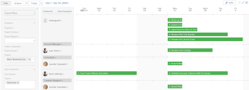

# Veroudering van hulpmiddelen voor het plannen van bronnen in Adobe Workfront

>[!IMPORTANT]
>  
>De planningsfunctionaliteit die in dit artikel wordt beschreven, is vanaf de release 23.1 in januari 2023 vervangen en uit Adobe Workfront verwijderd.   
>  
>  Dit artikel wordt ook verwijderd kort na de release van 23.1, begin 2023. Op dit moment raden we u aan eventuele bladwijzers dienovereenkomstig bij te werken. 
> 
> U kunt de werklastbalans nu gebruiken om werk voor uw bronnen te plannen. 
>  
> Voor informatie over het plannen van middelen die de Balancer van de Werkbelasting gebruiken, zie de sectie [De werklastbalans](../../resource-mgmt/workload-balancer/workload-balancer.md). 

<!--
We are currently in the process of removing all Scheduling tools from Adobe Workfront and replacing them with the Workload Balancer.

>[!IMPORTANT]
>
>We are no longer implementing new feature functionality for the current Scheduling solution and we no longer consider nor prioritize defects for a fix in this area of Adobe Workfront.

This article describes the timeline for this deprecation and it compares the functionality of the Scheduling tools and that of the Workload Balancer to indicate which Scheduling capabilities are already supported in the Workload Balancer. 

We have been announcing a more exact timeline through the Announcement Center at key milestones during the deprecation process and this article has been updated as this process continues.

>[!NOTE]
>
>The changes described in this article do not affect any other resource management tools. For example, they do not affect the [!UICONTROL Resource Planner] or the [!UICONTROL Utilization] report.
-->

## Hoe bereidt u zich voor

Voor gedetailleerde informatie over hoe u voor de overgang tussen Plannend en de Balancer van de Werkbelasting zou moeten voorbereidingen treffen, zie [Migreren van Resource Scheduling naar de Workload Balancer](../../resource-mgmt/resource-mgmt-overview/migrate-resource-scheduling-to-workload-balancer.md).

Als u momenteel de planningshulpmiddelen gebruikt, adviseren wij dat u hen beëindigt en begint te gebruiken de Balancer van de Werkbelasting.

Bijna alle mogelijkheden die eerder in de planningsgebieden beschikbaar waren, zijn nu beschikbaar in Workload Balancer. Zie de sectie [Beschikbaarheid van functies](#feature-availability) in dit artikel. U kunt uw bronnen blijven plannen voor uitsluitend het werk in Workload Balancer.

## Informatie die niet wordt overgedragen naar de werklastbalans

De volgende informatie wordt niet overgedragen van de planningsgereedschappen naar Workload Balancer:

* **Dagelijkse toewijzingen voor gebruikers**: U zou niet zowel Plannend als de Balancer van de Werkbelasting tezelfdertijd moeten gebruiken om de zelfde gebruikerstoewijzingen aan te passen. Als u gebruikerstoewijzingen in de planningshulpmiddelen hebt beheerd, brengen de aangepaste dagelijkse toewijzingen niet naar de Balancer van de Werkbelasting over. Op dezelfde manier als u gebruikerstoewijzingen in de Balancer van de Werkbelasting hebt aangepast, brengen zij niet naar de het plannen hulpmiddelen over. We raden u aan ervoor te zorgen dat de dagelijkse toewijzingen correct zijn in de Workload Balancer om deze overgang voor te bereiden. Zie voor meer informatie [Toewijzingen van gebruikers beheren in Workload Balancer](../workload-balancer/manage-user-allocations-workload-balancer.md).
* **Filters**: Als u filters in de planningsgebieden hebt opgeslagen, worden ze niet overgedragen naar Workload Balancer. U moet de filters opnieuw maken in Workload Balancer. Zie voor meer informatie [Gegevens in de werklastbalans filteren](../workload-balancer/filter-information-workload-balancer.md).

## Hooglichten in tijdlijn van verdringing

>[!IMPORTANT]
>
>Gebruik dit artikel voor een beter begrip van de meest recente tijdlijn voor het vervangen van planningsgereedschappen. Alle updates van deze tijdlijn worden in dit artikel en in de berichten van het Aankondigingscentrum vermeld.

Hier volgt een tijdlijn voor het verouderde proces van de planningsgereedschappen voor bronnen:

* [Release 2020.4 (november 2020)](#2020-4-release-november-2020)
* [Release 2021.4 (oktober 2021)](#2021-4-release-october-2021)
* [2022,4 - 2023,1-releases (oktober 2022 - januari 2023)](#2022-4-2023-1-releases)

### Release 2020.4 (november 2020) {#2020-4-release-november-2020}

* De nieuwe eigenschapfunctionaliteit wordt niet meer uitgevoerd voor de Plannende oplossing
* Alleen defecten met hoge en kritieke ernst krijgen prioriteit bij een correctie
* Nieuwe mogelijkheden voor werklastverdeling toegevoegd aan Workfront

### Release 2021.4 (oktober 2021) {#2021-4-release-october-2021}

* Werklastbalans is standaard ingesteld voor elke nieuwe gebruiker van Workfront
* Verbeterde filters die kunnen worden gedeeld en extra velden bevatten

### 2022,4 - 2023,1-releases (oktober 2022 - januari 2023) {#2022-4-2023-1-releases}

* Er wordt geen prioriteit toegekend aan defecten tijdens en na de releases van 2022.4 of 2023.1.
* Alle planningsgebieden worden verwijderd uit de voorvertoningsomgeving (**20 oktober 2022**)
* Alle plangebieden worden uit de productieomgeving verwijderd (**Januari 2023**)
* De werklastbalans is het enige middel dat in Workfront (na **Januari 2023**)

## Beschikbaarheid van functies {#feature-availability}

Tenzij anders vermeld, zijn of zullen alle eigenschappen van de Planning van het Middel beschikbaar in de Balancer van de Werkbelasting zijn. Voor informatie over de taakverdelingsfactor raadpleegt u [Overzicht van de werklastbalans](../../resource-mgmt/workload-balancer/overview-workload-balancer.md).

Naast bestaande eigenschappen, heeft of zal de Balancer van de Werkbelasting nieuwe functionaliteit hebben die niet in het Middel dat hulpmiddelen, zoals aangetoond in de volgende lijst plant bestond:

<table style="table-layout:auto"> 
 <col> 
 <col> 
 <col> 
 <col> 
 <col> 
 <tbody> 
  <tr> 
   <td rowspan="2"><b>Functies</b> </td> 
   <td rowspan="2"> <b>Beschikbaarheid van functies voor het plannen van resources</b></td> 
   <td colspan="3"><b>Beschikbaarheid werklastverdeling</b></td> 
  </tr> 
  <tr> 
   <td><b>Nu beschikbaar</b></td> 
   <td><b>Binnenkort beschikbaar</b></td> 
   <td><b>Niet gepland</b></td> 
  </tr> 
  <tr> 
   <td> 
Het hulpmiddel van de toegang van het Brongebied
 </td> 
   <td>✓</td> 
   <td>✓</td> 
   <td> </td> 
   <td> </td> 
  </tr> 
  <tr> 
   <td>Afzonderlijke gebieden voor niet toegewezen en toegewezen werk</td> 
   <td>✓</td> 
   <td>✓</td> 
   <td> </td> 
   <td> </td> 
  </tr> 
  <tr> 
   <td>Filters toepassen en maken voor niet toegewezen en toegewezen werk</td> 
   <td>✓</td> 
   <td>✓</td> 
   <td> </td> 
   <td> </td> 
  </tr> 
  <tr> 
   <td>Toegang tot werkitems rechtstreeks vanuit het gereedschap</td> 
   <td>✓</td> 
   <td>✓</td> 
   <td> </td> 
   <td> </td> 
  </tr> 
  <tr> 
   <td>Taken en problemen handmatig toewijzen of verwijderen</td> 
   <td>✓</td> 
   <td>✓</td> 
   <td> </td> 
   <td> </td> 
  </tr> 
  <tr> 
   <td>Individuele toewijzingen aanpassen</td> 
   <td>✓</td> 
   <td>✓</td> 
   <td> </td> 
   <td> </td> 
  </tr> 
  <tr> 
   <td>Inclusief uitgiftetijd</td> 
   <td>✓</td> 
   <td>✓</td> 
   <td> </td> 
   <td> </td> 
  </tr> 
  <tr> 
   <td>Voorspelde datums weergeven </td> 
   <td>✓</td> 
   <td>✓</td> 
   <td> </td> 
   <td> </td> 
  </tr> 
  <tr> 
   <td>Voltooid werk weergeven</td> 
   <td>✓</td> 
   <td>✓</td> 
   <td> </td> 
   <td> </td> 
  </tr> 
  <tr> 
   <td>Gebruikerstijd van gebruikers uit, weekends en planningsuitzonderingen tonen</td> 
   <td>✓</td> 
   <td>✓</td> 
   <td> </td> 
   <td> </td> 
  </tr> 
  <tr data-mc-conditions=""> 
   <td>Wijs snel gebruikers toe op basis van rollen* </td> 
   <td>✓</td> 
   <td>✓ </td> 
   <td> </td> 
   <td> </td> 
  </tr> 
  <tr data-mc-conditions=""> 
   <td>Vervang snel gebruikers* </td> 
   <td>✓</td> 
   <td>✓ </td> 
   <td> </td> 
   <td> </td> 
  </tr> 
  <tr data-mc-conditions=""> 
   <td>Wijs gebruikers snel weg* </td> 
   <td>✓</td> 
   <td>✓ </td> 
   <td> </td> 
   <td> </td> 
  </tr> 
  <tr> 
   <td>Het hulpmiddel van de toegang van een team </td> 
   <td>✓</td> 
   <td>✓ </td> 
   <td> </td> 
   <td> </td> 
  </tr> 
  <tr> 
   <td>Het hulpmiddel van de toegang van een project </td> 
   <td>✓</td> 
   <td>✓ </td> 
   <td> </td> 
   <td> </td> 
  </tr> 
  <tr>
   <td>Gebruikers met een werkvergunning kunnen gebruikerstoewijzingen aanpassen bij het openen van de werklastbalans van een project </td> 
   <td>✓</td> 
   <td>✓</td> 
   <td></td> 
   <td></td> 
  </tr> 
  <tr> 
   <td>Problemen weergeven in het gebied Niet toegewezen werk</td> 
   <td>✓</td> 
   <td>✓</td> 
   <td></td> 
   <td></td> 
  </tr> 
  <tr> 
   <td>Taken en problemen toewijzen en de toewijzing ongedaan maken door te slepen en neer te zetten* </td> 
   <td>✓</td> 
   <td>✓ </td> 
   <td> </td> 
   <td> </td> 
  </tr> 
  <tr> 
   <td>Zichtbaar voor alle gebruikers van het Plan, zonder een Manager van het Middel op het project te worden aangewezen.</td> 
   <td> </td> 
   <td>✓</td> 
   <td> </td> 
   <td> </td> 
  </tr> 
  <tr> 
   <td>Groepsinformatie per project</td> 
   <td> </td> 
   <td>✓</td> 
   <td> </td> 
   <td> </td> 
  </tr> 
  <tr> 
   <td>Deel de werklastbalans met gebruikers zonder toegang tot het gebied Bronnen</td> 
   <td> </td> 
   <td>✓</td> 
   <td> </td> 
   <td> </td> 
  </tr> 
  <tr> 
   <td>Toewijzingen per week weergeven en aanpassen</td> 
   <td> </td> 
   <td>✓</td> 
   <td> </td> 
   <td> </td> 
  </tr> 
  <tr> 
   <td>Toegang tot gebruikers rechtstreeks vanuit het gereedschap</td> 
   <td> </td> 
   <td>✓</td> 
   <td> </td> 
   <td> </td> 
  </tr> 
  <tr data-mc-conditions=""> 
   <td>Gebruik het deelvenster Samenvatting om meer informatie over werkitems te openen zonder weg te navigeren*</td> 
   <td> </td> 
   <td>✓</td> 
   <td> </td> 
   <td> </td> 
  </tr> 
  <tr> 
   <td>Toewijzing weergeven en aanpassen als een percentagewaarde </td> 
   <td> </td> 
   <td>✓</td> 
   <td> </td> 
   <td> </td> 
  </tr> 
  <tr> 
   <td>Het verschil weergeven tussen de beschikbare en de toegewezen tijd</td> 
   <td> </td> 
   <td>✓</td> 
   <td> </td> 
   <td> </td> 
  </tr> 
  <tr> 
   <td>Beschikbaarheid van gebruikers weergeven in een grafiek</td> 
   <td> </td> 
   <td>✓</td> 
   <td> </td> 
   <td> </td> 
  </tr> 
  <tr> 
   <td>De punten en de projecten van het kleurencodewerk door de Status van het Project</td> 
   <td> </td> 
   <td>✓</td> 
   <td> </td> 
   <td> </td> 
  </tr> 
  <tr> 
   <td>Geplande uren automatisch bijwerken tijdens het aanpassen van de gebruikerstoewijzing (voor taken met een eenvoudig type duur)</td> 
   <td> </td> 
   <td>✓</td> 
   <td> </td> 
   <td> </td> 
  </tr> 
  <tr> 
   <td>Wijzen voorstellen die op het de taakpatroon van de gebruiker, bestaande Rol of taken van het Team worden gebaseerd </td> 
   <td> </td> 
   <td>✓ </td> 
   <td> </td> 
   <td> </td> 
  </tr> 
  <tr> 
   <td>Verbeterde filters die kunnen worden gedeeld en extra velden bevatten</td> 
   <td> </td> 
   <td>✓</td> 
   <td> </td> 
   <td> </td> 
  </tr> 
  <tr> 
   <td>Geavanceerde toewijzingen maken </td> 
   <td> </td> 
   <td>✓ </td> 
   <td> </td> 
   <td> </td> 
  </tr>

<tr> 
   <td>Kleur-code het werkpunten door projecten en projectstatus </td> 
   <td> </td> 
   <td>✓ </td> 
   <td> </td> 
   <td> </td>

<tr> 
   <td>Voeg gebruikers aan het projectteam (opnieuw gevestigd aan toe <b>Mensen</b> tabblad van het project) </td> 
   <td>✓</td> 
   <td>✓</td> 
   <td></td> 
   <td> </td>

</tr>
   <tr> 
   <td>Taken en problemen automatisch toewijzen</td> 
   <td>✓</td> 
   <td> </td> 
   <td> </td> 
   <td>✓</td> 
  </tr>

</tbody> 
</table>

*Deze functies zijn alleen beschikbaar in de nieuwe Adobe Workfront-ervaring.
