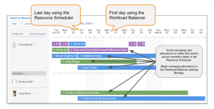

# Migreren vanuit bron [!UICONTROL Scheduling] aan de [!UICONTROL Workload Balancer]

De gemarkeerde informatie op deze pagina verwijst naar functionaliteit die nog niet algemeen beschikbaar is. Deze optie is alleen beschikbaar in de voorvertoningsomgeving.

<!-- drafted for res scheduling deprecation blurb for PREVIEW release - Oct 2022 - CHANGE THIS BLURB TO SOMETHING ELSE AT PRODUCTION:-->

>[!CAUTION]
>  
>  
> De planningsgebieden zijn verwijderd uit de voorvertoningsomgeving en worden verwijderd uit de productieomgeving in **Januari 2023**. \
>  Na Januari 2023, moet u uw middelen in de Balancer van de Werkbelasting plannen. 
>  
> Voor informatie over het plannen van middelen die de Balancer van de Werkbelasting gebruiken, zie de sectie [De werklastbalans](../../resource-mgmt/workload-balancer/workload-balancer.md).

De informatie in dit artikel is op u slechts van toepassing als u het plannen van uw middelen in het Middel hebt beheerd [!UICONTROL Scheduling] gebieden van Adobe Workfront. Workfront is begonnen met de veroudering van de [!UICONTROL Scheduling] in november 2020 en heeft deze vervangen door de [!UICONTROL Workload Balancer].

Voor informatie over het afbraakplan voor de [!UICONTROL Resource Scheduling] en de tijdlijn voor de vervanging ervan door de [!UICONTROL Workload Balancer], zie [Veroudering van hulpmiddelen voor het plannen van bronnen in Adobe Workfront](../../resource-mgmt/resource-mgmt-overview/deprecate-resource-scheduling.md).

We willen dat u zo weinig mogelijk werkonderbreking ervaart door u te helpen bij het ontwerpen van een migratieplan. De onderstaande stappen helpen u uw team op te leiden en bepalen hoe lang u het beste kunt overschakelen op [!UICONTROL Workload Balancer].

## Zoek de planningtools voor resources

U en uw teams kunnen sommige Middel gebruiken [!UICONTROL Scheduling] gereedschappen in de volgende gebieden van Workfront:

* De [!UICONTROL Scheduling] in de [!UICONTROL Resourcing] gebied
* De [!UICONTROL Scheduling] deel van een project
* De [!UICONTROL Schedule] deel van een team

Met deze afgekeurde [!UICONTROL Workload Balancer] vervangt alle  [!UICONTROL Resource Scheduling] in alle hierboven vermelde gebieden.

## Stap 1: Laat uw teams getraind

De training volgen [Resourcebeheerprogramma voor de nieuwe Adobe Workfront-ervaring](https://one.workfront.com/s/resource-management-program-nwe) (75 minuten) op Workfront One.

Neem contact op met de Klantenondersteuning als u problemen ondervindt bij het aanmelden of het openen van de cursus. Zie voor meer informatie [Contact opnemen met Klantenondersteuning](../../workfront-basics/tips-tricks-and-troubleshooting/contact-customer-support.md).

## Stap 2: De beste migratietijd bepalen {#step-2-determine-the-best-time-to-migrate}

Voer de onderstaande stappen uit om te bepalen wanneer de migratie het beste voor u is:

1. Bepaal welke eigenschappen in het Middel [!UICONTROL Scheduling] de hulpmiddelen uw team het meeste gebruikt en ervoor zorgen dat die eigenschappen in beschikbaar zijn in [!UICONTROL Workload Balancer]. Voor informatie over welke functies momenteel beschikbaar zijn in het dialoogvenster [!UICONTROL Workload Balancer], zie de sectie &quot;Beschikbaarheid van de Eigenschap&quot; in het artikel [Veroudering van hulpmiddelen voor het plannen van bronnen in Adobe Workfront](../../resource-mgmt/resource-mgmt-overview/deprecate-resource-scheduling.md).

   >[!IMPORTANT]
   >
   >Bijna alle mogelijkheden van de planningshulpmiddelen zijn nu in de Balancer van de Werkbelasting.

1. Bepaal of uw team gebruikerstoewijzingen voor toewijzingen beheert. Het aanpassen van of het wijzigen van gebruikerstoewijzingen betekent het wijzigen van de geplande uren per dag voor elke gebruiker over de duur van een het werkpunt.

   Toewijzingen die zijn bewerkt met de planningsgereedschappen, worden niet overgebracht naar Workload Balancer. Door gebrek, verdeelt het systeem evenzeer de totale Geplande Uren van een het werkpunt over de volledige duur van het punt.

   U moet toewijzingen in het werklastevenwicht handmatig beheren om ervoor te zorgen dat de toewijzingen overeenkomen met de toewijzingen in de planningsgereedschappen. Zie voor meer informatie [Toewijzingen van gebruikers beheren in Workload Balancer](../workload-balancer/manage-user-allocations-workload-balancer.md).

1. Opgeslagen filters in het planningsgebied worden niet automatisch overgedragen naar Workload Balancer. Maak tijd om filters te maken die u nodig hebt in Workload Balancer. Zie voor informatie over het maken van filters in Workload Balancer [Gegevens in de werklastbalans filteren](../workload-balancer/filter-information-workload-balancer.md).

<!--
1. Using the information gathered from Steps 1 and Step 2, decide which version of Step 3 you should continue with based on the needs of your organization.
-->

## Stap 3: Migreren naar de [!UICONTROL Workload Balancer]{#step-3-migrate-to-the-workload-balancer}

We hebben de volgende versies voor deze stap geïdentificeerd, afhankelijk van uw bevindingen in stap 2:

* [Stap 3a: U of uw teams gebruiken de [!UICONTROL Scheduling] -gereedschappen, maar de gebruikerstoewijzing niet wijzigen](#step-3a-you-or-your-teams-use-the-scheudling-tools-but-do-not-modify-user-allocation)
* [Stap 3b: U of uw teams beheren gebruikerstoewijzingen in de [!UICONTROL Scheduling] gereedschappen](#step-3b-you-or-your-teams-manage-user-allocations-in-the-scheduling-tools)

### Stap 3a: U of uw teams gebruiken de [!UICONTROL Scheduling] -gereedschappen, maar de gebruikerstoewijzing niet wijzigen

Als u of uw teams de dagelijkse uurtoewijzingen op het werktaken niet wijzigen, dan bent u bereid om het plannen van middelen aan te schakelen [!UICONTROL Workload Balancer].

Ga als volgt te werk:

* Kies een overgangsdatum.

   >[!TIP]
   >
   >Geef uw team enige tijd om de training over het gebruik van de werklastbalans vóór de overgangsdatum te doorlopen. Zie de sectie voor informatie over training [Migreren van Resource Scheduling naar de Workload Balancer](#migrate-from-resource-uicontrol-scheduling-to-the-uicontrol-workload-balancer) in dit artikel.

* Volg deze richtlijnen om uw teams bij te staan:

   * Moedig uw teams aan om de [Overzicht van de [!UICONTROL Workload Balancer]](../../resource-mgmt/workload-balancer/overview-workload-balancer.md) pagina en alle pagina&#39;s die van daaruit zijn gekoppeld om dieper in te gaan op de manier waarop de [!UICONTROL Workload Balancer] werkt.
   * De vergaderingen van FAQ van de gastheer voor uw teams om vragen de week vóór de overgang te beantwoorden, maakt de schakelaar, en houdt dan een andere vergadering van FAQ om follow-upvragen te beantwoorden.
   * Feedback verzenden naar Workfront met de button Feedback op de bovenste werkbalk. Onze productontwikkelaars hebben er altijd belang bij om uw gebruiksscenario&#39;s te horen voor hoe we de [!UICONTROL Workload Balancer] Geef meer waarde op.

### Stap 3b: U of uw teams beheren gebruikerstoewijzingen in de [!UICONTROL Scheduling] gereedschappen

Als uw werkschema dit scenario aanpast, zou u strategischer in uw overgangsplan moeten zijn. De dagelijkse toewijzingen die in de [!UICONTROL Scheduling] de gereedschappen worden opgeslagen in een andere database dan de dagelijkse toewijzingen die worden weergegeven in de [!UICONTROL Workload Balancer]. Dit betekent dat de aanpassingen van dagelijkse toewijzingen die u in het Middel doet [!UICONTROL Scheduling] de instrumenten worden niet overgedragen naar de dagelijkse toewijzingen in de [!UICONTROL Workload Balancer].

>[!CAUTION]
>
>U hebt tot **Januari 2023** om ervoor te zorgen dat uw gebruikerstoewijzing uit de planningsgebieden overeenkomt met die in de werklastverdeler in uw productieomgeving. Op dat ogenblik, verwijderen wij de Plannende hulpmiddelen uit het milieu van de Productie. U moet de toewijzingen in het werklastevenwicht handmatig aanpassen, zodat deze overeenkomen met de toewijzingen in de planningsgereedschappen. De planningsgereedschappen zijn al verwijderd uit de voorvertoningsomgeving.

Houd rekening met het volgende wanneer u de overgang naar de [!UICONTROL Workload Balancer] wanneer u deze [!UICONTROL Scheduling] functionaliteit:

* Het beheer van de toewijzingen in de [!UICONTROL Scheduling] hulpmiddelen aangezien uw middelmanagers de schakelaar maken. Dit doet u als volgt:

   * Ontdek de gemiddelde duur van taken in uw huidige projecten en neem dat in overweging wanneer het bepalen van hoe lang u op het beheren van de gebruikerstoewijzingen moet houden.

      >[!TIP]
      >
      >U moet slechts naar uw huidige of planningsprojecten kijken, die zijn die waarvoor uw teams actief taken maken en dagelijkse toewijzingen beheren.

   * Creeer een taakrapport en voeg het gebied van de Duur van de taak in de mening toe en groepeer het door de Naam van het Project. vatten de kolom van de Duur in de Mening door het Gemiddelde samen, dan sparen uw rapport.

      Voor informatie over het creëren van een rapport, zie [Een aangepast rapport maken](../../reports-and-dashboards/reports/creating-and-managing-reports/create-custom-report.md) .

   * Analyseer uw taakrapport. Als de gemiddelde taakduur bijvoorbeeld 3 dagen is, is een overgang van één week wellicht het beste. Laat het team een week lang ophouden met het beheren van gebruikerstoewijzingen. In de volgende week gaat u naar het team [!UICONTROL Workload Balancer] en beginnen met het beheren van gebruikerstoewijzingen die volgende week plaatsvinden.
   >[!NOTE]
   >
   >Deze suggestie werkt mogelijk niet als de gemiddelde taakduur langer is dan de resterende tijd tot de verwijdering van de planningsinstrumenten.

   

   >[!TIP]
   >
   >Tijdens de overgangsperiode kunt u taken blijven uitvoeren en taken blijven uitvoeren. De toegewezen taken zullen in zowel de Planner van het Middel als worden weerspiegeld [!UICONTROL Workload Balancer].

* Als u een grotere organisatie bent met teams die middelen voor honderden projecten beheren, kunt u overwegen om van [!UICONTROL Scheduling] aan de [!UICONTROL Workload Balancer] één portfolio tegelijk. Overweeg een gefaseerde uitrol door aangepaste filters te maken in het dialoogvenster [!UICONTROL Workload Balancer] een specifieke portefeuille tegelijk bekijken.

* Sta uw middelmanagers toe om omhoog te team: één persoon te laten beoordelen in de  [!UICONTROL Resource Scheduling] de instrumenten en een passende aanpassing van de [!UICONTROL Workload Balancer]. Zodra dat team van twee beide hulpmiddelen met elkaar in overeenstemming brengt, laat hen hun werkschema&#39;s naar [!UICONTROL Workload Balancer].

## Meer hulp nodig

Neem contact op met Aangepaste ondersteuning als u aanvullende informatie nodig hebt bij deze migratie. Voor informatie over het contacteren van Steun, zie [Contact opnemen met Klantenondersteuning](../../workfront-basics/tips-tricks-and-troubleshooting/contact-customer-support.md).
