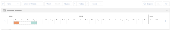

# Datums voor budgettering aanpassen in de functie voor middelenplanning

Als u vindt dat er overtoewijzingen van uw middelen zijn nadat u hen in de Planner van het Middel hebt begroot, kunt u onderzoeken wat-als scenario&#39;s door de Begrotende Uren, FTE, of Kosten naar een ander tijdkader te verplaatsen. Op basis van de bevindingen in deze scenario&#39;s kunt u uw begrote uren uren, VTE, of Kosten dan aanpassen.

Overtoewijzingen kunnen verschijnen wanneer de begrote Uren, FTE, of Kosten van uw middelen hoger dan hun Beschikbare Uren, VTE, of Kosten zijn. Hierdoor wordt een negatieve nettowaarde gegenereerd.

## Toegangsvereisten

U moet het volgende hebben:

<table style="table-layout:auto"> 
 <col> 
 <col> 
 <tbody> 
  <tr> 
   <td role="rowheader">Adobe Workfront-abonnement*</td> 
   <td> 
Pro en hoger
 </td> 
  </tr> 
  <tr> 
   <td role="rowheader">Adobe Workfront-licentie*</td> 
   <td> 
Plan 
 </td> 
  </tr> 
  <tr> 
   <td role="rowheader">Configuraties op toegangsniveau*</td> 
   <td> 
Toegang tot resourcebeheer bewerken, inclusief toegang tot bewerkingsprioriteiten en begrotingstijden in de bronnenplanner
 
Toegang tot financiële gegevens, projecten en gebruikers bewerken
 
<b>OPMERKING</b>

Als u nog steeds geen toegang hebt, vraagt u de Workfront-beheerder of deze aanvullende beperkingen op uw toegangsniveau instelt. Voor informatie over hoe een beheerder van Workfront uw toegangsniveau kan veranderen, zie <a href="../../administration-and-setup/add-users/configure-and-grant-access/create-modify-access-levels.md" class="MCXref xref"> tot douanetoegangsniveaus </a> leiden of wijzigen.
 </td>
</tr> 
  <tr> 
   <td role="rowheader">Objectmachtigingen</td> 
   <td> 
Beheer machtigingen voor de projecten waarvoor u begrotingsgegevens wilt maken met de mogelijkheid om financiën te beheren
 
Voor informatie bij het vragen van om extra toegang, zie <a href="../../workfront-basics/grant-and-request-access-to-objects/request-access.md" class="MCXref xref"> de toegang van het Verzoek tot voorwerpen </a>.
 </td> 
  </tr> 
 </tbody> 
</table>

&#42; om te weten te komen welk plan, vergunningstype, of toegang u hebt, contacteer uw beheerder van Workfront.

## Bochtingsdatums aanpassen

1. Ga naar de Planner van het Middel en selecteer **Mening door Project**.

   >[!NOTE]
   >
   >U kunt de Adjust Gefabriceerde optie van Datums gebruiken slechts wanneer u de Planner van het Middel door project bekijkt.

1. Beweeg over de naam van een project, dan klik **Meer** menu.
1. Klik **aanpassen het Begrotingstermijnen**.\
   De tijdlijn voor projecttoewijzing wordt weergegeven.\
   Het tijdsbestek waarin de uren momenteel in de begroting zijn opgenomen, wordt oranje gemarkeerd als er sprake is van een begrotingsconflict en blauw als er geen conflicten zijn.

   

1. Sleep het gemarkeerde tijdframe naar een ander tijdstip om te begrijpen waar er geen begrotingsconflicten zijn voor het geselecteerde project. Wanneer u een tijdkader vindt waar de Netto waarde positief is, verandert het benadrukte tijdkader in blauw.
1. Klik op de &#39;x&#39; in de rechterbovenhoek van de tijdlijn van de projecttoewijzing om deze te sluiten.
1. Verwijder de begrote uren uren uit de bestaande tijdlijn van het project en voeg hen aan de chronologie toe die de meeste beschikbaarheid toont.
1. Klik **sparen**.
1. (Voorwaardelijk en optioneel) Als de tijdframes zonder budgetconflicten zich buiten de tijdlijn van het project bevinden, klikt u op de naam van het project om het project te openen.
1. (Voorwaardelijk en facultatief) klik **uitgeven Project**, dan geef de **Geplande Datum van het Begin** of de **Geplande Datum van de Voltooiing** uit om de chronologie van het project voor het tijdkader zonder het in de begroting opnemen conflicten te wijzigen.\
   Voor meer informatie over het uitgeven van projecten, zie het artikel [ projecten ](../../manage-work/projects/manage-projects/edit-projects.md) uitgeven.

1. (Voorwaardelijk en facultatief) klik **sparen Veranderingen**.
1. Keer terug naar de Planner van het Middel en neem de Begrotingspunten, FTEs, of Kosten in het tijdkader opnieuw op zonder in de begroting op te nemen conflicten.
1. Klik **sparen**.
