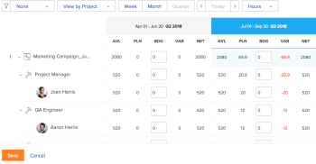

# De middelen van de begroting in de Planner van het Middel gebruikend de meningen van het Project en van de Rol

<!--
<p data-mc-conditions="QuicksilverOrClassic.Draft mode">(NOTE: broken off of another larger article (Planning in the RP); reformat, restructure, relink)</p>
-->

De belangrijkste functie van de Planner van het Middel is uw middelen voor het werk te begroten dat aan projecten moet worden voltooid.

>[!IMPORTANT]
>
>U kunt uw middelen begroting slechts als u de **Mening door Project** of **Mening door de meningen van de Rol** op de Planner van het Middel toepast.

Lees de volgende artikelen voordat u begint met budgetinformatie in de functie voor middelenplanning:

* [ Overzicht van de Planner van het Middel ](../../resource-mgmt/resource-planning/get-started-resource-planner.md)
* [ toegang nodig aan begrotingsmiddelen in Adobe Workfront ](../../resource-mgmt/resource-planning/access-needed-to-budget-resources.md)
* [Overzicht van uren, FTE, en kosteninformatie in de mening van het Project en van de Rol van de Planner van het Middel](../../resource-mgmt/resource-planning/overview-of-planner-hour-fte-cost-information-in-role-project-views.md)

## Toegangsvereisten

U moet de volgende toegang hebben om de stappen in dit artikel uit te voeren:

<table style="table-layout:auto"> 
 <col> 
 <col> 
 <tbody> 
  <tr> 
   <td role="rowheader">Adobe Workfront-abonnement*</td> 
   <td> <p>Pro en hoger</p> </td> 
  </tr> 
  <tr> 
   <td role="rowheader">Adobe Workfront-licentie*</td> 
   <td> <p>Plan </p> </td> 
  </tr> 
  <tr> 
   <td role="rowheader">Configuraties op toegangsniveau*</td> 
   <td> <p>Toegang tot resourcebeheer bewerken, inclusief toegang tot bewerkingsprioriteiten en begrotingstijden in de bronnenplanner</p> <p>Toegang tot financiële gegevens voor begrotingsmiddelen via kostenaanpassing bewerken</p> <p>Toegang tot projecten en gebruikers bewerken</p> <p><b>OPMERKING</b>

Als u nog steeds geen toegang hebt, vraagt u de Workfront-beheerder of deze aanvullende beperkingen op uw toegangsniveau instelt. Voor informatie over hoe een beheerder van Workfront uw toegangsniveau kan veranderen, zie <a href="../../administration-and-setup/add-users/configure-and-grant-access/create-modify-access-levels.md" class="MCXref xref"> tot douanetoegangsniveaus </a> leiden of wijzigen.</p> </td>
</tr> 
  <tr> 
   <td role="rowheader">Objectmachtigingen</td> 
   <td> <p>Rechten beheren voor de projecten waarvoor u begrotingsgegevens wilt opgeven</p> <p>Voor informatie bij het vragen van om extra toegang, zie <a href="../../workfront-basics/grant-and-request-access-to-objects/request-access.md" class="MCXref xref"> de toegang van het Verzoek tot voorwerpen </a>.</p> </td> 
  </tr> 
 </tbody> 
</table>

&#42; om te weten te komen welk plan, vergunningstype, of toegang u hebt, contacteer uw beheerder van Workfront.

## Begrotingsmiddelen in de middelenplanner

* [ middelen van de Begroting in de Mening van het Project ](#budget-resources-in-the-project-view)
* [ middelen van de Begroting in de Mening van de Rol ](#budget-resources-in-the-role-view)
* [Begrotingsmiddelen in bulk](#budget-resources-in-bulk)

### Begrotingsmiddelen in de projectweergave {#budget-resources-in-the-project-view}

<!--
<p data-mc-conditions="QuicksilverOrClassic.Draft mode">(NOTE: this section is linked to the Budgeting Project Resources in the Business Case article)</p>
-->

1. Klik het **Belangrijkste pictogram van het Menu**  in de hoger-juiste hoek van Adobe Workfront.

1. Klik **Middelen**.
1. De **vertoningen van de Planner** door gebrek.
1. (Voorwaardelijk) selecteer de **Mening door de mening van het Project**.
1. Breid de projecten en de baanrollen uit om de toewijzing voor het project, baanrollen, of gebruikers te beheren.
1. Voer een van de volgende handelingen uit om uw budget toe te wijzen aan gebruikers:

   * In de **BDG** kolom, specificeer manueel een aantal begrote uren, FTE, of kosten voor de gebruikers.

   * Klik het **Meer** menu voor de baanrol van de gebruiker, dan klik **Gepland Uren van de Plaats van Gebruikers zoals Beoogde**.\
     De begrotingsuren van elke gebruiker worden berekend met behulp van de volgende formule:

     ```
     User Budgeted Hours = User Planned Hours
     ```

1. Voer een van de volgende handelingen uit om begrotingstoewijzing voor taakrollen toe te wijzen:

   * In de **BDG** kolom, specificeer manueel een aantal begrote uren, FTE, of kosten voor de baanrol.

     >[!NOTE]
     >
     >De rol begrotingsuren wordt toegevoegd aan het voor het project begrote uren uur.

   * (Voorwaardelijk) als u uren voor gebruikers in de begroting hebt opgenomen, klik het **Meer** menu voor de baanrol, dan klik **Totale Beoogde Uren van Gebruikers voor Rol**.\
     De begrotingsuren voor elke rol worden berekend met behulp van de volgende formule:

     ```
     Role Budgeted Hours = SUM(User Budgeted Hours)
     ```

   * Klik het **Meer** menu voor het project, dan klik **Geplande Uren van Rollen&quot;plaatsen zoals Beoogd**.\
     De begrotingsuren voor elke rol worden berekend met behulp van de volgende formule:\
     *

     ```
     Role Budgeted Hours = Role Planned Hours
     ```

     >[!NOTE]
     >   
     >* De rol begrotingsuren wordt toegevoegd aan het voor het project begrote uren uur.
     >* De gebruikers kunnen voor zowel Primaire als Andere (of secundaire) Rollen in de begroting worden opgenomen.
     >* Het **Percentage van VTE Beschikbaarheid** voor de rollen van de gebruiker moet een aantal verschillend zijn dan 0% voor de Beschikbare Uren om een waarde in de Planner van het Middel voor een baanrol te tonen. Als een gebruiker met een rol met een 0% **Percentage van VTE Beschikbaarheid** wordt geassocieerd, is de Beschikbare waarde van Uren nul voor die baanrol. In dit geval, zou de rol een negatieve **Netto Waarde** kunnen tonen.\
     >Voor meer informatie over het **Percentage van Beschikbaarheid FTE** voor baanrollen, zie het artikel [ het profiel van een gebruiker ](../../administration-and-setup/add-users/create-and-manage-users/edit-a-users-profile.md) uitgeven.

   * In de **BDG** kolom, specificeer manueel een aantal begrote uren, FTE, of kosten voor het project. Hierdoor wordt het aantal begrote uren projecturen verdeeld over elke rol in het kader van het project. De volgende scenario&#39;s bestaan:

      * Als het aantal begrote uren uren van het Project uw specificeert de Geplande Uren van het Project evenaart, past de Rol Geplande Uren de Rol de Geplande Uren.
      * Als het aantal begrote uren uren van het Project u specificeert niet de Geplande Uren van het Project evenaart, wordt de Rol Geboedgeted Uren verdeeld volgens het percentage Geplande Uren nodig voor elke rol.\
        Bijvoorbeeld, als een project 20 Geplande Uren heeft, en zij tussen twee baanrollen worden verdeeld (de Consultant vereist 12 Geplande Uren en de ingenieur vereist 8 Geplande Uren), en u begroot 30 uren voor het Project, zijn de uren als volgt verdeeld: de Consultant ontvangt 18 Geplande Uren, en de rol van de Ingenteur ontvangt 12 Begrotingstijd.

1. Voer een van de volgende handelingen uit om een budget voor het project toe te wijzen:

   * Begroting van de rollen in het kader van het project, zoals beschreven in Stap 7.\
     Het voor het project uitgetrokken aantal uren wordt berekend aan de hand van de volgende formule:

     ```
     Project Budgeted Hours = SUM(Role Budgeted Hours)
     ```

   * In de **BDG** kolom, specificeer manueel een aantal begrote uren, FTE, of kosten voor het project.\
     Hiermee werkt u de rol die is toegewezen aan uren bij, zoals beschreven in stap 7.\
     

1. Klik **sparen**.\
   Nadat u uw middelen in de Planner van het Middel begroot, zijn de Begrotingstijd voor uw middelen en om het even welke kosten verbonden aan hen vermeld in het BedrijfsGeval van elk project.\
   Voor meer informatie over het begrip van het gebied van de Begroting van het Middel van het BedrijfsGeval, zie de sectie &quot;het Leiden van het Middel&quot;in het artikel [ Overzicht van de Gebieden van het BedrijfsGeval ](../../manage-work/projects/define-a-business-case/areas-of-business-case.md).

1. (Optioneel) Selecteer de weergave Gebruiker om te zien of de gebruiker teveel of te weinig gebruikmaakt van de beschikbare en geplande uren voor elke gebruiker. De begrote uren uren zijn niet zichtbaar in de mening van de Gebruiker.

   Voor informatie over hoe Workfront de beschikbaarheid van een gebruiker berekent, zie [ de voorkeur van het Beheer van het Middel ](../../administration-and-setup/set-up-workfront/configure-system-defaults/configure-resource-mgmt-preferences.md) vormen.

### Begrotingsmiddelen in de weergave Rol {#budget-resources-in-the-role-view}

<!--
<div data-mc-conditions="QuicksilverOrClassic.Draft mode">
<p>(NOTE: THIS IS WRONG - I LOGGED A BUG TO FIX THIS LINK - IT SHOULD GO TO"ACCESS NEEDED TO BUDGET IN THE RP":</p>
<p>Planning in the resource planner has links to the UI - ensure Flare notes are there for this: https://workfront.zendesk.com/hc/en-us/articles/115006356928 - the "Budgeting resources in the role view" is linked to this tooltip: ***This is linked to the product in the RP when the user does not have Manage rights on one of the projects under the role. This tool tip is linked here: "You don't have Manage permissions for all projects. Budget hours by individual project instead. Learn more...")</p>
</div>
-->

U moet Edit toegang tot het Beheer van het Middel en Financiële Gegevens hebben en de toestemmingen van de Financiën van het Beheer op de projecten om middelen in de Planner van het Middel te begroten. Als u slechts de toegang van de Mening tot minstens één project hebt dat onder een baanrol wordt vermeld, kunt u geen toewijzingen voor de rol in de mening van de Rol begroten. U kunt budgettoewijzing voor de projecten nog steeds uitvoeren waarvoor u beheermachtigingen hebt.

Voor informatie over de toegang nodig voor het opnemen van middelen, zie de artikel [ Toegang nodig aan begrotingsmiddelen in Adobe Workfront ](../../resource-mgmt/resource-planning/access-needed-to-budget-resources.md).

Aan begrotingstoewijzingen in de Planner van het Middel in de*** mening van de Rol:

1. Klik het **Belangrijkste pictogram van het Menu**  in de hoger-juiste hoek van Adobe Workfront.

1. Klik **Middelen**.
1. De **vertoningen van de Planner** door gebrek.
1. (Voorwaardelijk) selecteer de **Mening door de mening van de Rol**.
1. Breid de baanrollen en de projecten uit om de toewijzing voor het project, baanrollen, of gebruikers te beheren.
1. Voer een van de volgende handelingen uit om uw budget toe te wijzen aan gebruikers:

   * In de **BDG** kolom, specificeer manueel een aantal begrote uren, FTE, of kosten voor de gebruikers.
   * Klik het **Meer** menu voor het project, dan klik **Gepland Uren van de Plaats van Gebruikers zoals Beoogd**.\
     De begrotingsuren van elke gebruiker worden berekend met behulp van de volgende formule:

     ```
     User Budgeted Hours = User Planned Hours
     ```

1. Voer een van de volgende handelingen uit om begrotingstoewijzing voor taakrollen toe te wijzen:

   * In de **BDG** kolom, specificeer manueel een aantal begrote uren, FTE, of kosten voor de baanrollen.\
     Dit verdeelt de Rol Geboedde Uren aan het Project Geplande Uren voor de projecten die u toegang hebt om te leiden.

   * Klik het **Meer** menu voor de baanrol, dan klik **Plaats Projecten&#39; Geplande Uren zoals Beoogd.**De Rol die in de begroting wordt opgenomen Uren wordt berekend gebruikend de volgende formule:\
     *

     ```
     Role Budgeted Hours = SUM(Project Budgeted Hours)
     ```

     *Het voor het project uitgetrokken aantal uren wordt berekend met behulp van de volgende formule:

     ```
     Project Budgeted Hours = Project Planned Hours
     ```

   * In de **BDG** kolom, specificeer manueel een aantal begrote uren, FTE, of kosten voor de projecten die onder de baanrol worden vermeld.\
     Hiermee voegt u het aantal begrote uren projecturen toe aan de rol.

   >[!NOTE]
   >
   >De gebruikers kunnen voor zowel Primaire als Andere (of secundaire) Rollen in de begroting worden opgenomen. Het **Percentage van VTE Beschikbaarheid** voor de rollen van de gebruiker moet een aantal verschillend zijn dan 0% voor de Beschikbare Uren om een waarde in de Planner van het Middel voor een baanrol te tonen. Als een gebruiker met een rol met een 0% **Percentage van VTE Beschikbaarheid** wordt geassocieerd, is de Beschikbare waarde van Uren nul voor die baanrol. In dit geval, zou de rol een negatieve **Netto Waarde** kunnen tonen.\
   >Voor meer informatie over het **Percentage van Beschikbaarheid FTE** voor baanrollen, zie het artikel [ het profiel van een gebruiker ](../../administration-and-setup/add-users/create-and-manage-users/edit-a-users-profile.md) uitgeven.

1. Voer een van de volgende handelingen uit om een budget voor het project toe te wijzen:

   * In de **BDG** kolom, specificeer manueel een aantal begrote uren, FTE, of kosten voor de projecten.\
     Dit werkt ook de begrotingsuren bij voor de rollen waaronder het project wordt vermeld.

   * Klik het **Meer** menu voor de baanrol, dan klik **Geplande Uren van Projecten&quot;plaatsen zoals Gegrogeerd**.\
     De voor het project uitgetrokken uren worden berekend aan de hand van de volgende formule:

     ```
     Project Budgeted Hours = Project Planned Hours
     ```

     De begrote uren projecturen worden toegevoegd aan de Rol Geforceerde Uren.

   * (Voorwaardelijk) als u de uren voor de gebruikers in de begroting hebt opgenomen, klik het **Meer** menu voor het project, dan klik **Totale Beoogde Uren van Gebruikers voor Project**.\
     Het budget voor het project wordt berekend met behulp van de volgende formule:

     ```
     Project Budgeted Hours = SUM(User Budgeted Hours)
     ```

     

1. Klik **sparen**.\
   Nadat u uw middelen in de Planner van het Middel begroot, zijn de Begrotingstijd voor uw middelen en om het even welke kosten verbonden aan hen vermeld in het BedrijfsGeval van elk project.\
   Voor meer informatie over het begrip van het gebied van de Begroting van het Middel van het BedrijfsGeval, zie de artikel [ middelen van de Begroting in het BedrijfsGeval ](../../manage-work/projects/define-a-business-case/budget-resources-in-business-case.md).

1. (Facultatief) selecteer de **Mening door Gebruiker** mening om het even welke gebruikersovertoewijzingen of onderbenutting tussen Beschikbaar en Geplande Uren voor elke gebruiker op te merken. De begrote Uren zijn niet zichtbaar in de Mening door Gebruiker.

### Begrotingsmiddelen in bulk {#budget-resources-in-bulk}

U kunt begrotingstoewijzingen voor uw middelen in bulk wanneer het gebruiken van snelle verbindingen. De snelle verbindingen zijn beschikbaar slechts voor de Mening van het Project en van de Rol.


>[!NOTE]
>
>Wanneer de snelle koppelingen naar begrotingstoewijzingen voor middelen worden gebruikt, wordt de budgettering automatisch alleen toegepast op de tijdsperiodes die op het scherm worden weergegeven. Als de tijdlijn van een project langer duurt dan de tijdlijn die op uw scherm wordt weergegeven, moet u van links naar rechts schuiven en de snelle koppelingen gebruiken om uw bronnen automatisch te begroten.

Om uw middelen in massa te begroten:

1. Ga naar de .\
   Voor meer informatie over de toegang tot van de Planner van het Middel, zie de &quot;Toegang tot de sectie van de Planner van het Middel&quot;in het artikel [ overzicht van de Planner van het Middel ](../../resource-mgmt/resource-planning/get-started-resource-planner.md).\
   Een lijst van projecten u vertoningen in de lijst kunt beheren.

1. (Optioneel) Vouw elk project uit om een lijst met functies weer te geven die aan het project zijn gekoppeld.\
   of
1. (Facultatief) Uitgezochte **Mening door Rol**, breid dan elke rol uit om een lijst van projecten te zien verbonden aan het.
1. Houd de aanwijzer boven de naam van een project of een functie.
1. Klik het **Meer** pictogram  dat aan het uiterste recht van het project of de rolnaam toont.

1. Klik op een van de beschikbare opties om automatisch de hoeveelheid begrote uren uren (BDG) voor andere objecten op te geven.

   Afhankelijk van het feit of u op het pictogram Meer op een project of een rol hebt geklikt, zijn de opties voor het bulksgewijs in de begroting opnemen verschillend. In de onderstaande tabel worden de opties weergegeven die beschikbaar zijn voor projecten en rollen:

   <table style="table-layout:auto"> 
    <col> 
    <col> 
    <col> 
    <tbody> 
     <tr> 
      <td> </td> 
      <td><strong> Mening van het Project </strong> </td> 
      <td><strong> Mening van de Rol </strong> </td> 
     </tr> 
     <tr> 
      <td>Projectopties</td> 
      <td> 
       <ul> 
        <li><strong> plaatste Geplande Uren van Rollen' zoals Bewogen </strong>: Selecteer deze optie om de Bewogen Uren van de rol te maken identiek aan hun Geplande Uren worden. Het totaal van de begrote uren uren voor de rollen zal voor het Project worden getoond die Uren wordt begroot. </li> 
        <li><strong> pas het Begrotende Datums </strong> aan: Selecteer deze optie om de Begonnen Uren naar een verschillend chronologie te bewegen.<br> voor meer informatie over het aanpassen van het opnemen van data, zie <a href="../../resource-mgmt/resource-planning/adjust-budgeting-dates.md" class="MCXref xref"> het in de begroting opnemen van data in de Planner van het Middel </a> aanpassen.</li> 
       </ul> </td> 
      <td> 
       <ul> 
        <li><strong> plaats Geplande Uren van de Gebruikers' zoals Bewogen </strong>: Selecteer deze optie om de Bewogen Uren van de gebruiker te maken identiek aan hun Geplande Uren worden. </li> 
        <li><strong> Totale Begrotingstijd van Gebruikers voor Project </strong>: Selecteer deze optie om alle gebruiker toe te voegen Beoogde Uren samen en het totaal als Beoogde Uren voor het project en voor de rol te tonen. We raden u aan deze optie te gebruiken nadat u de gebruikers handmatig in de begroting hebt opgenomen of de vorige optie eerst hebt gebruikt. </li> 
       </ul> </td> 
     </tr> 
     <tr> 
      <td>Rolopties</td> 
      <td> 
       <ul> 
        <li><strong> plaats Geplande Uren van de Gebruikers' zoals Bewogen </strong>: Selecteer deze optie om de Bewogen Uren van de gebruiker te maken identiek aan hun Geplande Uren worden. </li> 
        <li><strong> Totale Begrotingstijd van Gebruikers voor Rol </strong>: selecteer deze optie om alle Begrotingspunten van de gebruiker samen toe te voegen en het totaal als Begrotingstijd voor de rol en het project te tonen. We raden u aan deze optie te gebruiken nadat u de gebruikers handmatig in de begroting hebt opgenomen of de vorige optie eerst hebt gebruikt. </li> 
       </ul> </td> 
      <td> 
       <ul> 
        <li><strong> plaatste Geplande Uren van Projecten"zoals Gefabriceerd </strong>: Selecteer deze optie om het project Geboedgeted Uren te maken identiek met het project Gepland Uren worden. </li> 
       </ul> </td> 
     </tr> 
    </tbody> 
   </table>

   >[!NOTE]
   >
   >Sommige opties worden mogelijk niet weergegeven als aan een aantal voorwaarden voor het werken in de functie Bronnen ontbreekt.
   >
   >
   >Voor meer informatie over de eerste vereisten die voor nauwkeurige het opnemen in de Planner van het Middel moeten worden voldaan, zie de &quot;Vereisten voor het werken in de sectie van de Planner van het Middel&quot;in het [ overzicht van de Planner van het Middel ](../../resource-mgmt/resource-planning/get-started-resource-planner.md) artikel.\
   >Sommige opties worden bijvoorbeeld niet weergegeven in de volgende scenario&#39;s:
   >
   >   
   >   
   >   * Wanneer de projecten niet met de Pool van het Middel worden geassocieerd
   >   * Wanneer de Groepen van het Middel die met projecten worden geassocieerd geen gebruikers bevatten
   >   * Wanneer de Pools van het Middel die met projecten worden geassocieerd gebruikers zonder baanrol verbonden aan hen bevatten.
   >   
   >
