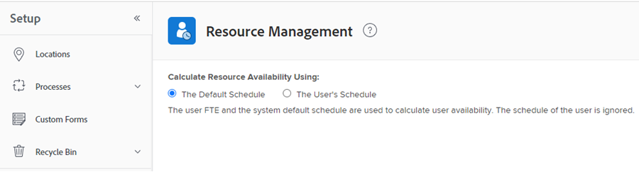
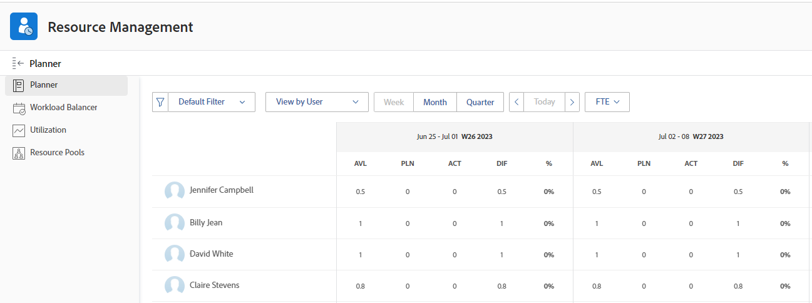

# Overzicht van het berekenen van uren en FTE voor gebruikers en rollen in de Planner van het Middel

<!--

(NOTE: Alina:KEEP THIS:***Linked to: Configuring My Settings, Editing User Accounts, Planning in the Resource Planner -- *** Some of this documentation is also duplicated in this article (Scheduling): https://support.workfront.com/hc/en-us/articles/360000557174)

-->

U kunt de toewijzing en beschikbaarheid van uw middelen in de Planner van het Middel door Uren, VTE, of Kosten tonen.\
Voor meer informatie over het berekenen van Kosten in de Planner van het Middel, zie [ kosten in de Planner van het Middel berekenen ](../../resource-mgmt/resource-planning/calculate-costs-resource-planner.md).

&quot;FTE&quot; staat voor voltijdequivalent. Het is een tijdsmeting die de hoeveelheid uren vertegenwoordigt die aan echt werk tijdens een dag of week voor een gebruiker of baanrol wordt gewijd.

De volgende reeksen van middelinformatie worden berekend verschillend in de Planner van het Middel:

* De waarden voor Beschikbare uren of FTE worden berekend op basis van de manier waarop de systeembeheerder de voorkeuren voor Bronbeheer in uw systeem configureert.\
  Voor meer informatie over hoe de Beschikbare Uren en FTE waarden worden berekend, zie [ Beschikbare Uren of FTE voor gebruikers en baanrollen in de Planner van het Middel berekenen ](#calculate-available-hours-or-fte-for-users-and-job-roles-in-the-resource-planner).\
  Voor meer informatie over het bepalen van de voorkeur van het Beheer van het Middel voor het systeem van Adobe Workfront, zie [ de voorkeur van het Beheer van het Middel ](../../administration-and-setup/set-up-workfront/configure-system-defaults/configure-resource-mgmt-preferences.md) vormen.

* Alle andere FTE-waarden worden berekend op basis van het standaardschema van het systeem.\
  Voor meer informatie over hoe alle andere waarden in de Planner van het Middel wanneer het gebruiken van FTE tonen, zie de sectie [ alle andere uren en FTE waarden voor gebruikers en baanrollen in de Planner van het Middel ](#calculate-all-other-hour-and-fte-values-for-users-and-job-roles-in-the-resource-planner) in dit artikel berekenen.

Het is belangrijk om te begrijpen wat FTE voor elk van uw gebruikers en hun baanrollen is om uw middelen nauwkeurig te beheren aangezien u hen aan het werk toewijst.

## Beschikbare uren of FTE voor gebruikers en baanrollen in de Planner van het Middel berekenen {#calculate-available-hours-or-fte-for-users-and-job-roles-in-the-resource-planner}

* [ berekent de Beschikbare Uren en FTE voor een gebruiker in de Planner van het Middel ](#calculate-the-available-hours-and-fte-for-a-user-in-the-resource-planner)
* [ berekent de Beschikbare Uren en FTE voor een baanrol in de Planner van het Middel ](#calculate-the-available-hours-and-fte-for-a-job-role-in-the-resource-planner)
* [Bereken de Beschikbare Uren en FTE voor een gebruiker in de Planner van het Middel (Voorbeeld)](#calculate-the-available-hours-and-fte-for-a-user-in-the-resource-planner-example)

### Bereken de Beschikbare Uren en FTE voor een gebruiker in de Planner van het Middel {#calculate-the-available-hours-and-fte-for-a-user-in-the-resource-planner}

De beheerder van Workfront bepaalt hoe de beschikbare tijd voor een gebruiker door te selecteren wordt berekend om één van het volgende op het gebied van het Beheer van het Middel in Opstelling te gebruiken wordt berekend:

* Het standaardschema van het systeem en FTE van de gebruiker.
* Het schema van de gebruiker.

>[!NOTE]
>
>Dit bepaalt hoe te om middelbeschikbaarheid op het systeemniveau te berekenen. Voor meer informatie over het bepalen van de voorkeur van het Beheer van het Middel voor het systeem, zie [ de voorkeur van het Beheer van het Middel ](/help/quicksilver/administration-and-setup/set-up-workfront/configure-system-defaults/configure-resource-mgmt-preferences.md) vormen.

Gebaseerd op hoe dit het plaatsen wordt gevormd, wordt de beschikbaarheid van de gebruikers in de Planner van het Middel (uren evenals beschikbaarheid FTE) berekend gebruikend de volgende methodes:

* **het StandaardProgramma**: Het StandaardProgramma van het systeem en gebruikerFTE wordt gebruikt om de Beschikbare Uren en waarde FTE voor de gebruiker in de Planner van het Middel te bepalen. Het schema van de gebruiker wordt genegeerd. In dit geval:

   * De **Beschikbare Uren** in de Planner van het Middel worden berekend gebruikend de volgende formule:

     `User Available Hours = Default Schedule Hours * User FTE value`

     Bijvoorbeeld, als het Standaard Programma 40 uren per week beschikbaar voor het werk heeft, en de gebruiker FTE 0.5 is, is de gebruiker beschikbaar om 20 uren per week in de Planner van het Middel te werken.

     Voor meer informatie over programma&#39;s, met inbegrip van het StandaardProgramma, zie [ een programma ](/help/quicksilver/administration-and-setup/set-up-workfront/configure-timesheets-schedules/create-schedules.md) creëren.

   * **Beschikbare FTE** voor de gebruiker in de Planner van het Middel is het zelfde als gebruiker FTE die in de gebruikersmontages wordt gespecificeerd.

     Bijvoorbeeld, als de gebruiker FTE 0.5 in de gebruikersmontages is, beschikbaar FTE van de gebruiker is 0.5 in de Planner van het Middel. Voor meer informatie over de waarde van gebruikerFTE aangezien het in de gebruikersmontages toont, zie [ het profiel van een gebruiker ](/help/quicksilver/administration-and-setup/add-users/create-and-manage-users/edit-a-users-profile.md) uitgeven.

* **het Programma van de Gebruiker**: Het Programma van de gebruiker wordt gebruikt om de beschikbaarheid van de gebruiker in de Planner van het Middel te bepalen. De waarde van de gebruiker FTE wordt genegeerd. In dit geval:

   * De **Beschikbare Uren** in de Planner van het Middel zijn het zelfde als de Uren van het Programma van de gebruiker.

     Bijvoorbeeld, als het Programma van de gebruiker 40 uren per week beschikbaar voor het werk heeft, is de gebruiker beschikbaar om 40 uren per week in de Planner van het Middel te werken.

   * **Beschikbare FTE** in de Planner van het Middel wordt berekend door de volgende formule:

     `User Available FTE = Hours from the Schedule of the User/ Default Schedule Hours`

     Bijvoorbeeld, als het Programma van de gebruiker 20 uren beschikbaar heeft om te werken, en het Standaard Plan in Workfront 40 uren beschikbaar heeft om te werken, FTE van de gebruiker is 0.5.

     Voor meer informatie over programma&#39;s, met inbegrip van het StandaardProgramma, zie [ een programma ](/help/quicksilver/administration-and-setup/set-up-workfront/configure-timesheets-schedules/create-schedules.md) creëren.

>[!NOTE]
>
>Als de gebruiker niet aan een programma wordt geassocieerd, worden de Beschikbare Uren voor de gebruiker berekend gebruikend het StandaardProgramma.

### Bereken de Beschikbare Uren en FTE voor een baanrol in de Planner van het Middel {#calculate-the-available-hours-and-fte-for-a-job-role-in-the-resource-planner}

U moet eerst de gebruikersbeschikbaarheid berekenen, en dan kunt u de beschikbaarheid van elk van hun baanrollen berekenen.

De beschikbaarheid van baanrollen in de Planner van het Middel houdt rekening met de totale beschikbaarheid van de gebruiker, en het **Percentage van VTE Beschikbaarheid** verbonden aan elke rol van de gebruiker.\

Voor meer informatie over het associëren van a **Percentage van de waarde van de Beschikbaarheid van FTE** met een baanrol voor een gebruiker, zie [ het profiel van een gebruiker ](../../administration-and-setup/add-users/create-and-manage-users/edit-a-users-profile.md) uitgeven.

Bijvoorbeeld, als de waarde van Beschikbare Uren voor een gebruiker 40 is en zij één Primaire Rol voor 75% van die tijd kunnen vervullen, en één Andere Rol voor 25% van die tijd, toont de Planner van het Middel aan dat de **Beschikbare Uren** waarde voor de Primaire Rol voor één week 30 uren is, en dat de **Beschikbare Uren** waarde voor de Andere Rol 10 uren is. In dit geval is de VTE voor de primaire rol 0,75 en de VTE voor de andere rol 0,25.

>[!NOTE]
>
>De totale beschikbare tijd voor de gebruiker wordt berekend door één van de twee methodes die in [ worden beschreven Bereken de Beschikbare Uren en FTE voor een gebruiker in de 1} sectie van de Planner van het Middel {in dit artikel.](#calculate-the-available-hours-and-fte-for-a-user-in-the-resource-planner)

Wanneer het bekijken van de Planner van het Middel in de Mening van de Rol, is de beschikbaarheid van één baanrol een totaal van de beschikbaarheid van alle gebruikers die die baanrol kunnen vervullen.\
Voor meer informatie over beschikbaarheid van middelen in de Planner van het Middel, zie het [ overzicht van de Planner van het Middel ](../../resource-mgmt/resource-planning/get-started-resource-planner.md).

### Bereken de Beschikbare Uren en FTE voor een gebruiker in de Planner van het Middel (Voorbeeld) {#calculate-the-available-hours-and-fte-for-a-user-in-the-resource-planner-example}

De volgende lijst illustreert hoe de Beschikbare Uren en Beschikbare FTE voor de gebruiker in de Planner van het Middel worden berekend, afhankelijk van welke methode door de systeembeheerder voor de FTE berekening in de Voorkeur van het Beheer van het Middel wordt gebruikt.

In dit voorbeeld gebruiken we de volgende getallen:

* Een standaardschema voor het systeem van 40 uur
* Een gebruikersschema van 20 uur
* Een FTE van de gebruiker van 0.8

| Methode voor FTE-berekening (systeeminstelling) | **Uren van Programma van de Gebruiker** | **Uren van het StandaardProgramma** | **VLAK VAN DE Gebruiker FTE** | **Beschikbare Uren in de Planner van het Middel** | **Beschikbare FTE in de Planner van het Middel** |
|---|---|---|---|---|---|
| **StandaardProgramma** | Genegeerd | 40 | 0,8 | **32** (berekend) | **0.8** |
| **Programma van de Gebruiker** | 20 | 40 | Genegeerd | **20** | **0.5** (berekend) |

De uitzonderingen van het programma en de onderbreking zouden de hoeveelheid Geplande Uren of VTE kunnen beïnvloeden. Voor meer informatie, zie [ de voorkeur van het Beheer van het Middel ](../../administration-and-setup/set-up-workfront/configure-system-defaults/configure-resource-mgmt-preferences.md) vormen.

Voorbeeldweergave van de functie Bronnen per gebruiker en aantal uren:

Voorbeeldweergave van bronnenplanner op gebruiker en FTE:

## Bereken alle andere uren en FTE waarden voor gebruikers en baanrollen in de Planner van het Middel {#calculate-all-other-hour-and-fte-values-for-users-and-job-roles-in-the-resource-planner}

Naast Beschikbare Uren of FTE, wordt de volgende tijdinformatie ook getoond in de Planner van het Middel:

* Geplande uren
* Geforceerde uren
* Uurvariatie
* Nettouren\
  Voor meer informatie over deze waarden zie [ Overzicht van uren, VTE, en kosteninformatie in het Project en de meningen van de Rol van de Planner van het Middel ](../../resource-mgmt/resource-planning/overview-of-planner-hour-fte-cost-information-in-role-project-views.md)

* Uurverschil\
  Voor meer informatie over wat deze waarde vertegenwoordigt zie [ Overzicht van uren, FTE, en kosteninformatie in de mening van het Project en van de Rol van de Planner van het Middel ](../../resource-mgmt/resource-planning/overview-of-planner-hour-fte-cost-information-in-role-project-views.md).

U kunt de zelfde informatie in de Planner van het Middel zoals VTE of als uren tonen.

Workfront gebruikt de volgende formule om alle andere waarden als FTE in de Planner van het Middel te tonen:

`FTE = Resource Planner Hours/ Default Schedule Hours`

>[!NOTE]
>
>Het schema van de gebruiker wordt genegeerd wanneer het berekenen van FTE voor alle waarden behalve Beschikbare (AVL) waarden FTE, in de Planner van het Middel. Alleen het standaardschema wordt in aanmerking genomen voor de berekening.

Deze berekening geldt voor de volgende waarden:

* Geplande VTE (PLN)
* FTE (BDG)
* FTE-variantie (VAR)
* NETTO FTE
* FTE-verschil (DIF)
